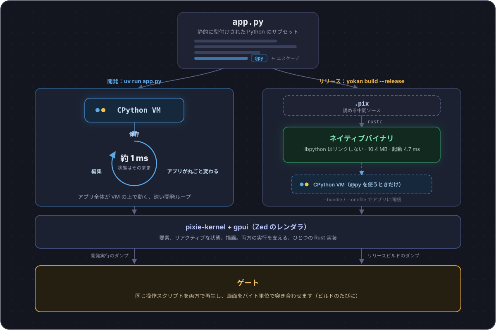

# Yokan

**Python で書く。ネイティブで配る。** — [English README](README.md)

**📘 ドキュメントサイト: <https://i2y.github.io/yokan/ja/>**

Yokan（羊羹）は、静的に型付けされた Python のサブセットをネイティブコードにコンパイルする処理系です。
サブセットといっても、Python に似せた別の言語ではありません。
書けるのは Python の一部ですが、その範囲のコードは Python とまったく同じに動きます。
開発中はアプリ全体が本物の CPython で動き、リリースするときに同じソースが機械語の実行ファイルになります。
そして、この二つが同じに振る舞うことを、ビルドのたびに自動で検証します。

まず見た目から。
付属デモのダッシュボード OpsBoard で、チャートも仮想化リストもテーマ切替も、すべて Python で書かれています（ソースは `crates/yokan/demo/opsboard/`）。


そして、いちばん小さいアプリの全文がこちらです。

```python
# /// script
# dependencies = ["yokan"]
# ///
import yokan as ui
from yokan import State

count: State[int] = State(0)

def view():
    with ui.column(spacing=12, padding=16):
        ui.text(f"count: {count()}", size=34)
        ui.button("+1", on_click=lambda: count.set(count() + 1))

if __name__ == "__main__":
    ui.run(view, title="counter")
```

`uv run app.py` で動かすと、この画面が開きます（描画エンジンは Zed エディタを支える **gpui**）。


実行したままソースを直して保存すると、状態はそのままに、画面もハンドラの挙動も新しいコードに入れ替わります。
下の GIF がその瞬間です（別の小さなデモを編集しています）。編集の前後でティックが止まっていないことに注目してください。


サブセットに入らない処理は、関数に `@py` を付ければ本物の Python のまま動きます。
numpy のようなライブラリもここで使えます。
逆に速さが欲しい処理は、自分の Rust crate を宣言してそのまま呼べます（開発中もリリース後も同じ実装が呼ばれます）。
コンパイルできない書き方をしたときは、何がなぜだめかを名指しするエラーになります。
黙って挙動が変わることはありません。

配布は `yokan build app.py --release`。
`@py` を使っていないアプリなら、できあがる実行ファイルに CPython は入りません。
Python へのリンクもゼロで、13.4 MB（strip 後 10.4 MB）、起動は数ミリ秒です。
`@py` を使うアプリは `--bundle` か `--onefile` で CPython ごと同梱します（単一ファイルで stdlib のみ約 17 MB、numpy 込み約 21 MB）。
`--app` を足せば、どちらの形も macOS の `.app` バンドル（Dock 名とアイコン付き、ダブルクリックで起動）になります。
どちらの場合も、受け取る側のマシンに Python も pip も要りません。

開発中はホットリロード、リリースは AOT コンパイルでネイティブ、という体験は Flutter と Dart の組み合わせに近いものです。
Yokan はそれを Python でやり、さらに開発版とリリース版が同じに振る舞うことをビルドごとに検証します。

## 何が作れるか

デスクトップアプリ全般です。
画面数枚の社内ツールから、フォームと表とチャートでデータを扱うアプリケーションまで、Python の書き味のまま作って、そのまま配れます。

画面部品は 25 種類（テキスト、ボタン、フォーム部品一式、表、チャート、仮想化リスト、モーダルなど）。
スタイル、ライト/ダークのテーマ切替、アニメーションが揃い、仮想化リストは 10 万行でもスクロールが軽いままです。
状態の持ち方は 3 つだけで、書き方は[言語ツアー](crates/yokan/TOUR.ja.md)が一周で案内します。
付属デモは 40 本あり、全部スクリーンショット付きの[ギャラリー](crates/yokan/demo/README.ja.md)から入れます。

## 全体像

アプリはひとつの Python ファイルで、実行の道が二つあります。
どちらの道も同じ Rust 製の土台の上で動くから、最後の一致チェックが成立します。
土台の名前が **pixie**（Yokan が経由する基盤言語）で、リリースの途中に挟まる `.pix` はその読めるソースです。
生成された `.pix` を開けば、自分のアプリが何にコンパイルされたのかを目で確かめられます。



## 検証の仕組み

図の最後の箱、冒頭の「自動で検証します」の中身です。
Yokan ではこれを**ゲート**と呼んでいます。

```console
$ yokan gate app.py --script "click:+1,input:Momo"
GATE OK — 2 dump lines identical across tiers
```

クリックや入力の並びを渡すと、CPython 版と機械語版の両方でそれを再生して、画面の結果をバイト単位で突き合わせます。
ファイルや SQLite、HTTP などの標準ライブラリが開発中も配布後も同じ実装なのは、この検証を成り立たせるためです。
まだできないことは、言語ツアー末尾の「今できないこと」に理由付きでまとまっています。

## 対応環境

現在は Apple silicon の macOS、Python 3.14 以上です。
Linux にはまもなく対応します。
開発に使うものは `uv run app.py` だけで揃います（冒頭の例の 3 行コメントが依存宣言です）。
プロジェクトに入れるなら `uv add yokan`、`yokan` コマンドは `uv tool install yokan`。pip でも入ります。
ウィンドウ、ライブリロード、ヘッドレス実行まで、ここに Rust は要りません。

ネイティブビルド（`yokan build` / `yokan gate`）だけは、コンパイルが依存する Rust クレート群がこのリポジトリに入っているため、clone と Rust ツールチェーンが要ります。

```console
$ git clone https://github.com/i2y/yokan && cd yokan
$ yokan gate path/to/app.py --script "click:+1"
$ yokan build path/to/app.py --release --onefile
```

- Rust は [rustup](https://rustup.rs) で入れておきます。コンパイラの版はリポジトリ側で固定してあり、初回ビルド時に自動で取得されます。
- macOS では Xcode の Metal ツールチェーンも必要です（GPU エンジンのシェーダをビルドするため）。
- `yokan` コマンドは、チェックアウトの中で実行すればリポジトリを自動で見つけます。外から実行するときは環境変数 `PIXIE_REPO` にチェックアウトの場所を渡します。
- 初回はエンジンごとコンパイルするので数分かかります。二回目からは差分だけです。

実測値（macOS/arm64、リリースビルド）：起動 4.7 ms、ライブリロード約 1 ms。サイズは上の配布の節の通りです。

## もっと知る

- [ドキュメントサイト](https://i2y.github.io/yokan/ja/) — インストール、言語ツアー、デモギャラリーをブラウザで（[English](https://i2y.github.io/yokan/)）
- [言語ツアー（日本語）](crates/yokan/TOUR.ja.md) — 書き方を一周。末尾に「今できないこと」（[English](crates/yokan/TOUR.md)）
- [crates/yokan/README.md](crates/yokan/README.md) — ビルド方法とプロダクトの詳細
- [docs/PIXIE.md](docs/PIXIE.md) — 土台の言語 pixie（`.pix` の側の話）

エディタ補完と型チェックは Pylance / pyright を推奨します（型スタブ同梱）。

名前は和菓子の羊羹からとりました。
中身のぎっしり詰まったひと棹を、切り分けて配るお菓子です。
ひとつの実行ファイルに詰めて配る、このアプリの姿と重なります。

Yokan は 0.x です。
マイナーバージョン間で API が変わることがあります。

License: MIT OR Apache-2.0.
