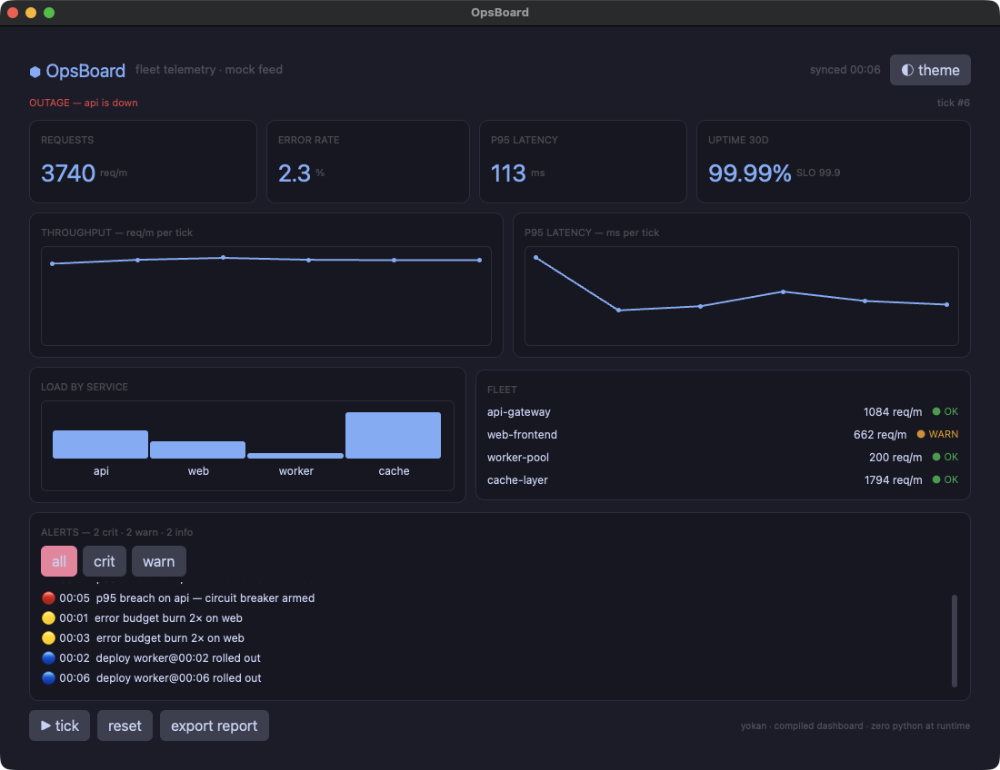
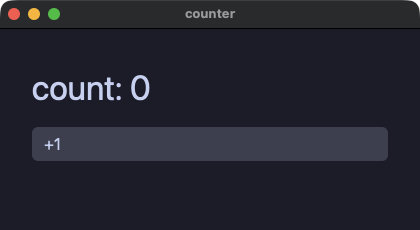
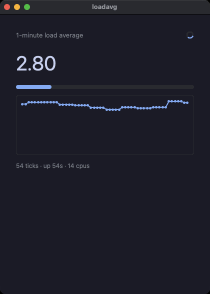

# Yokan

**Write Python. Ship native.** — [日本語版 README](README.ja.md)

**📘 Documentation: <https://i2y.github.io/yokan/>**

Yokan is a compiler: it takes a statically typed subset of Python to native code.
A subset — but not a lookalike language. What you can write is a
slice of Python, and inside that slice your code behaves exactly as
Python. While you develop, the whole app runs on real CPython; when
you ship, the same source becomes a machine-code executable; and
every build automatically verifies that the two behave the same.

First, what it looks like: OpsBoard, a bundled dashboard demo —
charts, a virtualized list, theme switching — written entirely in
Python (source: `crates/yokan/demo/opsboard/`).



And here is the smallest complete app:

```python
# /// script
# dependencies = ["yokan"]
# ///
from yokan import State, button, column, run, text

count: State[int] = State(0)

def view():
    with column(spacing=12, padding=16):
        text(f"count: {count()}", size=34)
        button("+1", on_click=lambda: count.set(count() + 1))

if __name__ == "__main__":
    run(view, title="counter")
```

Run it with `uv run app.py` and this window opens (the renderer is
**gpui**, the engine behind the Zed editor):



Edit the running app's source and save, and the app updates in
place — views and handler behavior alike — with the state intact. The GIF below is that moment (editing
another small demo) — note the tick counter never stops.



What doesn't fit the subset can stay real Python: mark the function
with `@py` and it runs on CPython — numpy and friends included.
And where you want native speed of your own, declare a Rust crate
and call it — the same implementation serves both the development
run and the release build.
And when something can't be compiled, you get an error naming what
and why. Behavior never changes silently.

Shipping is `yokan build app.py --release`. If the app uses no
`@py`, the executable contains no CPython at all — zero links to
Python, 13.4 MB (10.4 MB stripped), millisecond startup. Apps that
do use `@py` ship CPython embedded via `--bundle` or `--onefile`
(one file: about 17 MB stdlib-only, about 21 MB with numpy). Add
`--app` and either shape becomes a macOS `.app` bundle — Dock name,
icon, double-click launch. Either way, the person receiving it
needs no Python and no pip.

The shape — hot reload while you develop, AOT-compiled native when
you release — is close to what Flutter and Dart give you. Yokan
does it with Python, and verifies on every build that the two runs
behave the same.

## What can you build?

Desktop apps, full stop. From a few-screen internal tool to a
data-facing application of forms, tables, and charts — written with
Python's feel, shipped as a native app.

There are 25 UI elements (text, buttons, a full set of form
controls, tables, charts, virtualized lists, modals), plus styles,
light/dark themes, and animation; virtualized lists stay smooth at
a hundred thousand rows. State comes in exactly three shapes, and
the [language tour](crates/yokan/TOUR.md) walks the whole surface
in one pass. There are 40 bundled demos, all screenshotted in the
[gallery](crates/yokan/demo/README.md).

## The whole picture

Your app is one Python file with two roads to run it.
Both roads stand on the same Rust foundation, which is what makes the final comparison meaningful.
That foundation is **pixie**, the substrate language Yokan compiles through, and the `.pix` in the middle of the release road is its readable source — open the generated `.pix` and you can see, with your own eyes, what your app compiled to.


## How the check works

The last box of the diagram — the "automatically verifies" above. Yokan calls it the
**gate**:

```console
$ yokan gate app.py --script "click:+1,input:Momo"
GATE OK — 2 dump lines identical across tiers
```

Hand it a sequence of clicks and input; it replays them on the
CPython build and on the machine-code build, then byte-compares the
resulting screens. The standard library (files, SQLite, HTTP, and
friends) is one implementation in both — that is what makes the
comparison meaningful. And what Yokan cannot do yet is listed at
the end of the tour, each item with its reason.

## Platforms

Today: macOS on Apple silicon, Python 3.14+; Linux support lands
shortly. Everything you develop with arrives via `uv run app.py`
(the three-line comment in the example above declares the
dependency). In a project, `uv add yokan`; for the `yokan` command,
`uv tool install yokan` — plain pip works too. The window, live
reload, headless runs: no Rust needed so far.

Only the native build (`yokan build` / `yokan gate`) needs more: the
Rust crates it compiles against live in this repository, so clone it
and have a Rust toolchain.

```console
$ git clone https://github.com/i2y/yokan && cd yokan
$ yokan gate path/to/app.py --script "click:+1"
$ yokan build path/to/app.py --release --onefile
```

- Install Rust via [rustup](https://rustup.rs); the compiler version
  is pinned by the repository and fetched automatically on the first
  build.
- On macOS you also need Xcode's Metal toolchain (the GPU engine
  builds shaders).
- Run `yokan` from inside the checkout and it finds the repository
  by itself; from anywhere else, point `PIXIE_REPO` at the checkout.
- The first build compiles the engine and takes a few minutes;
  later builds are incremental.

Measured (macOS/arm64, release): 4.7 ms start, ~1 ms live reload;
sizes as in the shipping paragraph above.

## Learn more

- [The documentation site](https://i2y.github.io/yokan/) —
  installation, the tour and the demo gallery, browsable
  ([日本語](https://i2y.github.io/yokan/ja/))
- [Language tour](crates/yokan/TOUR.md) — one pass over how apps
  are written, closing with what does not work yet
  ([日本語版](crates/yokan/TOUR.ja.md))
- [crates/yokan/README.md](crates/yokan/README.md) — how to build,
  product details
- [docs/PIXIE.md](docs/PIXIE.md) — pixie, the substrate language
  (the `.pix` side of the story)

For editor completion and type checking, use Pylance / pyright
(type stubs ship with the package).

The name is the Japanese confection — yokan (羊羹), a dense solid
block made to be sliced and handed out. Which is what your app
becomes.

Yokan is 0.x: the API can change between minor versions.

License: MIT OR Apache-2.0.
