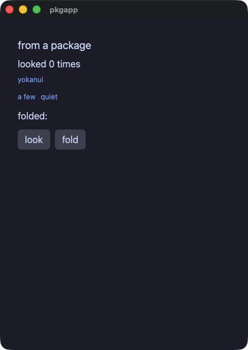
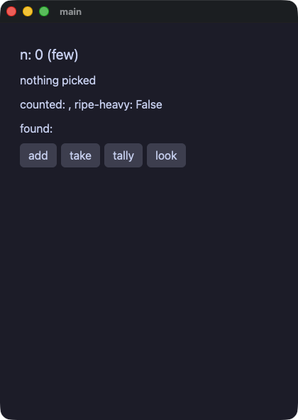
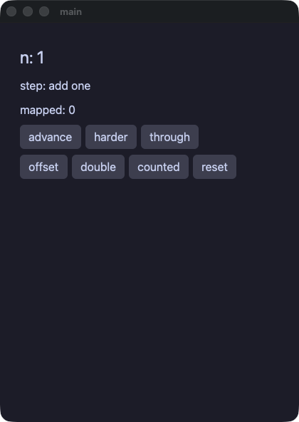
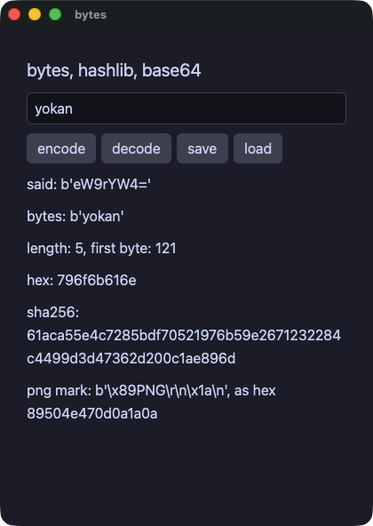
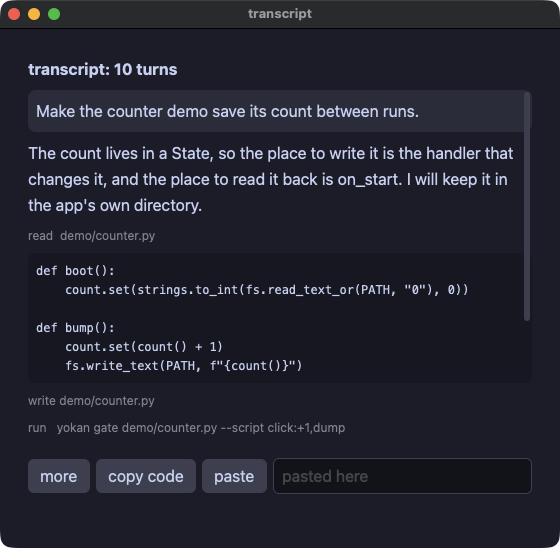
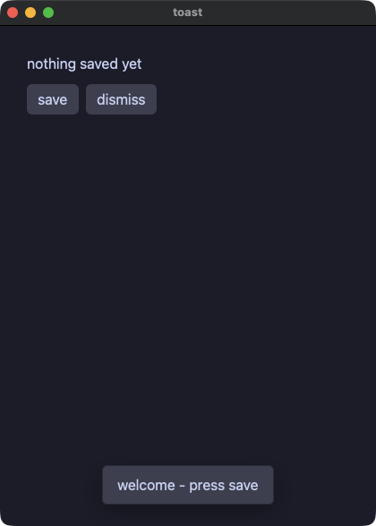
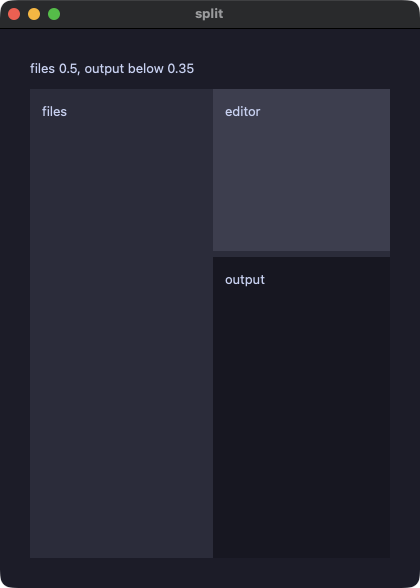
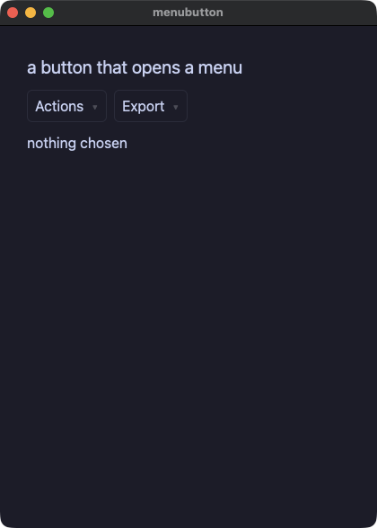
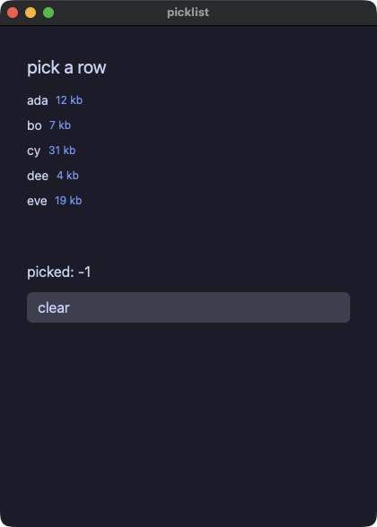
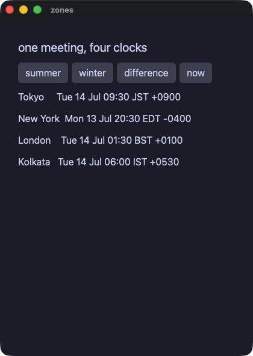

# デモ集

[English](README.md)

どのデモも 1 ファイルで（opsboard と multi だけはディレクトリ）、リポジトリの `crates/yokan/` の中でそのまま動きます。

```console
$ uv run demo/counter.py            # そのデモの名前に置き換える
$ ./tools/gate_all.sh               # 全デモをゲートで一括チェック
```

numpy を使う 3 本（pystats / csv_viewer / app）は `uv run --with numpy` で動かします。
`transcribe` は必要な依存を自分で宣言しているので、`uv run demo/transcribe/app.py` がそれを取ってきます。
初めて文字起こしをするときには、Whisper のモデルも取りに行きます。
ゲートは全デモの一括チェックには入れず、単独（`just transcribe-gate`）で走らせます。
`app` と `csv_viewer` の 2 本は辞書 state を使う開発専用のデモなので、ゲートの対象外です（ツアーの[今できないこと](../TOUR.ja.md#今できないこと)を参照）。
スクリーンショットはどれも起動直後の画面ですが、`transcribe` だけは文字起こしを終えたところを写しています。
起動直後は表が空で、何も伝わらないからです。

## まず動きを見る

#### counter — いちばん小さいアプリ。同じアプリを別の書き方にしたのが counter_state.py（型付き State セル）と counter_with.py


#### opsboard — 旗艦デモ。3 モジュールで組んだダッシュボード（ストア 2 つ、直和型のヘルスモデル、チャート、仮想化したアラートフィード、テーマ切替、fs へのレポート出力）


#### forms — フォームの要素一式。checkbox / switch / slider / select / radio_group / tab_bar があり、どのハンドラも新しい値をひとつ受け取る


#### calc — 定番の電卓：レイアウトは `grow` だけで組んであり（行が高さを分け合い、キーが行の幅を分け合い、0 キーは 2 コマ分）、ウィンドウを伸ばせばパッド全体が隙間なく追従する


#### calcgrid — 同じ電卓を `grid(columns=4, rows=5)` で書いたもの：等分トラックのコンテナ一つに全キーが並び、0 キーは `col_span=2` で 2 セルにまたがる


## 状態の持ち方

#### stores — 名前付きストア。クラス名がそのままシングルトンになり、ストア同士でメソッドを呼び合える


#### models — @model と Protocol。観測されるオブジェクトと、静的ディスパッチされるインターフェース


#### links — モデルがモデルを参照する。所有は `Node | None`、逆向きは `Weak[Node]`（循環しないので、根を手放すと連鎖ごと解放される）


#### stateful — @component + local。呼び出し位置ごとに独立した状態を持つコンポーネント


#### lookup — 辞書セル。読みは `.get(key, default)` と `in`、書き込みは `cell[k] = v` のその場更新


#### mixer — フィールドだけの @store。注釈を付けたフィールドに直接代入すると、画面がそれに追随する


## 値と型

#### points — Value クラス（frozen dataclass）。書き換えは `replace` による関数的な更新


#### pkgapp — 方言で書いたパッケージから組み立てたアプリ。`py.yokan` が目印で、モジュールはアプリの中にコンパイルされ、パッケージが宣言した Rust crate も一緒に入る


#### vecops — Value クラスの演算子。`__add__` / `__sub__` / `__mul__` を定義すると `+` `-` `*` がその意味になる


#### geometry — Protocol による静的ディスパッチ。実装ごとに特殊化してコンパイルされる


#### moods — Enum と Optional とアニメーション


#### pyops — CPython と同じ算術。`/` `//` `%` `**` から負のインデックス、キーによる並べ替えまで、両実行の結果がバイト単位で一致する


#### pytext — 素の float / bool / Enum の表示が Python の str() と一致する


## 制御フローとエラー

#### flow — ハンドラの中の本物の制御フロー（if / elif / while / for / break / continue）


#### dialect — これまで断っていた普段の Python。`int | None` を返すメソッド、ローカルの辞書、ビューの中の条件式、KeyError として捕まえる `d[k]`、比較される二つめの出力になった `print`、途中の `return`


#### closures — 値としての関数。ローカル変数のラムダ、捕獲する入れ子の def、差し替えられるコールバックのフィールド、メソッドに渡すクロージャ、それを呼ぶ map


#### bytes — バイト列のリテラル、ダイジェスト、base64、そして書いて読み直すバイナリファイル。先頭の目印はリテラルと突き合わせる


#### edges — 封じ込めの実証。範囲外アクセスもオーバーフローも、両実行のどちらでも同じ文で同じように止まり、アプリは動き続ける


#### tryfetch — try/except の全形。失敗する http 呼び出しを捕まえ、`f"{e}"` の文言まで両実行で一致する


## 画面の要素

#### todo — 定番の TODO リスト


#### table — data_table：最初の `row` がヘッダー行、以降の `row` は交互に色の付くデータ行になり、枠線は要素に付いてくる


#### transcript — コーディングエージェントとの対話を上から読む。高さの揃わない行（吹き出し、折り返す文章、パネルに載せた `mono` のコード、薄いツール行）を `scroll_view` の中の `column` に並べる。高さが揃わない行はこの形で描く。`copy code` はコードをクリップボードへ


#### dialog — モーダル。「存在すること」が「開いていること」なので、`if` で包む


#### toast — アプリの上に出て、自分で閉じるメッセージ。`duration_ms` はフレームワーク自身の時計で数え（スクリプトは `advance:` で進める）、`on_close` が `if` の読む値を消す


#### trend — ライン / バーチャート


#### styled — 名前付きスタイル（`style` + `**` 展開 + `|` 合成）とテーマスコープ


#### cards — スロット付きコンポーネント（子要素を受け取る）


#### layout — spacer と divider。spacer がボタンを行の端に押しやり、divider が罫線を引く（節の間は太い accent 色の線）


#### split — 二つの区画と、ドラッグできる仕切り。割合はアプリ自身が持つ数値なので、ハンドラが書き戻し、下限もそこで押さえる（要素に min / max は無い）


#### about — link。URL を開くテキストと、その URL をクリップボードにコピーするボタン


#### badges — 自前の箱を持つ text。状態のピル、等幅のハッシュ、下線付きの注記、省略記号、二行での打ち切り


#### filter — segmented。トグルボタン群で絞り込むリスト


#### menubutton — 押すと短いメニューが開くボタン。現在値が無いのでラベルは変わらず、ハンドラは選ばれた番号を受け取る。スクリプトは `select:` で選ぶ


#### quantities — number_field と int_field。型付きの数値入力で、enter で確定し、値を範囲に収め、step に吸着する


#### loading — progress の見出しと大きさ。どれだけかかるか分からない作業には、往復し続ける不確定表示を使う


#### canvas — 描画面：仮想的なピクセルの格子に 1 命令ずつ描き、色はパレットの番号で指定し、キャンバスの中で `for` を回して、ティックの中でキーの状態を読む


#### shooter — Pyxel のシューティングの例を移植。三つの場面、視差で流れる 100 個の星、揺れながら落ちてくる敵、矩形の当たり判定、広がる爆発が、すべてキャンバスの上で動く


#### jump — Pyxel のジャンプゲームを移植。重力、乗ると落ちていく床、果物、そしてそれぞれの速さで流れる山と木と二層の雲


#### charts — 0 の線の下に垂れる負の値、固定した範囲、グリッド線付きの軸、色の異なる二つの系列


#### roster — table。仮想化された表に、列トラック、行の選択、見出しでのソートを付ける（並べ替えはアプリ側）


#### picklist — 行を選べる list_view。`selected=` / `on_select` は表と同じ組で、スクリプトは行が表示している文字で行を選ぶ


#### labels — アクセシビリティのプロパティ `role=` と `a11y_label=`。スクリプトの `a11y` ステップが出力する


#### shared — 共通プロパティを要素の種類ごとに一つずつ。theme 付きの spacer、animate 付きの segmented、grid の 2 トラックにまたがるフィールド、role 付きの link、tooltip 付きの divider、disabled のボタンとフィールド、幅を指定した列


## 標準ライブラリ

#### picker — ファイルダイアログと落とされたファイル：`task` の中の `fs.open_dialog` / `save_dialog` と `on_file_drop`、スクリプトからは `file:<path>` で答え、`drop:<path>` で落とす


#### keys — ショートカット、キー、クリップボード、メニューバー：`shortcut("cmd+s", save)`、`on_key(typed)`、`clipboard.set_text` / `get_text`、`menu_item("Count", "Save", save)` を使い、スクリプトからは `key:cmd+s` と `menu:Save` で動かす


#### files — yokan.fs。書く、足す、ディレクトリを並べる、消す。読まずにファイルの様子を知る（長さ、ディレクトリかどうか、書かれた時刻）と、位置を指して続きを読む（両実行が同じ実装を呼ぶ）


#### dbnotes — yokan.sqlite。行の形は SQL で決め、並び順は ORDER BY で決める


#### ledger — 実用アプリの形をした家計簿。sqlite に保存し、値はすべてバインド変数で渡す


#### webfetch — yokan.http。GET、ヘッダ、POST、ステータス（@py のフィクスチャサーバを両実行に立てるので、ゲートはネットワーク不要）


#### reader — http + jsondoc のフィードリーダー。全項目の全欄を `jsondoc.get_texts` の一回の解析で読む


#### stdlib — Python の `math`、`random`、`statistics`、`json`、`datetime`、`time`、`re`、`collections`、`itertools` と、Yokan の jsondoc、clock


#### zones — zoneinfo。一つの会議を四つの土地の時計で読み、`astimezone` で移し、二つの時刻の差を取る（どちらの実行も機械自身のゾーンファイルを読むので、時差について食い違えない）


#### dice — Python の `random`。同じ種を与えれば、両実行で同じ列が出る


#### postcard — 画像とベクタアイコン、そして `notify.send`（`.app` バンドルとして動かすと通知センターに届く）


## Rust crate

#### rustcrate — `yokan add` で足した Rust crate：手元の path crate と crates.io の version crate が同居し、どちらも crate 本来の snake_case 名で呼ぶ（同じ宣言を pyproject.toml で書いた版が `demo/proj/`）


#### dashboard — every()。モジュールレベルで宣言したタイマーが両方の実行で動く（ゲートは `advance:` で進める）


#### tasks — task()。重い処理を、どちらの実行でも UI スレッドの外に出す


## CPython エスケープと開発専用

#### pystats — @py + numpy。エスケープした関数はリリースバイナリに CPython ごと同梱される


#### pyjob — @py のエスケープに書いた重い Python を task で回す。ウィンドウは描き続け、エスケープは自分が載ったワーカースレッドから進み具合を報告する


#### transcribe — Buzz の移植。@py と mlx-whisper で文字起こしをして、進捗バー、区間の表、TXT と SRT と VTT の書き出しまで揃える


#### multi — マルチモジュール構成（state.py と widgets.py に分割、ヘルパはコンポーネントになる）


#### app — numpy 入りのダッシュボード（開発専用：辞書 state）


#### csv_viewer — 10 万行の仮想化テーブル + numpy（開発専用：辞書 state）

