# デモ集

[English](README.md)

どれも 1 ファイル（opsboard と multi はディレクトリ）で、リポジトリの `crates/yokan/` からそのまま動きます。

```console
$ uv run demo/counter.py            # そのデモの名前に置き換える
$ ./tools/gate_all.sh               # 全デモをゲートで一括チェック
```

numpy を使う 3 本（pystats / csv_viewer / app）は `uv run --with numpy` で。
`transcribe` は依存を自分で宣言しているので `uv run demo/transcribe/app.py` がそれを取ってきます。
初めて文字起こしをするときに Whisper のモデルを取得し、ゲートはスイープではなく単独（`just transcribe-gate`）で走ります。
`app` と `csv_viewer` の 2 本は辞書 state を使う開発専用デモで、ゲート対象外です（ツアーの[今できないこと](../TOUR.ja.md#今できないこと)参照）。
スクリーンショットはすべて初期状態（起動直後）のものですが、`transcribe` だけは文字起こしを終えた状態です。
起動直後は表が空で、何も伝わらないからです。

## まず動きを見る

#### counter — いちばん小さいアプリ。同じアプリの別の書き方が counter_state.py（型付き State セル）と counter_with.py です
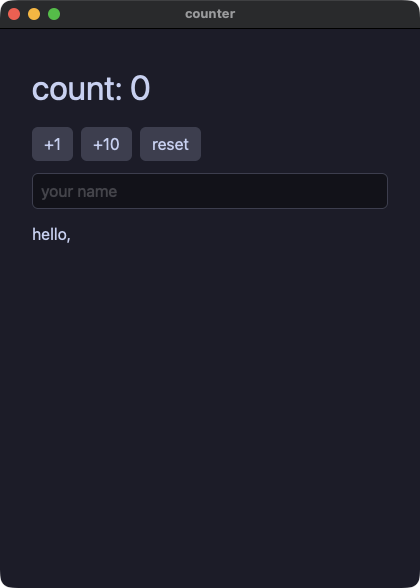

#### opsboard — 旗艦デモ。3 モジュール構成のダッシュボード（ストア 2 つ、直和型のヘルスモデル、チャート、仮想化アラートフィード、テーマ切替、fs へのレポート出力）
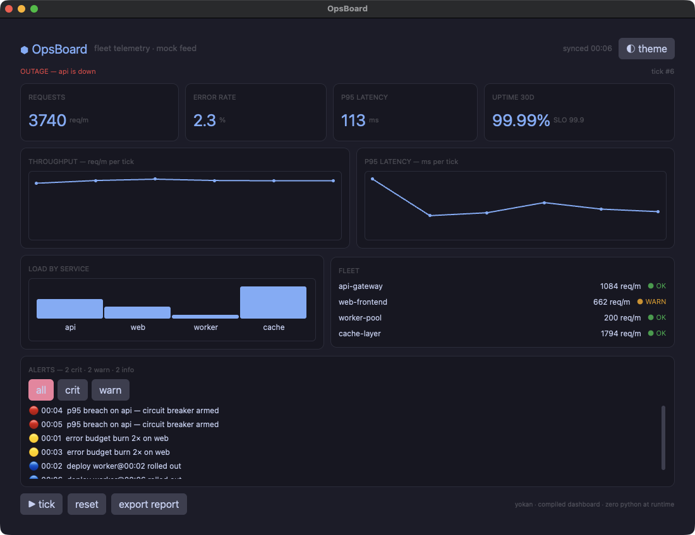

#### forms — フォーム部品一式。checkbox / switch / slider / select / radio_group / tab_bar、ハンドラは新しい値をひとつ受け取る


#### calc — 定番の電卓。レイアウトは `grow` だけで組んであり（行が高さを分け合い、キーが行の幅を分け合い、0 キーは 2 コマ分）、ウィンドウを伸ばすとパッド全体が隙間なく追従する
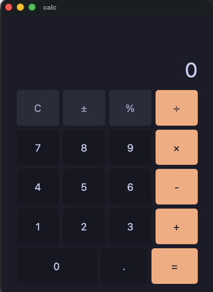

#### calcgrid — 同じ電卓を `grid(columns=4, rows=5)` で。等分トラックの一つのコンテナに全キーが並び、0 キーは `col_span=2` で 2 セルにまたがる
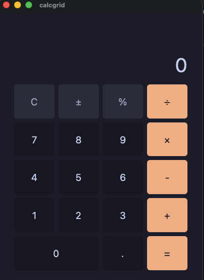

## 状態の持ち方

#### stores — 名前付きストア。クラス名がそのままシングルトンで、ストア同士のメソッド呼び出しもできる


#### models — @model と Protocol。観測されるオブジェクトと、静的ディスパッチされるインターフェース
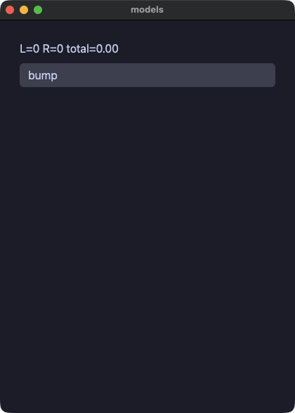

#### links — モデルがモデルを参照する。所有は `Node | None`、逆向きは `Weak[Node]`（循環しないので、根を手放すと連鎖ごと解放される）


#### stateful — @component + local。呼び出し位置ごとに独立した状態を持つ部品


#### lookup — 辞書セル。読みは `.get(key, default)`、`in`、そして `cell[k] = v` のその場書き込み


#### mixer — フィールドだけの @store。注釈付きフィールドへの直接代入で画面が追随する


## 値と型

#### points — Value クラス（frozen dataclass）。書き換えは `replace` の関数的更新


#### vecops — Value クラスの演算子。`__add__` / `__sub__` / `__mul__` を定義すると `+` `-` `*` がその意味になる


#### geometry — Protocol による静的ディスパッチ。トレイト相当がコンパイルされる


#### moods — Enum と Optional とアニメーション


#### pyops — CPython と同じ算術。`/` `//` `%` `**`、負のインデックス、キーによる並べ替えまで両実行でバイト一致
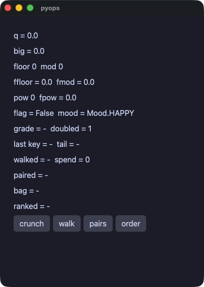

#### pytext — 素の float / bool / Enum の表示が Python の str() と一致する


## 制御フローとエラー

#### flow — ハンドラの中の本物の制御フロー（if / elif / while / for / break / continue）


#### edges — 封じ込めの実証。範囲外アクセスもオーバーフローも、両実行で同じ文が同じように止まり、アプリは落ちない


#### tryfetch — try/except の全形。失敗する http 呼び出しを捕まえ、`f"{e}"` の文言まで両実行で一致する


## 画面部品

#### todo — 定番の TODO リスト


#### table — data_table。最初の `row` がヘッダー行、以降の `row` が交互に色の付くデータ行になり、枠は要素が描く
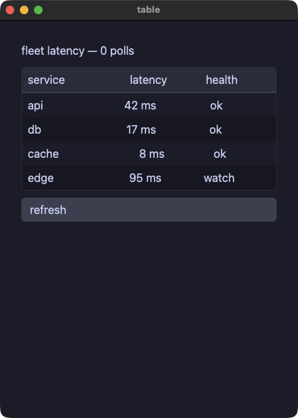

#### dialog — モーダル。「存在すること」が「開いていること」なので、`if` で包む
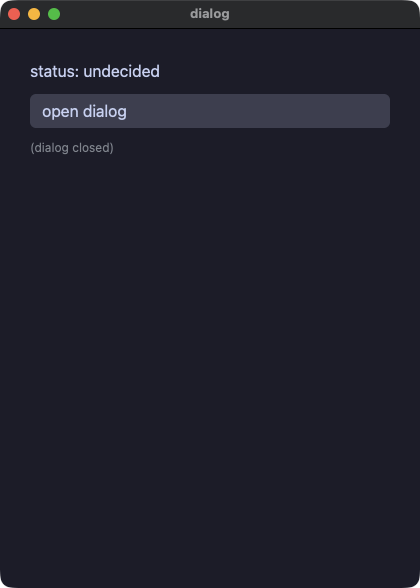

#### trend — ライン / バーチャート


#### styled — 名前付きスタイル（`style` + `**` 展開 + `|` 合成）とテーマスコープ
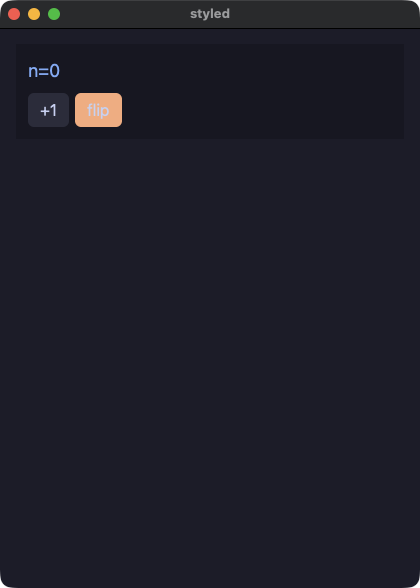

#### cards — スロット付きコンポーネント（子要素を受け取る部品）
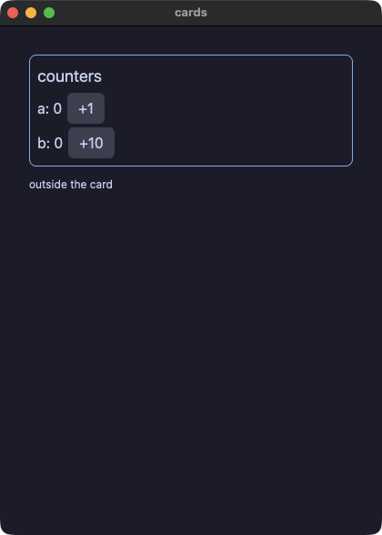

#### layout — spacer と divider。spacer がボタンを行の端に押しやり、divider が罫線を引く（節の間は太い accent 色の線）


#### about — link。URL を開くテキストと、URL をクリップボードに写すボタン


#### badges — 自分の箱を持つ text。状態のピル、等幅のハッシュ、下線付きの注記、省略記号、二行での打ち切り
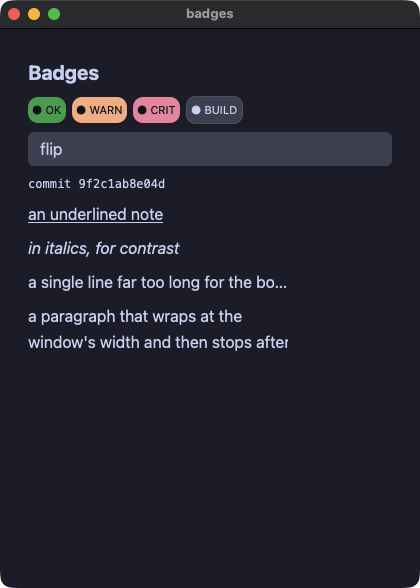

#### filter — segmented。トグルボタン群で絞り込むリスト


#### quantities — number_field と int_field。enter で確定し、範囲に収め、step に吸着する型付きの数値入力


#### loading — progress の見出しと大きさ、長さの分からない作業のための不確定の往復


#### canvas — 描画面。仮想的なピクセルの格子を1命令ずつ描き、色はパレットの番号で指定します。キャンバスの中の `for` と、ティックからキーの状態を読む例です


#### shooter — Pyxel のシューティングの例を移植。三つの場面、視差で流れる100個の星、揺れながら落ちてくる敵、矩形の当たり判定、広がる爆発をキャンバスの上で
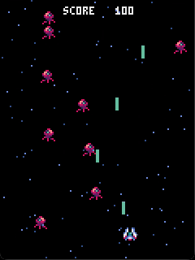

#### jump — Pyxel のジャンプゲームを移植。重力、乗ると落ちていく床、果物、そしてそれぞれの速さで流れる山と木と二層の雲
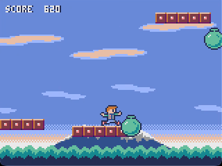

#### charts — 0 の線の下に垂れる負の値、固定した範囲、グリッド線付きの軸、色の異なる二つの系列


#### roster — table。列トラック、行の選択、見出しでのソートを持つ仮想化された表（並べ替えはアプリ側）


#### labels — アクセシビリティのプロパティ `role=` と `a11y_label=`。スクリプトの `a11y` ステップが印字する
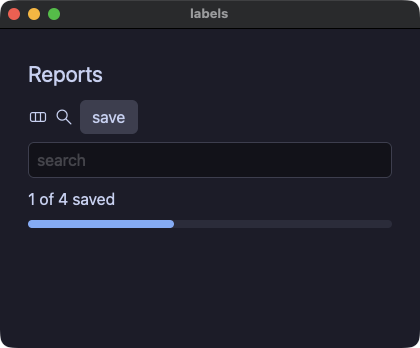

#### shared — 共通プロパティを要素の種類ごとに一つずつ。theme 付きの spacer、animate 付きの segmented、grid の 2 トラックにまたがるフィールド、role 付きの link、tooltip 付きの divider、disabled のボタンとフィールド、幅を指定した列
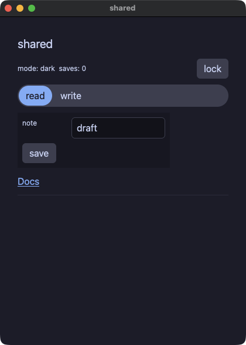

## 標準ライブラリ

#### picker — ファイルダイアログと落とされたファイル。`task` の中の `fs.open_dialog` / `save_dialog`、`on_file_drop`。スクリプトは `file:<path>` で答え、`drop:<path>` で落とす


#### keys — ショートカット、キー、クリップボード、メニューバー。`shortcut("cmd+s", save)`、`on_key(typed)`、`clipboard.set_text` / `get_text`、`menu_item("Count", "Save", save)`。スクリプトからは `key:cmd+s` と `menu:Save` で動かす


#### files — yokan.fs。書く、足す、ディレクトリを並べる、消す（両実行が同じ実装を呼ぶ）
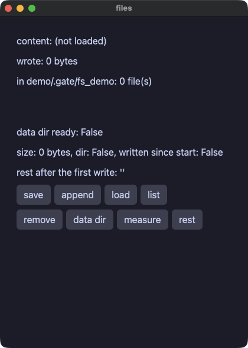

#### dbnotes — yokan.sqlite。行は SQL で形作り、ORDER BY で並べる
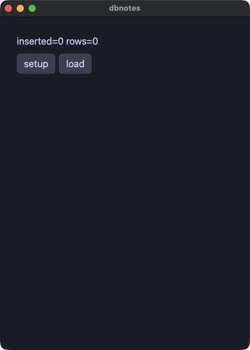

#### ledger — 実用アプリの形をした家計簿。sqlite に永続化し、値はすべてバインドで渡す
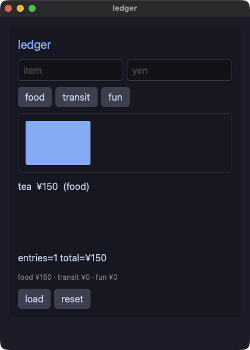

#### webfetch — yokan.http。GET、ヘッダ、POST、ステータス（@py のフィクスチャサーバを両実行に立てるので、ゲートはネットワーク不要）


#### reader — http + jsondoc のフィードリーダー


#### stdlib — Python の `math`、`random`、`statistics`、`json`、`datetime`、`time`、`re`、`collections`、`itertools` と、Yokan の jsondoc、clock
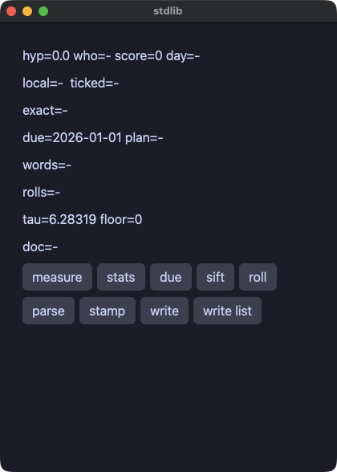

#### dice — Python の `random`。種を撒けば両実行で同じ列


#### postcard — 画像とベクタアイコン、そして `notify.send`（`.app` バンドルとして動かすと通知センターに届く）


## Rust crate

#### rustcrate — `yokan add` で足した Rust crate。手元の path crate と crates.io の version crate が同居し、crate 本来の snake_case 名で呼ぶ。同じ宣言の pyproject 綴りが `demo/proj/`


#### dashboard — every()。モジュールレベルで宣言したタイマーが両方の実行で動く（ゲートは `advance:` で進める）


#### tasks — task()。重い処理を UI スレッドの外へ、両方の実行で


## CPython エスケープと開発専用

#### pystats — @py + numpy。エスケープした関数はリリースバイナリに CPython ごと同梱される


#### pyjob — @py のエスケープの中の重い Python を task で回すデモ。ウィンドウは描き続け、エスケープは載ったワーカースレッドから進み具合を報告します
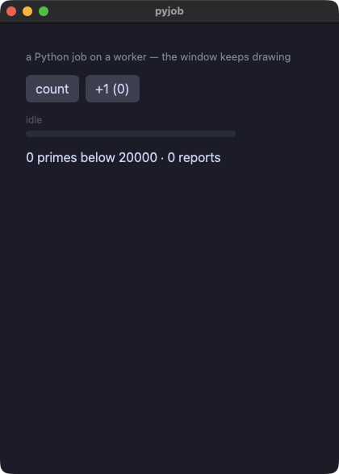

#### transcribe — Buzz の移植。@py と mlx-whisper で文字起こしをして、進捗バー、区間の表、TXT と SRT と VTT の書き出しを持ちます
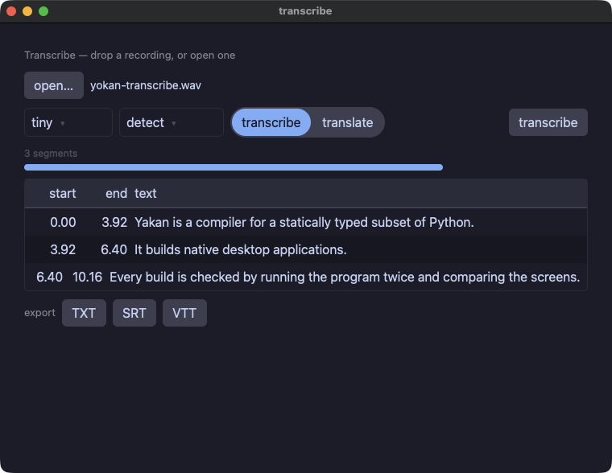

#### multi — マルチモジュール構成（state.py と widgets.py に分割、ヘルパはコンポーネントになる）


#### app — numpy 入りのダッシュボード（開発専用: 辞書 state）
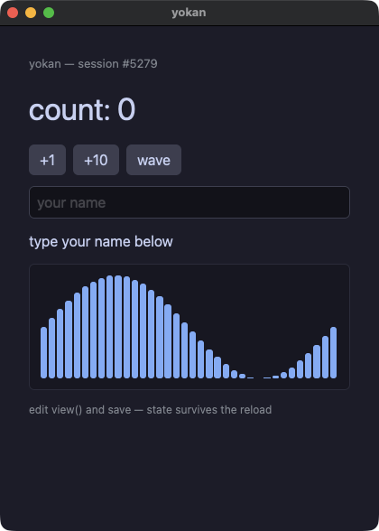

#### csv_viewer — 10 万行の仮想化テーブル + numpy（開発専用: 辞書 state）
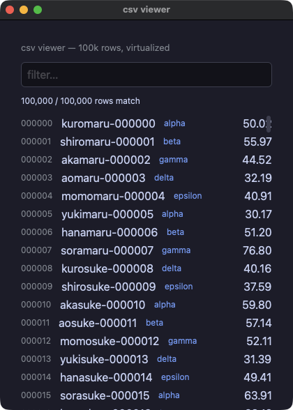
