<!-- Written by website/tools/demospage from demo/. Edit the demos. -->
# デモ

アプリが 44 本あり、すべてがゲートを通っています。
解釈実行とコンパイルした実行を同じスクリプトで動かし、1 バイトずつ突き合わせています。
どれもリポジトリの `gomamochi/` からそのまま動きます。

```console
$ ./bin/gomamochi run demo/counter.go    # 名前はどのデモでもよい
$ ./tools/gate_all.sh                    # すべてのデモをまとめてゲートにかける
```

画面写真はどれも起動直後の状態です。
ただし 2 つのゲームだけは、遊んでいるところの録画です。
その下にあるのは、そのデモのファイル全体です。

## まずはここから

#### counter — 基本形。アプリは構造体で、状態はそのフィールド、ハンドラはフィールドがそのまま見えるクロージャ
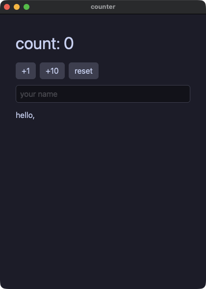

??? note "counter.go"

    ```go
    // The reference: everything in this file is what Gomamochi takes. The
    // app is a struct, its state is its fields, `View` is a method, and a
    // handler is a closure over the fields.
    //
    //	gomamochi run  demo/counter.go
    //	gomamochi gate demo/counter.go --script "click:+1,input:Momo"
    package main

    import (
    	"fmt"

    	. "github.com/i2y/yokan/gomamochi"
    )

    type Counter struct {
    	count int
    	name  string
    }

    func (c *Counter) View() Element {
    	return Column(
    		Text(fmt.Sprintf("count: %d", c.count)).Size(34),
    		Row(
    			Button("+1").OnClick(func() { c.count += 1 }),
    			Button("+10").OnClick(func() { c.count += 10 }),
    			Button("reset").OnClick(func() { c.count = 0 }),
    		).Spacing(8),
    		TextField(c.name).Placeholder("your name").OnChange(func(s string) { c.name = s }),
    		Text(fmt.Sprintf("hello, %s", c.name)),
    	).Spacing(12).Padding(16)
    }

    func main() {
    	Run(&Counter{}, Title("counter"))
    }
    ```

#### prefixed — 同じカウンタを、パッケージに名前を付けて import した書き方で。呼び出しはすべて `gm.` で始まり、アプリ自身の型にはどんな名前を付けてもよい


??? note "prefixed.go"

    ```go
    // The counter again, written the other way: the package imported under
    // a name rather than dot-imported. Every call reads `gm.` in front, the
    // app may use any name it likes for its own types, and both runs take
    // it the same. Which way to write an app is a matter of taste; the
    // tour uses the bare form because the other languages on the engine
    // read that way.
    package main

    import (
    	"fmt"

    	gm "github.com/i2y/yokan/gomamochi"
    )

    type Counter struct {
    	count int
    	name  string
    }

    func (c *Counter) View() gm.Element {
    	return gm.Column(
    		gm.Text(fmt.Sprintf("count: %d", c.count)).Size(34),
    		gm.Row(
    			gm.Button("+1").OnClick(func() { c.count += 1 }),
    			gm.Button("+10").OnClick(func() { c.count += 10 }),
    			gm.Button("reset").OnClick(func() { c.count = 0 }),
    		).Spacing(8),
    		gm.TextField(c.name).Placeholder("your name").OnChange(func(s string) { c.name = s }),
    		gm.Text(fmt.Sprintf("hello, %s", c.name)),
    	).Spacing(12).Padding(16)
    }

    func main() {
    	gm.Run(&Counter{}, gm.Title("prefixed"))
    }
    ```

#### control — ビューの中はただの Go。`if`、ループ、画面の一部を返すメソッド。要素のスライスは、普通の Go と同じ書き方で組み立てる
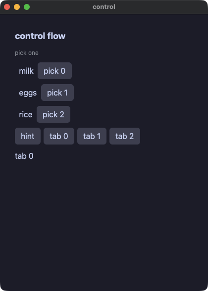

??? note "control.go"

    ```go
    // Ordinary Go inside a view: `if`, a loop, and a method that answers
    // part of the screen. Nothing here is a special form — the view builds
    // a list of elements the way any Go builds a slice, and hands it to
    // the column.
    package main

    import (
    	"fmt"

    	. "github.com/i2y/yokan/gomamochi"
    )

    type Control struct {
    	items    []string
    	picked   int
    	showHint bool
    	tab      int
    }

    func (c *Control) hint() Element {
    	return Text("pick one").Size(12).Color("#8a8f98")
    }

    func (c *Control) line(name string, i int) Element {
    	label := "  " + name
    	if i == c.picked {
    		label = "▸ " + name
    	}
    	return Row(
    		Text(label),
    		Button(fmt.Sprintf("pick %d", i)).OnClick(func() { c.picked = i }),
    	).Spacing(8)
    }

    func (c *Control) tabButton(n int) Element {
    	return Button(fmt.Sprintf("tab %d", n)).OnClick(func() { c.tab = n })
    }

    func (c *Control) View() Element {
    	kids := []Element{Text("control flow").Size(18).Bold(true)}
    	if c.showHint {
    		kids = append(kids, c.hint())
    	} else {
    		kids = append(kids, Text("hidden").Size(12))
    	}
    	for i, name := range c.items {
    		kids = append(kids, c.line(name, i))
    	}
    	if c.picked >= 0 {
    		color := "#f38ba8"
    		if c.picked%2 == 0 {
    			color = "accent"
    		}
    		kids = append(kids, Text(fmt.Sprintf("picked %s", c.items[c.picked])).Color(color))
    	}
    	tabs := []Element{Button("hint").OnClick(func() { c.showHint = !c.showHint })}
    	for n := 0; n < 3; n++ {
    		tabs = append(tabs, c.tabButton(n))
    	}
    	kids = append(kids, Row(tabs...).Spacing(6), Text(fmt.Sprintf("tab %d", c.tab)))
    	return Column(kids...).Spacing(10).Padding(14)
    }

    func main() {
    	Run(&Control{items: []string{"milk", "eggs", "rice"}, picked: -1, showHint: true}, Title("control"))
    }
    ```

#### todo — 行を必要なぶんだけ作るリストと、enter で確定する入力欄
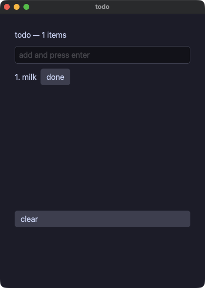

??? note "todo.go"

    ```go
    // A list whose rows are built on demand: the builder is called for the
    // rows in view, not for all of them. The row number is an ordinary
    // argument inside it, so the line, the marker and that row's own button
    // all read the same `i`.
    package main

    import (
    	"fmt"

    	. "github.com/i2y/yokan/gomamochi"
    )

    type Todo struct {
    	items []string
    	draft string
    	done  int
    }

    func (t *Todo) add(s string) {
    	t.items = append(t.items, s)
    	t.draft = ""
    }

    func (t *Todo) line(i int) Element {
    	cells := []Element{Text(fmt.Sprintf("%d. %s", i+1, t.items[i]))}
    	if i == t.done {
    		cells = append(cells, Text("done").Color("accent"))
    	}
    	cells = append(cells, Button("done").OnClick(func() { t.done = i }))
    	return Row(cells...).Spacing(8)
    }

    func (t *Todo) View() Element {
    	return Column(
    		Text(fmt.Sprintf("todo — %d items", len(t.items))).Size(16),
    		TextField(t.draft).Placeholder("add and press enter").
    			OnChange(func(s string) { t.draft = s }).
    			OnSubmit(func(s string) { t.add(s) }),
    		ListView(len(t.items), func(i int) Element { return t.line(i) }).ItemHeight(26).Height(280),
    		Button("clear").OnClick(func() { t.items = nil }),
    	).Spacing(10).Padding(14)
    }

    func main() {
    	Run(&Todo{items: []string{"milk"}, done: -1}, Title("todo"))
    }
    ```

#### calc — 電卓。途中の値ひとつと待っている演算ひとつを持ち、見た目は、どのキーにも同じメソッドを並べる関数にまとめる
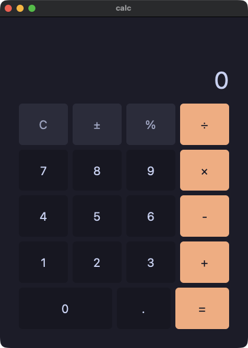

??? note "calc.go"

    ```go
    // A calculator: one accumulator, one pending operation, and a display
    // the app builds as a string. The look of a key is a function that
    // sets the same properties on every button handed to it.
    package main

    import (
    	"strconv"
    	"strings"

    	. "github.com/i2y/yokan/gomamochi"
    )

    // The calculator's look.
    func key(b *ButtonEl) *ButtonEl {
    	return b.Grow(1).Size(20).Background("panel").HoverBackground("#45475a").ActiveBackground("#585b70")
    }

    func fun(b *ButtonEl) *ButtonEl { return key(b).Background("#313244").Color("#a6adc8") }

    func op(b *ButtonEl) *ButtonEl {
    	return key(b).Background("#fab387").Color("#1e1e2e").HoverBackground("#f8c49b").ActiveBackground("#f5e0dc")
    }

    func wide(b *ButtonEl) *ButtonEl { return key(b).Grow(2).Basis(8) }

    func keys(r *RowEl) *RowEl { return r.Spacing(8).Grow(1) }

    type Calc struct {
    	display string
    	acc     float64
    	op      string
    	fresh   bool
    	hasDot  bool
    }

    // The readout reads the way the original's does: a whole number still
    // shows its ".0".
    func num(v float64) string {
    	s := strconv.FormatFloat(v, 'f', -1, 64)
    	if !strings.ContainsAny(s, ".e") {
    		s += ".0"
    	}
    	return s
    }

    // A display that is not a number is worth 0, as it is in the original,
    // where a trailing dot is not a number either.
    func toFloatOrZero(s string) float64 {
    	if strings.HasSuffix(s, ".") {
    		return 0
    	}
    	v, err := strconv.ParseFloat(s, 64)
    	if err != nil {
    		return 0
    	}
    	return v
    }

    func (c *Calc) press(d string) {
    	if c.fresh {
    		c.display = d
    		c.fresh = false
    		c.hasDot = false
    	} else if c.display == "0" {
    		c.display = d
    	} else {
    		c.display = c.display + d
    	}
    }

    func (c *Calc) dot() {
    	if c.fresh {
    		c.display = "0."
    		c.fresh = false
    		c.hasDot = true
    	} else if !c.hasDot {
    		c.display = c.display + "."
    		c.hasDot = true
    	}
    }

    func (c *Calc) negate() {
    	v := toFloatOrZero(c.display)
    	if v == 0 {
    		return
    	}
    	c.display = num(0 - v)
    	c.fresh = false
    }

    func (c *Calc) percent() {
    	c.display = num(toFloatOrZero(c.display) / 100)
    	c.fresh = true
    	c.hasDot = false
    }

    func (c *Calc) apply(next string) {
    	if c.fresh && c.op != "" {
    		c.op = next
    		return
    	}
    	cur := toFloatOrZero(c.display)
    	switch c.op {
    	case "":
    		c.acc = cur
    	case "+":
    		c.acc += cur
    	case "-":
    		c.acc -= cur
    	case "×":
    		c.acc *= cur
    	case "÷":
    		if cur == 0 {
    			c.display = "Error"
    			c.acc = 0
    			c.op = ""
    			c.fresh = true
    			return
    		}
    		c.acc /= cur
    	}
    	c.display = num(c.acc)
    	c.op = next
    	c.fresh = true
    }

    func (c *Calc) clear() {
    	c.display = "0"
    	c.acc = 0
    	c.op = ""
    	c.fresh = true
    	c.hasDot = false
    }

    func (c *Calc) digit(d string) Element {
    	return key(Button(d)).OnClick(func() { c.press(d) })
    }

    func (c *Calc) opKey(name string) Element {
    	return op(Button(name)).OnClick(func() { c.apply(name) })
    }

    func (c *Calc) View() Element {
    	return Column(
    		Text(c.display).Size(40).Color("text").Align("right").Grow(1.4),
    		keys(Row(
    			fun(Button("C")).OnClick(func() { c.clear() }),
    			fun(Button("±")).OnClick(func() { c.negate() }),
    			fun(Button("%")).OnClick(func() { c.percent() }),
    			c.opKey("÷"),
    		)),
    		keys(Row(c.digit("7"), c.digit("8"), c.digit("9"), c.opKey("×"))),
    		keys(Row(c.digit("4"), c.digit("5"), c.digit("6"), c.opKey("-"))),
    		keys(Row(c.digit("1"), c.digit("2"), c.digit("3"), c.opKey("+"))),
    		keys(Row(
    			wide(Button("0")).OnClick(func() { c.press("0") }),
    			key(Button(".")).OnClick(func() { c.dot() }),
    			op(Button("=")).OnClick(func() { c.apply("") }),
    		)),
    	).Spacing(8).Padding(16).Grow(1)
    }

    func main() {
    	Run(&Calc{display: "0", fresh: true}, Title("calc"))
    }
    ```

#### calcgrid — 同じ電卓を 5 行ではなくグリッドで。0 キーが 2 つぶんの幅になるのは `ColSpan`
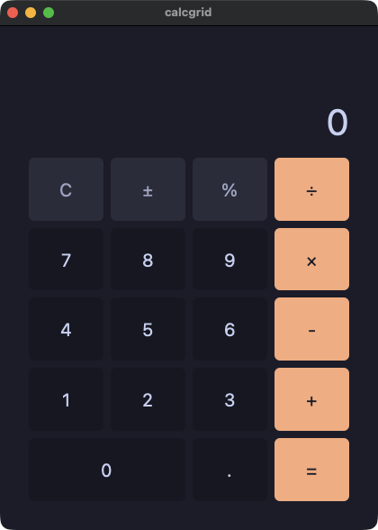

??? note "calcgrid.go"

    ```go
    // The same calculator as demo/calc.go, on a grid instead of five rows.
    // `ColSpan` is what makes the zero key twice as wide.
    package main

    import (
    	"strconv"
    	"strings"

    	. "github.com/i2y/yokan/gomamochi"
    )

    func key(b *ButtonEl) *ButtonEl {
    	return b.Grow(1).Size(20).Background("panel").HoverBackground("#45475a").ActiveBackground("#585b70")
    }

    func fun(b *ButtonEl) *ButtonEl { return key(b).Background("#313244").Color("#a6adc8") }

    func op(b *ButtonEl) *ButtonEl {
    	return key(b).Background("#fab387").Color("#1e1e2e").HoverBackground("#f8c49b").ActiveBackground("#f5e0dc")
    }

    type CalcGrid struct {
    	display string
    	acc     float64
    	op      string
    	fresh   bool
    	hasDot  bool
    }

    func num(v float64) string {
    	s := strconv.FormatFloat(v, 'f', -1, 64)
    	if !strings.ContainsAny(s, ".e") {
    		s += ".0"
    	}
    	return s
    }

    func toFloatOrZero(s string) float64 {
    	if strings.HasSuffix(s, ".") {
    		return 0
    	}
    	v, err := strconv.ParseFloat(s, 64)
    	if err != nil {
    		return 0
    	}
    	return v
    }

    func (c *CalcGrid) press(d string) {
    	if c.fresh {
    		c.display = d
    		c.fresh = false
    		c.hasDot = false
    	} else if c.display == "0" {
    		c.display = d
    	} else {
    		c.display = c.display + d
    	}
    }

    func (c *CalcGrid) dot() {
    	if c.fresh {
    		c.display = "0."
    		c.fresh = false
    		c.hasDot = true
    	} else if !c.hasDot {
    		c.display = c.display + "."
    		c.hasDot = true
    	}
    }

    func (c *CalcGrid) negate() {
    	v := toFloatOrZero(c.display)
    	if v == 0 {
    		return
    	}
    	c.display = num(0 - v)
    	c.fresh = false
    }

    func (c *CalcGrid) percent() {
    	c.display = num(toFloatOrZero(c.display) / 100)
    	c.fresh = true
    	c.hasDot = false
    }

    func (c *CalcGrid) apply(next string) {
    	if c.fresh && c.op != "" {
    		c.op = next
    		return
    	}
    	cur := toFloatOrZero(c.display)
    	switch c.op {
    	case "":
    		c.acc = cur
    	case "+":
    		c.acc += cur
    	case "-":
    		c.acc -= cur
    	case "×":
    		c.acc *= cur
    	case "÷":
    		if cur == 0 {
    			c.display = "Error"
    			c.acc = 0
    			c.op = ""
    			c.fresh = true
    			return
    		}
    		c.acc /= cur
    	}
    	c.display = num(c.acc)
    	c.op = next
    	c.fresh = true
    }

    func (c *CalcGrid) clear() {
    	c.display = "0"
    	c.acc = 0
    	c.op = ""
    	c.fresh = true
    	c.hasDot = false
    }

    func (c *CalcGrid) digit(d string) Element {
    	return key(Button(d)).OnClick(func() { c.press(d) })
    }

    func (c *CalcGrid) opKey(name string) Element {
    	return op(Button(name)).OnClick(func() { c.apply(name) })
    }

    func (c *CalcGrid) View() Element {
    	return Column(
    		Text(c.display).Size(40).Color("text").Align("right").Grow(1.4),
    		Grid(
    			fun(Button("C")).OnClick(func() { c.clear() }),
    			fun(Button("±")).OnClick(func() { c.negate() }),
    			fun(Button("%")).OnClick(func() { c.percent() }),
    			c.opKey("÷"),
    			c.digit("7"), c.digit("8"), c.digit("9"), c.opKey("×"),
    			c.digit("4"), c.digit("5"), c.digit("6"), c.opKey("-"),
    			c.digit("1"), c.digit("2"), c.digit("3"), c.opKey("+"),
    			key(Button("0")).ColSpan(2).OnClick(func() { c.press("0") }),
    			key(Button(".")).OnClick(func() { c.dot() }),
    			op(Button("=")).OnClick(func() { c.apply("") }),
    		).Columns(4).Rows(5).Spacing(8).Grow(5),
    	).Spacing(8).Padding(16).Grow(1)
    }

    func main() {
    	Run(&CalcGrid{display: "0", fresh: true}, Title("calcgrid"))
    }
    ```

## 状態

#### mixer — アプリが持つ状態と、そこへ書き込む入力欄
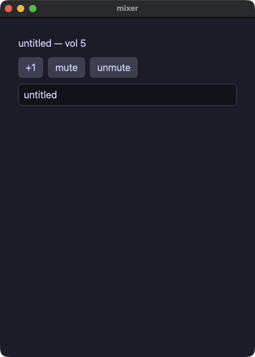

??? note "mixer.go"

    ```go
    // State an app keeps and a field that writes into it.
    package main

    import (
    	"fmt"

    	. "github.com/i2y/yokan/gomamochi"
    )

    type Mixer struct {
    	volume int
    	title  string
    	muted  bool
    }

    func (m *Mixer) View() Element {
    	cells := []Element{
    		Text(fmt.Sprintf("%s — vol %d", m.title, m.volume)).Size(16),
    		Row(
    			Button("+1").OnClick(func() { m.volume += 1 }),
    			Button("mute").OnClick(func() { m.muted = true }),
    			Button("unmute").OnClick(func() { m.muted = false }),
    		).Spacing(8),
    	}
    	if m.muted {
    		cells = append(cells, Text("(muted)").Size(12).Color("#8a8f98"))
    	}
    	cells = append(cells, TextField(m.title).Placeholder("title").OnChange(func(t string) { m.title = t }))
    	return Column(cells...).Spacing(10).Padding(14)
    }

    func main() {
    	Run(&Mixer{volume: 5, title: "untitled"}, Title("mixer"))
    }
    ```

#### lookup — アプリが持つマップ。既定値つきの読み出し、キーがあるかどうかの確認、ウィンドウを開けたままの追加。ビューの中でマップを走査することはない
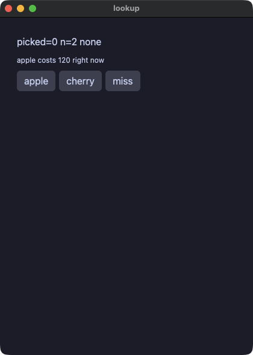

??? note "lookup.go"

    ```go
    // A map on the app: reading with a fallback, asking whether a key is
    // there, and adding one while the window is open. A map is never
    // ranged over in a view — its order changes from run to run — but a
    // key is read as freely as a field.
    package main

    import (
    	"fmt"

    	. "github.com/i2y/yokan/gomamochi"
    )

    type Lookup struct {
    	prices map[string]int
    	picked int
    	label  string
    }

    // The price of a fruit, or `fallback` when it is not on the list.
    func (l *Lookup) price(name string, fallback int) int {
    	if v, ok := l.prices[name]; ok {
    		return v
    	}
    	return fallback
    }

    func (l *Lookup) pickApple() {
    	l.picked = l.price("apple", -1)
    	if _, ok := l.prices["cherry"]; ok {
    		l.label = "cherry known"
    	} else {
    		l.label = "no cherry"
    	}
    }

    func (l *Lookup) addCherry() {
    	l.prices["cherry"] = 200
    	l.picked = l.price("cherry", -1)
    	if _, ok := l.prices["cherry"]; ok {
    		l.label = "cherry known"
    	}
    }

    func (l *Lookup) View() Element {
    	return Column(
    		Text(fmt.Sprintf("picked=%d n=%d %s", l.picked, len(l.prices), l.label)),
    		Text(fmt.Sprintf("apple costs %d right now", l.price("apple", -1))).Size(12),
    		Row(
    			Button("apple").OnClick(func() { l.pickApple() }),
    			Button("cherry").OnClick(func() { l.addCherry() }),
    			Button("miss").OnClick(func() { l.picked = l.price("durian", -7) }),
    		).Spacing(6),
    	).Spacing(8).Padding(12)
    }

    func main() {
    	Run(&Lookup{prices: map[string]int{"apple": 120, "banana": 80}, label: "none"}, Title("lookup"))
    }
    ```

#### points — 値のための小さな構造体を、アプリの状態として持つ
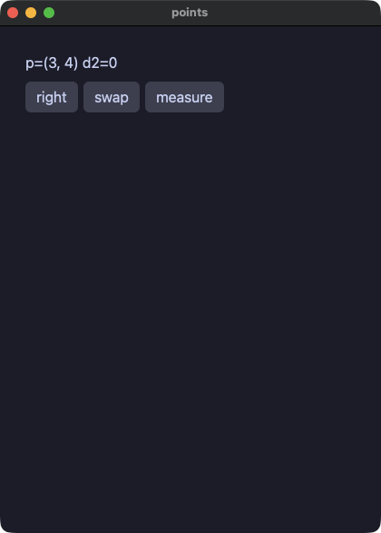

??? note "points.go"

    ```go
    // A small struct of values, carried on the app's own state.
    package main

    import (
    	"fmt"

    	. "github.com/i2y/yokan/gomamochi"
    )

    type Point struct {
    	x, y int
    }

    type Points struct {
    	sel  Point
    	dist int
    }

    func (p *Points) View() Element {
    	return Column(
    		Text(fmt.Sprintf("p=(%d, %d) d2=%d", p.sel.x, p.sel.y, p.dist)),
    		Row(
    			Button("right").OnClick(func() { p.sel = Point{p.sel.x + 5, p.sel.y} }),
    			Button("swap").OnClick(func() { p.sel = Point{p.sel.y, p.sel.x} }),
    			Button("measure").OnClick(func() { p.dist = p.sel.x*p.sel.x + p.sel.y*p.sel.y }),
    		).Spacing(6),
    	).Spacing(8).Padding(12)
    }

    func main() {
    	Run(&Points{sel: Point{3, 4}}, Title("points"))
    }
    ```

#### moods — 決まった名前のどれか一つになる値（定数）と、何も入っていないかもしれない値（nil になりうるポインタ）
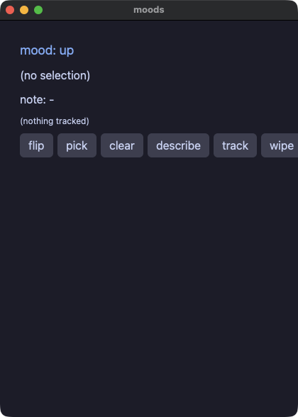

??? note "moods.go"

    ```go
    // Values that are one of a few named things, and a value that may be
    // nothing at all. Go writes the first as constants and the second as a
    // pointer that may be nil.
    package main

    import (
    	"fmt"

    	. "github.com/i2y/yokan/gomamochi"
    )

    const (
    	happy = "happy"
    	sad   = "sad"
    )

    type Tracker struct {
    	last  *int
    	trend string
    }

    func (t *Tracker) note(v int) {
    	t.last = &v
    	if t.trend == happy {
    		t.trend = sad
    	} else {
    		t.trend = happy
    	}
    }

    func (t *Tracker) wipe() {
    	t.last = nil
    }

    type Moods struct {
    	mood    string
    	sel     *int
    	note    string
    	tracker *Tracker
    }

    func (m *Moods) flip() {
    	if m.mood == happy {
    		m.mood = sad
    	} else {
    		m.mood = happy
    	}
    }

    func (m *Moods) describe() {
    	if m.sel == nil {
    		m.note = "nothing chosen"
    	} else {
    		m.note = fmt.Sprintf("chose %d", *m.sel)
    	}
    }

    func (m *Moods) moodLine() Element {
    	if m.mood == happy {
    		return Text("mood: up").Size(18).Color("accent").Animate(120).Easing("out")
    	}
    	return Text("mood: down").Size(18).Color("#f38ba8").Animate(120).Easing("out")
    }

    func (m *Moods) View() Element {
    	selection := Text("(no selection)")
    	if m.sel != nil {
    		selection = Text(fmt.Sprintf("selection: %d", *m.sel))
    	}
    	tracked := Text("(nothing tracked)").Size(12)
    	if m.tracker.last != nil {
    		tracked = Text(fmt.Sprintf("tracked: %d", *m.tracker.last)).Size(12)
    	}
    	return Column(
    		m.moodLine(),
    		selection,
    		Text("note: "+m.note),
    		tracked,
    		Row(
    			Button("flip").OnClick(func() { m.flip() }),
    			Button("pick").OnClick(func() { seven := 7; m.sel = &seven }),
    			Button("clear").OnClick(func() { m.sel = nil }),
    			Button("describe").OnClick(func() { m.describe() }),
    			Button("track").Animate(100).Easing("inOut").OnClick(func() { m.tracker.note(9) }),
    			Button("wipe").OnClick(func() { m.tracker.wipe() }),
    		).Spacing(6),
    	).Spacing(8).Padding(12)
    }

    func main() {
    	Run(&Moods{mood: happy, note: "-", tracker: &Tracker{trend: happy}}, Title("moods"))
    }
    ```

#### links — 互いを指し合うオブジェクト。Go のガベージコレクタは循環参照も回収するので、親を指すフィールドも普通のポインタでよい
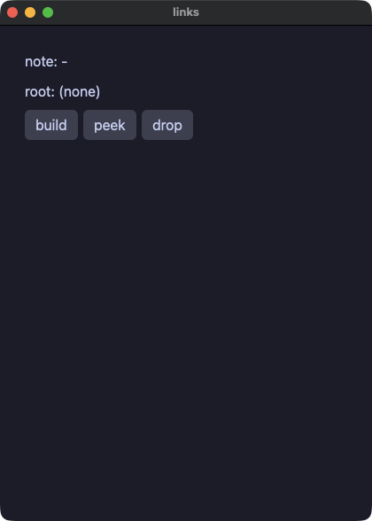

??? note "links.go"

    ```go
    // Objects that point at one another. Yokan needs a weak back pointer
    // here so a parent and a child cannot own each other forever; Go's
    // collector takes a cycle in its stride, so the back pointer is an
    // ordinary pointer and the tree is written the way it reads.
    package main

    import (
    	"fmt"

    	. "github.com/i2y/yokan/gomamochi"
    )

    type Node struct {
    	label  string
    	kid    *Node
    	parent *Node
    }

    type Tree struct {
    	root *Node
    	keep *Node
    	note string
    }

    func (t *Tree) build() {
    	a := &Node{label: "alpha"}
    	b := &Node{label: "beta"}
    	a.kid = b
    	b.parent = a
    	t.root = a
    	t.keep = b
    }

    func (t *Tree) peek() {
    	switch {
    	case t.root == nil && t.keep == nil:
    		t.note = "no root"
    	case t.root == nil:
    		t.note = fmt.Sprintf("kept %s, parent=%s", t.keep.label, t.keep.parent.label)
    	case t.root.kid == nil:
    		t.note = "no kid"
    	default:
    		t.note = fmt.Sprintf("kid=%s parent=%s", t.root.kid.label, t.root.kid.parent.label)
    	}
    }

    func (t *Tree) View() Element {
    	rootLine := Text("root: (none)")
    	if t.root != nil {
    		rootLine = Text("root: " + t.root.label)
    	}
    	return Column(
    		Text("note: "+t.note),
    		rootLine,
    		Row(
    			Button("build").OnClick(func() { t.build() }),
    			Button("peek").OnClick(func() { t.peek() }),
    			Button("drop").OnClick(func() { t.root = nil }),
    		).Spacing(6),
    	).Spacing(8).Padding(12)
    }

    func main() {
    	Run(&Tree{note: "-"}, Title("links"))
    }
    ```

## 見た目と配置

#### forms — 人が動かす要素。チェックボックス、スイッチ、スライダ、そして 4 種類の選択
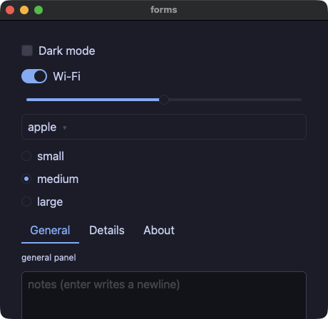

??? note "forms.go"

    ```go
    // The controls a person changes: a box, a switch, a track, and the four
    // choosers. Each hands its new value to the closure.
    package main

    import (
    	"fmt"

    	. "github.com/i2y/yokan/gomamochi"
    )

    type Forms struct {
    	dark   bool
    	wifi   bool
    	volume float64
    	fruits []string
    	fruit  int
    	sizes  []string
    	size   int
    	tabs   []string
    	tab    int
    	note   string
    }

    func (f *Forms) panel() Element {
    	if f.tab == 0 {
    		return Text("general panel").Size(12)
    	}
    	if f.tab == 1 {
    		return Text("details panel").Size(12)
    	}
    	return Text("about panel").Size(12)
    }

    func (f *Forms) View() Element {
    	return Column(
    		Checkbox("Dark mode").Checked(f.dark).Tooltip("the whole window follows this").
    			OnChange(func(on bool) { f.dark = on }),
    		Switch("Wi-Fi").Checked(f.wifi).OnChange(func(on bool) { f.wifi = on }),
    		Slider().Value(f.volume).Min(0).Max(10).Step(1).Tooltip("0 to 10, in whole steps").
    			OnChange(func(v float64) { f.volume = v }),
    		Select().Options(f.fruits...).Selected(f.fruit).OnChange(func(i int) { f.fruit = i }),
    		RadioGroup().Options(f.sizes...).Selected(f.size).OnChange(func(i int) { f.size = i }),
    		TabBar().Labels(f.tabs...).Active(f.tab).OnChange(func(i int) { f.tab = i }),
    		f.panel(),
    		TextField(f.note).Placeholder("notes (enter writes a newline)").Multiline(true).Rows(3).
    			OnChange(func(t string) { f.note = t }),
    		Text(fmt.Sprintf("dark=%v  wifi=%v  vol=%.1f", f.dark, f.wifi, f.volume)),
    		Text(fmt.Sprintf("fruit#%d  size#%d  tab#%d", f.fruit, f.size, f.tab)),
    	).Spacing(10).Padding(14)
    }

    func main() {
    	Run(&Forms{
    		wifi:   true,
    		volume: 5,
    		fruits: []string{"apple", "banana", "cherry"},
    		sizes:  []string{"small", "medium", "large"},
    		size:   1,
    		tabs:   []string{"General", "Details", "About"},
    	}, Title("forms"), Size(460, 420))
    }
    ```

#### quantities — 文字ではなく数を持つ 2 つの入力欄。enter か、欄を離れることで確定し、数でない文字は捨てられる
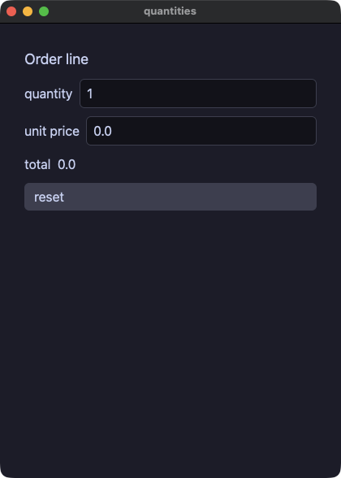

??? note "quantities.go"

    ```go
    // The two fields that hold a number rather than text: enter or leaving
    // them commits, text that is not a number is dropped and the shown
    // value returns to what the app holds.
    package main

    import (
    	"strconv"
    	"strings"

    	. "github.com/i2y/yokan/gomamochi"
    )

    type Order struct {
    	qty   int
    	price float64
    }

    func (o *Order) reset() {
    	o.qty = 1
    	o.price = 0
    }

    // A number the way the other languages print one: a whole number
    // still shows its ".0".
    func num(v float64) string {
    	s := strconv.FormatFloat(v, 'f', -1, 64)
    	if !strings.ContainsAny(s, ".e") {
    		s += ".0"
    	}
    	return s
    }

    func (o *Order) View() Element {
    	return Column(
    		Text("Order line").Size(18),
    		Row(
    			Text("quantity"),
    			IntField(o.qty).Min(1).Max(99).Placeholder("qty").OnChange(func(n int) { o.qty = n }),
    		).Spacing(8),
    		Row(
    			Text("unit price"),
    			NumberField(o.price).Min(0).Max(1000).Step(0.5).Placeholder("price").
    				OnChange(func(p float64) { o.price = p }),
    		).Spacing(8),
    		Text("total  "+num(float64(o.qty)*o.price)),
    		Button("reset").OnClick(func() { o.reset() }),
    	).Spacing(10).Padding(14)
    }

    func main() {
    	Run(&Order{qty: 1}, Title("quantities"))
    }
    ```

#### layout — Spacer と Divider。続きを端まで押しやる余白と、区切り線
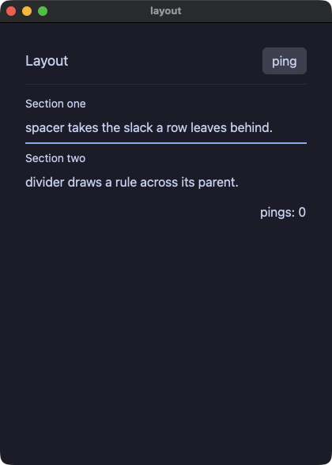

??? note "layout.go"

    ```go
    // Spacer and Divider: a filler and a rule. The header row's spacer
    // pushes "ping" to the far edge; the footer's does the same for the
    // count. Divider draws the rules, the second one heavier and colored.
    package main

    import (
    	"fmt"

    	. "github.com/i2y/yokan/gomamochi"
    )

    type Layout struct {
    	pings int
    }

    func (l *Layout) View() Element {
    	return Column(
    		Row(
    			Text("Layout").Size(18),
    			Spacer(),
    			Button("ping").OnClick(func() { l.pings += 1 }),
    		),
    		Divider(),
    		Column(
    			Text("Section one").Size(14),
    			Text("spacer takes the slack a row leaves behind."),
    			Divider().Thickness(2).Color("accent"),
    			Text("Section two").Size(14),
    			Text("divider draws a rule across its parent."),
    		).Spacing(6),
    		Row(
    			Spacer(),
    			Text(fmt.Sprintf("pings: %d", l.pings)),
    		),
    	).Spacing(12).Padding(16)
    }

    func main() {
    	Run(&Layout{}, Title("layout"))
    }
    ```

#### cards — 名前のついた画面の一部はメソッド。ほかの要素を包むものは、それらを引数に取る
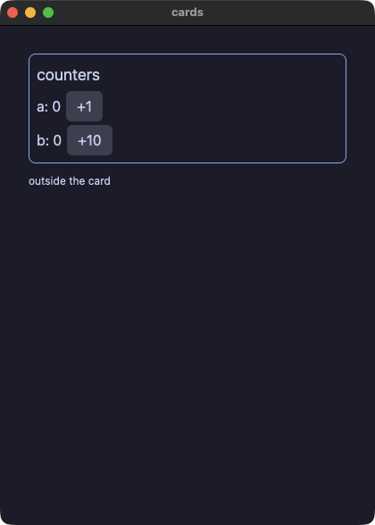

??? note "cards.go"

    ```go
    // A piece of screen with a name is a method that answers an element,
    // and one that wraps other elements takes them as arguments.
    package main

    import (
    	"fmt"

    	. "github.com/i2y/yokan/gomamochi"
    )

    type Cards struct {
    	a int
    	b int
    }

    func (c *Cards) card(title string, kids ...Element) Element {
    	cells := []Element{Text(title).Size(18)}
    	cells = append(cells, kids...)
    	return Column(cells...).Spacing(4).Padding(8).
    		BorderWidth(1).BorderColor("accent").BorderRadius(8)
    }

    func (c *Cards) View() Element {
    	return Column(
    		c.card("counters",
    			Row(Text(fmt.Sprintf("a: %d", c.a)), Button("+1").OnClick(func() { c.a += 1 })).Spacing(6),
    			Row(Text(fmt.Sprintf("b: %d", c.b)), Button("+10").OnClick(func() { c.b += 10 })).Spacing(6)),
    		Text("outside the card").Size(12),
    	).Spacing(10).Padding(16)
    }

    func main() {
    	Run(&Cards{}, Title("cards"))
    }
    ```

#### styled — 見た目をひとところに。どのボタンにも同じメソッドを並べる関数と、パネルを丸ごと切り替える `Theme`
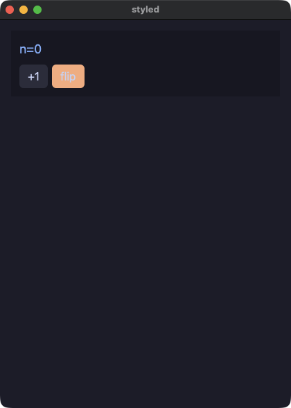

??? note "styled.go"

    ```go
    // A look kept in one place: a function that sets the same properties
    // on every button handed to it. `Theme` swaps the palette its subtree
    // resolves colors in, so one keyword flips the whole panel.
    package main

    import (
    	"fmt"

    	. "github.com/i2y/yokan/gomamochi"
    )

    func key(b *ButtonEl) *ButtonEl { return b.Background("#313244").HoverBackground("#45475a") }

    func keyHot(b *ButtonEl) *ButtonEl { return key(b).Background("#fab387") }

    type Styled struct {
    	mode string
    	n    int
    }

    func (s *Styled) flip() {
    	if s.mode == "dark" {
    		s.mode = "light"
    	} else {
    		s.mode = "dark"
    	}
    }

    func (s *Styled) View() Element {
    	return Column(
    		Text(fmt.Sprintf("n=%d", s.n)).Size(18).Color("accent"),
    		Row(
    			key(Button("+1")).OnClick(func() { s.n += 1 }),
    			keyHot(Button("flip")).OnClick(func() { s.flip() }),
    		).Spacing(6),
    	).Spacing(8).Padding(12).Background("panel").Theme(s.mode)
    }

    func main() {
    	Run(&Styled{mode: "dark"}, Title("styled"))
    }
    ```

#### badges — 文字を丸いラベルに。等幅、下線、斜体、省略記号での打ち切り、行数の制限
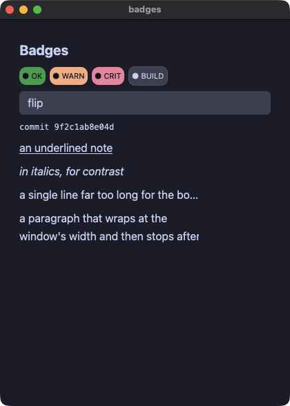

??? note "badges.go"

    ```go
    // Text as a pill: a background with padding and a radius. And the rest
    // of what a run of text can be — monospace, underlined, italic, clipped
    // with an ellipsis, or wrapped and then clamped.
    package main

    import . "github.com/i2y/yokan/gomamochi"

    type Badges struct {
    	tint string
    	hot  bool
    }

    func (b *Badges) flip() {
    	b.hot = !b.hot
    	if b.hot {
    		b.tint = "#f38ba8"
    	} else {
    		b.tint = "#45475a"
    	}
    }

    // A pill is a piece of text with a background; the rest is the same
    // for every one of them.
    func pill(label, background string) Element {
    	return Text(label).Size(11).Color("#11111b").Padding(4).BorderRadius(10).Background(background)
    }

    func (b *Badges) View() Element {
    	return Column(
    		Text("Badges").Size(20).Bold(true),
    		Row(
    			pill("● OK", "#2fa84f"),
    			pill("● WARN", "#fab387"),
    			pill("● CRIT", "#f38ba8"),
    			Text("● BUILD").Size(11).Color("#cdd6f4").Background(b.tint).
    				Padding(4).BorderRadius(10).BorderWidth(1).BorderColor("#585b70"),
    		).Spacing(6),
    		Button("flip").OnClick(func() { b.flip() }),
    		Text("commit 9f2c1ab8e04d").Mono(true).Size(12),
    		Text("an underlined note").Underline(true),
    		Text("in italics, for contrast").Italic(true),
    		// An ellipsis needs a bounded box to clip against.
    		Text("a single line far too long for the box it was given, so it ends in an ellipsis").
    			Wrap("ellipsis").Width(260),
    		// The clamp is the other half: this one wraps, then stops.
    		Text("a paragraph that wraps at the window's width and then stops after two lines, "+
    			"because a clamped label is what a card summary wants").
    			MaxLines(2).Width(260),
    	).Spacing(8).Padding(12)
    }

    func main() {
    	Run(&Badges{tint: "#45475a"}, Title("badges"))
    }
    ```

#### panels — 並べる要素と覆う要素。グリッド、重ね、スクロールする面、ウィンドウの上に出る一枚
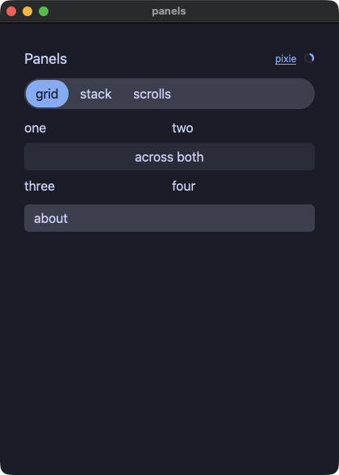

??? note "panels.go"

    ```go
    // The elements that arrange or cover: tracks, layers, panes that
    // scroll, and a panel over the rest of the window.
    package main

    import (
    	"fmt"

    	. "github.com/i2y/yokan/gomamochi"
    )

    type Panels struct {
    	open  bool
    	pane  int
    	panes []string
    }

    func (p *Panels) tracks() Element {
    	return Grid(
    		Text("one"), Text("two"),
    		GridCell(Text("across both").Align("center").Background("#313244").
    			Padding(4).BorderRadius(6)).ColSpan(2),
    		Text("three"), Text("four"),
    	).Columns(2).Spacing(6)
    }

    func (p *Panels) layers() Element {
    	return Stack(
    		Image("demo/assets/postcard.png").Width(180).Height(90),
    		Text("over the picture").Size(14).Color("#11111b").Background("#f9e2af").Padding(4),
    	)
    }

    func (p *Panels) scrolls() Element {
    	var lines []Element
    	for n := 1; n <= 12; n++ {
    		lines = append(lines, Text(fmt.Sprintf("line %d", n)))
    	}
    	var cols []Element
    	for n := 1; n <= 10; n++ {
    		cols = append(cols, Text(fmt.Sprintf("col %d", n)).Width(70))
    	}
    	return Column(
    		ScrollView(Column(lines...).Spacing(2)).Height(90),
    		HScrollView(Row(cols...).Spacing(6)),
    	).Spacing(8)
    }

    func (p *Panels) panel() Element {
    	if p.pane == 0 {
    		return p.tracks()
    	}
    	if p.pane == 1 {
    		return p.layers()
    	}
    	return p.scrolls()
    }

    func (p *Panels) View() Element {
    	return Stack(
    		Column(
    			Row(
    				Text("Panels").Size(18),
    				Spacer(),
    				Link("pixie", "https://example.invalid").Size(12),
    				Spinner().Size(14),
    			).Spacing(8),
    			Segmented().Options(p.panes...).Selected(p.pane).OnChange(func(i int) { p.pane = i }),
    			p.panel(),
    			Button("about").OnClick(func() { p.open = true }),
    		).Spacing(10).Padding(14),
    		Modal(
    			Column(
    				Text("A panel over the rest of it.").Size(14),
    				Button("close").OnClick(func() { p.open = false }),
    			).Spacing(8).Padding(12).Background("panel"),
    		).Open(p.open),
    	)
    }

    func main() {
    	Run(&Panels{panes: []string{"grid", "stack", "scrolls"}}, Title("panels"))
    }
    ```

#### dialog — ウィンドウの上に出る一枚を、アプリが開いて閉じる
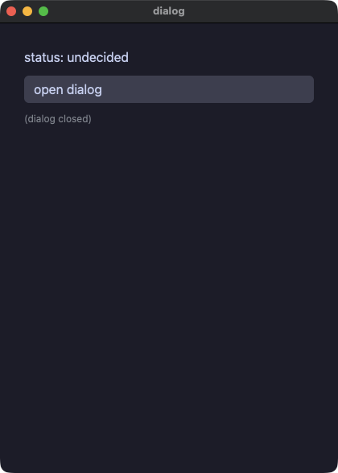

??? note "dialog.go"

    ```go
    // A panel over the rest of the window, opened and closed by the app.
    package main

    import . "github.com/i2y/yokan/gomamochi"

    type Dialog struct {
    	show   bool
    	status string
    }

    func (d *Dialog) decide(answer string) {
    	d.status = answer
    	d.show = false
    }

    func (d *Dialog) View() Element {
    	kids := []Element{
    		Text("status: " + d.status).Size(16),
    		Button("open dialog").OnClick(func() { d.show = true }),
    	}
    	if d.show {
    		kids = append(kids, Modal(
    			Text("accept the terms?").Size(18),
    			Row(
    				Button("accept").OnClick(func() { d.decide("accepted") }),
    				Button("decline").OnClick(func() { d.decide("declined") }),
    			).Spacing(8),
    		))
    	} else {
    		kids = append(kids, Text("(dialog closed)").Size(12).Color("#8a8f98"))
    	}
    	return Column(kids...).Spacing(10).Padding(14)
    }

    func main() {
    	Run(&Dialog{status: "undecided"}, Title("dialog"))
    }
    ```

#### labels — 画面読み上げに伝える名前と、ポインタが見せる説明。`Role` は値を取るので、行が見出しであるかどうかを切り替えられる
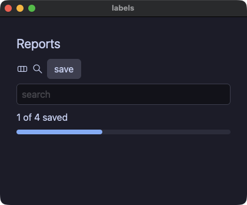

??? note "labels.go"

    ```go
    // What a screen reader is told, and what the pointer shows. `Role`
    // takes a value, so the summary line is a heading until there is a
    // result under it and then it is not.
    package main

    import . "github.com/i2y/yokan/gomamochi"

    type Labels struct {
    	title       string
    	query       string
    	summaryRole string
    }

    func (l *Labels) View() Element {
    	return Column(
    		Text(l.title).Size(22).Role("heading"),
    		Row(
    			Svg("demo/assets/yokan.svg").Width(20).Height(20).A11yLabel("Yokan"),
    			Svg("demo/assets/search.svg").Width(20).Height(20).A11yLabel("Search"),
    			// The one element carrying a tooltip, a role, a name and a
    			// tween at once, which is what pins the order they wrap in.
    			Button("save").Animate(150).Easing("out").Role("button").
    				A11yLabel("Save the report").Tooltip("Save this report").
    				OnClick(func() { l.summaryRole = "label" }),
    		).Spacing(6).Role("group").A11yLabel("toolbar"),
    		TextField(l.query).Placeholder("search").A11yLabel("search").
    			OnChange(func(q string) { l.query = q }),
    		Text("1 of 4 saved").Role(l.summaryRole),
    		Progress(0.4),
    	).Spacing(8).Padding(12)
    }

    func main() {
    	Run(&Labels{title: "Reports", summaryRole: "heading"}, Title("labels"), Size(420, 320))
    }
    ```

#### shared — 共通のメソッドを、種類の違う要素それぞれに付けてみる
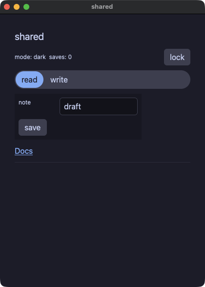

??? note "shared.go"

    ```go
    // The properties every element takes, on elements that have nothing
    // else in common: a theme scope on a spacer, a box around a column, a
    // tween on a chooser, a tooltip on a rule, and the lock that makes a
    // field and a button inert.
    package main

    import (
    	"fmt"

    	. "github.com/i2y/yokan/gomamochi"
    )

    type Locks struct {
    	locked bool
    	saves  int
    	// The palette the spacer's subtree resolves its tokens in — a
    	// property takes a value, not just a literal, so the lock switches it.
    	mode string
    	tab  int
    	note string
    }

    func (l *Locks) flip() {
    	l.locked = !l.locked
    	if l.locked {
    		l.mode = "light"
    	} else {
    		l.mode = "dark"
    	}
    }

    func (l *Locks) View() Element {
    	return Column(
    		Text("shared").Size(20).Role("heading"),
    		Row(
    			Text(fmt.Sprintf("mode: %s  saves: %d", l.mode, l.saves)).Size(12),
    			// A theme scope on a spacer: the property is the element's,
    			// whichever element it is.
    			Spacer().Grow(1).Theme(l.mode),
    			Button("lock").Tooltip("flip the lock").OnClick(func() { l.flip() }),
    		).Spacing(8),
    		Segmented().Options("read", "write").Selected(l.tab).Animate(120).Easing("out").
    			OnChange(func(i int) { l.tab = i }),
    		// A box around the section: 260 wide, never under 200.
    		Column(
    			// The field takes two of the grid's three tracks, and goes
    			// inert with the lock.
    			Grid(
    				Text("note").Size(12),
    				TextField(l.note).ColSpan(2).Disabled(l.locked).OnChange(func(t string) { l.note = t }),
    			).Columns(3).Spacing(8),
    			Button("save").Disabled(l.locked).Tooltip("count a save").OnClick(func() { l.saves += 1 }),
    		).Width(260).MinWidth(200).Spacing(8).Padding(8).Background("panel"),
    		Link("Docs", "https://i2y.github.io/yokan/").Role("button"),
    		Divider().Tooltip("the end of the shared properties"),
    	).Spacing(10).Padding(14)
    }

    func main() {
    	Run(&Locks{mode: "dark", note: "draft"}, Title("shared"))
    }
    ```

#### loading — 満ちていくバーの 3 つの形。見出しつき、アプリが決めた大きさ、そして終わりの見えない処理のために行き来する表示
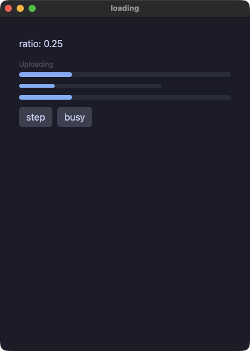

??? note "loading.go"

    ```go
    // The bar that fills, in its three forms: with a caption above it, at a
    // size the app chose, and sweeping for work with no known length.
    package main

    import (
    	"strconv"
    	"strings"

    	. "github.com/i2y/yokan/gomamochi"
    )

    type Loading struct {
    	ratio float64
    	busy  bool
    }

    func (l *Loading) step() {
    	if l.ratio >= 1 {
    		l.ratio = 0
    	} else {
    		l.ratio += 0.25
    	}
    }

    // A number the way the other languages print one: a whole number
    // still shows its ".0".
    func num(v float64) string {
    	s := strconv.FormatFloat(v, 'f', -1, 64)
    	if !strings.ContainsAny(s, ".e") {
    		s += ".0"
    	}
    	return s
    }

    func (l *Loading) View() Element {
    	return Column(
    		Text("ratio: "+num(l.ratio)),
    		Progress(l.ratio).Label("Uploading"),
    		Progress(l.ratio).Width(240).Height(6),
    		Progress(l.ratio).Indeterminate(l.busy),
    		Row(
    			Button("step").OnClick(func() { l.step() }),
    			Button("busy").OnClick(func() { l.busy = !l.busy }),
    		).Spacing(8),
    	).Spacing(12).Padding(16)
    }

    func main() {
    	Run(&Loading{ratio: 0.25}, Title("loading"))
    }
    ```

#### filter — リストが見せるものを変える選択。行は必要なぶんだけ作られる
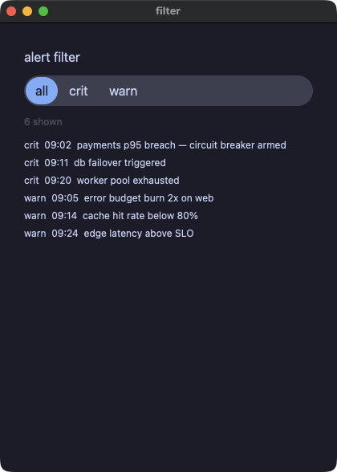

??? note "filter.go"

    ```go
    // A chooser that changes what a list shows. The rows are built on
    // demand, so the list is asked only for the ones in view.
    package main

    import (
    	"fmt"

    	. "github.com/i2y/yokan/gomamochi"
    )

    type Alerts struct {
    	levels  []string
    	level   int
    	crit    []string
    	warn    []string
    	visible []string
    }

    func (a *Alerts) all() []string {
    	out := append([]string{}, a.crit...)
    	return append(out, a.warn...)
    }

    func (a *Alerts) pick(i int) {
    	a.level = i
    	switch i {
    	case 1:
    		a.visible = a.crit
    	case 2:
    		a.visible = a.warn
    	default:
    		a.visible = a.all()
    	}
    }

    func (a *Alerts) alertRow(i int) Element {
    	return Text(a.visible[i]).Size(12)
    }

    func (a *Alerts) View() Element {
    	return Column(
    		Text("alert filter").Size(16),
    		Segmented().Options(a.levels...).Selected(a.level).OnChange(func(i int) { a.pick(i) }),
    		Text(fmt.Sprintf("%d shown", len(a.visible))).Size(12).Color("textDim"),
    		ListView(len(a.visible), func(i int) Element { return a.alertRow(i) }).ItemHeight(22).Height(150),
    	).Spacing(10).Padding(14)
    }

    func main() {
    	app := &Alerts{
    		levels: []string{"all", "crit", "warn"},
    		crit: []string{
    			"crit  09:02  payments p95 breach — circuit breaker armed",
    			"crit  09:11  db failover triggered",
    			"crit  09:20  worker pool exhausted",
    		},
    		warn: []string{
    			"warn  09:05  error budget burn 2x on web",
    			"warn  09:14  cache hit rate below 80%",
    			"warn  09:24  edge latency above SLO",
    		},
    	}
    	app.visible = app.all()
    	Run(app, Title("filter"))
    }
    ```

## リストと表とグラフ

#### table — `DataTable` が表そのものを描く。最初の行が見出しで、以降は交互に色の変わるデータ行
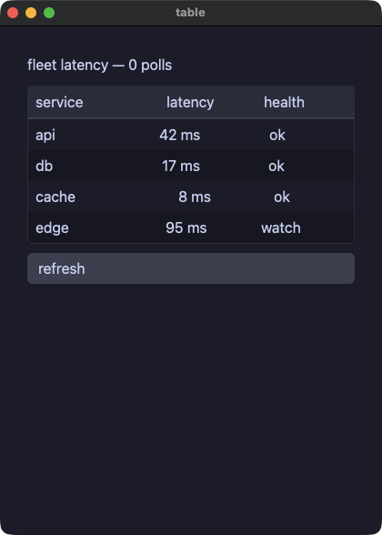

??? note "table.go"

    ```go
    // DataTable draws the table itself: the first row inside it is the
    // header, every later row is a data row shaded in alternation, and the
    // frame comes with the element. Columns line up because the cells of
    // one column carry the same `Grow` share.
    package main

    import (
    	"fmt"

    	. "github.com/i2y/yokan/gomamochi"
    )

    type Fleet struct {
    	latency map[string]int
    	polls   int
    }

    func (f *Fleet) refresh() {
    	f.polls += 1
    	f.latency["api"] = (f.latency["api"]*3 + 29) % 140
    	f.latency["db"] = (f.latency["db"]*5 + 11) % 140
    	f.latency["cache"] = (f.latency["cache"]*7 + 3) % 140
    	f.latency["edge"] = (f.latency["edge"]*2 + 47) % 140
    }

    func health(ms int) string {
    	label := "ok"
    	if ms > 60 {
    		label = "watch"
    	}
    	if ms > 100 {
    		label = "slow"
    	}
    	return label
    }

    func (f *Fleet) serviceRow(name string) Element {
    	return Row(
    		Text(name).Grow(2),
    		Text(fmt.Sprintf("%d ms", f.latency[name])).Grow(1).Align("right"),
    		Text(health(f.latency[name])).Grow(1).Align("center"),
    	).Spacing(8)
    }

    func (f *Fleet) View() Element {
    	return Column(
    		Text(fmt.Sprintf("fleet latency — %d polls", f.polls)).Size(16),
    		DataTable(
    			Row(
    				Text("service").Grow(2),
    				Text("latency").Grow(1).Align("right"),
    				Text("health").Grow(1).Align("center"),
    			).Spacing(8),
    			f.serviceRow("api"),
    			f.serviceRow("db"),
    			f.serviceRow("cache"),
    			f.serviceRow("edge"),
    		),
    		Button("refresh").OnClick(func() { f.refresh() }),
    	).Spacing(10).Padding(14)
    }

    func main() {
    	Run(&Fleet{latency: map[string]int{"api": 42, "db": 17, "cache": 8, "edge": 95}}, Title("table"))
    }
    ```

#### roster — 行を必要なぶんだけ作る表。行の選択と見出しでの並べ替えは、アプリ自身が行う
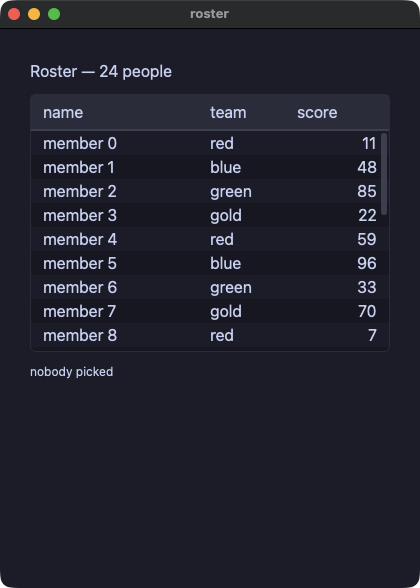

??? note "roster.go"

    ```go
    // The table that builds its rows on demand: the closure builds row i as
    // a row of one cell per column, and the header and the rows sit on
    // tracks whose shares are `Widths`. Picking a row and sorting a column
    // are the app's own methods.
    package main

    import (
    	"fmt"
    	"sort"
    	"strconv"

    	. "github.com/i2y/yokan/gomamochi"
    )

    type Roster struct {
    	teams   []string
    	names   []string
    	teamOf  []string
    	scores  []int
    	sel     int
    	line    string
    	sortCol int
    	desc    bool
    }

    func newRoster() *Roster {
    	r := &Roster{teams: []string{"red", "blue", "green", "gold"}, sel: -1, sortCol: -1}
    	for i := 0; i < 24; i++ {
    		r.names = append(r.names, fmt.Sprintf("member %d", i))
    		r.teamOf = append(r.teamOf, r.teams[i%4])
    		r.scores = append(r.scores, (i*37+11)%100)
    	}
    	return r
    }

    func (r *Roster) pick(i int) {
    	r.sel = i
    	r.line = fmt.Sprintf("%s (%s, %d)", r.names[i], r.teamOf[i], r.scores[i])
    }

    func (r *Roster) sortBy(col int) {
    	if col == r.sortCol {
    		r.desc = !r.desc
    	} else {
    		r.desc = false
    	}
    	r.sortCol = col
    	order := make([]int, len(r.names))
    	for i := range order {
    		order[i] = i
    	}
    	sort.Slice(order, func(a, b int) bool {
    		if col == 2 {
    			return r.scores[order[a]] < r.scores[order[b]]
    		}
    		return r.names[order[a]] < r.names[order[b]]
    	})
    	if r.desc {
    		for i, j := 0, len(order)-1; i < j; i, j = i+1, j-1 {
    			order[i], order[j] = order[j], order[i]
    		}
    	}
    	names, teams, scores := make([]string, 0, len(order)), make([]string, 0, len(order)), make([]int, 0, len(order))
    	for _, i := range order {
    		names = append(names, r.names[i])
    		teams = append(teams, r.teamOf[i])
    		scores = append(scores, r.scores[i])
    	}
    	r.names, r.teamOf, r.scores = names, teams, scores
    	r.sel = -1
    	r.line = ""
    }

    func (r *Roster) row(i int) Element {
    	return Row(
    		Text(r.names[i]).Grow(2),
    		Text(r.teamOf[i]).Grow(1),
    		Text(strconv.Itoa(r.scores[i])).Grow(1).Align("right"),
    	)
    }

    func (r *Roster) View() Element {
    	line := r.line
    	if line == "" {
    		line = "nobody picked"
    	}
    	return Column(
    		Text(fmt.Sprintf("Roster — %d people", len(r.names))).Size(16),
    		Table([]string{"name", "team", "score"}, len(r.names), func(i int) Element { return r.row(i) }).
    			Widths(2, 1, 1).Height(220).
    			Selected(r.sel).Sort(r.sortCol).Descending(r.desc).
    			OnSelect(func(i int) { r.pick(i) }).
    			OnSort(func(i int) { r.sortBy(i) }),
    		Text(line).Size(12),
    	).Spacing(10).Padding(14)
    }

    func main() {
    	app := newRoster()
    	Run(app, Title("roster"))
    }
    ```

#### csv_viewer — 10 万行を、打ちながら絞り込む。作られるのは画面に入っている行だけ
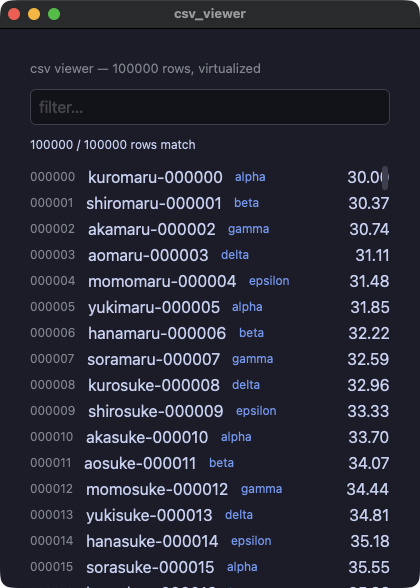

??? note "csv_viewer.go"

    ```go
    // A hundred thousand rows, filtered as you type. The list is
    // virtualized: only the rows in the window are ever built, so the
    // filter is the only thing that touches all of them.
    //
    // The numbers are arithmetic rather than random, so that a reader can
    // follow every row to its value.
    package main

    import (
    	"fmt"
    	"strings"

    	. "github.com/i2y/yokan/gomamochi"
    )

    const n = 100000

    var (
    	cats  = []string{"alpha", "beta", "gamma", "delta", "epsilon"}
    	stems = []string{"kuro", "shiro", "aka", "ao", "momo", "yuki", "hana", "sora"}
    	tails = []string{"maru", "suke", "chan", "gou", "ta", "emon"}
    )

    type Viewer struct {
    	names  []string
    	cats   []string
    	values []float64
    	q      string
    	idx    []int
    }

    func newViewer() *Viewer {
    	v := &Viewer{names: make([]string, n), cats: make([]string, n), values: make([]float64, n), idx: make([]int, n)}
    	for i := 0; i < n; i++ {
    		v.names[i] = fmt.Sprintf("%s%s-%06d", stems[i%8], tails[(i/8)%6], i)
    		v.cats[i] = cats[i%5]
    		v.values[i] = float64(i*37%4000)/100 + 30
    		v.idx[i] = i
    	}
    	return v
    }

    func (v *Viewer) filter(q string) {
    	v.q = q
    	if q == "" {
    		v.idx = make([]int, n)
    		for i := range v.idx {
    			v.idx[i] = i
    		}
    		return
    	}
    	low := strings.ToLower(q)
    	idx := make([]int, 0, 1024)
    	for i := 0; i < n; i++ {
    		if strings.Contains(v.names[i], low) || strings.Contains(v.cats[i], low) {
    			idx = append(idx, i)
    		}
    	}
    	v.idx = idx
    }

    func (v *Viewer) line(k int) Element {
    	i := v.idx[k]
    	return Row(
    		Text(fmt.Sprintf("%06d", i)).Size(12).Color("#8a8f98"),
    		Text(v.names[i]).Grow(1),
    		Text(v.cats[i]).Size(12).Color("#7aa2f7"),
    		Text(fmt.Sprintf("%.2f", v.values[i])).Align("right"),
    	).Spacing(12)
    }

    func (v *Viewer) View() Element {
    	return Column(
    		Text(fmt.Sprintf("csv viewer — %d rows, virtualized", n)).Size(13).Color("#8a8f98"),
    		TextField(v.q).Placeholder("filter…").OnChange(func(t string) { v.filter(t) }),
    		Text(fmt.Sprintf("%d / %d rows match", len(v.idx), n)).Size(12),
    		ListView(len(v.idx), func(k int) Element { return v.line(k) }).ItemHeight(26).Height(430),
    	).Spacing(10).Padding(14)
    }

    func main() {
    	app := newViewer()
    	Run(app, Title("csv_viewer"))
    }
    ```

#### trend — ひとつの数のリストを、2 通りに描く
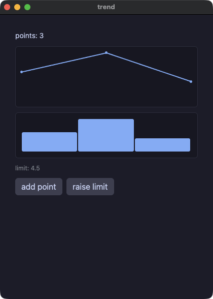

??? note "trend.go"

    ```go
    // One list of numbers, drawn twice. A chart takes its data as its first
    // argument, so a view that computes the numbers reads in order.
    package main

    import (
    	"fmt"

    	. "github.com/i2y/yokan/gomamochi"
    )

    type Trend struct {
    	values []float64
    	limit  float64
    }

    func (t *Trend) bump() {
    	t.values = append(t.values, 8)
    }

    func (t *Trend) View() Element {
    	return Column(
    		Text(fmt.Sprintf("points: %d", len(t.values))).Size(14),
    		LineChart(t.values).Height(120),
    		BarChart(t.values).Height(90),
    		Text(fmt.Sprintf("limit: %.1f", t.limit)).Size(12).Color("#8a8f98"),
    		Row(
    			Button("add point").OnClick(func() { t.bump() }),
    			Button("raise limit").OnClick(func() { t.limit += 0.5 }),
    		).Spacing(8),
    	).Spacing(10).Padding(14)
    }

    func main() {
    	Run(&Trend{values: []float64{3, 5, 2}, limit: 4.5}, Title("trend"))
    }
    ```

#### charts — 0 の線より下に伸びる損失、固定した範囲、目盛りと補助線のある軸、色を持つ 2 本の系列
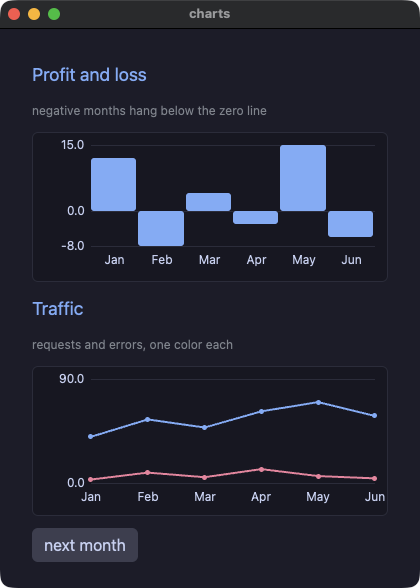

??? note "charts.go"

    ```go
    // Charts that can say what they mean: a profit-and-loss bar chart whose
    // losing months hang below the zero line, and a two-series line chart.
    // `Min`/`Max` both zero take the range from the data; `Axis` draws the
    // tick labels and a faint gridline at each; `Series` takes one list per
    // line, `Colors` one color each.
    package main

    import (
    	"fmt"

    	. "github.com/i2y/yokan/gomamochi"
    )

    type Book struct {
    	months   []string
    	profit   []float64
    	requests []float64
    	errors   []float64
    	n        int
    }

    func (b *Book) nextMonth() {
    	b.n += 1
    	// A deterministic next month, so both runs read the same numbers
    	// and the gate can compare them.
    	b.profit = append(b.profit, float64(b.n*7%41)-18)
    	b.months = append(b.months, fmt.Sprintf("M%d", b.n))
    	b.requests = append(b.requests, float64(b.n*13%50)+30)
    	b.errors = append(b.errors, float64(b.n*5%14))
    }

    func (b *Book) View() Element {
    	return Column(
    		Text("Profit and loss").Size(18).Color("accent"),
    		Text("negative months hang below the zero line").Size(12).Color("#8a8f98"),
    		BarChart(b.profit).Labels(b.months...).Axis(true).Height(150),
    		Text("Traffic").Size(18).Color("accent"),
    		Text("requests and errors, one color each").Size(12).Color("#8a8f98"),
    		LineChart(nil).Series([][]float64{b.requests, b.errors}).Labels(b.months...).
    			Colors("accent", "#f38ba8").Axis(true).Max(90).Height(150),
    		Row(Button("next month").OnClick(func() { b.nextMonth() })).Spacing(8),
    	).Spacing(12).Padding(16)
    }

    func main() {
    	Run(&Book{
    		months:   []string{"Jan", "Feb", "Mar", "Apr", "May", "Jun"},
    		profit:   []float64{12, -8, 4, -3, 15, -6},
    		requests: []float64{40, 55, 48, 62, 70, 58},
    		errors:   []float64{3, 9, 5, 12, 6, 4},
    		n:        6,
    	}, Title("charts"))
    }
    ```

## キャンバス

#### canvas — 仮想的な画素の格子を、命令をひとつずつ並べて塗る。色は配色の番号、キーボードはタイマーから読む
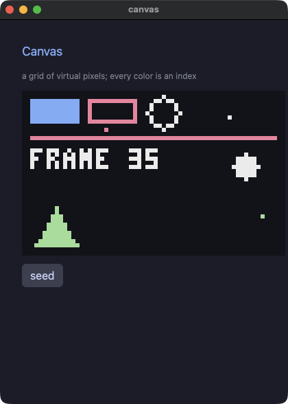

??? note "canvas.go"

    ```go
    // A canvas: a grid of virtual pixels, painted command by command.
    //
    // `Canvas(width, height)` opens the grid; `Scale` says how many logical
    // pixels one virtual pixel takes, so a 64x40 canvas at six is 384x240
    // on screen; and `Paint` is handed a painter with the commands — Pixel,
    // Line, Rect, RectOutline, Circle, CircleOutline, Triangle,
    // TriangleOutline, Sprite and PixelText.
    //
    // Every color is a NUMBER: the index of a color in `Palette`. That is
    // how tools for pixel art work, so drawing code written for one moves
    // here with its numbers unchanged.
    //
    // The commands are not elements. Nothing here can be clicked, themed,
    // sized or animated, and a loop inside the paint closure is the
    // ordinary loop: what its body paints joins the frame where it stands.
    package main

    import (
    	"fmt"

    	. "github.com/i2y/yokan/gomamochi"
    )

    // Five colors are enough to show that the index IS the color.
    var palette = []string{"#11111b", "#89b4fa", "#f38ba8", "#eeeeee", "#a6e3a1"}

    type Blip struct {
    	x, y, c int
    }

    type Sky struct {
    	frame  int
    	ballX  int
    	ballY  int
    	dx, dy int
    	blips  []Blip
    }

    func (s *Sky) seed() {
    	s.blips = []Blip{{6, 4, 1}, {20, 9, 2}, {50, 6, 3}, {58, 30, 4}}
    }

    func (s *Sky) tick() {
    	s.frame += 1
    	// The keyboard is read here, in the tick, never in a view.
    	// KeyDown is "held right now", so holding an arrow steers.
    	if KeyDown("left") {
    		s.dx = -1
    	}
    	if KeyDown("right") {
    		s.dx = 1
    	}
    	if KeyPressed("space") {
    		s.dy = -s.dy
    	}
    	x := s.ballX + s.dx
    	y := s.ballY + s.dy
    	if x < 4 {
    		x = 4
    		s.dx = 1
    	}
    	if x > 59 {
    		x = 59
    		s.dx = -1
    	}
    	if y < 4 {
    		y = 4
    		s.dy = 1
    	}
    	if y > 35 {
    		y = 35
    		s.dy = -1
    	}
    	s.ballX = x
    	s.ballY = y
    }

    func (s *Sky) View() Element {
    	return Column(
    		Text("Canvas").Size(18).Color("accent"),
    		Text("a grid of virtual pixels; every color is an index").Size(12).Color("#8a8f98"),
    		Canvas(64, 40).Scale(6).Background(0).Palette(palette...).Paint(func(p *Painter) {
    			p.Rect(2, 2, 12, 6, 1)
    			p.RectOutline(16, 2, 12, 6, 2)
    			p.CircleOutline(34, 5, 4, 3)
    			p.Line(2, 11, 61, 11, 2)
    			p.Triangle(3, 37, 8, 28, 13, 37, 4)
    			for _, b := range s.blips {
    				p.Pixel(b.x, b.y, b.c)
    			}
    			p.Circle(s.ballX, s.ballY, 3, 3)
    			p.PixelText(2, 14, fmt.Sprintf("FRAME %d", s.frame), 3)
    		}),
    		Row(
    			Button("seed").OnClick(func() { s.seed() }),
    		).Spacing(8),
    	).Spacing(12).Padding(16)
    }

    func main() {
    	app := &Sky{ballX: 30, ballY: 18, dx: 1, dy: 1}
    	app.seed()
    	Every(0.05, func() { app.tick() })
    	Run(app, Title("canvas"))
    }
    ```

#### jump — Pyxel のジャンプゲームの移植。重力、乗ると落ちる床、果物、それぞれの速さで流れる背景
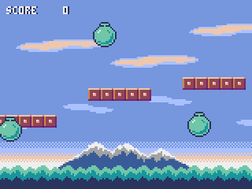

??? note "jump.go"

    ```go
    // Pyxel Jump, ported to Gomamochi.
    //
    // The original is `02_jump_game.py` from Pyxel's examples (Takashi
    // Kitao, MIT, https://github.com/kitao/pyxel), and `assets/jump.png` is
    // that example's own image bank written out with Pyxel's palette. The
    // port follows it line by line: `pyxel.blt` becomes `Sprite`,
    // `pyxel.btn` becomes `KeyDown`, `pyxel.cls(12)` becomes the canvas
    // background, and 12 still means the same color, because inside a
    // canvas a color is an index into the palette this file declares.
    //
    // What is different, and why. The three effects are WAV files rather
    // than the original's chiptune, since the engine plays files; a run
    // under a script is silent, so the gate still compares two silent
    // runs. And the numbers come from a generator written here rather than
    // from a random source, so that a reader can follow every floor to its
    // place. Everything else is the game.
    //
    // Left and right move; the rest is gravity.
    package main

    import (
    	"fmt"

    	. "github.com/i2y/yokan/gomamochi"
    )

    const (
    	width     = 160
    	height    = 120
    	sky       = 12
    	sheet     = "demo/assets/jump.png"
    	sndBounce = "demo/assets/sound/jump.wav"
    	sndFruit  = "demo/assets/sound/pickup.wav"
    	sndOver   = "demo/assets/sound/over.wav"
    )

    var palette = []string{
    	"#000000", "#2b335f", "#7e2072", "#19959c",
    	"#8b4852", "#395c98", "#a9c1ff", "#eeeeee",
    	"#d4186c", "#d38441", "#e9c35b", "#70c6a9",
    	"#7696de", "#a3a3a3", "#ff9798", "#edc7b0",
    }

    // Whole numbers from arithmetic alone, so both runs draw one game.
    type Roll struct{ s int }

    func (r *Roll) next(lo, hi int) int {
    	r.s = (r.s*1103515245 + 12345) % 2147483648
    	return lo + ((r.s >> 8) % (hi - lo + 1))
    }

    type Cloud struct{ x, y int }

    type Floor struct {
    	x, y  int
    	alive bool
    }

    type Fruit struct {
    	x, y, kind int
    	alive      bool
    }

    func maxInt(a, b int) int {
    	if a > b {
    		return a
    	}
    	return b
    }

    func minInt(a, b int) int {
    	if a < b {
    		return a
    	}
    	return b
    }

    func absInt(a int) int {
    	if a < 0 {
    		return -a
    	}
    	return a
    }

    type Game struct {
    	score int
    	px    int
    	py    int
    	dy    int
    	alive bool
    	frame int
    	// What the view needs whole: the parallax offsets and which of the
    	// two player sprites to cut out.
    	treeOff int
    	farOff  int
    	nearOff int
    	playerU int
    	roll    *Roll
    	far     []Cloud
    	near    []Cloud
    	floors  []Floor
    	fruits  []Fruit
    }

    func newGame() *Game {
    	g := &Game{
    		px: 72, py: -16, alive: true,
    		roll: &Roll{s: 11},
    		far:  []Cloud{{-10, 75}, {40, 65}, {90, 60}},
    		near: []Cloud{{10, 25}, {70, 35}, {120, 15}},
    	}
    	for i := 0; i < 4; i++ {
    		g.bootOne(i)
    	}
    	return g
    }

    func (g *Game) bootOne(i int) {
    	g.floors = append(g.floors, Floor{i * 60, g.roll.next(8, 104), true})
    	g.fruits = append(g.fruits, Fruit{i * 60, g.roll.next(0, 104), g.roll.next(0, 2), true})
    }

    func (g *Game) tick() {
    	g.frame += 1
    	g.treeOff = g.frame % 160
    	g.farOff = (g.frame / 16) % 160
    	g.nearOff = (g.frame / 8) % 160
    	g.updatePlayer()
    	g.updateFloors()
    	g.updateFruits()
    }

    func (g *Game) updatePlayer() {
    	if KeyDown("left") {
    		g.px = maxInt(g.px-2, 0)
    	}
    	if KeyDown("right") {
    		g.px = minInt(g.px+2, width-16)
    	}
    	g.py += g.dy
    	g.dy = minInt(g.dy+1, 8)
    	g.playerU = 0
    	if g.dy > 0 {
    		g.playerU = 16
    	}
    	if g.py <= height {
    		return
    	}
    	if g.alive {
    		AudioPlay(sndOver, 0.5)
    	}
    	g.alive = false
    	if g.py <= 600 {
    		return
    	}
    	g.score = 0
    	g.px = 72
    	g.py = -16
    	g.dy = 0
    	g.alive = true
    }

    // A floor the player lands on drops away and bounces them. The
    // original edits the tuple in the list; these are built fresh instead,
    // and the bounce it writes to `dy` is what the floors after this one
    // see.
    func (g *Game) updateFloors() {
    	out := make([]Floor, 0, len(g.floors))
    	for _, f := range g.floors {
    		out = append(out, g.nextFloor(f))
    	}
    	g.floors = out
    }

    func (g *Game) nextFloor(f Floor) Floor {
    	x, y, alive := f.x, f.y, f.alive
    	if alive {
    		if g.px+16 >= x && g.px <= x+40 && g.py+16 >= y && g.py <= y+8 && g.dy > 0 {
    			alive = false
    			g.score += 10
    			g.dy = -12
    			AudioPlay(sndBounce, 0.5)
    		}
    	} else {
    		y += 6
    	}
    	x -= 4
    	if x < -40 {
    		x += 240
    		y = g.roll.next(8, 104)
    		alive = true
    	}
    	return Floor{x, y, alive}
    }

    func (g *Game) updateFruits() {
    	out := make([]Fruit, 0, len(g.fruits))
    	for _, f := range g.fruits {
    		out = append(out, g.nextFruit(f))
    	}
    	g.fruits = out
    }

    func (g *Game) nextFruit(f Fruit) Fruit {
    	x, y, kind, alive := f.x, f.y, f.kind, f.alive
    	if alive && absInt(x-g.px) < 12 && absInt(y-g.py) < 12 {
    		alive = false
    		g.score += (kind + 1) * 100
    		g.dy = minInt(g.dy, -8)
    		AudioPlay(sndFruit, 0.5)
    	}
    	x -= 2
    	if x < -40 {
    		x += 240
    		y = g.roll.next(0, 104)
    		kind = g.roll.next(0, 2)
    		alive = true
    	}
    	return Fruit{x, y, kind, alive}
    }

    func (g *Game) tree(p *Painter, i int) {
    	p.Sprite(i*160-g.treeOff, 104, sheet, 0, 48, 160, 16, sky, false, false)
    }

    func (g *Game) farCloud(p *Painter, c Cloud, i int) {
    	p.Sprite(c.x+i*160-g.farOff, c.y, sheet, 64, 32, 32, 8, sky, false, false)
    }

    func (g *Game) nearCloud(p *Painter, c Cloud, i int) {
    	p.Sprite(c.x+i*160-g.nearOff, c.y, sheet, 0, 32, 56, 8, sky, false, false)
    }

    func (g *Game) floorOf(p *Painter, f Floor) {
    	p.Sprite(f.x, f.y, sheet, 0, 16, 40, 8, sky, false, false)
    }

    func (g *Game) fruitOf(p *Painter, f Fruit) {
    	if f.alive {
    		p.Sprite(f.x, f.y, sheet, 32+f.kind*16, 0, 16, 16, sky, false, false)
    	}
    }

    func (g *Game) View() Element {
    	return Column(
    		Canvas(width, height).Scale(4).Background(sky).Palette(palette...).Paint(func(p *Painter) {
    			// sky, mountain, and the trees that scroll fastest
    			p.Sprite(0, 88, sheet, 0, 88, 160, 32, -1, false, false)
    			p.Sprite(0, 88, sheet, 0, 64, 160, 24, sky, false, false)
    			for i := 0; i < 2; i++ {
    				g.tree(p, i)
    			}
    			// two layers of cloud, each strip drawn twice so it wraps
    			for i := 0; i < 2; i++ {
    				for _, c := range g.far {
    					g.farCloud(p, c, i)
    				}
    			}
    			for i := 0; i < 2; i++ {
    				for _, c := range g.near {
    					g.nearCloud(p, c, i)
    				}
    			}
    			for _, f := range g.floors {
    				g.floorOf(p, f)
    			}
    			for _, f := range g.fruits {
    				g.fruitOf(p, f)
    			}
    			p.Sprite(g.px, g.py, sheet, g.playerU, 0, 16, 16, sky, false, false)
    			p.PixelText(5, 4, fmt.Sprintf("SCORE %4d", g.score), 1)
    			p.PixelText(4, 4, fmt.Sprintf("SCORE %4d", g.score), 7)
    		}),
    	).Spacing(0).Padding(0)
    }

    func main() {
    	app := newGame()
    	Every(0.033, func() { app.tick() })
    	Run(app, Title("Pyxel Jump"), Size(640, 480), Padding(0))
    }
    ```

#### shooter — Pyxel のシューティングの移植。場面の切り替え、視差のある星、揺れながら落ちてくる敵、当たり判定と広がる爆発


??? note "shooter.go"

    ```go
    // Pyxel Shooter, ported to Gomamochi.
    //
    // The original is `shooter.py` from Pyxel's examples (Takashi Kitao,
    // MIT, https://github.com/kitao/pyxel), and `assets/shooter.png` is that
    // example's own image bank written out with Pyxel's palette.
    //
    // What is different, and why. The effects are WAV files rather than
    // the original's chiptune, since the engine plays files; a run under a
    // script is silent, so the gate still compares two silent runs. And the
    // numbers come from a generator written here rather than from a random
    // source, so that a reader can follow every enemy to its place.
    //
    // Arrows move, space fires, enter starts and restarts, q closes.
    package main

    import (
    	"fmt"

    	. "github.com/i2y/yokan/gomamochi"
    )

    const (
    	width  = 120
    	height = 160

    	sndShoot = "demo/assets/sound/shoot.wav"
    	sndBlast = "demo/assets/sound/blast.wav"
    	sndOver  = "demo/assets/sound/over.wav"

    	sceneTitle    = 0
    	scenePlay     = 1
    	sceneGameOver = 2

    	numStars      = 100
    	starColorHigh = 12
    	starColorLow  = 5

    	playerWidth  = 8
    	playerHeight = 8
    	playerSpeed  = 2

    	bulletWidth  = 2
    	bulletHeight = 8
    	bulletColor  = 11
    	bulletSpeed  = 4

    	enemyWidth  = 8
    	enemyHeight = 8
    	// Pyxel's 1.5 px a frame, in tenths.
    	enemySpeed = 15

    	blastStartRadius = 1
    	blastEndRadius   = 8
    	blastColorIn     = 7
    	blastColorOut    = 10

    	sheet = "demo/assets/shooter.png"
    )

    // Pyxel's own sixteen colors, which is what makes the numbers in this
    // file mean what they mean in the original.
    var palette = []string{
    	"#000000", "#2b335f", "#7e2072", "#19959c",
    	"#8b4852", "#395c98", "#a9c1ff", "#eeeeee",
    	"#d4186c", "#d38441", "#e9c35b", "#70c6a9",
    	"#7696de", "#a3a3a3", "#ff9798", "#edc7b0",
    }

    // Whole numbers from arithmetic alone, so both runs play one game.
    type Roll struct{ s int }

    func (r *Roll) next(lo, hi int) int {
    	r.s = (r.s*1103515245 + 12345) % 2147483648
    	return lo + ((r.s >> 8) % (hi - lo + 1))
    }

    // Star: `y` is what the canvas draws; `y10` is where the star really is.
    type Star struct{ x, y, y10, speed10, col int }

    type Bullet struct{ x, y int }

    type Enemy struct {
    	x, y, x10, y10 int
    	flip           bool
    	offset         int
    }

    type Blast struct{ x, y, radius int }

    func maxInt(a, b int) int {
    	if a > b {
    		return a
    	}
    	return b
    }

    func minInt(a, b int) int {
    	if a < b {
    		return a
    	}
    	return b
    }

    // The original's `//` rounds toward minus infinity, and an enemy
    // sweeping off the left edge has a negative tenth.
    func div10(v int) int {
    	if v < 0 && v%10 != 0 {
    		return v/10 - 1
    	}
    	return v / 10
    }

    type Game struct {
    	scene    int
    	score    int
    	frame    int
    	titleCol int
    	px, py   int
    	stars    []Star
    	bullets  []Bullet
    	enemies  []Enemy
    	blasts   []Blast
    	roll     *Roll
    }

    func newGame() *Game {
    	g := &Game{px: 56, py: 140, roll: &Roll{s: 7}}
    	for i := 0; i < numStars; i++ {
    		g.bootStar()
    	}
    	return g
    }

    func (g *Game) bootStar() {
    	x := g.roll.next(0, width-1)
    	y := g.roll.next(0, height-1)
    	speed10 := g.roll.next(10, 25)
    	col := starColorLow
    	if speed10 > 18 {
    		col = starColorHigh
    	}
    	g.stars = append(g.stars, Star{x, y, y * 10, speed10, col})
    }

    func (g *Game) tick() {
    	if KeyPressed("q") {
    		Quit()
    	}
    	g.frame += 1
    	g.titleCol = g.frame % 16
    	g.moveStars()
    	switch g.scene {
    	case sceneTitle:
    		if KeyPressed("enter") {
    			g.scene = scenePlay
    		}
    	case scenePlay:
    		g.play()
    	default:
    		g.over()
    	}
    }

    func (g *Game) moveStars() {
    	out := make([]Star, 0, len(g.stars))
    	for _, s := range g.stars {
    		y10 := s.y10 + s.speed10
    		if y10 >= height*10 {
    			y10 -= height * 10
    		}
    		out = append(out, Star{s.x, y10 / 10, y10, s.speed10, s.col})
    	}
    	g.stars = out
    }

    func (g *Game) play() {
    	if g.frame%6 == 0 {
    		x := g.roll.next(0, width-enemyWidth)
    		g.enemies = append(g.enemies, Enemy{x, 0, x * 10, 0, false, g.roll.next(0, 59)})
    	}
    	g.collide()
    	g.movePlayer()
    	g.moveBullets()
    	g.moveEnemies()
    	g.moveBlasts()
    }

    func (g *Game) over() {
    	g.moveBullets()
    	g.moveEnemies()
    	g.moveBlasts()
    	if !KeyPressed("enter") {
    		return
    	}
    	g.scene = scenePlay
    	g.px = 56
    	g.py = 140
    	g.score = 0
    	g.enemies = nil
    	g.bullets = nil
    	g.blasts = nil
    }

    func (g *Game) movePlayer() {
    	x, y := g.px, g.py
    	if KeyDown("left") {
    		x -= playerSpeed
    	}
    	if KeyDown("right") {
    		x += playerSpeed
    	}
    	if KeyDown("up") {
    		y -= playerSpeed
    	}
    	if KeyDown("down") {
    		y += playerSpeed
    	}
    	g.px = minInt(maxInt(x, 0), width-playerWidth)
    	g.py = minInt(maxInt(y, 0), height-playerHeight)
    	if !KeyPressed("space") {
    		return
    	}
    	g.bullets = append(g.bullets, Bullet{g.px + 3, g.py - 4})
    	AudioPlay(sndShoot, 0.35)
    }

    func (g *Game) moveBullets() {
    	out := make([]Bullet, 0, len(g.bullets))
    	for _, b := range g.bullets {
    		y := b.y - bulletSpeed
    		if y+bulletHeight-1 >= 0 {
    			out = append(out, Bullet{b.x, y})
    		}
    	}
    	g.bullets = out
    }

    func (g *Game) moveEnemies() {
    	out := make([]Enemy, 0, len(g.enemies))
    	for _, e := range g.enemies {
    		x10 := e.x10
    		flip := true
    		if (g.frame+e.offset)%60 < 30 {
    			x10 += enemySpeed
    			flip = false
    		} else {
    			x10 -= enemySpeed
    		}
    		y10 := e.y10 + enemySpeed
    		if y10 <= (height-1)*10 {
    			out = append(out, Enemy{div10(x10), y10 / 10, x10, y10, flip, e.offset})
    		}
    	}
    	g.enemies = out
    }

    func (g *Game) moveBlasts() {
    	out := make([]Blast, 0, len(g.blasts))
    	for _, b := range g.blasts {
    		r := b.radius + 1
    		if r <= blastEndRadius {
    			out = append(out, Blast{b.x, b.y, r})
    		}
    	}
    	g.blasts = out
    }

    // The two rectangle tests, resolved into new lists. Where the original
    // sets `is_alive = False` and filters afterwards, this keeps the ones
    // that live.
    func (g *Game) collide() {
    	live := make([]Enemy, 0, len(g.enemies))
    	hit := make([]bool, len(g.bullets))
    	struck := false
    	for _, e := range g.enemies {
    		enemyStruck := false
    		for i, b := range g.bullets {
    			if shot(e, b) {
    				enemyStruck = true
    				hit[i] = true
    			}
    		}
    		if enemyStruck {
    			g.blasts = append(g.blasts, Blast{e.x + 4, e.y + 4, blastStartRadius})
    			g.score += 10
    			AudioPlay(sndBlast, 0.5)
    		} else if g.rammed(e) {
    			g.blasts = append(g.blasts, Blast{g.px + 4, g.py + 4, blastStartRadius})
    			struck = true
    			AudioPlay(sndOver, 0.6)
    		} else {
    			live = append(live, e)
    		}
    	}
    	kept := make([]Bullet, 0, len(g.bullets))
    	for i, b := range g.bullets {
    		if !hit[i] {
    			kept = append(kept, b)
    		}
    	}
    	g.enemies = live
    	g.bullets = kept
    	if struck {
    		g.scene = sceneGameOver
    	}
    }

    func shot(e Enemy, b Bullet) bool {
    	return e.x+enemyWidth > b.x && b.x+bulletWidth > e.x &&
    		e.y+enemyHeight > b.y && b.y+bulletHeight > e.y
    }

    func (g *Game) rammed(e Enemy) bool {
    	return g.px+playerWidth > e.x && e.x+enemyWidth > g.px &&
    		g.py+playerHeight > e.y && e.y+enemyHeight > g.py
    }

    func (g *Game) View() Element {
    	return Column(
    		Canvas(width, height).Scale(4).Background(0).Palette(palette...).Paint(func(p *Painter) {
    			for _, s := range g.stars {
    				p.Pixel(s.x, s.y, s.col)
    			}
    			switch g.scene {
    			case sceneTitle:
    				p.PixelText(35, 66, "Pyxel Shooter", g.titleCol)
    				p.PixelText(31, 126, "- PRESS ENTER -", 13)
    			case scenePlay:
    				p.Sprite(g.px, g.py, sheet, 0, 0, playerWidth, playerHeight, 0, false, false)
    			default:
    				p.PixelText(43, 66, "GAME OVER", 8)
    				p.PixelText(31, 126, "- PRESS ENTER -", 13)
    			}
    			for _, b := range g.bullets {
    				p.Rect(b.x, b.y, bulletWidth, bulletHeight, bulletColor)
    			}
    			for _, e := range g.enemies {
    				p.Sprite(e.x, e.y, sheet, 8, 0, enemyWidth, enemyHeight, 0, e.flip, false)
    			}
    			for _, b := range g.blasts {
    				p.Circle(b.x, b.y, b.radius, blastColorIn)
    				p.CircleOutline(b.x, b.y, b.radius, blastColorOut)
    			}
    			p.PixelText(39, 4, fmt.Sprintf("SCORE %5d", g.score), 7)
    		}),
    	).Spacing(0).Padding(0)
    }

    func main() {
    	app := newGame()
    	Every(0.033, func() { app.tick() })
    	// Padding 0: the canvas IS the app, so it paints to the window's
    	// edge rather than sitting inside the engine's ring.
    	Run(app, Title("Pyxel Shooter"), Size(480, 640), Padding(0))
    }
    ```

## Go とファイルとデータ

#### stdlib — Go 自身のものをゲートにかける。`math`、`sort`、`time`、`encoding/json`、`encoding/csv`、`strings`、`regexp`。両方の実行が同じコンパイル済みのパッケージを呼ぶ
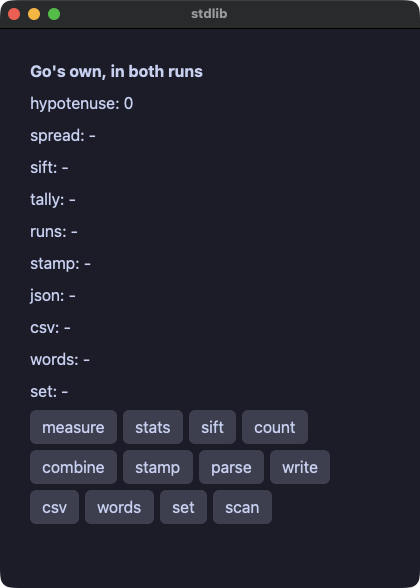

??? note "stdlib.go"

    ```go
    // Go's own standard library, under the gate.
    //
    // Nothing here is Gomamochi's. `math`, `sort`, `time`, `encoding/json`,
    // `encoding/csv`, `strings` and `regexp` are the language's, and both
    // runs call the same compiled packages. What the gate says is that
    // they answer the same — which is the only claim worth making about a
    // standard library shared between an interpreter and a compiler.
    package main

    import (
    	"encoding/csv"
    	"encoding/json"
    	"fmt"
    	"math"
    	"regexp"
    	"sort"
    	"strconv"
    	"strings"
    	"time"

    	. "github.com/i2y/yokan/gomamochi"
    )

    type Stdlib struct {
    	hyp    float64
    	spread string
    	sift   string
    	tally  string
    	runs   string
    	stamp  string
    	doc    string
    	row    string
    	words  string
    	unique string
    	scores []int
    	votes  []string
    }

    func (s *Stdlib) measure() {
    	s.hyp = math.Sqrt(3*3 + 4*4)
    }

    func (s *Stdlib) stats() {
    	sum := 0
    	for _, v := range s.scores {
    		sum += v
    	}
    	mean := float64(sum) / float64(len(s.scores))
    	sorted := append([]int{}, s.scores...)
    	sort.Ints(sorted)
    	median := sorted[len(sorted)/2]
    	s.spread = fmt.Sprintf("mean %.1f median %d min %d max %d", mean, median, sorted[0], sorted[len(sorted)-1])
    }

    func (s *Stdlib) doSift() {
    	var big, small []string
    	for _, v := range s.scores {
    		if v > 5 {
    			big = append(big, strconv.Itoa(v))
    		} else {
    			small = append(small, strconv.Itoa(v))
    		}
    	}
    	s.sift = fmt.Sprintf("big %s small %s", strings.Join(big, ","), strings.Join(small, ","))
    }

    // A count per name, most votes first and then by name. The map is
    // walked in a handler, and what the view reads is the sorted list.
    func (s *Stdlib) count() {
    	counts := map[string]int{}
    	for _, v := range s.votes {
    		counts[v]++
    	}
    	type pair struct {
    		name string
    		n    int
    	}
    	var pairs []pair
    	for name, n := range counts {
    		pairs = append(pairs, pair{name, n})
    	}
    	sort.Slice(pairs, func(i, j int) bool {
    		if pairs[i].n != pairs[j].n {
    			return pairs[i].n > pairs[j].n
    		}
    		return pairs[i].name < pairs[j].name
    	})
    	var parts []string
    	for _, p := range pairs {
    		parts = append(parts, fmt.Sprintf("%s:%d", p.name, p.n))
    	}
    	s.tally = strings.Join(parts, " ")
    }

    func (s *Stdlib) combine() {
    	var steps, pairs []string
    	for i := 1; i < len(s.scores); i++ {
    		steps = append(steps, strconv.Itoa(s.scores[i]-s.scores[i-1]))
    	}
    	for i, letter := range []string{"a", "b", "c"} {
    		pairs = append(pairs, fmt.Sprintf("%s%d", letter, s.scores[i]))
    	}
    	s.runs = fmt.Sprintf("steps %s pairs %s", strings.Join(steps, ","), strings.Join(pairs, ","))
    }

    func (s *Stdlib) doStamp() {
    	s.stamp = time.Unix(1700000000, 0).UTC().Format("2006-01-02 15:04:05 UTC")
    }

    func (s *Stdlib) parse() {
    	src := `{"name": "gomamochi", "parts": [1, 2, 3], "ok": true}`
    	var doc map[string]any
    	if err := json.Unmarshal([]byte(src), &doc); err != nil {
    		s.doc = "unreadable"
    		return
    	}
    	parts, _ := doc["parts"].([]any)
    	sum := 0.0
    	for _, p := range parts {
    		v, _ := p.(float64)
    		sum += v
    	}
    	s.doc = fmt.Sprintf("%v %d %v", doc["name"], int(sum), doc["ok"])
    }

    func (s *Stdlib) write() {
    	top := s.scores[0]
    	for _, v := range s.scores {
    		if v > top {
    			top = v
    		}
    	}
    	out, _ := json.Marshal(map[string]any{"n": len(s.scores), "top": top})
    	s.doc = string(out)
    }

    func (s *Stdlib) readRow() {
    	fields, err := csv.NewReader(strings.NewReader("api,42,\"one, two\"")).Read()
    	if err != nil {
    		s.row = "unreadable"
    		return
    	}
    	s.row = strings.Join(fields, " | ")
    }

    func (s *Stdlib) doWords() {
    	line := "  the quick brown fox  "
    	var caps []string
    	for _, w := range strings.Fields(line) {
    		caps = append(caps, strings.ToUpper(w[:1])+w[1:])
    	}
    	s.words = fmt.Sprintf("%s (%d)", strings.Join(caps, "-"), len(strings.TrimSpace(line)))
    }

    // The set of names, without repeats.
    func (s *Stdlib) doUnique() {
    	seen := map[string]bool{}
    	var names []string
    	for _, v := range s.votes {
    		if !seen[v] {
    			seen[v] = true
    			names = append(names, v)
    		}
    	}
    	sort.Strings(names)
    	s.unique = strings.Join(names, ",")
    }

    func (s *Stdlib) findNumbers() {
    	sum := 0
    	for _, m := range regexp.MustCompile(`\d+`).FindAllString("a1b22c333", -1) {
    		v, _ := strconv.Atoi(m)
    		sum += v
    	}
    	s.spread = strconv.Itoa(sum)
    }

    func (s *Stdlib) View() Element {
    	return Column(
    		Text("Go's own, in both runs").Size(16).Bold(true),
    		Text(fmt.Sprintf("hypotenuse: %v", s.hyp)),
    		Text("spread: "+s.spread),
    		Text("sift: "+s.sift),
    		Text("tally: "+s.tally),
    		Text("runs: "+s.runs),
    		Text("stamp: "+s.stamp),
    		Text("json: "+s.doc),
    		Text("csv: "+s.row),
    		Text("words: "+s.words),
    		Text("set: "+s.unique),
    		Row(
    			Button("measure").OnClick(func() { s.measure() }),
    			Button("stats").OnClick(func() { s.stats() }),
    			Button("sift").OnClick(func() { s.doSift() }),
    			Button("count").OnClick(func() { s.count() }),
    		).Spacing(6),
    		Row(
    			Button("combine").OnClick(func() { s.combine() }),
    			Button("stamp").OnClick(func() { s.doStamp() }),
    			Button("parse").OnClick(func() { s.parse() }),
    			Button("write").OnClick(func() { s.write() }),
    		).Spacing(6),
    		Row(
    			Button("csv").OnClick(func() { s.readRow() }),
    			Button("words").OnClick(func() { s.doWords() }),
    			Button("set").OnClick(func() { s.doUnique() }),
    			Button("scan").OnClick(func() { s.findNumbers() }),
    		).Spacing(6),
    	).Spacing(6).Padding(14)
    }

    func main() {
    	Run(&Stdlib{
    		spread: "-", sift: "-", tally: "-", runs: "-", stamp: "-", doc: "-", row: "-", words: "-", unique: "-",
    		scores: []int{3, 5, 8, 13, 21},
    		votes:  []string{"ivy", "momo", "ivy", "ada", "momo", "ivy", "ada"},
    	}, Title("stdlib"))
    }
    ```

#### files — Go 自身の `os` でファイルを扱う。Gomamochi 固有のものは使わず、両方の実行が一致することはゲートが確かめる
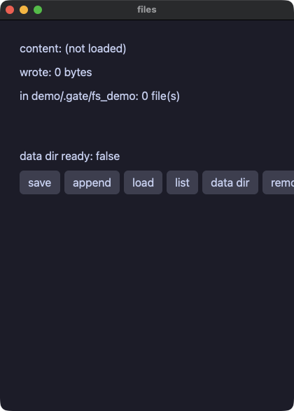

??? note "files.go"

    ```go
    // Files, with Go's own `os`. Nothing here is Gomamochi's: both runs
    // call the same package, and the gate is what says they answer the
    // same.
    package main

    import (
    	"fmt"
    	"os"

    	. "github.com/i2y/yokan/gomamochi"
    )

    const (
    	dir  = "demo/.gate/fs_demo"
    	note = "demo/.gate/fs_demo/note.txt"
    )

    type Files struct {
    	content string
    	wrote   int
    	names   []string
    	ready   bool
    }

    func (f *Files) save() {
    	os.MkdirAll(dir, 0o755)
    	text := "hello from one standard library"
    	if os.WriteFile(note, []byte(text), 0o644) == nil {
    		f.wrote = len(text)
    	}
    }

    func (f *Files) addLine() {
    	out, err := os.OpenFile(note, os.O_APPEND|os.O_WRONLY, 0o644)
    	if err != nil {
    		return
    	}
    	out.WriteString(" (and again)")
    	out.Close()
    }

    func (f *Files) load() {
    	text, err := os.ReadFile(note)
    	if err != nil {
    		f.content = "(unreadable)"
    		return
    	}
    	f.content = string(text)
    }

    func (f *Files) listing() {
    	f.names = nil
    	entries, _ := os.ReadDir(dir)
    	for _, e := range entries {
    		f.names = append(f.names, e.Name())
    	}
    }

    func (f *Files) clean() {
    	os.Remove(note)
    	f.listing()
    }

    // A place of the app's own, made on the way out. A demo has no
    // business in someone's home directory, so this one keeps to the
    // directory the gate already writes in — and beside the one it lists,
    // not inside it, or the listing would depend on the order.
    func (f *Files) dataDir() {
    	path := "demo/.gate/fs_demo_app"
    	os.MkdirAll(path, 0o755)
    	st, err := os.Stat(path)
    	f.ready = err == nil && st.IsDir()
    }

    func (f *Files) entry(i int) Element {
    	return Text(f.names[i])
    }

    func (f *Files) View() Element {
    	return Column(
    		Text("content: "+f.content),
    		Text(fmt.Sprintf("wrote: %d bytes", f.wrote)),
    		Text(fmt.Sprintf("in %s: %d file(s)", dir, len(f.names))),
    		ListView(len(f.names), func(i int) Element { return f.entry(i) }).ItemHeight(20).Height(44),
    		Text(fmt.Sprintf("data dir ready: %v", f.ready)),
    		Row(
    			Button("save").OnClick(func() { f.save() }),
    			Button("append").OnClick(func() { f.addLine() }),
    			Button("load").OnClick(func() { f.load() }),
    			Button("list").OnClick(func() { f.listing() }),
    			Button("data dir").OnClick(func() { f.dataDir() }),
    			Button("remove").OnClick(func() { f.clean() }),
    		).Spacing(6),
    	).Spacing(8).Padding(12)
    }

    func main() {
    	Run(&Files{content: "(not loaded)"}, Title("files"))
    }
    ```

#### reader — ウィンドウのスレッドの外で、アプリ自身が立てたサーバからページを取ってくる。サーバが自前なので、両方の実行が同じバイト列を読む
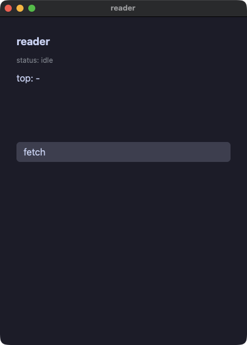

??? note "reader.go"

    ```go
    // A page fetched and read, with nothing outside the machine involved:
    // the app serves the document to itself on a port the operating system
    // picks, so both runs read the same bytes and the gate can compare
    // them. The fetch happens off the window's thread, which is what
    // `Task` is for; the server answers on a goroutine of its own.
    package main

    import (
    	"bufio"
    	"encoding/json"
    	"fmt"
    	"io"
    	"net"
    	"net/http"

    	. "github.com/i2y/yokan/gomamochi"
    )

    const body = `{"items": [` +
    	`{"title": "gomamochi ships native go apps", "points": 128},` +
    	`{"title": "one engine, two runs", "points": 64},` +
    	`{"title": "the gate arbitrates", "points": 256}` +
    	`]}`

    type Reader struct {
    	status string
    	titles []string
    	top    string
    	port   int
    }

    // A server that answers exactly one request and then closes.
    func (r *Reader) serveOne() {
    	ln, err := net.Listen("tcp", "127.0.0.1:0")
    	if err != nil {
    		r.status = "no port"
    		return
    	}
    	r.port = ln.Addr().(*net.TCPAddr).Port
    	go func() {
    		conn, err := ln.Accept()
    		if err != nil {
    			return
    		}
    		// past the request head: a blank line is where it ends
    		in := bufio.NewReader(conn)
    		for {
    			line, err := in.ReadString('\n')
    			if err != nil || line == "\r\n" {
    				break
    			}
    		}
    		fmt.Fprintf(conn, "HTTP/1.1 200 OK\r\nContent-Length: %d\r\nConnection: close\r\n\r\n%s", len(body), body)
    		conn.Close()
    		ln.Close()
    	}()
    }

    func (r *Reader) fetch() {
    	r.status = "fetching"
    	r.serveOne()
    	url := fmt.Sprintf("http://127.0.0.1:%d/", r.port)
    	Task(func() any {
    		resp, err := http.Get(url)
    		if err != nil {
    			return ""
    		}
    		defer resp.Body.Close()
    		text, _ := io.ReadAll(resp.Body)
    		return string(text)
    	}, func(v any) { r.read(v.(string)) })
    }

    func (r *Reader) read(text string) {
    	var doc map[string]any
    	if err := json.Unmarshal([]byte(text), &doc); err != nil {
    		r.status = "unreadable"
    		return
    	}
    	items, _ := doc["items"].([]any)
    	r.titles = nil
    	bestTitle, bestPoints := "", -1.0
    	for _, it := range items {
    		item, _ := it.(map[string]any)
    		title, _ := item["title"].(string)
    		points, _ := item["points"].(float64)
    		r.titles = append(r.titles, title)
    		if points > bestPoints {
    			bestTitle, bestPoints = title, points
    		}
    	}
    	r.top = fmt.Sprintf("%s (%d)", bestTitle, int(bestPoints))
    	r.status = fmt.Sprintf("read %d items", len(items))
    }

    func (r *Reader) line(i int) Element {
    	return Text(r.titles[i]).Size(13)
    }

    func (r *Reader) View() Element {
    	return Column(
    		Text("reader").Size(18).Bold(true),
    		Text("status: "+r.status).Size(12).Color("#8a8f98"),
    		Text("top: "+r.top),
    		ListView(len(r.titles), func(i int) Element { return r.line(i) }).ItemHeight(22).Height(80),
    		Button("fetch").OnClick(func() { r.fetch() }),
    	).Spacing(8).Padding(12)
    }

    func main() {
    	Run(&Reader{status: "idle", top: "-"}, Title("reader"))
    }
    ```

#### dbnotes — エンジン越しに触るデータベース。実装は一つで、両方の実行が同じものを呼ぶ。値は文に埋め込まず、束縛して渡す
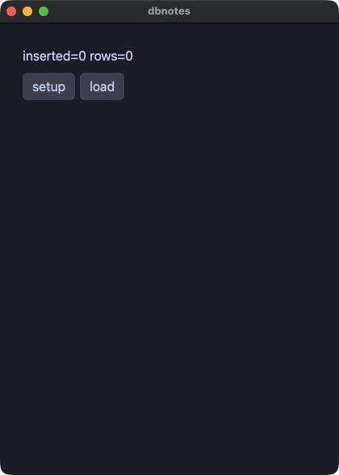

??? note "dbnotes.go"

    ```go
    // A database, reached through the engine so that both runs call one
    // implementation. Write `?` in the statement and put the values beside
    // it, and text a person typed can never become part of the statement.
    package main

    import (
    	"fmt"

    	. "github.com/i2y/yokan/gomamochi"
    )

    const db = "demo/.gate/notes.db"

    type Notes struct {
    	changed int
    	rows    []string
    }

    func (nt *Notes) setup() {
    	SqliteExec(db, "CREATE TABLE IF NOT EXISTS notes(t TEXT)")
    	SqliteExec(db, "DELETE FROM notes")
    	nt.changed = SqliteExec(db, "INSERT INTO notes VALUES ('alpha'),('beta'),('gamma')")
    }

    func (nt *Notes) load() {
    	nt.rows = SqliteQueryText(db, "SELECT t FROM notes ORDER BY t")
    }

    func (nt *Notes) noteRow(i int) Element {
    	return Text(nt.rows[i])
    }

    func (nt *Notes) View() Element {
    	return Column(
    		Text(fmt.Sprintf("inserted=%d rows=%d", nt.changed, len(nt.rows))),
    		Row(
    			Button("setup").OnClick(func() { nt.setup() }),
    			Button("load").OnClick(func() { nt.load() }),
    		).Spacing(6),
    		ListView(len(nt.rows), func(i int) Element { return nt.noteRow(i) }).ItemHeight(22).Height(120),
    	).Spacing(8).Padding(12)
    }

    func main() {
    	Run(&Notes{}, Title("dbnotes"))
    }
    ```

#### ledger — データベースに置いた家計簿。o'brien という品目はアポストロフィであって、SQL の一部にはならない
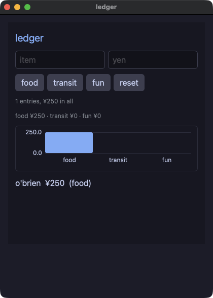

??? note "ledger.go"

    ```go
    // Money kept in a database, with the values bound rather than spliced:
    // an item called o'brien is an apostrophe and never a piece of SQL.
    package main

    import (
    	"fmt"
    	"strconv"

    	. "github.com/i2y/yokan/gomamochi"
    )

    const db = "demo/.gate/ledger.db"

    type Ledger struct {
    	name    string
    	amount  string
    	count   int
    	grand   int
    	food    int
    	transit int
    	fun     int
    	rows    []string
    }

    func newLedger() *Ledger {
    	l := &Ledger{}
    	l.load()
    	return l
    }

    func (l *Ledger) reset() {
    	SqliteExec(db, "CREATE TABLE IF NOT EXISTS expenses(name TEXT, amount INTEGER, cat TEXT)")
    	SqliteExec(db, "DELETE FROM expenses")
    	l.load()
    }

    func (l *Ledger) add(cat string) {
    	yen, _ := strconv.Atoi(l.amount)
    	if yen <= 0 {
    		return
    	}
    	SqliteExec(db, "INSERT INTO expenses VALUES (?, ?, ?)", l.name, strconv.Itoa(yen), cat)
    	l.load()
    }

    // A query that may run before the table exists — the first load does —
    // answers no rows rather than stopping the app.
    func (l *Ledger) oneNumber(sql string, params ...string) int {
    	rows := SqliteQueryRowsOr(db, sql, params...)
    	if len(rows) == 0 {
    		return 0
    	}
    	v, _ := strconv.Atoi(rows[0][0])
    	return v
    }

    func (l *Ledger) load() {
    	l.count = l.oneNumber("SELECT COUNT(*) FROM expenses")
    	l.grand = l.oneNumber("SELECT COALESCE(SUM(amount),0) FROM expenses")
    	by := "SELECT COALESCE(SUM(amount),0) FROM expenses WHERE cat=?"
    	l.food = l.oneNumber(by, "food")
    	l.transit = l.oneNumber(by, "transit")
    	l.fun = l.oneNumber(by, "fun")
    	// whole rows, every column as text: the line is written here
    	// rather than assembled in SQL
    	l.rows = nil
    	for _, r := range SqliteQueryRowsOr(db, "SELECT name, amount, cat FROM expenses ORDER BY rowid") {
    		l.rows = append(l.rows, fmt.Sprintf("%s  ¥%s  (%s)", r[0], r[1], r[2]))
    	}
    }

    func (l *Ledger) entryRow(i int) Element {
    	return Text(l.rows[i])
    }

    func (l *Ledger) View() Element {
    	return Column(
    		Text("ledger").Size(20).Color("accent"),
    		Row(
    			TextField(l.name).Placeholder("item").OnChange(func(t string) { l.name = t }),
    			TextField(l.amount).Placeholder("yen").OnChange(func(t string) { l.amount = t }),
    		).Spacing(6),
    		Row(
    			Button("food").OnClick(func() { l.add("food") }),
    			Button("transit").OnClick(func() { l.add("transit") }),
    			Button("fun").OnClick(func() { l.add("fun") }),
    			Button("reset").OnClick(func() { l.reset() }),
    		).Spacing(6),
    		Text(fmt.Sprintf("%d entries, ¥%d in all", l.count, l.grand)).Size(12).Color("#8a8f98"),
    		Text(fmt.Sprintf("food ¥%d · transit ¥%d · fun ¥%d", l.food, l.transit, l.fun)).Size(12).Color("#8a8f98"),
    		BarChart([]float64{float64(l.food), float64(l.transit), float64(l.fun)}).
    			Labels("food", "transit", "fun").Axis(true).Height(90),
    		ListView(len(l.rows), func(i int) Element { return l.entryRow(i) }).ItemHeight(22).Height(120),
    	).Spacing(10).Padding(14).Background("panel")
    }

    func main() {
    	app := newLedger()
    	Run(app, Title("ledger"))
    }
    ```

#### edges — 端の話。終わりを越えた添字はどちらの実行でもプログラムを止めるので、アプリは先に長さを確かめる。64 ビットに収まらない数は `math/big` で、これも両方の実行が同じパッケージを呼ぶ
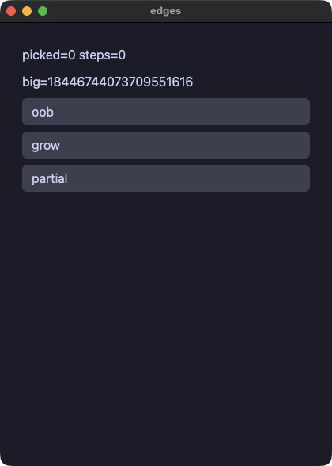

??? note "edges.go"

    ```go
    // The edges: an index past the end of a list, and a number far past
    // what a machine word holds that keeps growing. Both runs have to
    // answer the same, and this is the demo that says so.
    //
    // Go answers the first by refusing: an index past the end stops the
    // program in both runs, so the app asks the length first. The second
    // is `math/big`, the same package in both runs.
    package main

    import (
    	"fmt"
    	"math/big"

    	. "github.com/i2y/yokan/gomamochi"
    )

    type Edges struct {
    	xs     []int
    	picked int
    	big    *big.Int
    	steps  int
    }

    // The element at i, or -1 when there is none.
    func (e *Edges) at(i int) int {
    	if i < 0 || i >= len(e.xs) {
    		return -1
    	}
    	return e.xs[i]
    }

    func (e *Edges) View() Element {
    	return Column(
    		Text(fmt.Sprintf("picked=%d steps=%d", e.picked, e.steps)),
    		Text("big="+e.big.String()),
    		Button("oob").OnClick(func() { e.picked = e.at(5) }),
    		Button("grow").OnClick(func() { e.big = new(big.Int).Mul(e.big, big.NewInt(4)) }),
    		Button("partial").OnClick(func() {
    			e.steps += 1
    			e.picked = e.at(9)
    		}),
    	).Spacing(8).Padding(12)
    }

    func main() {
    	start, _ := new(big.Int).SetString("18446744073709551616", 10)
    	Run(&Edges{xs: []int{7}, big: start}, Title("edges"))
    }
    ```

#### flow — ハンドラの中の制御構造。飛ばすループ、止まるループ、条件つきの `for`、別のメソッドを包むメソッド
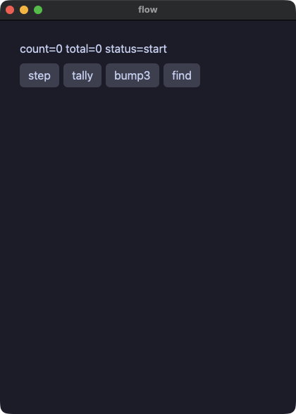

??? note "flow.go"

    ```go
    // Control flow in the handlers: a loop that skips, a loop that stops, a
    // `for` with a condition, and a method that wraps another one. Both
    // runs do the same thing, which is what the gate compares.
    package main

    import (
    	"fmt"

    	. "github.com/i2y/yokan/gomamochi"
    )

    type Flow struct {
    	count  int
    	total  int
    	status string
    }

    func (f *Flow) double(v int) int {
    	return v * 2
    }

    // A wrapper around a handler: it says what it is doing, runs the
    // handler, and says it is done.
    func (f *Flow) announced(work func()) {
    	f.status = "working"
    	work()
    	f.status = "done"
    }

    func (f *Flow) step() {
    	f.count += 1
    	if f.count > 3 && f.count < 100 {
    		f.status = "big"
    	} else if f.count == 3 {
    		f.status = "three"
    	} else {
    		f.status = "small"
    	}
    }

    func (f *Flow) tally() {
    	f.total = 0
    	for i := 1; i < 6; i++ {
    		if i == 3 {
    			continue
    		}
    		f.total += f.double(i)
    	}
    }

    func (f *Flow) bump3() {
    	f.announced(func() {
    		for f.count < 3 {
    			f.count += 1
    		}
    	})
    }

    func (f *Flow) find() {
    	for i := 0; i < 10; i++ {
    		if i*i > 10 {
    			f.count = i
    			break
    		}
    	}
    }

    func (f *Flow) View() Element {
    	return Column(
    		Text(fmt.Sprintf("count=%d total=%d status=%s", f.count, f.total, f.status)),
    		Row(
    			Button("step").OnClick(func() { f.step() }),
    			Button("tally").OnClick(func() { f.tally() }),
    			Button("bump3").OnClick(func() { f.bump3() }),
    			Button("find").OnClick(func() { f.find() }),
    		).Spacing(6),
    	).Spacing(8).Padding(12)
    }

    func main() {
    	Run(&Flow{status: "start"}, Title("flow"))
    }
    ```

## ウィンドウまわり

#### keys — キーの組み合わせにハンドラを結び付け、同じものをメニューバーにも置く。`key:cmd+s` と `menu:Save` で動かせる
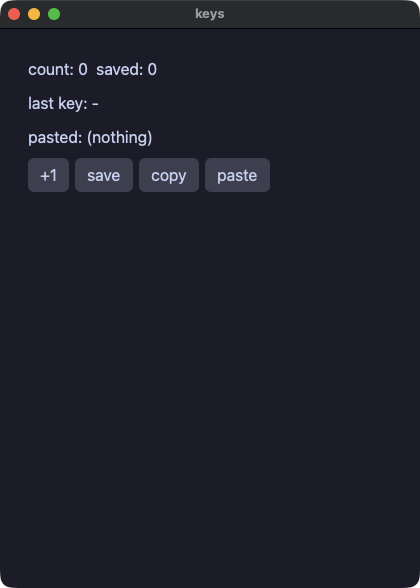

??? note "keys.go"

    ```go
    // The keyboard as a set of chords, and the same handlers in the
    // application's menu bar. A script presses one with `key:cmd+s` and
    // picks one with `menu:Save`.
    package main

    import (
    	"fmt"

    	. "github.com/i2y/yokan/gomamochi"
    )

    type Keys struct {
    	count  int
    	saved  int
    	last   string
    	pasted string
    }

    func (k *Keys) save() {
    	k.saved = k.count
    }

    func (k *Keys) clear() {
    	k.count = 0
    	k.saved = 0
    }

    func (k *Keys) copyCount() {
    	ClipboardSetText(fmt.Sprintf("count=%d", k.count))
    }

    func (k *Keys) paste() {
    	k.pasted = ClipboardGetText()
    }

    func (k *Keys) typed(chord string) {
    	k.last = chord
    }

    func (k *Keys) View() Element {
    	return Column(
    		Text(fmt.Sprintf("count: %d  saved: %d", k.count, k.saved)),
    		Text("last key: "+k.last),
    		Text("pasted: "+k.pasted),
    		Row(
    			Button("+1").OnClick(func() { k.count += 1 }),
    			Button("save").OnClick(func() { k.save() }),
    			Button("copy").OnClick(func() { k.copyCount() }),
    			Button("paste").OnClick(func() { k.paste() }),
    		).Spacing(6),
    	).Spacing(8).Padding(12)
    }

    func main() {
    	app := &Keys{last: "-", pasted: "(nothing)"}

    	MenuItem("Count", "Save", func() { app.save() })
    	MenuItem("Count", "Clear", func() { app.clear() })

    	Shortcut("cmd+s", func() { app.save() })
    	Shortcut("cmd+shift+r", func() { app.clear() })
    	Shortcut("cmd+shift+c", func() { app.copyCount() })
    	Shortcut("cmd+shift+v", func() { app.paste() })
    	OnKey(func(chord string) { app.typed(chord) })

    	Run(app, Title("keys"))
    }
    ```

#### picker — OS 自身のファイル選択と、ウィンドウへ落とされたファイル。選択は人を待つので、ウィンドウのスレッドの外で頼む
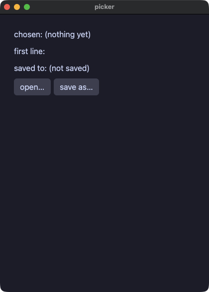

??? note "picker.go"

    ```go
    // The platform's own panels, and a file dragged onto the window. A
    // dialog waits for a person, so it is asked for off the window's
    // thread; a script answers one with `file:<path>` and drops one with
    // `drop:<path>`.
    package main

    import (
    	"os"

    	. "github.com/i2y/yokan/gomamochi"
    )

    type Picker struct {
    	chosen string
    	body   string
    	saved  string
    }

    func (p *Picker) took(path string) {
    	p.chosen = path
    	if path != "" {
    		p.body = readOr(path, "(unreadable)")
    	}
    }

    func readOr(path, fallback string) string {
    	text, err := os.ReadFile(path)
    	if err != nil {
    		return fallback
    	}
    	return string(text)
    }

    func (p *Picker) openOne() {
    	Task(func() any { return OpenDialog("Choose a file") }, func(v any) { p.took(v.(string)) })
    }

    func (p *Picker) saveAs() {
    	Task(func() any { return SaveDialog("notes.txt") }, func(v any) {
    		path := v.(string)
    		if path != "" {
    			if os.WriteFile(path, []byte(p.body), 0o644) == nil {
    				p.saved = path
    			}
    		}
    	})
    }

    // The first forty characters of the text.
    func head(s string) string {
    	r := []rune(s)
    	if len(r) > 40 {
    		r = r[:40]
    	}
    	return string(r)
    }

    func (p *Picker) View() Element {
    	return Column(
    		Text("chosen: "+p.chosen),
    		Text("first line: "+head(p.body)),
    		Text("saved to: "+p.saved),
    		Row(
    			Button("open…").Tooltip("the platform's own panel").OnClick(func() { p.openOne() }),
    			Button("save as…").OnClick(func() { p.saveAs() }),
    		).Spacing(6),
    	).Spacing(8).Padding(12)
    }

    func main() {
    	app := &Picker{chosen: "(nothing yet)", saved: "(not saved)"}
    	OnFileDrop(func(path string) { app.took(path) })
    	Run(app, Title("picker"))
    }
    ```

#### about — ページを開くリンクと、システムのクリップボード
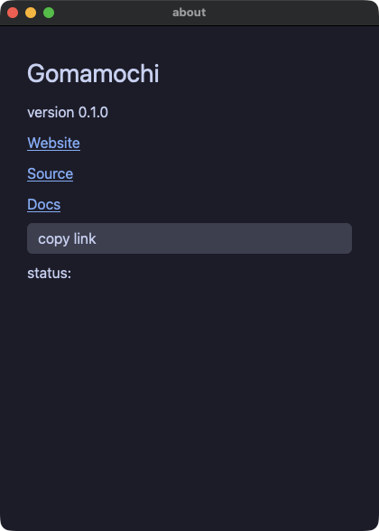

??? note "about.go"

    ```go
    // Links that open a page, and the system clipboard.
    package main

    import . "github.com/i2y/yokan/gomamochi"

    type About struct {
    	status string
    }

    func (a *About) View() Element {
    	return Column(
    		Text("Gomamochi").Size(28),
    		Text("version 0.1.0"),
    		Link("Website", "https://i2y.github.io/yokan/"),
    		Link("Source", "https://github.com/i2y/yokan"),
    		Link("Docs", "https://i2y.github.io/yokan/tour/"),
    		Button("copy link").OnClick(func() {
    			ClipboardSetText("https://github.com/i2y/yokan")
    			a.status = "copied"
    		}),
    		Text("status: "+a.status),
    	).Spacing(8).Padding(14)
    }

    func main() {
    	Run(&About{}, Title("about"))
    }
    ```

#### sound — ハンドラから WAV ファイルを鳴らす。スクリプトの下では無音になるので、ゲートが突き合わせるのは画面だけ
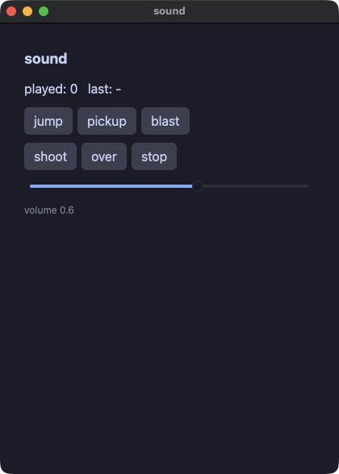

??? note "sound.go"

    ```go
    // Sound. A WAV file is played and the call answers at once, so a
    // handler that starts one carries on.
    //
    // A run under a script is silent: a gate must not need a machine with
    // speakers, and both runs read that one flag through the same library,
    // so neither is louder than the other. That is why this demo can be
    // gated at all — the screen is what the two runs compare.
    package main

    import (
    	"fmt"

    	. "github.com/i2y/yokan/gomamochi"
    )

    const dir = "demo/assets/sound"

    type Sound struct {
    	played int
    	last   string
    	volume float64
    }

    func (s *Sound) play(name string) {
    	AudioPlay(dir+"/"+name+".wav", s.volume)
    	s.played += 1
    	s.last = name
    }

    func (s *Sound) hush() {
    	AudioStop()
    	s.last = "stopped"
    }

    func (s *Sound) View() Element {
    	return Column(
    		Text("sound").Size(18).Bold(true),
    		Text(fmt.Sprintf("played: %d   last: %s", s.played, s.last)),
    		Row(
    			Button("jump").OnClick(func() { s.play("jump") }),
    			Button("pickup").OnClick(func() { s.play("pickup") }),
    			Button("blast").OnClick(func() { s.play("blast") }),
    		).Spacing(6),
    		Row(
    			Button("shoot").OnClick(func() { s.play("shoot") }),
    			Button("over").OnClick(func() { s.play("over") }),
    			Button("stop").OnClick(func() { s.hush() }),
    		).Spacing(6),
    		Slider().Value(s.volume).Min(0).Max(1).Step(0.1).OnChange(func(v float64) { s.volume = v }),
    		Text(fmt.Sprintf("volume %.1f", s.volume)).Size(12).Color("#8a8f98"),
    	).Spacing(10).Padding(14)
    }

    func main() {
    	Run(&Sound{last: "-", volume: 0.6}, Title("sound"))
    }
    ```

## タイマーとタスク

#### dashboard — アプリを走らせる前に宣言するタイマー。両方の実行で同じだけ時を刻む（ゲートは `advance:` で進める）
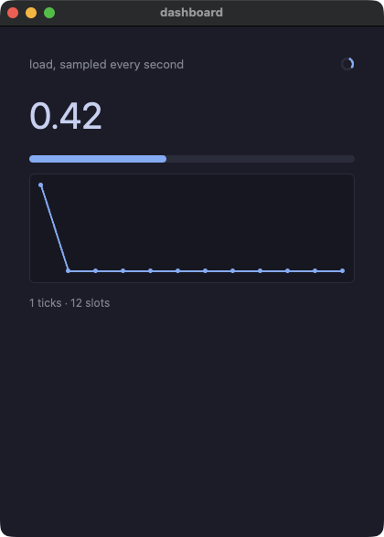

??? note "dashboard.go"

    ```go
    // A timer: declared before the app runs, told every second. Both runs
    // tick off the same clock — a frame in a window, an `advance:` in a
    // script — so the same number of ticks lands in both.
    //
    // The step is arithmetic rather than a random number: a dashboard that
    // cannot be compared is not worth gating.
    package main

    import (
    	"fmt"

    	. "github.com/i2y/yokan/gomamochi"
    )

    const slots = 12

    type Dashboard struct {
    	hist  []float64
    	at    int
    	ticks int
    	cur   float64
    }

    func (d *Dashboard) tick() {
    	d.ticks += 1
    	step := float64(d.ticks*37%41)/100 - 0.2
    	v := d.cur + step
    	if v < 0 {
    		v = 0
    	}
    	if v > 1 {
    		v = 1
    	}
    	d.cur = v
    	d.hist[d.at] = v
    	d.at = (d.at + 1) % slots
    }

    func (d *Dashboard) View() Element {
    	return Column(
    		Row(
    			Text("load, sampled every second").Size(13).Color("#8a8f98").Grow(1),
    			Spinner().Size(16),
    		).Spacing(8),
    		Text(fmt.Sprintf("%.2f", d.cur)).Size(40),
    		Progress(d.cur),
    		LineChart(d.hist).Height(120),
    		Text(fmt.Sprintf("%d ticks · %d slots", d.ticks, slots)).Size(12).Color("#8a8f98"),
    	).Spacing(12).Padding(16)
    }

    func main() {
    	app := &Dashboard{hist: make([]float64, slots), cur: 0.25}
    	Every(1.0, func() { app.tick() })
    	Run(app, Title("dashboard"))
    }
    ```

#### tasks — 時間のかかる処理を、専用の goroutine でウィンドウのスレッドの外へ。答えは二つ目のクロージャで受け取る
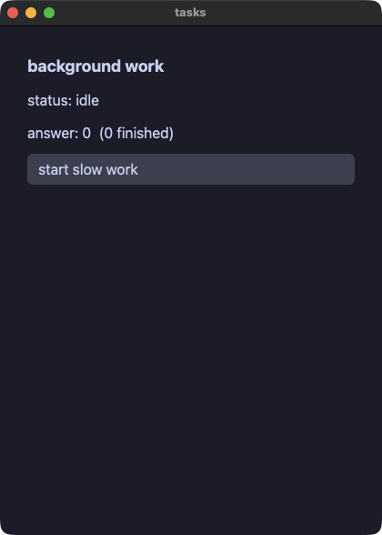

??? note "tasks.go"

    ```go
    // Work that takes a while, done off the window's thread. `Task` runs
    // the work on a goroutine of its own; when it answers, the second
    // closure is called on the window's thread with the answer.
    //
    // Nothing inside the work touches the app's fields or the screen. That
    // is the whole rule, and it is why the answer comes back as an argument
    // rather than the worker writing it anywhere.
    package main

    import (
    	"fmt"

    	. "github.com/i2y/yokan/gomamochi"
    )

    type Jobs struct {
    	status string
    	answer int
    	done   int
    }

    func (j *Jobs) start() {
    	j.status = "working"
    	Task(func() any {
    		// deliberately slow, and deliberately arithmetic: both runs
    		// have to agree about what it answers.
    		total := 0
    		for i := 0; i < 300000; i++ {
    			total += i % 7
    		}
    		return total
    	}, func(v any) {
    		j.answer = v.(int)
    		j.done += 1
    		j.status = "done"
    	})
    }

    func (j *Jobs) View() Element {
    	return Column(
    		Text("background work").Size(18).Bold(true),
    		Text("status: "+j.status),
    		Text(fmt.Sprintf("answer: %d  (%d finished)", j.answer, j.done)),
    		Button("start slow work").OnClick(func() { j.start() }),
    	).Spacing(10).Padding(14)
    }

    func main() {
    	Run(&Jobs{status: "idle"}, Title("tasks"))
    }
    ```

