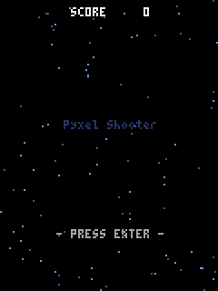

<div class="gm-hero" markdown>


# Gomamochi

<p class="gm-hero__tag">Write Go. Ship what you saw.</p>

<p class="gm-hero__lede">
Gomamochi builds desktop apps in Go on pixie's engine, and
<strong><code>gomamochi gate</code> is how you check that what you saw
while writing is what you ship</strong>. <code>gomamochi run</code>
reads your file and runs it interpreted, with no build step: save, and
the window takes the new code and keeps the values it had.
<code>gomamochi build</code> compiles the same file with the Go compiler
into a native binary. Both reach the same drawing engine
(<strong>gpui</strong>, the engine behind the Zed editor) through
<a href="https://github.com/i2y/yokan/blob/main/docs/PIXIE.md">pixie</a>'s
C face, opened without cgo, and the gate drives both with one script
and compares what they drew, byte for byte. An app is a Go struct with
a <code>View</code> method; what Gomamochi adds is the elements that
build the screen, and the check that the two runs agree.
</p>

<div class="gm-hero__cta" markdown>
[Get started](installation.md){ .md-button .md-button--primary }
[Language tour](tour.md){ .md-button }
[Demos](demos.md){ .md-button }
[GitHub](https://github.com/i2y/yokan){ .md-button }
</div>
</div>

## The whole picture

One source, two roads to run it.


Both roads end at one engine, and both reach it the same way: pixie's C
face is one shared library, and each run opens it through purego,
without cgo. The interpreted run is [yaegi](https://github.com/traefik/yaegi),
inside the `gomamochi` command; the compiled run is the binary
`go build` makes from the same file, with that library beside it. The
engine never holds a Go value, which is what lets an interpreter and a
compiled binary drive exactly the same code.

---

## Write it, run it, ship it

The smallest complete app:

```go
package main

import (
	"fmt"

	. "github.com/i2y/yokan/gomamochi"
)

type Counter struct {
	count int
}

func (c *Counter) View() Element {
	return Column(
		Text(fmt.Sprintf("count: %d", c.count)).Size(34),
		Button("+1").OnClick(func() { c.count += 1 }),
	).Spacing(12).Padding(16)
}

func main() {
	Run(&Counter{}, Title("counter"))
}
```

An app is a struct. Its state is its fields, `View` answers one
element, and a handler is a closure over the fields. There is nothing
to inherit from, nothing to register, and nothing to mark as
observable. Go has no keyword arguments, so an element's keywords are
methods on it, and a chain reads the way the keyword list would:
`Text("…").Size(34)`, `Column(…).Spacing(12).Padding(16)`.

The dot import is a matter of taste. Import the package under a name
and every call reads `gm.Text(…)`, `gm.Run(…)` instead, and the app may
then use any name it likes for its own types. Both runs take either
form.

```console
$ ./bin/gomamochi run app.go
```

That opens a window and watches the file. Save an edit and the window
picks it up: a fresh interpreter reads the file again, and the struct
the window is holding carries every value it had into the new code.
There is no build step, and no Go toolchain in the loop either: the
command holds the interpreter.

Ship it:

```console
$ ./bin/gomamochi build demo/counter.go --release --app
built: demo/.gate/counter/counter (1.9 MB)
bundle: demo/dist/counter.app (22.2 MB)
```

The binary is the Go compiler's own, built without cgo, and the engine
rides beside it as one shared library; `--app` puts the two in one
bundle (an AppDir on Linux, which `--appimage` packs into one file).
The person receiving it installs neither Go nor the toolchain.

---

## What it looks like


*`demo/ledger.go` — money kept in a database, every value bound rather
than spliced, with a chart over the totals. Ordinary Go; ships as the
Go compiler's own binary.*

---

## "But it worked on my machine"

Hand it a sequence of interactions and it replays them against the
interpreted run and the compiled binary, then compares the resulting
screens. Gomamochi calls it the **gate**:

```console
$ ./bin/gomamochi gate app.go --script "click:+1,dump"
GATE OK — 3 dump lines identical in both runs
```

The compiled run *is* the Go compiler's, so what a green gate says is
that the window you were writing in agreed with what ships, on
everything the script touched. The interpreter is the one that could
differ, and the places where it does are named, with reasons, on
[The two runs](two-runs.md), and refused by name before anything is
built.

---

## Go's standard library is the same code in both runs

`fmt`, `strings`, `strconv`, `math`, `sort`, `time`, `encoding/json`,
`net/http`, `os`: Go's own, not a library of ours standing in front of
them. The interpreter calls the packages compiled into the command,
and the binary links the same ones, so a number formats the same, an
integer overflows the same and a string upper-cases the same, with no
table needed to keep them honest.

```go
	sort.Slice(order, func(a, b int) bool { return scores[order[a]] < scores[order[b]] })
	line := fmt.Sprintf("mean %.1f, %d over five", mean, len(big))
```

A database, the clipboard, the platform's dialogs, sound and
notifications come from the framework instead, and there one
implementation, inside the engine, answers both runs through the C
face:

```go
	SqliteExec(db, "INSERT INTO expenses VALUES (?, ?, ?)", name, strconv.Itoa(yen), cat)
	rows := SqliteQueryRowsOr(db, "SELECT name, amount, cat FROM expenses ORDER BY rowid")
```

---

## Two games, ported

Two of Pyxel's own examples (Takashi Kitao, MIT) are in the bundled
demos, ported almost line for line: the same pixel canvas, the same
thirty frames a second, the same keys read while they are held. A
script of keystrokes and frames replays both runs, so the gate compares
every frame of the game.

<p align="center">
  
  
</p>

*`demo/shooter.go` and `demo/jump.go` — inside a canvas a color is a
number, the index of a color in the palette, which is what lets drawing
code written for a pixel machine port with its numbers unchanged.*

---

## When an agent is writing it

An agent writes a file and reads what comes back, so what comes back
decides how the session goes. Two of the commands build nothing and
open no window, and each answers in about a second or less: a refusal
that names what to write instead, and the screen as text. The gate is
the proof at the end.


[Building with an agent](agents.md) walks the whole loop.

---

## What else is in it

<div class="grid cards" markdown>

-   :material-table-large: __One table, one vocabulary__

    Thirty-three elements, fifteen shared keywords and ten drawing
    commands, written once in `elements.toml`. The Go an app calls, the
    interpreter's view of it and the numbers the engine counts with are
    generated from it, so an element cannot mean two things — and the
    other three languages on this engine read the same table.

-   :material-brush-variant: __A canvas, and the keyboard__

    A grid of virtual pixels painted command by command, colors by
    palette index, keys read as a device from the tick, and a WAV played
    with `AudioPlay` — and a PNG of any frame without opening a window
    at all.

-   :material-shield-check: __Refusals that teach__

    What the interpreted run cannot run the way the compiler does is
    refused by name, with the line and the rewrite, before anything is
    built, and Go's own errors come in Go's own words. Each refusal has
    a file holding the message it must print, word for word.

</div>

---

## The limits, named

- The interpreted run is yaegi, whose Go is 1.22's. `min` and `max`,
  `range` over a number or a function, and what the standard library
  gained after 1.22 are not in it; the first three are refused by name,
  and the tour's closing section is the whole list.
- An app is one file that imports the standard library and this
  package. A module outside the standard library is refused, because
  the interpreted run cannot read it yet.
- A shipped app is the binary and the engine's library beside it, or
  the bundle that holds both. There is no single-file form.
- Under a dot import the package's exported names (`App`, `Element`,
  `Text`, `Run` and the rest) are taken, so an app names its own types
  around them, or imports the package under a name.
- macOS on Apple silicon and Linux.

[What does not work yet](tour-ship.md#what-does-not-work-yet) on the
tour has the reasons.

---

## Where next

<div class="grid cards" markdown>

-   :material-rocket-launch: __[Installation](installation.md)__

    What you need, the one-time setup, and the four commands. macOS on
    Apple silicon and Linux today.

-   :material-book-open-variant: __[Language tour](tour.md)__

    One pass over how apps are written — state, views, the canvas, the
    window, a database, the gate — closing with what does not work yet.

-   :material-view-gallery: __[Demos](demos.md)__

    Forty-four apps, each with its screenshot and its whole source.

-   :material-github: __[Source](https://github.com/i2y/yokan)__

    The command, the door, the engine, and the demos.

</div>

---

_The name is 胡麻餅 — gomamochi, mochi with black sesame kneaded
through. Like Yokan, Wakakusa and Rakugan, the three languages it
shares an engine with, it is named after a Japanese sweet._
