<!-- Written by website/tools/demos_page.pl from demo/. Edit the demos. -->
# デモ

アプリが 43 本あり、すべてがゲートを通っています。
解釈実行とコンパイルした実行を同じスクリプトで動かし、1 バイトずつ突き合わせています。
どれもリポジトリの `rakugan/` からそのまま動きます。

```console
$ ./bin/rakugan run demo/counter.pl     # 名前はどのデモでもよい
$ ./tools/gate_all.sh                   # すべてのデモをまとめてゲートにかける
```

画面写真はどれも起動直後の状態です。
ただし 2 つのゲームだけは、遊んでいるところの録画です。
その下にあるのは、そのデモのファイル全体です。

## まずはここから

#### counter — 基本形。アプリはクラスで、状態はそのフィールド、ハンドラはフィールドがそのまま見える無名サブルーチン
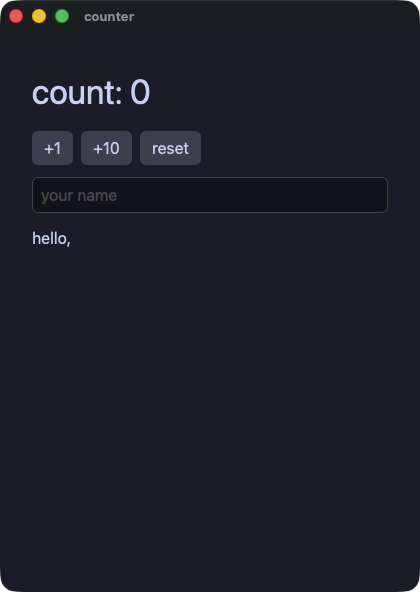

??? note "counter.pl"

    ```perl
    # The reference: everything in this file is what Rakugan takes. The app
    # is a class, its state is its fields, `view` is a method, and a handler
    # is an anonymous sub that closes over the fields.
    #
    #   rakugan run  demo/counter.pl
    #   rakugan gate demo/counter.pl --script "click:+1,input:Momo"
    use Rakugan;

    class Counter {
        use Rakugan;
        field $count = 0;
        field $name  = "";

        method view {
            column(
                text("count: $count", size => 34),
                row(
                    button("+1",    on_click => sub { $count += 1 }),
                    button("+10",   on_click => sub { $count += 10 }),
                    button("reset", on_click => sub { $count = 0 }),
                    spacing => 8,
                ),
                text_field($name, placeholder => "your name",
                           on_change => sub ($s) { $name = $s }),
                text("hello, $name"),
                spacing => 12,
                padding => 16,
            );
        }
    }

    run(Counter->new, title => "counter");
    ```

#### control — ビューの中はただの Perl。`if`、`unless`、条件演算子、ループ、画面の一部を返すメソッド
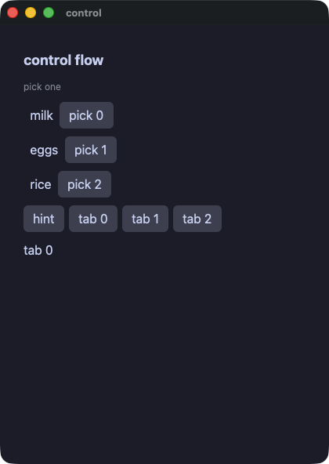

??? note "control.pl"

    ```perl
    # Ordinary Perl inside a view: `if`, `unless`, a conditional
    # expression, a loop, and a method that answers part of the screen.
    # The parts go into a list, and the list is what the container holds.
    use Rakugan;

    class Control {
        use Rakugan;
        field @items     = ("milk", "eggs", "rice");
        field $picked    = -1;
        field $show_hint = true;
        field $tab       = 0;

        method hint {
            return text("pick one", size => 12, color => "#8a8f98");
        }

        method line :Sig(Str, Int) ($name, $i) {
            return row(
                text($i == $picked ? "▸ $name" : "  $name"),
                button("pick $i", on_click => sub { $picked = $i }),
                spacing => 8,
            );
        }

        method tab_button :Sig(Int) ($n) {
            return button("tab $n", on_click => sub { $tab = $n });
        }

        method view {
            my @cells = (text("control flow", size => 18, bold => true));
            if ($show_hint) {
                push @cells, $self->hint;
            } else {
                push @cells, text("hidden", size => 12);
            }
            for my $i (0 .. $#items) {
                push @cells, $self->line($items[$i], $i);
            }
            push @cells, text("picked $items[$picked]", color => $picked % 2 == 0 ? "accent" : "#f38ba8")
                unless $picked < 0;
            push @cells, row(
                button("hint", on_click => sub { $show_hint = !$show_hint }),
                (map { $self->tab_button($_) } 0 .. 2),
                spacing => 6,
            );
            push @cells, text("tab $tab");
            return column(@cells, spacing => 10, padding => 14);
        }
    }

    run(Control->new, title => "control");
    ```

#### todo — 行を必要なぶんだけ作るリストと、enter で確定する入力欄
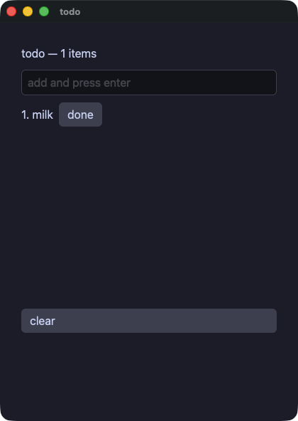

??? note "todo.pl"

    ```perl
    # A list whose rows are built on demand: the builder is called for the
    # rows in view, not for all of them. The row number is the sub's own
    # argument, so the line, the marker and that row's button all read it.
    use Rakugan;

    class Todo {
        use Rakugan;
        field @items = ("milk");
        field $draft = "";
        field $done  = -1;

        method add :Sig(Str) ($t) {
            push @items, $t;
            $draft = "";
        }

        method line :Sig(Int) ($i) {
            my @cells = (text("@{[ $i + 1 ]}. $items[$i]"));
            push @cells, text("done", color => "accent") if $i == $done;
            push @cells, button("done", on_click => sub { $done = $i });
            return row(@cells, spacing => 8);
        }

        method view {
            return column(
                text("todo — @{[ scalar @items ]} items", size => 16),
                text_field($draft, placeholder => "add and press enter",
                           on_change => sub ($t) { $draft = $t },
                           on_submit => sub ($t) { $self->add($t) }),
                list_view(scalar @items, sub ($i) { $self->line($i) },
                          item_height => 26, height => 280),
                button("clear", on_click => sub { @items = () }),
                spacing => 10,
                padding => 14,
            );
        }
    }

    run(Todo->new, title => "todo");
    ```

#### calc — 電卓。途中の値ひとつと待っている演算ひとつを持ち、見た目はハッシュにまとめて各キーに渡す
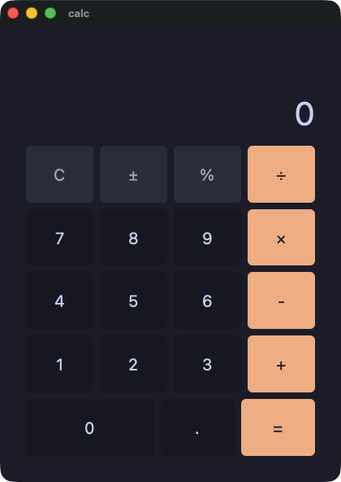

??? note "calc.pl"

    ```perl
    # A calculator: one accumulator, one pending operation, and a display
    # the app builds as a string. The look is a hash of keywords, handed to
    # each key.
    use Rakugan;

    my %KEY     = (grow => 1, size => 20, background => "panel",
                   hover_background => "#45475a", active_background => "#585b70");
    my %FUN     = (%KEY, background => "#313244", color => "#a6adc8");
    my %OP      = (%KEY, background => "#fab387", color => "#1e1e2e",
                   hover_background => "#f8c49b", active_background => "#f5e0dc");
    my %WIDE    = (%KEY, grow => 2, basis => 8);
    my %READOUT = (size => 40, color => "text", align => "right", grow => 1.4);
    my %KEYS    = (spacing => 8, grow => 1);

    class Calc {
        use Rakugan;
        field $display = "0";
        field $acc     = 0.0;
        field $op      = "";
        field $fresh   = true;
        field $has_dot = false;

        method press :Sig(Str) ($d) {
            if ($fresh) {
                $display = $d;
                $fresh = false;
                $has_dot = false;
            } elsif ($display eq "0") {
                $display = $d;
            } else {
                $display = $display . $d;
            }
        }

        method dot {
            if ($fresh) {
                $display = "0.";
                $fresh = false;
                $has_dot = true;
            } elsif (!$has_dot) {
                $display = $display . ".";
                $has_dot = true;
            }
        }

        method negate {
            my $v = 0 + $display;
            return if $v == 0.0;
            $display = "@{[ 0.0 - $v ]}";
            $fresh = false;
        }

        method percent {
            $display = "@{[ (0 + $display) / 100.0 ]}";
            $fresh = true;
            $has_dot = false;
        }

        method apply :Sig(Str) ($nxt) {
            if ($fresh && $op ne "") {
                $op = $nxt;
                return;
            }
            my $cur = 0 + $display;
            $acc = $cur if $op eq "";
            $acc += $cur if $op eq "+";
            $acc -= $cur if $op eq "-";
            $acc *= $cur if $op eq "×";
            if ($op eq "÷") {
                if ($cur == 0.0) {
                    $display = "Error";
                    $acc = 0.0;
                    $op = "";
                    $fresh = true;
                    return;
                }
                $acc /= $cur;
            }
            $display = "$acc";
            $op = $nxt;
            $fresh = true;
        }

        method clear {
            $display = "0";
            $acc = 0.0;
            $op = "";
            $fresh = true;
            $has_dot = false;
        }

        method digit :Sig(Str) ($d) {
            return button($d, %KEY, on_click => sub { $self->press($d) });
        }

        method op_key :Sig(Str) ($name) {
            return button($name, %OP, on_click => sub { $self->apply($name) });
        }

        method equals {
            return button("=", %OP, on_click => sub { $self->apply("") });
        }

        method view {
            return column(
                text($display, %READOUT),
                row(
                    button("C", %FUN, on_click => sub { $self->clear }),
                    button("±", %FUN, on_click => sub { $self->negate }),
                    button("%", %FUN, on_click => sub { $self->percent }),
                    $self->op_key("÷"),
                    %KEYS,
                ),
                row($self->digit("7"), $self->digit("8"), $self->digit("9"), $self->op_key("×"), %KEYS),
                row($self->digit("4"), $self->digit("5"), $self->digit("6"), $self->op_key("-"), %KEYS),
                row($self->digit("1"), $self->digit("2"), $self->digit("3"), $self->op_key("+"), %KEYS),
                row(
                    button("0", %WIDE, on_click => sub { $self->press("0") }),
                    button(".", %KEY, on_click => sub { $self->dot }),
                    $self->equals,
                    %KEYS,
                ),
                spacing => 8, padding => 16, grow => 1,
            );
        }
    }

    run(Calc->new, title => "calc");
    ```

#### calcgrid — 同じ電卓を 5 行ではなくグリッドで。0 キーが 2 つぶんの幅になるのは `col_span`
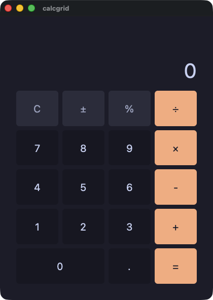

??? note "calcgrid.pl"

    ```perl
    # The same calculator as demo/calc.pl, on a grid instead of five
    # rows. `col_span =>` is what makes the zero key twice as wide.
    use Rakugan;

    my %KEY     = (grow => 1, size => 20, background => "panel",
                   hover_background => "#45475a", active_background => "#585b70");
    my %FUN     = (%KEY, background => "#313244", color => "#a6adc8");
    my %OP      = (%KEY, background => "#fab387", color => "#1e1e2e",
                   hover_background => "#f8c49b", active_background => "#f5e0dc");
    my %WIDE    = (%KEY, grow => 2, basis => 8);
    my %READOUT = (size => 40, color => "text", align => "right", grow => 1.4);
    my %KEYS    = (spacing => 8, grow => 1);

    class CalcGrid {
        use Rakugan;
        field $display = "0";
        field $acc     = 0.0;
        field $op      = "";
        field $fresh   = true;
        field $has_dot = false;

        method press :Sig(Str) ($d) {
            if ($fresh) {
                $display = $d;
                $fresh = false;
                $has_dot = false;
            } elsif ($display eq "0") {
                $display = $d;
            } else {
                $display = $display . $d;
            }
        }

        method dot {
            if ($fresh) {
                $display = "0.";
                $fresh = false;
                $has_dot = true;
            } elsif (!$has_dot) {
                $display = $display . ".";
                $has_dot = true;
            }
        }

        method negate {
            my $v = 0 + $display;
            return if $v == 0.0;
            $display = "@{[ 0.0 - $v ]}";
            $fresh = false;
        }

        method percent {
            $display = "@{[ (0 + $display) / 100.0 ]}";
            $fresh = true;
            $has_dot = false;
        }

        method apply :Sig(Str) ($nxt) {
            if ($fresh && $op ne "") {
                $op = $nxt;
                return;
            }
            my $cur = 0 + $display;
            $acc = $cur if $op eq "";
            $acc += $cur if $op eq "+";
            $acc -= $cur if $op eq "-";
            $acc *= $cur if $op eq "×";
            if ($op eq "÷") {
                if ($cur == 0.0) {
                    $display = "Error";
                    $acc = 0.0;
                    $op = "";
                    $fresh = true;
                    return;
                }
                $acc /= $cur;
            }
            $display = "$acc";
            $op = $nxt;
            $fresh = true;
        }

        method clear {
            $display = "0";
            $acc = 0.0;
            $op = "";
            $fresh = true;
            $has_dot = false;
        }

        method digit :Sig(Str) ($d) {
            return button($d, %KEY, on_click => sub { $self->press($d) });
        }

        method op_key :Sig(Str) ($name) {
            return button($name, %OP, on_click => sub { $self->apply($name) });
        }

        method equals {
            return button("=", %OP, on_click => sub { $self->apply("") });
        }

        method view {
            return column(
                text($display, %READOUT),
                grid(
                    button("C", %FUN, on_click => sub { $self->clear }),
                    button("±", %FUN, on_click => sub { $self->negate }),
                    button("%", %FUN, on_click => sub { $self->percent }),
                    $self->op_key("÷"),
                    $self->digit("7"), $self->digit("8"), $self->digit("9"), $self->op_key("×"),
                    $self->digit("4"), $self->digit("5"), $self->digit("6"), $self->op_key("-"),
                    $self->digit("1"), $self->digit("2"), $self->digit("3"), $self->op_key("+"),
                    grid_cell(button("0", %WIDE, on_click => sub { $self->press("0") }), col_span => 2),
                    button(".", %KEY, on_click => sub { $self->dot }),
                    $self->equals,
                    columns => 4, rows => 5, spacing => 8, grow => 5,
                ),
                spacing => 8, padding => 16, grow => 1,
            );
        }
    }

    run(CalcGrid->new, title => "calcgrid");
    ```

## 状態

#### mixer — アプリが持つ状態と、そこへ書き込む入力欄。画面の一部は、あるときだけ現れる
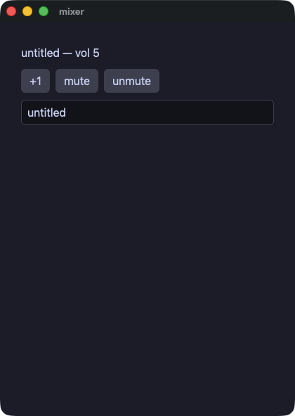

??? note "mixer.pl"

    ```perl
    # State an app keeps and a field that writes into it. The parts of the
    # screen go into a list, and one of them is only there some of the time.
    use Rakugan;

    class Mixer {
        use Rakugan;
        field $volume = 5;
        field $title  = "untitled";
        field $muted  = false;

        method view {
            my @cells = (
                text("$title — vol $volume", size => 16),
                row(
                    button("+1",     on_click => sub { $volume += 1 }),
                    button("mute",   on_click => sub { $muted = true }),
                    button("unmute", on_click => sub { $muted = false }),
                    spacing => 8,
                ),
            );
            push @cells, text("(muted)", size => 12, color => "#8a8f98") if $muted;
            push @cells, text_field($title, placeholder => "title", on_change => sub ($t) { $title = $t });
            return column(@cells, spacing => 10, padding => 14);
        }
    }

    run(Mixer->new, title => "mixer");
    ```

#### lookup — アプリが持つハッシュ。既定値つきの読み出し、鍵があるかどうかの確認、ウィンドウを開けたままの追加
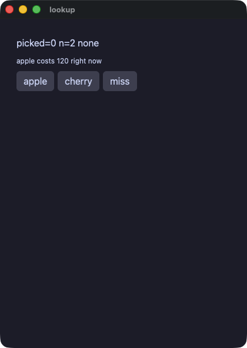

??? note "lookup.pl"

    ```perl
    # A hash on the app: reading with a fallback, asking whether a key is
    # there, and adding one while the window is open.
    use Rakugan;

    class Lookup {
        use Rakugan;
        field %prices = (apple => 120, banana => 80);
        field $picked = 0;
        field $label  = "none";

        method pick_apple {
            $picked = $prices{"apple"} // -1;
            $label = exists $prices{"cherry"} ? "cherry known" : "no cherry";
        }

        method add_cherry {
            $prices{"cherry"} = 200;
            $picked = $prices{"cherry"} // -1;
            $label = "cherry known" if exists $prices{"cherry"};
        }

        method view {
            return column(
                text("picked=$picked n=@{[ scalar keys %prices ]} $label"),
                text("apple costs @{[ $prices{'apple'} // -1 ]} right now", size => 12),
                row(
                    button("apple",  on_click => sub { $self->pick_apple }),
                    button("cherry", on_click => sub { $self->add_cherry }),
                    button("miss",   on_click => sub { $picked = $prices{"durian"} // -7 }),
                    spacing => 6,
                ),
                spacing => 8,
                padding => 12,
            );
        }
    }

    run(Lookup->new, title => "lookup");
    ```

#### points — 値のための小さなクラスを、アプリの状態として持つ
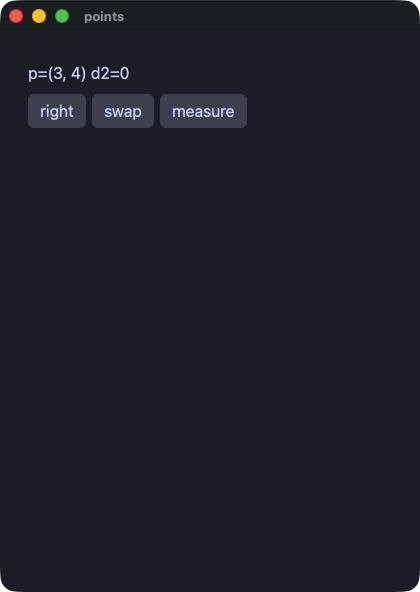

??? note "points.pl"

    ```perl
    # A small class of values, carried on the app's own state. A class with
    # no `view` is a value: `:param` says what `new` is given, `:reader`
    # what can be read back, and the compiled run holds it as a value
    # rather than as something two names can share.
    use Rakugan;

    class Point {
        use Rakugan;
        field $x :param :reader = 0;
        field $y :param :reader = 0;
    }

    class Points {
        use Rakugan;
        field $sel  = Point->new(x => 3, y => 4);
        field $dist = 0;

        method view {
            return column(
                text("p=(@{[ $sel->x ]}, @{[ $sel->y ]}) d2=$dist"),
                row(
                    button("right",   on_click => sub { $sel = Point->new(x => $sel->x + 5, y => $sel->y) }),
                    button("swap",    on_click => sub { $sel = Point->new(x => $sel->y, y => $sel->x) }),
                    button("measure", on_click => sub { $dist = $sel->x * $sel->x + $sel->y * $sel->y }),
                    spacing => 6,
                ),
                spacing => 8,
                padding => 12,
            );
        }
    }

    run(Points->new, title => "points");
    ```

#### moods — なにもないかもしれない値を `if (defined ...)` の中で読む。いくつかの決まった値は定数で。アプリが持つ、メソッドを持つ二つ目のクラス
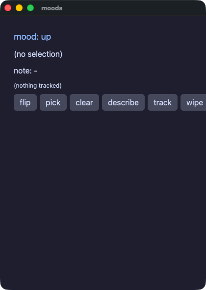

??? note "moods.pl"

    ```perl
    # Values that are one of a few named things, and a value that may be
    # nothing at all. Perl writes the first as constants and the second as
    # `undef`: a field that starts as nothing says what it may hold, and
    # `defined` is the `if` inside which it is read as the value. The
    # tracker is a second class with methods of its own, which the app
    # holds and calls.
    use Rakugan;

    class Tracker {
        use Rakugan;
        use constant { HAPPY => "happy", SAD => "sad" };
        field $last  :reader = maybe(Int);
        field $trend :reader = HAPPY;

        method note :Sig(Int) ($v) {
            $last = $v;
            $trend = $trend eq HAPPY ? SAD : HAPPY;
        }

        method wipe {
            $last = undef;
        }
    }

    class Moods {
        use Rakugan;
        use constant { HAPPY => "happy", SAD => "sad" };
        field $mood    = HAPPY;
        field $sel     = maybe(Int);
        field $note    = "-";
        field $tracker = Tracker->new;

        method flip {
            $mood = $mood eq HAPPY ? SAD : HAPPY;
        }

        method describe {
            if (defined $sel) {
                $note = "chose $sel";
            } else {
                $note = "nothing chosen";
            }
        }

        method mood_line {
            return text("mood: up", size => 18, color => "accent", animate => 120, easing => "out") if $mood eq HAPPY;
            return text("mood: down", size => 18, color => "#f38ba8", animate => 120, easing => "out");
        }

        method view {
            my @cells = ($self->mood_line);
            if (defined $sel) {
                push @cells, text("selection: $sel");
            } else {
                push @cells, text("(no selection)");
            }
            push @cells, text("note: $note");
            if (defined $tracker->last) {
                push @cells, text("tracked: @{[ $tracker->last ]}", size => 12);
            } else {
                push @cells, text("(nothing tracked)", size => 12);
            }
            return column(
                @cells,
                row(
                    button("flip",     on_click => sub { $self->flip }),
                    button("pick",     on_click => sub { $sel = 7 }),
                    button("clear",    on_click => sub { $sel = undef }),
                    button("describe", on_click => sub { $self->describe }),
                    button("track",    animate => 100, easing => "inOut", on_click => sub { $tracker->note(9) }),
                    button("wipe",     on_click => sub { $tracker->wipe }),
                    spacing => 6,
                ),
                spacing => 8,
                padding => 12,
            );
        }
    }

    run(Moods->new, title => "moods");
    ```

#### links — 互いを指し合うオブジェクト。戻りの参照は perl の作法どおり弱くしてあるので、鎖を切れば両方の実行で解放される
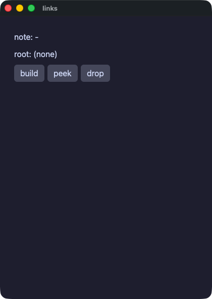

??? note "links.pl"

    ```perl
    # Objects that point at one another. A perl object is a reference, and
    # two names can hold the same one; the compiled run keeps that. The
    # pointer back is weakened, as perl itself asks, so a parent and a
    # child do not keep each other alive: cut the owning chain and the
    # survivor's pointer back answers nothing, in both runs.
    use Rakugan;

    class Node {
        use Rakugan;
        field $label  :param :reader = "n";
        field $kid    :reader :writer = maybe(Node);
        field $parent :reader = maybe(Node);

        method hang_under :Sig(Node) ($p) {
            $parent = $p;
            weaken($parent);
        }
    }

    class Tree {
        use Rakugan;
        field $root = maybe(Node);
        field $keep = maybe(Node);
        field $note = "-";

        method build {
            my $a = Node->new(label => "alpha");
            my $b = Node->new(label => "beta");
            $a->set_kid($b);
            $b->hang_under($a);
            $root = $a;
            $keep = $b;
        }

        method peek {
            if (defined $root) {
                if (defined $root->kid) {
                    if (defined $root->kid->parent) {
                        $note = "kid=@{[ $root->kid->label ]} parent=@{[ $root->kid->parent->label ]}";
                    } else {
                        $note = "kid=@{[ $root->kid->label ]} parent=gone";
                    }
                } else {
                    $note = "no kid";
                }
            } elsif (defined $keep) {
                if (defined $keep->parent) {
                    $note = "kept @{[ $keep->label ]}, parent=@{[ $keep->parent->label ]}";
                } else {
                    $note = "kept @{[ $keep->label ]}, parent=gone";
                }
            } else {
                $note = "no root";
            }
        }

        method view {
            my @cells = (text("note: $note"));
            if (defined $root) {
                push @cells, text("root: @{[ $root->label ]}");
            } else {
                push @cells, text("root: (none)");
            }
            return column(
                @cells,
                row(
                    button("build", on_click => sub { $self->build }),
                    button("peek",  on_click => sub { $self->peek }),
                    button("drop",  on_click => sub { $root = undef }),
                    spacing => 6,
                ),
                spacing => 8,
                padding => 12,
            );
        }
    }

    run(Tree->new, title => "links");
    ```

## 見た目と配置

#### forms — 人が動かす要素。チェックボックス、スイッチ、スライダ、そして 4 種類の選択
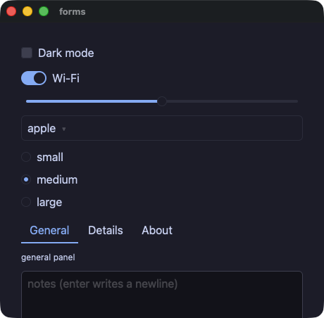

??? note "forms.pl"

    ```perl
    # The controls a person changes: a box, a switch, a track, and the four
    # choosers. Each hands its new value to the sub written on it.
    use Rakugan;

    class Settings {
        use Rakugan;
        field $dark   = false;
        field $wifi   = true;
        field $volume = 5.0;
        field @fruits = ("apple", "banana", "cherry");
        field $fruit  = 0;
        field @sizes  = ("small", "medium", "large");
        field $size   = 1;
        field @tabs   = ("General", "Details", "About");
        field $tab    = 0;
        field $note   = "";

        method panel {
            return text("general panel", size => 12) if $tab == 0;
            return text("details panel", size => 12) if $tab == 1;
            return text("about panel", size => 12);
        }

        method view {
            return column(
                checkbox("Dark mode", checked => $dark,
                         tooltip => "the whole window follows this",
                         on_change => sub ($on) { $dark = $on }),
                switch("Wi-Fi", checked => $wifi, on_change => sub ($on) { $wifi = $on }),
                slider(value => $volume, min => 0, max => 10, step => 1,
                       tooltip => "0 to 10, in whole steps",
                       on_change => sub ($v) { $volume = $v }),
                select(options => \@fruits, selected => $fruit,
                       on_change => sub ($i) { $fruit = $i }),
                radio_group(options => \@sizes, selected => $size,
                            on_change => sub ($i) { $size = $i }),
                tab_bar(labels => \@tabs, active => $tab,
                        on_change => sub ($i) { $tab = $i }),
                $self->panel,
                text_field($note, placeholder => "notes (enter writes a newline)",
                           multiline => true, rows => 3,
                           on_change => sub ($t) { $note = $t }),
                text("dark=$dark  wifi=$wifi  vol=@{[ sprintf('%.1f', $volume) ]}"),
                text("fruit#$fruit  size#$size  tab#$tab"),
                spacing => 10,
                padding => 14,
            );
        }
    }

    run(Settings->new, title => "forms", width => 460, height => 420);
    ```

#### quantities — 文字ではなく数を持つ 2 つの入力欄。enter で確定し、数でない文字は捨てられる
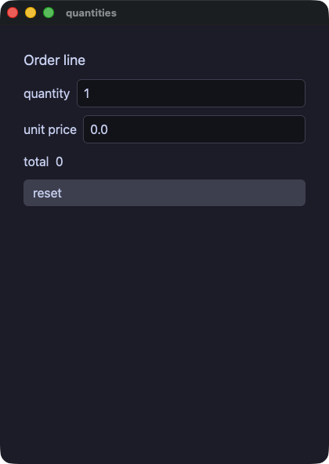

??? note "quantities.pl"

    ```perl
    # The two fields that hold a number rather than text: enter or leaving
    # them commits, text that is not a number is dropped and the shown
    # value returns to what the app holds.
    use Rakugan;

    class Order {
        use Rakugan;
        field $qty   = 1;
        field $price = 0.0;

        method reset {
            $qty = 1;
            $price = 0.0;
        }

        method view {
            return column(
                text("Order line", size => 18),
                row(
                    text("quantity"),
                    int_field($qty, min => 1, max => 99, placeholder => "qty",
                              on_change => sub ($n) { $qty = $n }),
                    spacing => 8,
                ),
                row(
                    text("unit price"),
                    number_field($price, min => 0, max => 1000, step => 0.5,
                                 placeholder => "price",
                                 on_change => sub ($p) { $price = $p }),
                    spacing => 8,
                ),
                text("total  @{[ $qty * $price ]}"),
                button("reset", on_click => sub { $self->reset }),
                spacing => 10,
                padding => 14,
            );
        }
    }

    run(Order->new, title => "quantities");
    ```

#### layout — spacer と divider。続きを端まで押しやる余白と、区切り線
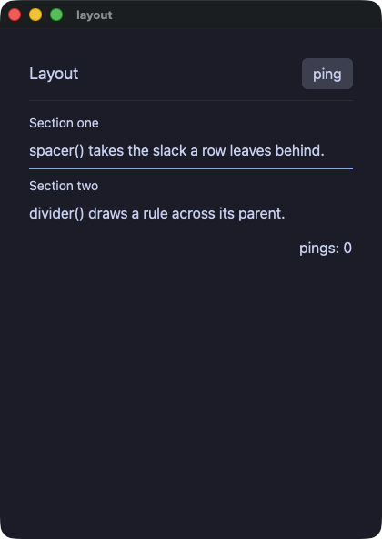

??? note "layout.pl"

    ```perl
    # spacer and divider: a filler and a rule. The header row's spacer
    # pushes "ping" to the far edge; the footer's does the same for the
    # count. divider draws the rules, the second one heavier and colored.
    use Rakugan;

    class Layout {
        use Rakugan;
        field $pings = 0;

        method view {
            column(
                row(
                    text("Layout", size => 18),
                    spacer(),
                    button("ping", on_click => sub { $pings += 1 }),
                ),
                divider(),
                column(
                    text("Section one", size => 14),
                    text("spacer() takes the slack a row leaves behind."),
                    divider(thickness => 2, color => "accent"),
                    text("Section two", size => 14),
                    text("divider() draws a rule across its parent."),
                    spacing => 6,
                ),
                row(
                    spacer(),
                    text("pings: $pings"),
                ),
                spacing => 12,
                padding => 16,
            );
        }
    }

    run(Layout->new, title => "layout");
    ```

#### cards — 名前のついた画面の一部はメソッド。ほかの要素を包むものは、自分の値のあとにそれらを取る
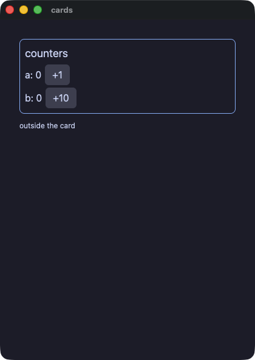

??? note "cards.pl"

    ```perl
    # A piece of screen with a name is a method that answers an element,
    # and one that wraps other elements takes them after its own values.
    use Rakugan;

    class Cards {
        use Rakugan;
        field $a = 0;
        field $b = 0;

        method card :Sig(Str) ($title, @kids) {
            return column(
                text($title, size => 18),
                @kids,
                spacing => 4, padding => 8,
                border_width => 1, border_color => "accent", border_radius => 8,
            );
        }

        method view {
            return column(
                $self->card("counters",
                    row(text("a: $a"),  button("+1",  on_click => sub { $a += 1 }),  spacing => 6),
                    row(text("b: $b"),  button("+10", on_click => sub { $b += 10 }), spacing => 6),
                ),
                text("outside the card", size => 12),
                spacing => 10,
                padding => 16,
            );
        }
    }

    run(Cards->new, title => "cards");
    ```

#### styled — 見た目をひとところに。キーワードのハッシュを要素に渡し、`theme` でパネルを丸ごと切り替える
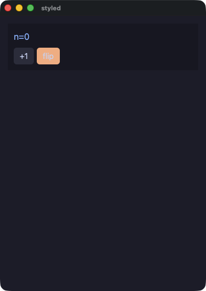

??? note "styled.pl"

    ```perl
    # A look kept in one place: a hash of keywords an app writes once and
    # hands to an element. `theme =>` swaps the palette its subtree resolves
    # colors in, so one keyword flips the whole panel.
    use Rakugan;

    my %CHIP    = (size => 18, color => "accent");
    my %KEY     = (background => "#313244", hover_background => "#45475a");
    my %KEY_HOT = (%KEY, background => "#fab387");

    class Styled {
        use Rakugan;
        field $mode = "dark";
        field $n    = 0;

        method flip {
            $mode = $mode eq "dark" ? "light" : "dark";
        }

        method view {
            column(
                text("n=$n", %CHIP),
                row(
                    button("+1", %KEY, on_click => sub { $n += 1 }),
                    button("flip", %KEY_HOT, on_click => sub { $self->flip }),
                    spacing => 6,
                ),
                spacing => 8, padding => 12, background => "panel", theme => $mode,
            );
        }
    }

    run(Styled->new, title => "styled");
    ```

#### badges — 文字を丸いラベルに。等幅、下線、斜体、省略記号での打ち切り、行数の制限
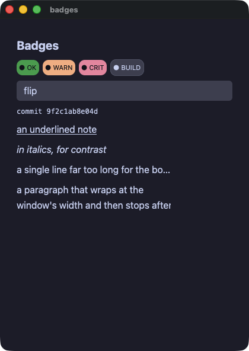

??? note "badges.pl"

    ```perl
    # Text as a pill: a background with padding and a radius. And the rest
    # of what a run of text can be — monospace, underlined, italic, clipped
    # with an ellipsis, or wrapped and then clamped. A bag of keywords an
    # app writes once is a hash at the top of the file.
    use Rakugan;

    my %PILL      = (size => 11, color => "#11111b", padding => 4, border_radius => 10);
    my %PILL_OK   = (%PILL, background => "#2fa84f");
    my %PILL_WARN = (%PILL, background => "#fab387");
    my %PILL_CRIT = (%PILL, background => "#f38ba8");

    class Badges {
        use Rakugan;
        field $tint = "#45475a";
        field $hot  = false;

        method flip {
            $hot = !$hot;
            $tint = $hot ? "#f38ba8" : "#45475a";
        }

        method view {
            column(
                text("Badges", size => 20, bold => true),
                row(
                    text("● OK", %PILL_OK),
                    text("● WARN", %PILL_WARN),
                    text("● CRIT", %PILL_CRIT),
                    text("● BUILD", size => 11, color => "#cdd6f4", background => $tint,
                         padding => 4, border_radius => 10, border_width => 1,
                         border_color => "#585b70"),
                    spacing => 6,
                ),
                button("flip", on_click => sub { $self->flip }),
                text("commit 9f2c1ab8e04d", mono => true, size => 12),
                text("an underlined note", underline => true),
                text("in italics, for contrast", italic => true),
                # An ellipsis needs a bounded box to clip against.
                text("a single line far too long for the box it was given, so it ends in an ellipsis",
                     wrap => "ellipsis", width => 260),
                # The clamp is the other half: this one wraps, then stops.
                text("a paragraph that wraps at the window's width and then stops after two lines, "
                     . "because a clamped label is what a card summary wants",
                     max_lines => 2, width => 260),
                spacing => 8,
                padding => 12,
            );
        }
    }

    run(Badges->new, title => "badges");
    ```

#### panels — 並べる要素と覆う要素。グリッド、重ね、スクロールする面、ウィンドウの上に出る一枚
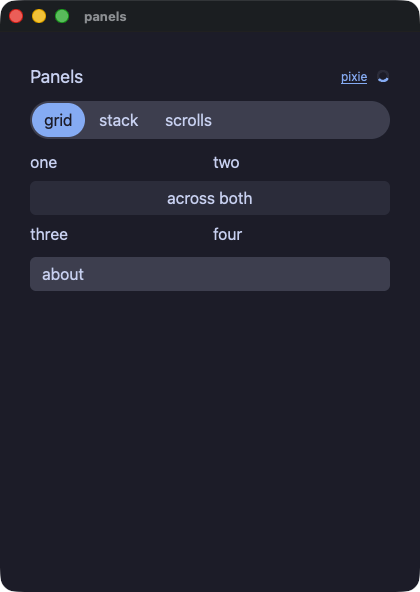

??? note "panels.pl"

    ```perl
    # The elements that arrange or cover: tracks, layers, panes that
    # scroll, and a panel over the rest of the window. A method that
    # answers an element is a piece of the screen with a name.
    use Rakugan;

    class Panels {
        use Rakugan;
        field $open  = false;
        field $shown = 0;
        field @views = ("grid", "stack", "scrolls");

        method tracks {
            return grid(
                text("one"), text("two"),
                grid_cell(text("across both", align => "center", background => "#313244",
                               padding => 4, border_radius => 6), col_span => 2),
                text("three"), text("four"),
                columns => 2, spacing => 6,
            );
        }

        method layers {
            return stack(
                image("demo/assets/postcard.png", width => 180, height => 90),
                text("over the picture", size => 14, color => "#11111b",
                     background => "#f9e2af", padding => 4),
            );
        }

        method scrolls {
            return column(
                scroll_view(
                    column((map { text("line $_") } 1 .. 12), spacing => 2),
                    height => 90,
                ),
                h_scroll_view(
                    row((map { text("col $_", width => 70) } 1 .. 10), spacing => 6),
                ),
                spacing => 8,
            );
        }

        method panel {
            return $self->tracks if $shown == 0;
            return $self->layers if $shown == 1;
            return $self->scrolls;
        }

        method view {
            return stack(
                column(
                    row(
                        text("Panels", size => 18),
                        spacer(),
                        link("pixie", "https://example.invalid", size => 12),
                        spinner(size => 14),
                        spacing => 8,
                    ),
                    segmented(options => \@views, selected => $shown,
                              on_change => sub ($i) { $shown = $i }),
                    $self->panel,
                    button("about", on_click => sub { $open = true }),
                    spacing => 10,
                    padding => 14,
                ),
                modal(
                    column(
                        text("A panel over the rest of it.", size => 14),
                        button("close", on_click => sub { $open = false }),
                        spacing => 8, padding => 12, background => "panel",
                    ),
                    open => $open,
                ),
            );
        }
    }

    run(Panels->new, title => "panels");
    ```

#### dialog — ウィンドウの上に出る一枚を、アプリが開いて閉じる
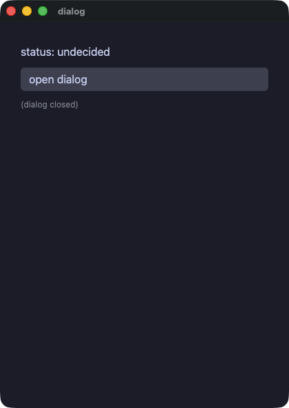

??? note "dialog.pl"

    ```perl
    # A panel over the rest of the window, opened and closed by the app.
    use Rakugan;

    class Dialog {
        use Rakugan;
        field $show   = false;
        field $status = "undecided";

        method decide :Sig(Str) ($answer) {
            $status = $answer;
            $show = false;
        }

        method view {
            my @cells = (
                text("status: $status", size => 16),
                button("open dialog", on_click => sub { $show = true }),
            );
            if ($show) {
                push @cells, modal(
                    column(
                        text("accept the terms?", size => 18),
                        row(
                            button("accept",  on_click => sub { $self->decide("accepted") }),
                            button("decline", on_click => sub { $self->decide("declined") }),
                            spacing => 8,
                        ),
                        spacing => 8, padding => 12, background => "panel",
                    ),
                );
            } else {
                push @cells, text("(dialog closed)", size => 12, color => "#8a8f98");
            }
            return column(@cells, spacing => 10, padding => 14);
        }
    }

    run(Dialog->new, title => "dialog");
    ```

#### labels — 画面読み上げに伝える名前と、ポインタが見せる説明。`role` は値を取るので、行が見出しであるかどうかを切り替えられる
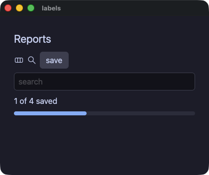

??? note "labels.pl"

    ```perl
    # What a screen reader is told, and what the pointer shows. `role` takes
    # a value, so the summary line is a heading until there is a result
    # under it and then it is not.
    use Rakugan;

    class Labels {
        use Rakugan;
        field $title        = "Reports";
        field $query        = "";
        field $summary_role = "heading";

        method view {
            column(
                text($title, size => 22, role => "heading"),
                row(
                    svg("demo/assets/yokan.svg", width => 20, height => 20, a11y_label => "Yokan"),
                    svg("demo/assets/search.svg", width => 20, height => 20, a11y_label => "Search"),
                    # The one element carrying a tooltip, a role, a name and a tween
                    # at once, which is what pins the order they wrap in.
                    button("save", animate => 150, easing => "out", role => "button",
                           a11y_label => "Save the report", tooltip => "Save this report",
                           on_click => sub { $summary_role = "label" }),
                    spacing => 6, role => "group", a11y_label => "toolbar",
                ),
                text_field($query, placeholder => "search", a11y_label => "search",
                           on_change => sub ($q) { $query = $q }),
                text("1 of 4 saved", role => $summary_role),
                progress(0.4),
                spacing => 8,
                padding => 12,
            );
        }
    }

    run(Labels->new, title => "labels", width => 420, height => 320);
    ```

#### shared — 共通のキーワードを、種類の違う要素それぞれに付けてみる
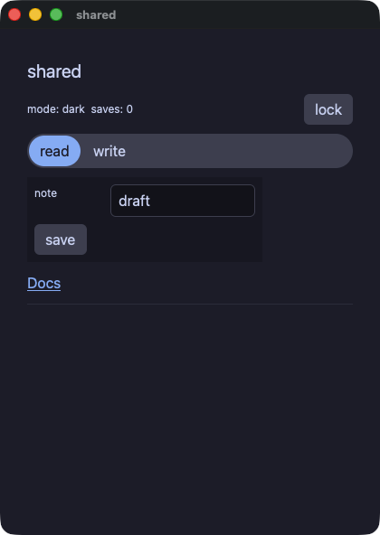

??? note "shared.pl"

    ```perl
    # The keywords every element takes, on elements that have nothing else
    # in common: a theme scope on a spacer, a box around a column, a tween
    # on a chooser, a tooltip on a rule, and the lock that makes a field
    # and a button inert.
    use Rakugan;

    class Locks {
        use Rakugan;
        field $locked = false;
        field $saves  = 0;
        # The palette the spacer's subtree resolves its tokens in — a
        # keyword takes a value, not just a literal, so the lock switches it.
        field $mode   = "dark";
        field $tab    = 0;
        field $note   = "draft";

        method flip {
            $locked = !$locked;
            $mode = $locked ? "light" : "dark";
        }

        method view {
            return column(
                text("shared", size => 20, role => "heading"),
                row(
                    text("mode: $mode  saves: $saves", size => 12),
                    # A theme scope on a spacer: the keyword is the
                    # element's, whichever element it is.
                    spacer(grow => 1, theme => $mode),
                    button("lock", tooltip => "flip the lock", on_click => sub { $self->flip }),
                    spacing => 8,
                ),
                segmented(options => ["read", "write"], selected => $tab,
                          animate => 120, easing => "out",
                          on_change => sub ($i) { $tab = $i }),
                # A box around the section: 260 wide, never under 200.
                column(
                    # The field takes two of the grid's three tracks, and
                    # goes inert with the lock.
                    grid(
                        text("note", size => 12),
                        text_field($note, col_span => 2, disabled => $locked,
                                   on_change => sub ($t) { $note = $t }),
                        columns => 3, spacing => 8,
                    ),
                    button("save", disabled => $locked, tooltip => "count a save",
                           on_click => sub { $saves += 1 }),
                    width => 260, min_width => 200, spacing => 8, padding => 8, background => "panel",
                ),
                link("Docs", "https://i2y.github.io/yokan/", role => "button"),
                divider(tooltip => "the end of the shared properties"),
                spacing => 10,
                padding => 14,
            );
        }
    }

    run(Locks->new, title => "shared");
    ```

#### loading — 満ちていくバーの 3 つの形と、終わりの見えない処理のために行き来する表示
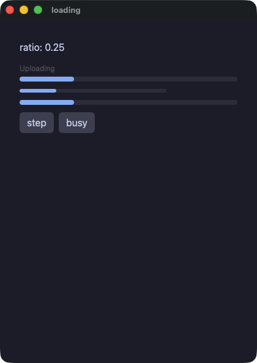

??? note "loading.pl"

    ```perl
    # The bar that fills, in its three forms: with a caption above it, at a
    # size the app chose, and sweeping for work with no known length.
    use Rakugan;

    class Loading {
        use Rakugan;
        field $ratio = 0.25;
        field $busy  = false;

        method step {
            $ratio = $ratio >= 1.0 ? 0.0 : $ratio + 0.25;
        }

        method view {
            return column(
                text("ratio: $ratio"),
                progress($ratio, label => "Uploading"),
                progress($ratio, width => 240, height => 6),
                progress($ratio, indeterminate => $busy),
                row(
                    button("step", on_click => sub { $self->step }),
                    button("busy", on_click => sub { $busy = !$busy }),
                    spacing => 8,
                ),
                spacing => 12,
                padding => 16,
            );
        }
    }

    run(Loading->new, title => "loading");
    ```

#### filter — リストが見せるものを変える選択。行は必要なぶんだけ作られる
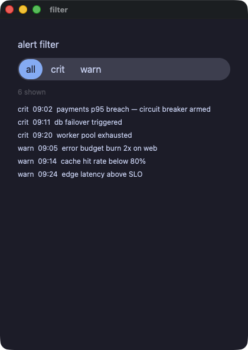

??? note "filter.pl"

    ```perl
    # A chooser that changes what a list shows. The rows are built on
    # demand, so the list is asked only for the ones in view.
    use Rakugan;

    class Alerts {
        use Rakugan;
        field @levels = ("all", "crit", "warn");
        field $level  = 0;
        field @crit = (
            "crit  09:02  payments p95 breach — circuit breaker armed",
            "crit  09:11  db failover triggered",
            "crit  09:20  worker pool exhausted",
        );
        field @warn = (
            "warn  09:05  error budget burn 2x on web",
            "warn  09:14  cache hit rate below 80%",
            "warn  09:24  edge latency above SLO",
        );
        field @visible = empty(Str);

        ADJUST {
            push @visible, $_ for @crit;
            push @visible, $_ for @warn;
        }

        method pick :Sig(Int) ($i) {
            $level = $i;
            @visible = ();
            if ($i == 0) {
                push @visible, $_ for @crit;
                push @visible, $_ for @warn;
            } elsif ($i == 1) {
                push @visible, $_ for @crit;
            } else {
                push @visible, $_ for @warn;
            }
        }

        method alert_row :Sig(Int) ($i) {
            return text($visible[$i], size => 12);
        }

        method view {
            return column(
                text("alert filter", size => 16),
                segmented(options => \@levels, selected => $level,
                          on_change => sub ($i) { $self->pick($i) }),
                text("@{[ scalar @visible ]} shown", size => 12, color => "textDim"),
                list_view(scalar @visible, sub ($i) { $self->alert_row($i) },
                          item_height => 22, height => 150),
                spacing => 10,
                padding => 14,
            );
        }
    }

    run(Alerts->new, title => "filter");
    ```

## リストと表とグラフ

#### table — `data_table` が表そのものを描く。最初の row が見出しで、以降は交互に色の変わるデータ行
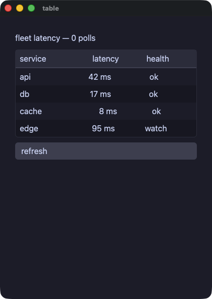

??? note "table.pl"

    ```perl
    # data_table draws the table itself: the first row inside it is the
    # header, every later row is a data row shaded in alternation, and the
    # frame comes with the element. Columns line up because the cells of
    # one column carry the same `grow` share.
    use Rakugan;

    class Fleet {
        use Rakugan;
        field %latency = (api => 42, db => 17, cache => 8, edge => 95);
        field $polls   = 0;

        method refresh {
            $polls += 1;
            $latency{"api"}   = (($latency{"api"}   // 0) * 3 + 29) % 140;
            $latency{"db"}    = (($latency{"db"}    // 0) * 5 + 11) % 140;
            $latency{"cache"} = (($latency{"cache"} // 0) * 7 + 3)  % 140;
            $latency{"edge"}  = (($latency{"edge"}  // 0) * 2 + 47) % 140;
        }

        method health :Sig(Int => Str) ($ms) {
            my $label = "ok";
            $label = "watch" if $ms > 60;
            $label = "slow" if $ms > 100;
            return $label;
        }

        method service_row :Sig(Str) ($name) {
            return row(
                text($name, grow => 2),
                text("@{[ $latency{$name} // 0 ]} ms", grow => 1, align => "right"),
                text($self->health($latency{$name} // 0), grow => 1, align => "center"),
                spacing => 8,
            );
        }

        method view {
            return column(
                text("fleet latency — $polls polls", size => 16),
                data_table(
                    row(
                        text("service", grow => 2),
                        text("latency", grow => 1, align => "right"),
                        text("health",  grow => 1, align => "center"),
                        spacing => 8,
                    ),
                    $self->service_row("api"),
                    $self->service_row("db"),
                    $self->service_row("cache"),
                    $self->service_row("edge"),
                ),
                button("refresh", on_click => sub { $self->refresh }),
                spacing => 10,
                padding => 14,
            );
        }
    }

    run(Fleet->new, title => "table");
    ```

#### roster — 行を必要なぶんだけ作る表。行の選択と見出しでの並べ替えは、アプリ自身が行う
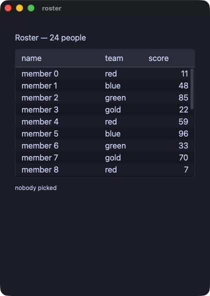

??? note "roster.pl"

    ```perl
    # The table that builds its rows on demand: the sub builds row i as a
    # row of one cell per column, and the header and the rows sit on tracks
    # whose shares are `widths`. Picking a row and sorting a column are the
    # app's own methods.
    use Rakugan;

    class Roster {
        use Rakugan;
        field @teams   = ("red", "blue", "green", "gold");
        field @names   = empty(Str);
        field @team_of = empty(Str);
        field @scores  = empty(Int);
        # What each column is put in order by. A column of text is sorted
        # by a number beside it, because putting two strings in order is
        # not in the dialect yet.
        field @ids     = empty(Int);
        field @team_ix = empty(Int);
        field $sel     = -1;
        field $line    = "";
        field $sorted  = -1;
        field $desc    = false;

        ADJUST {
            for my $i (0 .. 23) {
                push @names, "member $i";
                push @ids, $i;
                push @team_ix, $i % 4;
                push @team_of, $teams[$i % 4];
                push @scores, ($i * 37 + 11) % 100;
            }
        }

        method pick :Sig(Int) ($i) {
            $sel = $i;
            $line = "$names[$i] ($team_of[$i], $scores[$i])";
        }

        # Whether row a belongs before row b, by the column being sorted.
        method before :Sig(Int, Int, Int => Bool) ($col, $a, $b) {
            my $up = true;
            if ($col == 2) {
                $up = $scores[$a] < $scores[$b];
            } elsif ($col == 1) {
                $up = $team_ix[$a] < $team_ix[$b];
            } else {
                $up = $ids[$a] < $ids[$b];
            }
            return $desc ? !$up : $up;
        }

        method swap :Sig(Int, Int) ($a, $b) {
            my $n = $names[$a];
            $names[$a] = $names[$b];
            $names[$b] = $n;
            my $t = $team_of[$a];
            $team_of[$a] = $team_of[$b];
            $team_of[$b] = $t;
            my $s = $scores[$a];
            $scores[$a] = $scores[$b];
            $scores[$b] = $s;
            my $d = $ids[$a];
            $ids[$a] = $ids[$b];
            $ids[$b] = $d;
            my $x = $team_ix[$a];
            $team_ix[$a] = $team_ix[$b];
            $team_ix[$b] = $x;
        }

        method sort_by :Sig(Int) ($col) {
            $desc = $col == $sorted ? !$desc : false;
            $sorted = $col;
            my $i = 1;
            while ($i < scalar @names) {
                my $k = $i;
                while ($k > 0) {
                    if ($self->before($col, $k, $k - 1)) {
                        $self->swap($k, $k - 1);
                        $k -= 1;
                    } else {
                        last;
                    }
                }
                $i += 1;
            }
            $sel = -1;
            $line = "";
        }

        method member :Sig(Int) ($i) {
            return row(
                text($names[$i], grow => 2),
                text($team_of[$i], grow => 1),
                text("$scores[$i]", grow => 1, align => "right"),
            );
        }

        method view {
            return column(
                text("Roster — @{[ scalar @names ]} people", size => 16),
                table(["name", "team", "score"], scalar @names,
                      sub ($i) { $self->member($i) },
                      widths => [2, 1, 1], height => 220,
                      selected => $sel, sort => $sorted, descending => $desc,
                      on_select => sub ($i) { $self->pick($i) },
                      on_sort   => sub ($i) { $self->sort_by($i) }),
                text($line eq "" ? "nobody picked" : $line, size => 12),
                spacing => 10,
                padding => 14,
            );
        }
    }

    run(Roster->new, title => "roster");
    ```

#### csv_viewer — 10 万行を、打ちながら絞り込む。作られるのは画面に入っている行だけ
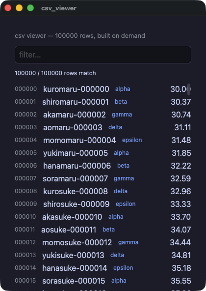

??? note "csv_viewer.pl"

    ```perl
    # A hundred thousand rows, filtered as you type. The list is built on
    # demand: only the rows in the window are ever made, so the filter is
    # the only thing that touches all of them.
    #
    # The numbers are worked out rather than drawn from a generator: the
    # two runs do not share one, and a viewer whose rows cannot be compared
    # would not be worth gating.
    use Rakugan;

    class Viewer {
        use Rakugan;
        field @stems  = ("kuro", "shiro", "aka", "ao", "momo", "yuki", "hana", "sora");
        field @tails  = ("maru", "suke", "chan", "gou", "ta", "emon");
        field @cats   = ("alpha", "beta", "gamma", "delta", "epsilon");
        field @names  = empty(Str);
        field @kind   = empty(Str);
        field @values = empty(Num);
        field @shown  = empty(Int);
        field $q      = "";

        ADJUST {
            for my $i (0 .. 99999) {
                my $stem = $stems[$i % 8];
                my $tail = $tails[int($i / 8) % 6];
                push @names, sprintf("%s%s-%06d", $stem, $tail, $i);
                push @kind, $cats[$i % 5];
                push @values, (($i * 37 % 4000) / 100.0) + 30.0;
                push @shown, $i;
            }
        }

        method filter :Sig(Str) ($text) {
            $q = $text;
            if ($q eq "") {
                @shown = (0 .. 99999);
            } else {
                my $low = lc($q);
                @shown = grep { index(lc($names[$_]), $low) >= 0 || index($kind[$_], $low) >= 0 } 0 .. 99999;
            }
        }

        method line :Sig(Int) ($i) {
            return row(
                text(sprintf("%06d", $i), size => 12, color => "#8a8f98"),
                text($names[$i], grow => 1),
                text($kind[$i], size => 12, color => "#7aa2f7"),
                text(sprintf("%.2f", $values[$i]), align => "right"),
                spacing => 12,
            );
        }

        method view {
            return column(
                text("csv viewer — 100000 rows, built on demand", size => 13, color => "#8a8f98"),
                text_field($q, placeholder => "filter…", on_change => sub ($t) { $self->filter($t) }),
                text("@{[ scalar @shown ]} / 100000 rows match", size => 12),
                list_view(scalar @shown, sub ($k) { $self->line($shown[$k]) },
                          item_height => 26, height => 430),
                spacing => 10,
                padding => 14,
            );
        }
    }

    run(Viewer->new, title => "csv_viewer");
    ```

#### trend — ひとつの数のリストを、2 通りに描く
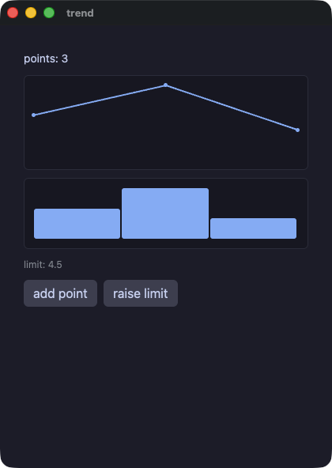

??? note "trend.pl"

    ```perl
    # One list of numbers, drawn twice. A chart takes its data as its first
    # argument, so a view that computes the numbers reads in order.
    use Rakugan;

    class Trend {
        use Rakugan;
        field @values = (3.0, 5.0, 2.0);
        field $limit  = 4.5;

        method bump {
            push @values, 8.0;
        }

        method view {
            return column(
                text("points: @{[ scalar @values ]}", size => 14),
                line_chart(\@values, height => 120),
                bar_chart(\@values, height => 90),
                text("limit: @{[ sprintf('%.1f', $limit) ]}", size => 12, color => "#8a8f98"),
                row(
                    button("add point",   on_click => sub { $self->bump }),
                    button("raise limit", on_click => sub { $limit += 0.5 }),
                    spacing => 8,
                ),
                spacing => 10,
                padding => 14,
            );
        }
    }

    run(Trend->new, title => "trend");
    ```

#### charts — 0 の線より下に伸びる損失、固定した範囲、目盛りと補助線のある軸、色を持つ 2 本の系列
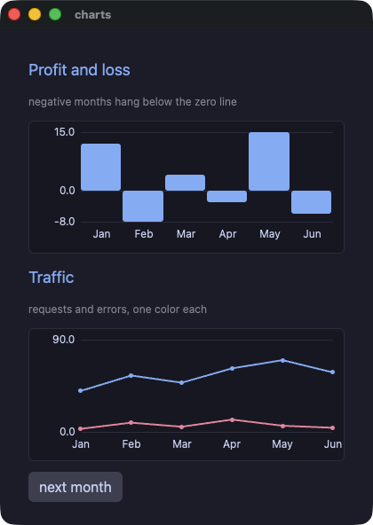

??? note "charts.pl"

    ```perl
    # Charts that can say what they mean: a profit-and-loss bar chart whose
    # losing months hang below the zero line, and a two-series line chart.
    # `min`/`max` both zero take the range from the data; `axis` draws the
    # tick labels and a faint gridline at each; `series` takes one list per
    # line, `colors` one color each.
    use Rakugan;

    my %HEADING = (size => 18, color => "accent");
    my %FAINT   = (size => 12, color => "#8a8f98");

    class Book {
        use Rakugan;
        field @months   = ("Jan", "Feb", "Mar", "Apr", "May", "Jun");
        field @profit   = (12.0, -8.0, 4.0, -3.0, 15.0, -6.0);
        field @requests = (40.0, 55.0, 48.0, 62.0, 70.0, 58.0);
        field @errors   = (3.0, 9.0, 5.0, 12.0, 6.0, 4.0);
        field @traffic  = ([40.0, 55.0, 48.0, 62.0, 70.0, 58.0], [3.0, 9.0, 5.0, 12.0, 6.0, 4.0]);
        field $n        = 6;

        method next_month {
            $n += 1;
            # A month that both runs can agree about, worked out rather
            # than drawn from a generator neither shares.
            push @profit,   ($n * 7 % 41) - 18.0;
            push @months,   "M$n";
            push @requests, ($n * 13 % 50) + 30.0;
            push @errors,   ($n * 5 % 14) + 0.0;
            @traffic = (\@requests, \@errors);
        }

        method view {
            return column(
                text("Profit and loss", %HEADING),
                text("negative months hang below the zero line", %FAINT),
                bar_chart(\@profit, labels => \@months, axis => true, height => 150),
                text("Traffic", %HEADING),
                text("requests and errors, one color each", %FAINT),
                line_chart(series => \@traffic, labels => \@months,
                           colors => ["accent", "#f38ba8"], axis => true, max => 90, height => 150),
                row(button("next month", on_click => sub { $self->next_month }), spacing => 8),
                spacing => 12,
                padding => 16,
            );
        }
    }

    run(Book->new, title => "charts");
    ```

## キャンバス

#### canvas — 仮想的な画素の格子を、命令をひとつずつ並べて塗る。色は配色の番号、キーボードはタイマーから読む
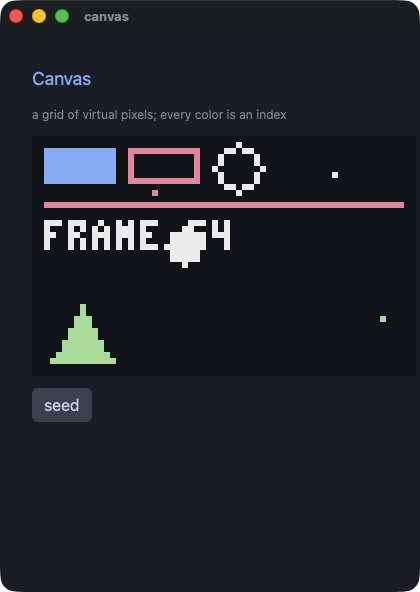

??? note "canvas.pl"

    ```perl
    # A canvas: a grid of virtual pixels, painted command by command.
    #
    # `canvas(width, height, scale => …, background => …, palette => …,
    # paint => sub { … })` opens the grid, and the sub paints it — pixel,
    # line, rect, rect_outline, circle, circle_outline, triangle,
    # triangle_outline, sprite and pixel_text. `scale` says how many
    # logical pixels one virtual pixel takes, so a 64x40 canvas at six is
    # 384x240 on screen.
    #
    # Every color is a NUMBER: the index of a color in `palette`. That is
    # how tools for pixel art work, so drawing written for one moves here
    # with its numbers unchanged.
    #
    # The commands are not elements. Nothing here can be clicked, themed,
    # sized or animated, and a loop inside the canvas is the ordinary loop:
    # what its body paints joins the frame where it stands.
    use Rakugan;

    my %HEADING = (size => 18, color => "accent");
    my %FAINT   = (size => 12, color => "#8a8f98");

    class Blip {
        use Rakugan;
        field $x :param :reader = 0;
        field $y :param :reader = 0;
        field $c :param :reader = 0;
    }

    class Sky {
        use Rakugan;
        # Five colors are enough to show that the index IS the color.
        field @palette = ("#11111b", "#89b4fa", "#f38ba8", "#eeeeee", "#a6e3a1");
        field $frame  = 0;
        field $ball_x = 30;
        field $ball_y = 18;
        field $dx     = 1;
        field $dy     = 1;
        field @blips  = (Blip->new(x => 6, y => 4, c => 1), Blip->new(x => 20, y => 9, c => 2),
                         Blip->new(x => 50, y => 6, c => 3), Blip->new(x => 58, y => 30, c => 4));

        method seed {
            @blips = (Blip->new(x => 6, y => 4, c => 1), Blip->new(x => 20, y => 9, c => 2),
                      Blip->new(x => 50, y => 6, c => 3), Blip->new(x => 58, y => 30, c => 4));
        }

        method tick {
            $frame += 1;
            # The keyboard is read here, in the tick, never in a view.
            # `keys_down` is "held right now", so holding an arrow steers.
            $dx = -1 if keys_down("left");
            $dx = 1 if keys_down("right");
            $dy = -$dy if keys_pressed("space");
            my $x = $ball_x + $dx;
            my $y = $ball_y + $dy;
            if ($x < 4) {
                $x = 4;
                $dx = 1;
            }
            if ($x > 59) {
                $x = 59;
                $dx = -1;
            }
            if ($y < 4) {
                $y = 4;
                $dy = 1;
            }
            if ($y > 35) {
                $y = 35;
                $dy = -1;
            }
            $ball_x = $x;
            $ball_y = $y;
        }

        method view {
            return column(
                text("Canvas", %HEADING),
                text("a grid of virtual pixels; every color is an index", %FAINT),
                canvas(64, 40, scale => 6, background => 0, palette => \@palette, paint => sub {
                    rect(2, 2, 12, 6, 1);
                    rect_outline(16, 2, 12, 6, 2);
                    circle_outline(34, 5, 4, 3);
                    line(2, 11, 61, 11, 2);
                    triangle(3, 37, 8, 28, 13, 37, 4);
                    for my $b (@blips) {
                        pixel($b->x, $b->y, $b->c);
                    }
                    circle($ball_x, $ball_y, 3, 3);
                    pixel_text(2, 14, "FRAME $frame", 3);
                }),
                row(button("seed", on_click => sub { $self->seed }), spacing => 8),
                spacing => 12,
                padding => 16,
            );
        }
    }

    my $app = Sky->new;
    every(0.05, sub { $app->tick });
    run($app, title => "canvas");
    ```

#### jump — Pyxel のジャンプゲームの移植。重力、乗ると落ちる床、果物、それぞれの速さで流れる背景


??? note "jump.pl"

    ```perl
    # Pyxel Jump, ported to Rakugan.
    #
    # The original is `02_jump_game.py` from Pyxel's examples (Takashi
    # Kitao, MIT, https://github.com/kitao/pyxel), and `assets/jump.png` is
    # that example's own image bank written out with Pyxel's palette. The
    # port follows it line by line: `pyxel.blt` becomes `sprite`,
    # `pyxel.btn` becomes `keys_down`, `pyxel.cls(12)` becomes the canvas
    # background, and 12 still means the same color, because inside a
    # canvas a color is an index into the palette this file declares.
    #
    # What is different, and why. The three effects are WAV files rather
    # than the original's chiptune, since the engine plays files; a run
    # under a script is silent, so the gate still compares two silent runs.
    # And the numbers come from arithmetic written here rather than from a
    # generator: two runs do not share one, and a game whose floors land in
    # different places is not one the gate can compare. Everything else is
    # the game.
    #
    # Left and right move; the rest is gravity.
    use Rakugan;
    use List::Util qw(max min);

    class Cloud {
        use Rakugan;
        field $x :param :reader = 0;
        field $y :param :reader = 0;
    }

    class Floor {
        use Rakugan;
        field $x :param :reader = 0;
        field $y :param :reader = 0;
        field $alive :param :reader = true;
    }

    class Fruit {
        use Rakugan;
        field $x :param :reader = 0;
        field $y :param :reader = 0;
        field $kind :param :reader = 0;
        field $alive :param :reader = true;
    }

    class Game {
        use Rakugan;
        use List::Util qw(max min);
        field @palette = ("#000000", "#2b335f", "#7e2072", "#19959c",
                          "#8b4852", "#395c98", "#a9c1ff", "#eeeeee",
                          "#d4186c", "#d38441", "#e9c35b", "#70c6a9",
                          "#7696de", "#a3a3a3", "#ff9798", "#edc7b0");
        field $sheet = "demo/assets/jump.png";
        field $score = 0;
        field $px    = 72;
        field $py    = -16;
        field $dy    = 0;
        field $alive = true;
        field $frame = 0;
        # What the view needs whole: the parallax offsets and which of the
        # two player sprites to cut out.
        field $tree_off = 0;
        field $far_off  = 0;
        field $near_off = 0;
        field $player_u = 0;
        field @far   = (Cloud->new(x => -10, y => 75), Cloud->new(x => 40, y => 65), Cloud->new(x => 90, y => 60));
        field @near  = (Cloud->new(x => 10, y => 25), Cloud->new(x => 70, y => 35), Cloud->new(x => 120, y => 15));
        field @floors = empty(Floor);
        field @fruits = empty(Fruit);

        ADJUST {
            srand(11);
            for my $i (0 .. 3) {
                $self->boot_one($i);
            }
        }

        # perl's own numbers: seeded once, so both runs draw one game.
        method roll :Sig(Int, Int => Int) ($lo, $hi) {
            return $lo + int(rand($hi - $lo + 1));
        }

        method boot_one :Sig(Int) ($i) {
            push @floors, Floor->new(x => $i * 60, y => $self->roll(8, 104), alive => true);
            push @fruits, Fruit->new(x => $i * 60, y => $self->roll(0, 104), kind => $self->roll(0, 2), alive => true);
        }

        method tick {
            $frame += 1;
            $tree_off = $frame % 160;
            $far_off = int($frame / 16) % 160;
            $near_off = int($frame / 8) % 160;
            $self->update_player;
            $self->update_floors;
            $self->update_fruits;
        }

        method update_player {
            $px = max($px - 2, 0) if keys_down("left");
            $px = min($px + 2, 144) if keys_down("right");
            $py += $dy;
            $dy = min($dy + 1, 8);
            $player_u = 0;
            $player_u = 16 if $dy > 0;
            return if $py <= 120;
            audio_play("demo/assets/sound/over.wav", 0.5) if $alive;
            $alive = false;
            return if $py <= 600;
            $score = 0;
            $px = 72;
            $py = -16;
            $dy = 0;
            $alive = true;
        }

        # A floor the player lands on drops away and bounces them. The
        # original edits the tuple in the list; these are built fresh
        # instead, and the bounce a floor writes is what the floors after
        # it see.
        method update_floors {
            my @out = empty(Floor);
            for my $f (@floors) {
                push @out, $self->next_floor($f);
            }
            @floors = @out;
        }

        method next_floor :Sig(Floor => Floor) ($f) {
            my $x = $f->x;
            my $y = $f->y;
            my $alive_now = $f->alive;
            if ($alive_now) {
                if ($px + 16 >= $x && $px <= $x + 40 && $py + 16 >= $y && $py <= $y + 8 && $dy > 0) {
                    $alive_now = false;
                    $score += 10;
                    $dy = -12;
                    audio_play("demo/assets/sound/jump.wav", 0.5);
                }
            } else {
                $y += 6;
            }
            $x -= 4;
            if ($x < -40) {
                $x += 240;
                $y = $self->roll(8, 104);
                $alive_now = true;
            }
            return Floor->new(x => $x, y => $y, alive => $alive_now);
        }

        method update_fruits {
            my @out = empty(Fruit);
            for my $f (@fruits) {
                push @out, $self->next_fruit($f);
            }
            @fruits = @out;
        }

        method next_fruit :Sig(Fruit => Fruit) ($f) {
            my $x = $f->x;
            my $y = $f->y;
            my $kind = $f->kind;
            my $alive_now = $f->alive;
            if ($alive_now && abs($x - $px) < 12 && abs($y - $py) < 12) {
                $alive_now = false;
                $score += ($kind + 1) * 100;
                $dy = min($dy, -8);
                audio_play("demo/assets/sound/pickup.wav", 0.5);
            }
            $x -= 2;
            if ($x < -40) {
                $x += 240;
                $y = $self->roll(0, 104);
                $kind = $self->roll(0, 2);
                $alive_now = true;
            }
            return Fruit->new(x => $x, y => $y, kind => $kind, alive => $alive_now);
        }

        method tree :Sig(Int) ($i) {
            sprite($i * 160 - $tree_off, 104, $sheet, 0, 48, 160, 16, colkey => 12);
        }

        method far_strip :Sig(Int) ($i) {
            for my $c (@far) {
                sprite($c->x + $i * 160 - $far_off, $c->y, $sheet, 64, 32, 32, 8, colkey => 12);
            }
        }

        method near_strip :Sig(Int) ($i) {
            for my $c (@near) {
                sprite($c->x + $i * 160 - $near_off, $c->y, $sheet, 0, 32, 56, 8, colkey => 12);
            }
        }

        method view {
            return column(
                canvas(160, 120, scale => 4, background => 12, palette => \@palette, paint => sub {
                    # sky, mountain, and the trees that scroll fastest
                    sprite(0, 88, $sheet, 0, 88, 160, 32);
                    sprite(0, 88, $sheet, 0, 64, 160, 24, colkey => 12);
                    for my $i (0 .. 1) {
                        $self->tree($i);
                    }
                    # two layers of cloud, each strip drawn twice so it wraps
                    for my $i (0 .. 1) {
                        $self->far_strip($i);
                    }
                    for my $i (0 .. 1) {
                        $self->near_strip($i);
                    }
                    for my $f (@floors) {
                        sprite($f->x, $f->y, $sheet, 0, 16, 40, 8, colkey => 12);
                    }
                    for my $f (@fruits) {
                        if ($f->alive) {
                            sprite($f->x, $f->y, $sheet, 32 + $f->kind * 16, 0, 16, 16, colkey => 12);
                        }
                    }
                    sprite($px, $py, $sheet, $player_u, 0, 16, 16, colkey => 12);
                    pixel_text(5, 4, sprintf("SCORE %4d", $score), 1);
                    pixel_text(4, 4, sprintf("SCORE %4d", $score), 7);
                }),
                spacing => 0,
                padding => 0,
            );
        }
    }

    my $app = Game->new;
    every(0.033, sub { $app->tick });
    run($app, title => "Pyxel Jump", width => 640, height => 480, padding => 0);
    ```

#### shooter — Pyxel のシューティングの移植。場面の切り替え、視差のある星、揺れながら落ちてくる敵、当たり判定と広がる爆発


??? note "shooter.pl"

    ```perl
    # Pyxel Shooter, ported to Rakugan.
    #
    # The original is `shooter.py` from Pyxel's examples (Takashi Kitao,
    # MIT, https://github.com/kitao/pyxel), and `assets/shooter.png` is
    # that example's own image bank written out with Pyxel's palette.
    #
    # What is different, and why. The effects are WAV files rather than the
    # original's chiptune, since the engine plays files; a run under a
    # script is silent, so the gate still compares two silent runs. And the
    # numbers come from arithmetic written here rather than from a
    # generator, because two runs do not share one and a game whose enemies
    # arrive in different places is not one the gate can compare.
    #
    # Arrows move, space fires, enter starts and restarts, q closes.
    use Rakugan;
    use List::Util qw(max min);

    my $WIDTH  = 120;
    my $HEIGHT = 160;

    my $SCENE_TITLE    = 0;
    my $SCENE_PLAY     = 1;
    my $SCENE_GAMEOVER = 2;

    my $STAR_COLOR_HIGH = 12;
    my $STAR_COLOR_LOW  = 5;

    my $PLAYER_WIDTH  = 8;
    my $PLAYER_HEIGHT = 8;
    my $PLAYER_SPEED  = 2;

    my $BULLET_WIDTH  = 2;
    my $BULLET_HEIGHT = 8;
    my $BULLET_COLOR  = 11;
    my $BULLET_SPEED  = 4;

    my $ENEMY_WIDTH  = 8;
    my $ENEMY_HEIGHT = 8;
    # Pyxel's 1.5 px a frame, in tenths.
    my $ENEMY_SPEED = 15;

    my $BLAST_START_RADIUS = 1;
    my $BLAST_END_RADIUS   = 8;
    my $BLAST_COLOR_IN     = 7;
    my $BLAST_COLOR_OUT    = 10;

    class Star {
        use Rakugan;
        # `y` is what the canvas draws; `y10` is where the star really is.
        field $x :param :reader = 0;
        field $y :param :reader = 0;
        field $y10 :param :reader = 0;
        field $speed10 :param :reader = 0;
        field $col :param :reader = 0;
    }

    class Bullet {
        use Rakugan;
        field $x :param :reader = 0;
        field $y :param :reader = 0;
    }

    class Enemy {
        use Rakugan;
        field $x :param :reader = 0;
        field $y :param :reader = 0;
        field $x10 :param :reader = 0;
        field $y10 :param :reader = 0;
        field $flip :param :reader = false;
        field $offset :param :reader = 0;
    }

    class Blast {
        use Rakugan;
        field $x :param :reader = 0;
        field $y :param :reader = 0;
        field $radius :param :reader = 0;
    }

    class Game {
        use Rakugan;
        use List::Util qw(max min);
        # Pyxel's own sixteen colors, which is what makes the numbers in
        # this file mean what they mean in the original.
        field @palette = ("#000000", "#2b335f", "#7e2072", "#19959c",
                          "#8b4852", "#395c98", "#a9c1ff", "#eeeeee",
                          "#d4186c", "#d38441", "#e9c35b", "#70c6a9",
                          "#7696de", "#a3a3a3", "#ff9798", "#edc7b0");
        field $sheet = "demo/assets/shooter.png";
        field $scene = 0;
        field $score = 0;
        field $frame = 0;
        field $title_col = 0;
        field $px = 56;
        field $py = 140;
        field @stars   = empty(Star);
        field @bullets = empty(Bullet);
        field @enemies = empty(Enemy);
        field @blasts  = empty(Blast);
        field @live_enemies = empty(Enemy);
        field @hit_bullets  = empty(Int);
        field $player_struck = false;
        field $enemy_struck  = false;

        ADJUST {
            srand(7);
            for my $i (0 .. 99) {
                $self->boot_star;
            }
        }

        # perl's own numbers: seeded once, so both runs play one game.
        method roll :Sig(Int, Int => Int) ($lo, $hi) {
            return $lo + int(rand($hi - $lo + 1));
        }

        method boot_star {
            my $x = $self->roll(0, $WIDTH - 1);
            my $y = $self->roll(0, $HEIGHT - 1);
            my $speed10 = $self->roll(10, 25);
            my $col = $STAR_COLOR_LOW;
            $col = $STAR_COLOR_HIGH if $speed10 > 18;
            push @stars, Star->new(x => $x, y => $y, y10 => $y * 10, speed10 => $speed10, col => $col);
        }

        method tick {
            quit() if keys_pressed("q");
            $frame += 1;
            $title_col = $frame % 16;
            $self->move_stars;
            if ($scene == $SCENE_TITLE) {
                $scene = $SCENE_PLAY if keys_pressed("enter");
            } elsif ($scene == $SCENE_PLAY) {
                $self->play;
            } else {
                $self->over;
            }
        }

        method move_stars {
            my @out = empty(Star);
            for my $s (@stars) {
                push @out, $self->next_star($s);
            }
            @stars = @out;
        }

        method next_star :Sig(Star => Star) ($s) {
            my $y10 = $s->y10 + $s->speed10;
            $y10 -= $HEIGHT * 10 if $y10 >= $HEIGHT * 10;
            return Star->new(x => $s->x, y => int($y10 / 10), y10 => $y10,
                             speed10 => $s->speed10, col => $s->col);
        }

        method play {
            if ($frame % 6 == 0) {
                my $x = $self->roll(0, $WIDTH - $ENEMY_WIDTH);
                push @enemies, Enemy->new(x => $x, y => 0, x10 => $x * 10, y10 => 0,
                                          flip => false, offset => $self->roll(0, 59));
            }
            $self->collide;
            $self->move_player;
            $self->move_bullets;
            $self->move_enemies;
            $self->move_blasts;
        }

        method over {
            $self->move_bullets;
            $self->move_enemies;
            $self->move_blasts;
            return unless keys_pressed("enter");
            $scene = $SCENE_PLAY;
            $px = 56;
            $py = 140;
            $score = 0;
            @enemies = ();
            @bullets = ();
            @blasts = ();
        }

        method move_player {
            my $x = $px;
            my $y = $py;
            $x -= $PLAYER_SPEED if keys_down("left");
            $x += $PLAYER_SPEED if keys_down("right");
            $y -= $PLAYER_SPEED if keys_down("up");
            $y += $PLAYER_SPEED if keys_down("down");
            $px = min(max($x, 0), $WIDTH - $PLAYER_WIDTH);
            $py = min(max($y, 0), $HEIGHT - $PLAYER_HEIGHT);
            return unless keys_pressed("space");
            push @bullets, Bullet->new(x => $px + 3, y => $py - 4);
            audio_play("demo/assets/sound/shoot.wav", 0.35);
        }

        method move_bullets {
            my @out = empty(Bullet);
            for my $b (@bullets) {
                my $y = $b->y - $BULLET_SPEED;
                push @out, Bullet->new(x => $b->x, y => $y) if $y + $BULLET_HEIGHT - 1 >= 0;
            }
            @bullets = @out;
        }

        method move_enemies {
            my @out = empty(Enemy);
            for my $e (@enemies) {
                my $x10 = $e->x10;
                my $flip = true;
                if (($frame + $e->offset) % 60 < 30) {
                    $x10 += $ENEMY_SPEED;
                    $flip = false;
                } else {
                    $x10 -= $ENEMY_SPEED;
                }
                my $y10 = $e->y10 + $ENEMY_SPEED;
                push @out, Enemy->new(x => int($x10 / 10), y => int($y10 / 10), x10 => $x10, y10 => $y10,
                                      flip => $flip, offset => $e->offset)
                    if $y10 <= ($HEIGHT - 1) * 10;
            }
            @enemies = @out;
        }

        method move_blasts {
            my @out = empty(Blast);
            for my $b (@blasts) {
                my $r = $b->radius + 1;
                push @out, Blast->new(x => $b->x, y => $b->y, radius => $r) if $r <= $BLAST_END_RADIUS;
            }
            @blasts = @out;
        }

        # The two rectangle tests, resolved into new lists. Where the
        # original sets `is_alive = False` and filters afterwards, this
        # keeps the ones that live.
        method collide {
            @live_enemies = ();
            @hit_bullets = ();
            $player_struck = false;
            for my $e (@enemies) {
                $self->resolve($e);
            }
            my @live = empty(Bullet);
            for my $i (0 .. $#bullets) {
                push @live, $bullets[$i] unless $self->was_hit($i);
            }
            @enemies = @live_enemies;
            @bullets = @live;
            $scene = $SCENE_GAMEOVER if $player_struck;
        }

        method was_hit :Sig(Int => Bool) ($i) {
            my $hit = false;
            for my $h (@hit_bullets) {
                $hit = true if $h == $i;
            }
            return $hit;
        }

        method resolve :Sig(Enemy) ($e) {
            $enemy_struck = false;
            for my $i (0 .. $#bullets) {
                if ($self->shot($e, $bullets[$i])) {
                    $enemy_struck = true;
                    push @hit_bullets, $i;
                }
            }
            if ($enemy_struck) {
                push @blasts, Blast->new(x => $e->x + 4, y => $e->y + 4, radius => $BLAST_START_RADIUS);
                $score += 10;
                audio_play("demo/assets/sound/blast.wav", 0.5);
            } elsif ($self->rammed($e)) {
                push @blasts, Blast->new(x => $px + 4, y => $py + 4, radius => $BLAST_START_RADIUS);
                $player_struck = true;
                audio_play("demo/assets/sound/over.wav", 0.6);
            } else {
                push @live_enemies, $e;
            }
        }

        method shot :Sig(Enemy, Bullet => Bool) ($e, $b) {
            return $e->x + $ENEMY_WIDTH > $b->x && $b->x + $BULLET_WIDTH > $e->x
                && $e->y + $ENEMY_HEIGHT > $b->y && $b->y + $BULLET_HEIGHT > $e->y;
        }

        method rammed :Sig(Enemy => Bool) ($e) {
            return $px + $PLAYER_WIDTH > $e->x && $e->x + $ENEMY_WIDTH > $px
                && $py + $PLAYER_HEIGHT > $e->y && $e->y + $ENEMY_HEIGHT > $py;
        }

        method blast_of :Sig(Blast) ($b) {
            circle($b->x, $b->y, $b->radius, $BLAST_COLOR_IN);
            circle_outline($b->x, $b->y, $b->radius, $BLAST_COLOR_OUT);
        }

        method view {
            return column(
                canvas($WIDTH, $HEIGHT, scale => 4, background => 0, palette => \@palette, paint => sub {
                    for my $s (@stars) {
                        pixel($s->x, $s->y, $s->col);
                    }
                    if ($scene == $SCENE_TITLE) {
                        pixel_text(35, 66, "Pyxel Shooter", $title_col);
                        pixel_text(31, 126, "- PRESS ENTER -", 13);
                    } elsif ($scene == $SCENE_PLAY) {
                        sprite($px, $py, $sheet, 0, 0, $PLAYER_WIDTH, $PLAYER_HEIGHT, colkey => 0);
                    } else {
                        pixel_text(43, 66, "GAME OVER", 8);
                        pixel_text(31, 126, "- PRESS ENTER -", 13);
                    }
                    for my $b (@bullets) {
                        rect($b->x, $b->y, $BULLET_WIDTH, $BULLET_HEIGHT, $BULLET_COLOR);
                    }
                    for my $e (@enemies) {
                        sprite($e->x, $e->y, $sheet, 8, 0, $ENEMY_WIDTH, $ENEMY_HEIGHT,
                               colkey => 0, flip_x => $e->flip);
                    }
                    for my $b (@blasts) {
                        $self->blast_of($b);
                    }
                    pixel_text(39, 4, sprintf("SCORE %5d", $score), 7);
                }),
                spacing => 0,
                padding => 0,
            );
        }
    }

    my $app = Game->new;
    every(0.033, sub { $app->tick });
    # `padding => 0`: the canvas IS the app, so it paints to the window's
    # edge rather than sitting inside the engine's ring.
    run($app, title => "Pyxel Shooter", width => 480, height => 640, padding => 0);
    ```

## Perl とファイルとデータ

#### stdlib — Perl 自身のものをゲートにかける。`sprintf`、`sort`、`grep`、`map`、`List::Util`、`POSIX`、正規表現
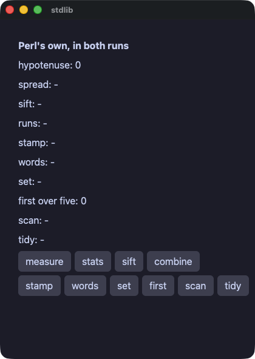

??? note "stdlib.pl"

    ```perl
    # Perl's own, under the gate.
    #
    # Nothing here is Rakugan's. `length`, `substr`, `uc`, `sort`, `grep`,
    # `map`, `sprintf`, `List::Util` and `POSIX` are the language's, and
    # what the gate says is that the two runs answer the same. Where the
    # name is Perl's, perl's own output is the specification: every one of
    # these is held to a table that perl printed.
    use Rakugan;
    use List::Util qw(sum max min first uniq);
    use POSIX qw(floor ceil fmod strftime);

    class Stdlib {
        use Rakugan;
        use List::Util qw(sum max min first uniq);
        use POSIX qw(floor ceil fmod strftime);

        field $hyp    = 0.0;
        field $spread = "-";
        field $sift   = "-";
        field $runs   = "-";
        field $stamp  = "-";
        field $words  = "-";
        field $unique = "-";
        field $picked = 0;
        field $found  = "-";
        field $tidy   = "-";
        field @scores = (3, 5, 8, 13, 21);
        field @votes  = ("ivy", "momo", "ivy", "ada", "momo", "ivy", "ada");

        method measure {
            $hyp = sqrt(3.0 * 3.0 + 4.0 * 4.0);
        }

        method stats {
            my @sorted = sort { $a <=> $b } @scores;
            my $mean = sum(@scores) / scalar @scores;
            my $median = $sorted[int(scalar(@sorted) / 2)];
            $spread = sprintf("mean %.1f median %d min %d max %d",
                              $mean, $median, min(@scores), max(@scores));
        }

        method sift_scores {
            my @big   = grep { $_ > 5 } @scores;
            my @small = grep { $_ <= 5 } @scores;
            my @big_text   = map { "$_" } @big;
            my @small_text = map { "$_" } @small;
            $sift = "big " . join(",", @big_text) . " small " . join(",", @small_text);
        }

        method combine {
            my @doubled = map { $_ * 2 } @scores;
            my @text = map { "$_" } @doubled;
            my $down = floor(2.7);
            my $up   = ceil(2.1);
            $runs = "doubled @{[ join(\",\", @text) ]} floor $down ceil $up";
        }

        # `%A`, `%a`, `%B` and `%b` are the locale's answer rather than the
        # format's: perl reads LC_TIME, and so does the twin. They are here
        # so the gate has something to compare them on — a twin that said
        # Thursday where perl said 木曜日 passed every sweep there was,
        # because nothing an app could run reached those four directives.
        method take_stamp {
            $stamp = strftime("%A %a %d %B %b %Y %H:%M:%S UTC", gmtime(1700000000));
        }

        method capitalize {
            my $line = "  the quick brown fox  ";
            my @parts = split(' ', $line);
            my @caps = map { ucfirst($_) } @parts;
            my $trimmed = substr($line, 2, length($line) - 4);
            my $n = length($trimmed);
            $words = join("-", @caps) . " ($n)";
        }

        method distinct {
            my @names = sort { $a cmp $b } uniq(@votes);
            $unique = join(",", @names);
        }

        method find {
            $picked = (first { $_ > 5 } @scores) // -1;
        }

        # Regular expressions. perl's own engine cannot be lifted out of
        # the interpreter, so the compiled run runs one whose syntax and
        # semantics were designed to be Perl's, and a table perl printed
        # says where the two agree.
        method scan {
            my $line = "a1b22c333";
            my @numbers = ($line =~ /(\d+)/g);
            my @widths = map { length($_) } @numbers;
            my $total = sum(@widths);
            my $first = "-";
            if ($line =~ /(?<head>[a-z])(\d+)/) {
                $first = "$+{head}=$2";
            }
            $found = join("+", @numbers) . " digits=$total first=$first";
        }

        method tidy_up {
            my $messy = "  one,two ,  three  ";
            my $clean = $messy =~ s/\s+//gr;
            my @parts = split /,/, $clean;
            my $n = scalar @parts;
            $tidy = join(" | ", @parts) . " ($n parts)";
        }

        method view {
            return column(
                text("Perl's own, in both runs", size => 16, bold => true),
                text("hypotenuse: $hyp"),
                text("spread: $spread"),
                text("sift: $sift"),
                text("runs: $runs"),
                text("stamp: $stamp"),
                text("words: $words"),
                text("set: $unique"),
                text("first over five: $picked"),
                text("scan: $found"),
                text("tidy: $tidy"),
                row(
                    button("measure", on_click => sub { $self->measure }),
                    button("stats",   on_click => sub { $self->stats }),
                    button("sift",    on_click => sub { $self->sift_scores }),
                    button("combine", on_click => sub { $self->combine }),
                    spacing => 6,
                ),
                row(
                    button("stamp",  on_click => sub { $self->take_stamp }),
                    button("words",  on_click => sub { $self->capitalize }),
                    button("set",    on_click => sub { $self->distinct }),
                    button("first",  on_click => sub { $self->find }),
                    button("scan",   on_click => sub { $self->scan }),
                    button("tidy",   on_click => sub { $self->tidy_up }),
                    spacing => 6,
                ),
                spacing => 6,
                padding => 14,
            );
        }
    }

    run(Stdlib->new, title => "stdlib");
    ```

#### files — フレームワークのライブラリでファイルを扱う。一つの実装が両方の実行に答える
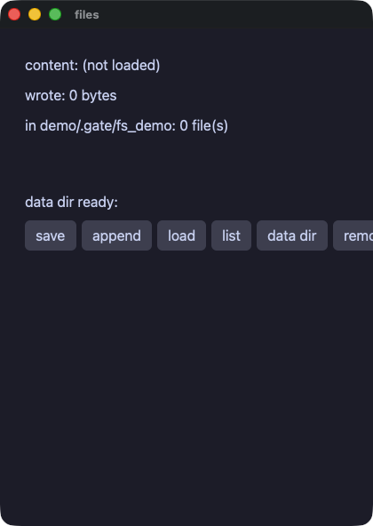

??? note "files.pl"

    ```perl
    # Files, through the framework's own standard library. One
    # implementation answers both runs: the compiled one links it through
    # pixie's binding door, and the interpreted one reaches the same Rust
    # through the engine's C face — so what the gate compares is one
    # library answering twice, not two libraries agreeing.
    use Rakugan;

    class Files {
        use Rakugan;
        field $dir     = "demo/.gate/fs_demo";
        field $note    = "demo/.gate/fs_demo/note.txt";
        field $content = "(not loaded)";
        field $wrote   = 0;
        field @names   = empty(Str);
        field $ready   = false;

        method save {
            fs_make_dir($dir);
            $wrote = fs_write_text($note, "hello from one standard library");
        }

        method add_line {
            fs_append_text($note, " (and again)");
        }

        method listing {
            @names = fs_list_dir($dir);
        }

        method clean {
            fs_remove($note) if fs_exists($note);
            $self->listing;
        }

        # A place of the app's own, made on the way out. A demo has no
        # business in someone's home directory, so this one keeps to the
        # directory the gate already writes in.
        method data_dir {
            my $path = "demo/.gate/fs_demo_app";
            fs_make_dir($path);
            $ready = fs_exists($path);
        }

        method entry :Sig(Int) ($i) {
            return text($names[$i]);
        }

        method view {
            return column(
                text("content: $content"),
                text("wrote: $wrote bytes"),
                text("in $dir: @{[ scalar @names ]} file(s)"),
                list_view(scalar @names, sub ($i) { $self->entry($i) },
                          item_height => 20, height => 44),
                text("data dir ready: $ready"),
                row(
                    button("save",     on_click => sub { $self->save }),
                    button("append",   on_click => sub { $self->add_line }),
                    button("load",     on_click => sub { $content = fs_read_text($note) }),
                    button("list",     on_click => sub { $self->listing }),
                    button("data dir", on_click => sub { $self->data_dir }),
                    button("remove",   on_click => sub { $self->clean }),
                    spacing => 6,
                ),
                spacing => 8,
                padding => 12,
            );
        }
    }

    run(Files->new, title => "files");
    ```

#### reader — 入れ子の JSON をドットパスで読む。ファイルに書いて読み直すので、両方の実行が同じバイト列を読む
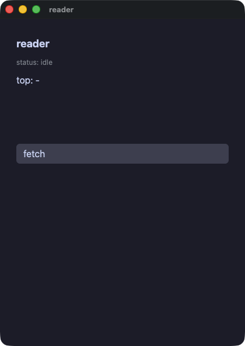

??? note "reader.pl"

    ```perl
    # A document read and shown: nested JSON, reached by path.
    #
    # Wakakusa's copy of this demo serves the document to itself over a
    # socket. A shipped Rakugan app has no perl in it, so it has no way to
    # run a server written in Perl — the document is written to a file and
    # read back instead, which is the same claim about the same JSON reader
    # and one the gate can make without a network.
    use Rakugan;

    class Reader {
        use Rakugan;
        field $path   = "demo/.gate/feed.json";
        field $status = "idle";
        field @titles = empty(Str);
        field $top    = "-";

        method write_feed {
            fs_write_text($path,
                '{"items": ['
                . '{"title": "rakugan ships native perl apps", "points": 128},'
                . '{"title": "one engine, three doors", "points": 64},'
                . '{"title": "the gate arbitrates", "points": 256}'
                . ']}');
        }

        method read_feed {
            $self->write_feed;
            my $src = fs_read_text($path);
            my $n = jsondoc_length($src, "items");
            @titles = ();
            my $best = -1;
            my $name = "-";
            for my $i (0 .. $n - 1) {
                my $title = jsondoc_get_text($src, "items.$i.title");
                my $points = jsondoc_get_int($src, "items.$i.points");
                push @titles, $title;
                if ($points > $best) {
                    $best = $points;
                    $name = $title;
                }
            }
            $top = "$name ($best)";
            $status = "read $n items";
        }

        method line :Sig(Int) ($i) {
            return text($titles[$i], size => 13);
        }

        method view {
            return column(
                text("reader", size => 18, bold => true),
                text("status: $status", size => 12, color => "#8a8f98"),
                text("top: $top"),
                list_view(scalar @titles, sub ($i) { $self->line($i) },
                          item_height => 22, height => 80),
                button("fetch", on_click => sub { $self->read_feed }),
                spacing => 8,
                padding => 12,
            );
        }
    }

    run(Reader->new, title => "reader");
    ```

#### dbnotes — エンジン越しに触るデータベース。値は文に埋め込まず、束縛して渡す
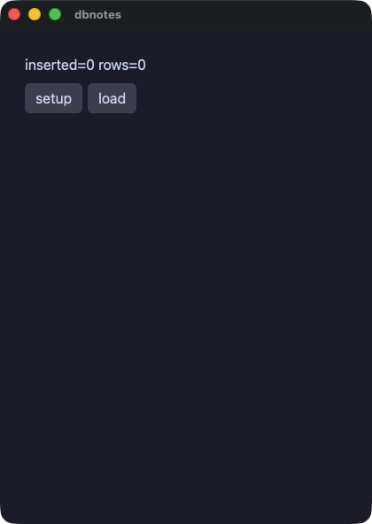

??? note "dbnotes.pl"

    ```perl
    # A database, reached through the framework's own library so that both
    # runs call one implementation. Write `?` in the statement and put the
    # values beside it, and text a person typed can never become part of
    # the statement.
    use Rakugan;

    class Notes {
        use Rakugan;
        field $db      = "demo/.gate/notes.db";
        field $changed = 0;
        field @rows    = empty(Str);

        method setup {
            sqlite_exec($db, "CREATE TABLE IF NOT EXISTS notes(t TEXT)");
            sqlite_exec($db, "DELETE FROM notes");
            $changed = sqlite_exec($db, "INSERT INTO notes VALUES ('alpha'),('beta'),('gamma')");
        }

        method load {
            @rows = sqlite_query_text($db, "SELECT t FROM notes ORDER BY t");
        }

        method note_row :Sig(Int) ($i) {
            return text($rows[$i]);
        }

        method view {
            return column(
                text("inserted=$changed rows=@{[ scalar @rows ]}"),
                row(
                    button("setup", on_click => sub { $self->setup }),
                    button("load",  on_click => sub { $self->load }),
                    spacing => 6,
                ),
                list_view(scalar @rows, sub ($i) { $self->note_row($i) },
                          item_height => 22, height => 120),
                spacing => 8,
                padding => 12,
            );
        }
    }

    run(Notes->new, title => "dbnotes");
    ```

#### ledger — sqlite に置いた家計簿。o'brien という品目はアポストロフィであって、SQL の一部にはならない


??? note "ledger.pl"

    ```perl
    # Money kept in a database, with the values bound rather than spliced:
    # an item called o'brien is an apostrophe and never a piece of SQL.
    use Rakugan;

    my %HEADING = (size => 20, color => "accent");
    my %FAINT   = (size => 12, color => "#8a8f98");

    class Ledger {
        use Rakugan;
        field $db      = "demo/.gate/ledger.db";
        field $name    = "";
        field $amount  = "";
        field $count   = 0;
        field $grand   = 0;
        field $food    = 0;
        field $transit = 0;
        field $fun     = 0;
        field @rows    = empty(Str);
        field @totals  = (0.0, 0.0, 0.0);

        ADJUST {
            $self->load;
        }

        method reset {
            sqlite_exec($db, "CREATE TABLE IF NOT EXISTS expenses(name TEXT, amount INTEGER, cat TEXT)");
            sqlite_exec($db, "DELETE FROM expenses");
            $self->load;
        }

        method add :Sig(Str) ($cat) {
            my $yen = int(0 + $amount);
            return if $yen <= 0;
            sqlite_exec($db, "INSERT INTO expenses VALUES (?, ?, ?)", [$name, "$yen", $cat]);
            $self->load;
        }

        method one_number :Sig(Str, Str => Int) ($sql, $cat) {
            return sqlite_query_int_or($db, $sql, 0, [$cat]);
        }

        method load {
            $count = sqlite_query_int_or($db, "SELECT COUNT(*) FROM expenses", 0);
            $grand = sqlite_query_int_or($db, "SELECT COALESCE(SUM(amount),0) FROM expenses", 0);
            my $by = "SELECT COALESCE(SUM(amount),0) FROM expenses WHERE cat=?";
            $food    = $self->one_number($by, "food");
            $transit = $self->one_number($by, "transit");
            $fun     = $self->one_number($by, "fun");
            @totals = ($food + 0.0, $transit + 0.0, $fun + 0.0);
            # whole rows, every column as text: the line is written here
            # rather than assembled in SQL
            my @found = sqlite_query_rows_or($db, "SELECT name, amount, cat FROM expenses ORDER BY rowid");
            @rows = map { "$_->[0]  ¥$_->[1]  ($_->[2])" } @found;
        }

        method entry_row :Sig(Int) ($i) {
            return text($rows[$i]);
        }

        method view {
            return column(
                text("ledger", %HEADING),
                row(
                    text_field($name, placeholder => "item", on_change => sub ($t) { $name = $t }),
                    text_field($amount, placeholder => "yen", on_change => sub ($t) { $amount = $t }),
                    spacing => 6,
                ),
                row(
                    button("food",    on_click => sub { $self->add("food") }),
                    button("transit", on_click => sub { $self->add("transit") }),
                    button("fun",     on_click => sub { $self->add("fun") }),
                    button("reset",   on_click => sub { $self->reset }),
                    spacing => 6,
                ),
                text("$count entries, ¥$grand in all", %FAINT),
                text("food ¥$food · transit ¥$transit · fun ¥$fun", %FAINT),
                bar_chart(\@totals, labels => ["food", "transit", "fun"], axis => true, height => 90),
                list_view(scalar @rows, sub ($i) { $self->entry_row($i) },
                          item_height => 22, height => 120),
                spacing => 10, padding => 14, background => "panel",
            );
        }
    }

    run(Ledger->new, title => "ledger");
    ```

#### edges — 端の話。リストの終わりを越えた添字と、64 ビットをはるかに超えた数
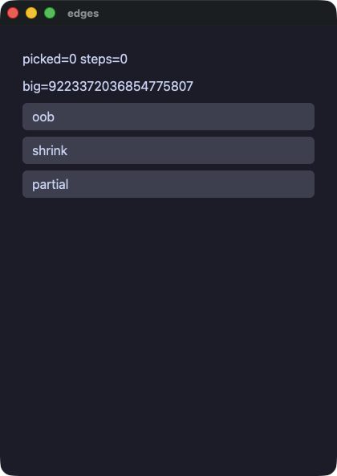

??? note "edges.pl"

    ```perl
    # The edges: an index past the end of a list, and a number far past
    # what a machine word holds that keeps growing. Both runs have to
    # answer the same, and this is the demo that says so.
    #
    # The number is the largest whole one the dialect holds. Past that,
    # perl grows a whole number into one with a fraction and the compiled
    # run has 64 bits and nowhere to grow, so a literal past the edge is
    # refused by name rather than quietly wrapping.
    use Rakugan;

    class Edges {
        use Rakugan;
        field @xs     = (7);
        field $picked = 0;
        field $big    = 9223372036854775807;
        field $steps  = 0;

        method partial {
            $steps += 1;
            $picked = $xs[9] // -1;
        }

        method view {
            return column(
                text("picked=$picked steps=$steps"),
                text("big=$big"),
                button("oob",     on_click => sub { $picked = $xs[5] // -1 }),
                button("shrink",  on_click => sub { $big = $big - 1 }),
                button("partial", on_click => sub { $self->partial }),
                spacing => 8,
                padding => 12,
            );
        }
    }

    run(Edges->new, title => "edges");
    ```

#### flow — ハンドラの中の制御構造。飛ばすループ、止まるループ、while、値を返すメソッド
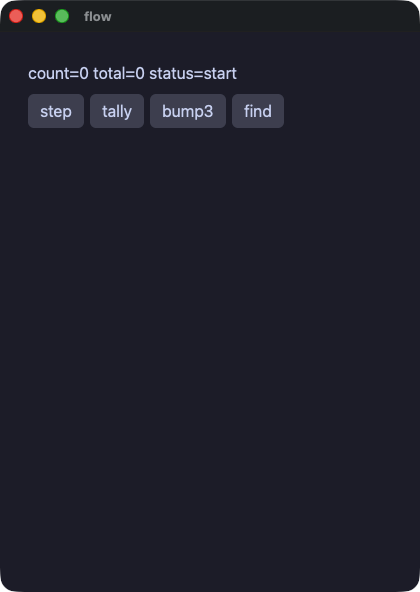

??? note "flow.pl"

    ```perl
    # Control flow in the handlers: a loop that skips, a loop that stops, a
    # while, and a method that answers a value. Both runs do the same
    # thing, which is what the gate compares.
    use Rakugan;

    class Flow {
        use Rakugan;
        field $count  = 0;
        field $total  = 0;
        field $status = "start";

        method double :Sig(Int => Int) ($v) {
            return $v * 2;
        }

        method step {
            $count += 1;
            if ($count > 3 && $count < 100) {
                $status = "big";
            } elsif ($count == 3) {
                $status = "three";
            } else {
                $status = "small";
            }
        }

        method tally {
            $total = 0;
            for my $i (1 .. 5) {
                next if $i == 3;
                $total += $self->double($i);
            }
        }

        method bump3 {
            $status = "working";
            while ($count < 3) {
                $count += 1;
            }
            $status = "done";
        }

        method find {
            for my $i (0 .. 9) {
                if ($i * $i > 10) {
                    $count = $i;
                    last;
                }
            }
        }

        method view {
            return column(
                text("count=$count total=$total status=$status"),
                row(
                    button("step",  on_click => sub { $self->step }),
                    button("tally", on_click => sub { $self->tally }),
                    button("bump3", on_click => sub { $self->bump3 }),
                    button("find",  on_click => sub { $self->find }),
                    spacing => 6,
                ),
                spacing => 8,
                padding => 12,
            );
        }
    }

    run(Flow->new, title => "flow");
    ```

## ウィンドウまわり

#### keys — キーの組み合わせにハンドラを結び付け、同じものをメニューバーにも置く。`key:cmd+s` と `menu:Save` で動かせる
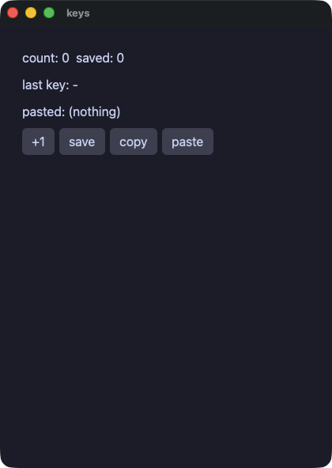

??? note "keys.pl"

    ```perl
    # The keyboard as a set of chords, and the same handlers in the
    # application's menu bar. A script presses one with `key:cmd+s` and
    # picks one with `menu:Save`.
    use Rakugan;

    class Keys {
        use Rakugan;
        field $count  = 0;
        field $saved  = 0;
        field $last   = "-";
        field $pasted = "(nothing)";

        method save {
            $saved = $count;
        }

        method clear {
            $count = 0;
            $saved = 0;
        }

        method copy_count {
            clipboard_set_text("count=$count");
        }

        method paste {
            $pasted = clipboard_get_text();
        }

        method typed :Sig(Str) ($key) {
            $last = $key;
        }

        method view {
            return column(
                text("count: $count  saved: $saved"),
                text("last key: $last"),
                text("pasted: $pasted"),
                row(
                    button("+1",    on_click => sub { $count += 1 }),
                    button("save",  on_click => sub { $self->save }),
                    button("copy",  on_click => sub { $self->copy_count }),
                    button("paste", on_click => sub { $self->paste }),
                    spacing => 6,
                ),
                spacing => 8,
                padding => 12,
            );
        }
    }

    my $app = Keys->new;

    menu_item("Count", "Save",  sub { $app->save });
    menu_item("Count", "Clear", sub { $app->clear });

    shortcut("cmd+s",        sub { $app->save });
    shortcut("cmd+shift+r",  sub { $app->clear });
    shortcut("cmd+shift+c",  sub { $app->copy_count });
    shortcut("cmd+shift+v",  sub { $app->paste });
    on_key(sub ($chord) { $app->typed($chord) });

    run($app, title => "keys");
    ```

#### picker — OS 自身のファイル選択と、ウィンドウへ落とされたファイル。選択は人を待つので、ウィンドウのスレッドの外で頼む
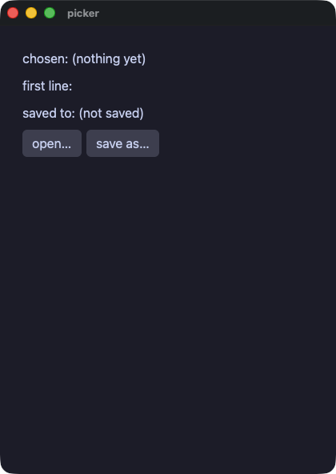

??? note "picker.pl"

    ```perl
    # The platform's own panels, and a file dragged onto the window. A
    # dialog waits for a person, so it is asked for off the window's
    # thread; a script answers one with `file:<path>` and drops one with
    # `drop:<path>`.
    use Rakugan;

    class Picker {
        use Rakugan;
        field $chosen = "(nothing yet)";
        field $body   = "";
        field $saved  = "(not saved)";

        method took :Sig(Str) ($path) {
            $chosen = $path;
            $body = fs_read_text_or($path, "(unreadable)") if $path ne "";
        }

        method open_one {
            task(sub { fs_open_dialog("Choose a file") },
                 on_done => sub ($path) { $self->took($path) });
        }

        method save_as {
            task(sub { fs_save_dialog("notes.txt") },
                 on_done => sub ($path) {
                     if ($path ne "") {
                         fs_write_text($path, $body);
                         $saved = $path;
                     }
                 });
        }

        method view {
            return column(
                text("chosen: $chosen"),
                text("first line: @{[ substr($body, 0, 40) ]}"),
                text("saved to: $saved"),
                row(
                    button("open…", tooltip => "the platform's own panel",
                           on_click => sub { $self->open_one }),
                    button("save as…", on_click => sub { $self->save_as }),
                    spacing => 6,
                ),
                spacing => 8,
                padding => 12,
            );
        }
    }

    my $app = Picker->new;
    on_file_drop(sub ($path) { $app->took($path) });
    run($app, title => "picker");
    ```

#### about — ページを開くリンクと、システムのクリップボード
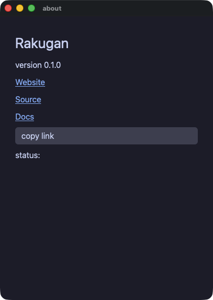

??? note "about.pl"

    ```perl
    # Links that open a page, and the system clipboard.
    use Rakugan;

    class About {
        use Rakugan;
        field $status = "";

        method view {
            return column(
                text("Rakugan", size => 28),
                text("version 0.1.0"),
                link("Website", "https://i2y.github.io/yokan/"),
                link("Source", "https://github.com/i2y/yokan"),
                link("Docs", "https://i2y.github.io/yokan/tour/"),
                button("copy link", on_click => sub {
                    clipboard_set_text("https://github.com/i2y/yokan");
                    $status = "copied";
                }),
                text("status: $status"),
                spacing => 8,
                padding => 14,
            );
        }
    }

    run(About->new, title => "about");
    ```

#### sound — ハンドラから WAV ファイルを鳴らす。スクリプトの下では無音になるので、ゲートが突き合わせるのは画面だけ
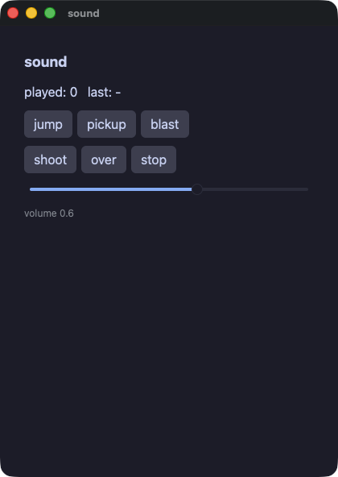

??? note "sound.pl"

    ```perl
    # Sound. A WAV file is played and the call answers at once, so a handler
    # that starts one carries on.
    #
    # A run under a script is silent: a gate must not need a machine with
    # speakers, and both runs read that one flag through the same library,
    # so neither is louder than the other. That is why this demo can be
    # gated at all — the screen is what the two runs compare.
    use Rakugan;

    class Sound {
        use Rakugan;
        field $played = 0;
        field $last   = "-";
        field $volume = 0.6;

        method play :Sig(Str) ($name) {
            audio_play("demo/assets/sound/$name.wav", $volume);
            $played += 1;
            $last = $name;
        }

        method hush {
            audio_stop();
            $last = "stopped";
        }

        method view {
            return column(
                text("sound", size => 18, bold => true),
                text("played: $played   last: $last"),
                row(
                    button("jump",   on_click => sub { $self->play("jump") }),
                    button("pickup", on_click => sub { $self->play("pickup") }),
                    button("blast",  on_click => sub { $self->play("blast") }),
                    spacing => 6,
                ),
                row(
                    button("shoot", on_click => sub { $self->play("shoot") }),
                    button("over",  on_click => sub { $self->play("over") }),
                    button("stop",  on_click => sub { $self->hush }),
                    spacing => 6,
                ),
                slider(value => $volume, min => 0, max => 1, step => 0.1,
                       on_change => sub ($v) { $volume = $v }),
                text("volume @{[ sprintf('%.1f', $volume) ]}", size => 12, color => "#8a8f98"),
                spacing => 10,
                padding => 14,
            );
        }
    }

    run(Sound->new, title => "sound");
    ```

## タイマーとタスク

#### dashboard — アプリを走らせる前に宣言するタイマー。両方の実行で同じだけ時を刻む（ゲートは `advance:` で進める）
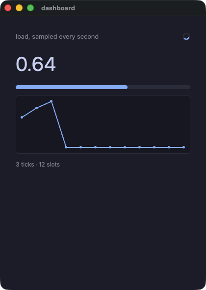

??? note "dashboard.pl"

    ```perl
    # A timer: declared before the app runs, told every second. Both runs
    # tick off the same clock — a frame in a window, an `advance:` in a
    # script — so the same number of ticks lands in both.
    #
    # The step is worked out rather than drawn from a generator: the two
    # runs draw on different ones, and a dashboard that cannot be compared
    # is not worth gating.
    use Rakugan;

    class Dashboard {
        use Rakugan;
        field @hist = (0.0, 0.0, 0.0, 0.0, 0.0, 0.0, 0.0, 0.0, 0.0, 0.0, 0.0, 0.0);
        field $at    = 0;
        field $ticks = 0;
        field $cur   = 0.25;

        method tick {
            $ticks += 1;
            my $step = (($ticks * 37 % 41) / 100.0) - 0.2;
            my $v = $cur + $step;
            $v = 0.0 if $v < 0.0;
            $v = 1.0 if $v > 1.0;
            $cur = $v;
            $hist[$at] = $v;
            $at = ($at + 1) % 12;
        }

        method view {
            return column(
                row(
                    text("load, sampled every second", size => 13, color => "#8a8f98", grow => 1),
                    spinner(size => 16),
                    spacing => 8,
                ),
                text("@{[ sprintf('%.2f', $cur) ]}", size => 40),
                progress($cur),
                line_chart(\@hist, height => 120),
                text("$ticks ticks · 12 slots", size => 12, color => "#8a8f98"),
                spacing => 12,
                padding => 16,
            );
        }
    }

    my $app = Dashboard->new;
    every(1.0, sub { $app->tick });
    run($app, title => "dashboard");
    ```

#### tasks — 時間のかかる処理をウィンドウのスレッドの外へ。答えは `on_done` で受け取る
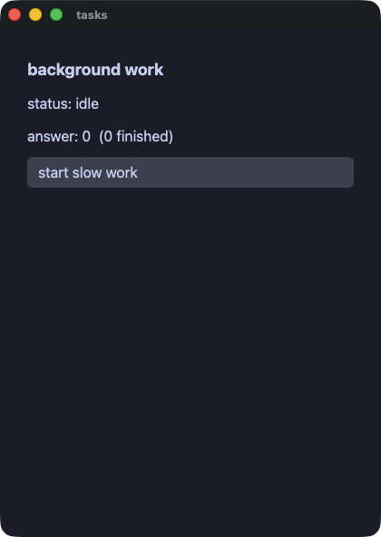

??? note "tasks.pl"

    ```perl
    # Work that takes a while, done off the window's thread. `task` runs
    # the sub on a thread of perl's own; when it answers, `on_done` is
    # called on the window's thread with the answer.
    #
    # Nothing inside the work touches the app's state or the screen. That
    # is the whole rule, and it is why the answer comes back as a value
    # rather than the work writing it anywhere.
    use Rakugan;

    class Jobs {
        use Rakugan;
        field $status = "idle";
        field $answer = 0;
        field $done   = 0;

        method start {
            $status = "working";
            task(sub {
                # deliberately slow, and deliberately arithmetic: both runs
                # have to agree about what it answers.
                my $total = 0;
                my $i = 0;
                while ($i < 300000) {
                    $total += $i % 7;
                    $i += 1;
                }
                $total;
            }, on_done => sub ($v) {
                $answer = $v;
                $done += 1;
                $status = "done";
            });
        }

        method view {
            return column(
                text("background work", size => 18, bold => true),
                text("status: $status"),
                text("answer: $answer  ($done finished)"),
                button("start slow work", on_click => sub { $self->start }),
                spacing => 10,
                padding => 14,
            );
        }
    }

    run(Jobs->new, title => "tasks");
    ```

