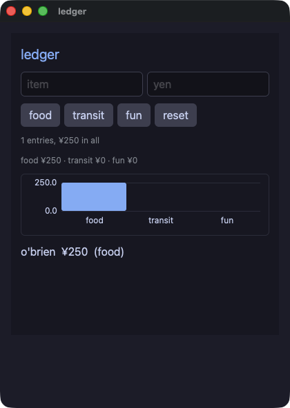

<div class="rk-hero" markdown>


# Rakugan

<p class="rk-hero__tag">Write Perl. Ship native.</p>

<!-- 日本語は行の折り返しが空白として描画されるので、リード文は一行で書く -->
<p class="rk-hero__lede">Rakugan（落雁）を使うと、Perl で書いたデスクトップアプリを 1 本のネイティブバイナリとしてリリースできます。<strong>perl で動かしたものが、そのままリリースするものになります。そのことを確かめるのが <code>rakugan gate</code> です</strong>。配るときは、アプリを <a href="https://github.com/i2y/yokan/blob/main/docs/PIXIE.md">pixie</a> に翻訳し、Zed エディタを支える <strong>gpui</strong> の上に組んだ描画エンジンと一緒にコンパイルして、インタプリタの入っていない 1 本のバイナリにします。書いているあいだは、同じファイルを perl が動かし、小さな XS の門を通して同じエンジンに触ります。<code>rakugan gate</code> は一つのスクリプトで両方を動かし、描いた画面を 1 バイトずつ突き合わせます。アプリそのものは普通の Perl のクラスです。Rakugan が足すのは、画面を組み立てるサブルーチンと、二つの実行が一致することを確かめる仕組みです。</p>

<div class="rk-hero__cta" markdown>
[はじめる](installation.md){ .md-button .md-button--primary }
[言語ツアー](tour.md){ .md-button }
[デモ](demos.md){ .md-button }
[GitHub](https://github.com/i2y/yokan){ .md-button }
</div>
</div>

## 全体の姿

一つのソースと、それを動かす二つの道です。


どちらの道も一つのエンジンに行き着きます。
解釈実行は XS の門を通して共有ライブラリとして開き、コンパイルした実行は pixie がリンクします。
エンジンは Perl の値を持ちません。
だからインタプリタと、perl の入っていないバイナリとが、まったく同じコードを動かせます。

---

## 書いて、動かして、配る

いちばん小さいアプリの全文です。

```perl
use Rakugan;

class Counter {
    use Rakugan;
    field $count = 0;

    method view {
        return column(
            text("count: $count", size => 34),
            button("+1", on_click => sub { $count += 1 }),
            spacing => 12,
            padding => 16,
        );
    }
}

run(Counter->new, title => "counter");
```

アプリは、perl 5.40 以降の `class` 機能で書いたクラスです。
状態はそのフィールド、`view` は要素を一つ返すメソッド、ハンドラはそのフィールドが見える無名サブルーチンです。
継承するものも、登録するものも、監視対象だと印を付けるものもありません。

このファイルのどこにも型は書いてありませんが、コンパイルした実行には型があります。
フィールドの型は初期値から、ハンドラの引数の型はそれが書かれている要素から読みます。
空で始まる入れ物は `field @items = empty(Str);` と、何を入れるかを言います。
引数のあるメソッドは `method add :Sig(Int) ($by)` と、それが何かを言います。
型を書く場所はこの二つだけです。

```console
$ ./bin/rakugan run app.pl
```

これでウィンドウが開き、ファイルを見はじめます。
編集して保存すると、ウィンドウがそれを取り込みます。
ファイルが読み直され、ウィンドウの持っているインスタンスが、値をすべて保ったまま新しい `view` で答えます。

配ります。

```console
$ ./bin/rakugan build demo/todo.pl --release --app
built: ~/.cache/pixie/target/release/main (11.9 MB)
bundle: demo/dist/todo.app (11.9 MB)
```

バイナリはエンジンと翻訳したアプリを含み、システム自身のライブラリ以外は何もリンクしません。
受け取る人は、perl もツールチェインも入れずに開けます。

---

## どんな画面になるか



*`demo/ledger.pl`。
家計簿をデータベースに置き、値は文に直接書かず `?` で渡し、合計を棒グラフにしています。
普通の Perl で書かれ、配るときは 1 本のネイティブバイナリになります。*

---

## 「手元では動いたのに」

操作の並びを渡すと、perl の実行とコンパイルしたバイナリの両方でそれを再生し、できあがった画面を突き合わせます。
Rakugan はこれを**ゲート**と呼びます。

```console
$ ./bin/rakugan gate app.pl --script "click:+1,dump"
GATE OK — 3 dump lines identical in both runs
```

解釈実行は perl そのものです。
だからゲートが通れば、配るバイナリが、スクリプトの触れた範囲では本物のインタプリタと一致したということです。
二つが同じにならない点は、理由とともに[二つの実行](two-runs.md)に挙げてあります。

---

## 名前が Perl のものであるかぎり、仕様は perl

`length`、`substr`、`uc`、`sort`、`grep`、`map`、`sprintf`、`List::Util`、`POSIX`、正規表現は言語自身のものです。
これらを Rakugan のライブラリで置き換えてはいません。
コンパイルした実行に perl は入っていないので、これらは Rust で一度ずつ書いてリンクしてあります。
そのうえで、perl 自身が印字した 1000 行あまりの表に照らして確かめます。
perl と一致することは、願いではなく検査です。

```perl
    my @big  = grep { $_ > 5 } @scores;
    my $line = sprintf("mean %.1f max %d", sum(@scores) / scalar @scores, max(@scores));
```

ファイル、データベース、ネットワーク、クリップボードは枠組みのものです。
そちらでは、一つの実装が両方の実行に答えます。

```perl
    sqlite_exec($db, "INSERT INTO expenses VALUES (?, ?, ?)", [$name, $yen, $cat]);
    my @rows = sqlite_query_rows($db, "SELECT name, amount FROM expenses ORDER BY rowid");
```

---

## 移植した二つのゲーム

Pyxel 自身の例（Takashi Kitao、MIT）を二つ、ほぼ 1 行ずつ移してデモに入れてあります。
画素のキャンバスも、毎秒 30 フレームという速さも、押しっぱなしのキーの読み方も同じです。
打鍵とフレームからなるスクリプトが両方の実行を再生するので、ゲートはゲームの全フレームを突き合わせます。

<p align="center">
  
  
</p>

*`demo/shooter.pl` と `demo/jump.pl`。
キャンバスの中で色は、配色の何番目かというだけの番号です。
だから、ドット絵の道具のために書かれた描画が、数字を変えずにそのまま移せます。*

---

## エージェントが書くとき

エージェントはファイルを書き、返ってきたものを読みます。
だから、返ってくるものの形で作業の進み方が決まります。
三つのコマンドのうち二つは、コンパイラもウィンドウもなしに 0.1 秒ほどで答えます。
何を書けばよいかを名指しする断りと、文字になった画面です。
最後の証明がゲートです。


ループ全体は[エージェントと一緒に書く](agents.md)にあります。

---

## ほかに入っているもの

<div class="grid cards" markdown>

-   :material-table-large: __一つの表、一つの語彙__

    33 個の要素、15 個の共通キーワード、10 個の描画命令が、`elements.toml` に一度だけ書いてあります。
    アプリが呼ぶ Perl も、エンジンが数える番号も、そこから生成されます。
    だから一つの要素が二つの意味を持つことはありません。
    このエンジンの上のほかの二つの言語も、同じ表を読んでいます。

-   :material-brush-variant: __キャンバスとキーボード__

    仮想的な画素の格子を、命令をひとつずつ並べて塗ります。
    色は配色の番号で指し、キーが押されているかどうかはタイマーの中で読みます。
    音は `audio_play` で WAV を鳴らします。
    ウィンドウを開かずに、どのフレームも PNG に書き出せます。

-   :material-shield-check: __教える断り方__

    翻訳器が受け取れない書き方は、何かを組み立てるより先に断ります。
    断りには、その行と、代わりにどう書くかが出ます。
    どの断りにも、印字される文面をそのまま置いたファイルがあります。

</div>

---

## 次に読むもの

<div class="grid cards" markdown>

-   :material-rocket-launch: __[インストール](installation.md)__

    必要なもの、一度だけの用意、そして五つのコマンド。
    今のところ Apple シリコンの macOS だけです。

-   :material-book-open-variant: __[言語ツアー](tour.md)__

    アプリの書き方をひととおり。
    状態、ビュー、キャンバス、ウィンドウ、データベース、ゲート。
    最後はまだできないことで閉じます。

-   :material-view-gallery: __[デモ](demos.md)__

    41 本のアプリを、画面写真とソース全体つきで。

-   :material-github: __[ソース](https://github.com/i2y/yokan)__

    翻訳器と、エンジンと、デモ。

</div>

---

_名前は落雁、押して乾かす干菓子です。
エンジンを共にする羊羹と若草と同じく、和菓子から採りました。_
