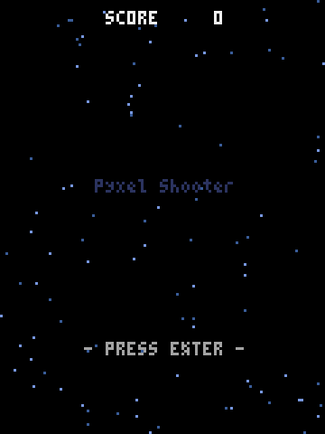
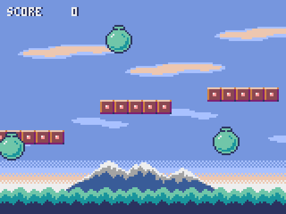

<div class="rk-hero" markdown>


# Rakugan

<p class="rk-hero__tag">Write Perl. Ship native.</p>

<p class="rk-hero__lede">
Rakugan turns a Perl desktop app into one native binary:
<strong>what you run under perl is what it ships, and
<code>rakugan gate</code> is how you check that</strong>. When you ship,
the app is translated to
<a href="https://github.com/i2y/yokan/blob/main/docs/PIXIE.md">pixie</a>
and compiled with the drawing engine (<strong>gpui</strong>, the engine
behind the Zed editor) into one binary with no interpreter in it; while
you are working, the same file runs under perl, reaching that engine
through a small XS door. <code>rakugan gate</code> drives both with the
same script and compares what they drew, byte for byte. An app is a
plain Perl class; what Rakugan adds is the subs that build the screen,
and the check that the two runs agree.
</p>

<div class="rk-hero__cta" markdown>
[Get started](installation.md){ .md-button .md-button--primary }
[Language tour](tour.md){ .md-button }
[Demos](demos.md){ .md-button }
[GitHub](https://github.com/i2y/yokan){ .md-button }
</div>
</div>

## The whole picture

One source, two roads to run it.


Both roads end at one engine. The interpreted run opens it through an XS
door as a shared library; the compiled run has pixie link it in. The
engine never holds a Perl value, which is what lets an interpreter and a
binary with no perl in it drive exactly the same code.

---

## Write it, run it, ship it

The smallest complete app:

```perl
use Rakugan;

class Counter {
    use Rakugan;
    field $count = 0;

    method view {
        return column(
            text("count: $count", size => 34),
            button("+1", on_click => sub { $count += 1 }),
            spacing => 12,
            padding => 16,
        );
    }
}

run(Counter->new, title => "counter");
```

An app is a class, written with the `class` feature of perl 5.40 and
newer. Its state is its fields, `view` answers one element, and a
handler is an anonymous sub that closes over them. There is nothing to
inherit from, nothing to register, and nothing to mark as observable.

Nothing in that file says a type, and the compiled run is typed all the
same: a field's type is read from its initializer, a handler's parameter
from the element it is written on. A container that starts empty says
what it will hold, `field @items = empty(Str);`, and a method with
parameters says what they are, `method add :Sig(Int) ($by)`. That is the
whole of the annotation.

```console
$ ./bin/rakugan run app.pl
```

That opens a window and watches the file. Save an edit and the window
picks it up: the file is read again, and the object the window is
holding answers with the new `view` while keeping every value it had.

Ship it:

```console
$ ./bin/rakugan build demo/todo.pl --release --app
built: ~/.cache/pixie/target/release/main (11.9 MB)
bundle: demo/dist/todo.app (11.9 MB)
```

The binary carries the engine and the translated app and links nothing
but the system's own libraries. The person receiving it installs neither
perl nor the toolchain.

---

## What it looks like


*`demo/ledger.pl` — money kept in a database, every value bound rather
than spliced, with a chart over the totals. Ordinary Perl; ships as one
native binary.*

---

## "But it worked on my machine"

Hand it a sequence of interactions and it replays them against the perl
run and the compiled binary, then compares the resulting screens.
Rakugan calls it the **gate**:

```console
$ ./bin/rakugan gate app.pl --script "click:+1,dump"
GATE OK — 3 dump lines identical in both runs
```

The interpreted run *is* perl, so a green gate means the shipped binary
agrees with the real interpreter on everything the script touched. The
places where the two are not the same program are named, with reasons,
on [The two runs](two-runs.md).

---

## Where the name is Perl's, perl is the specification

`length`, `substr`, `uc`, `sort`, `grep`, `map`, `sprintf`,
`List::Util`, `POSIX`, and regular expressions are the language's own,
not a library of ours standing in front of them. The compiled run
carries no perl, so each of them is written once in Rust and linked —
and then measured against a table of a thousand rows that perl itself
printed, so agreement with perl is a test rather than a hope.

```perl
    my @big  = grep { $_ > 5 } @scores;
    my $line = sprintf("mean %.1f max %d", sum(@scores) / scalar @scores, max(@scores));
```

Files, a database, the network and the clipboard come from the framework
instead, and there one implementation answers both runs:

```perl
    sqlite_exec($db, "INSERT INTO expenses VALUES (?, ?, ?)", [$name, $yen, $cat]);
    my @rows = sqlite_query_rows($db, "SELECT name, amount FROM expenses ORDER BY rowid");
```

---

## Two games, ported

Two of Pyxel's own examples (Takashi Kitao, MIT) are in the bundled
demos, ported almost line for line: the same pixel canvas, the same
thirty frames a second, the same keys read while they are held. A script
of keystrokes and frames replays both runs, so the gate compares every
frame of the game.

<p align="center">
  
  
</p>

*`demo/shooter.pl` and `demo/jump.pl` — inside a canvas a color is a
number, the index of a color in the palette, which is what lets drawing
code written for a pixel machine port with its numbers unchanged.*

---

## When an agent is writing it

An agent writes a file and reads what comes back, so what comes back
decides how the session goes. Two of the commands answer in about a
tenth of a second, with no compiler and no window: a refusal that names
what to write instead, and the screen as text. The gate is the proof at
the end.


[Building with an agent](agents.md) walks the whole loop.

---

## What else is in it

<div class="grid cards" markdown>

-   :material-table-large: __One table, one vocabulary__

    Thirty-three elements, fifteen shared keywords and ten drawing
    commands, written once in `elements.toml`. The Perl an app calls and
    the numbers the engine counts with are generated from it, so an
    element cannot mean two things — and the other three languages on this
    engine read the same table.

-   :material-brush-variant: __A canvas, and the keyboard__

    A grid of virtual pixels painted command by command, colors by
    palette index, keys read as a device from the tick, and a WAV played
    with `audio_play` — and a PNG of any frame without opening a window
    at all.

-   :material-shield-check: __Refusals that teach__

    What the translator cannot take is refused by name, with the line
    and the rewrite, before anything is built. Each one has a file
    holding the message it must print, word for word.

</div>

---

## Where next

<div class="grid cards" markdown>

-   :material-rocket-launch: __[Installation](installation.md)__

    What you need, the one-time setup, and the five commands. macOS on
    Apple silicon and Linux today.

-   :material-book-open-variant: __[Language tour](tour.md)__

    One pass over how apps are written — state, views, the canvas, the
    window, a database, the gate — closing with what does not work yet.

-   :material-view-gallery: __[Demos](demos.md)__

    Forty-one apps, each with its screenshot and its whole source.

-   :material-github: __[Source](https://github.com/i2y/yokan)__

    The translator, the engine, and the demos.

</div>

---

_The name is 落雁 — rakugan, a pressed dry confection. Like Yokan,
Wakakusa and Gomamochi, the three languages it shares an engine with, it
is named after a Japanese sweet._
