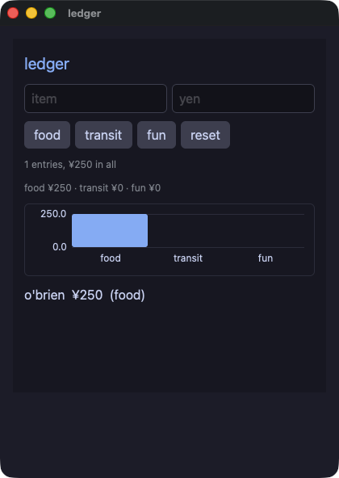

<div class="wk-hero" markdown>


# Wakakusa

<p class="wk-hero__tag">Write Ruby. Ship native.</p>

<!-- 日本語は行の折り返しが空白として描画されるので、リード文は一行で書く -->
<p class="wk-hero__lede">Wakakusa（若草）は、Ruby のデスクトップアプリを作るコンパイラです。<strong>CRuby で動かしたものが、そのままネイティブバイナリとして配れます。それを、ビルドのたびに検証します</strong>。書くのは、小さな要素の語彙に対する普通の Ruby です。作っているあいだは本物のインタプリタが答え、リリースするとプログラム全体が一つのネイティブバイナリになります。その二つを <code>wakakusa gate</code> が同じ台本で動かし、描いたものを一バイトずつ突き合わせます。</p>

<div class="wk-hero__cta" markdown>
[はじめる](installation.md){ .md-button .md-button--primary }
[言語ツアー](tour.md){ .md-button }
[デモ](demos.md){ .md-button }
[GitHub](https://github.com/i2y/yokan){ .md-button }
</div>
</div>

## 全体像

一つのソースに、走らせる道が二つあります。


どちらの道も、C ABI の向こうにある一つのエンジンを動かします。
インタプリタ側はそれを共有ライブラリとして開き、コンパイルされた側は静的なほうをリンクします。
エンジンは Ruby のオブジェクトを持ちません。
だから、インタプリタとコンパイル済みのバイナリが、まったく同じコードを動かせます。

---

## どんな見た目になるか



*`demo/ledger.rb`。
データベースに置いた家計簿で、値は文に埋め込まず束縛して渡し、合計を棒グラフにしています。
普通の Ruby で書かれ、一つのネイティブバイナリになります。*

---

## 書いて、動かして、配る

いちばん小さいアプリの全文がこちらです。

```ruby
require "wakakusa"

class Counter
  def initialize
    @count = 0
  end

  def view
    column(spacing: 12.0, padding: 16.0) {
      text "count: #{@count}", size: 34.0
      button("+1") { @count += 1 }
    }
  end
end

run(Counter.new, title: "counter")
```

アプリはオブジェクトです。
状態はそのインスタンス変数で、`view` は要素を一つ返し、ハンドラはそのオブジェクトを閉じ込めたブロックです。
継承するものも、登録するものも、監視の対象だと印を付けるものもありません。

```console
$ ./bin/wakakusa run app.rb
```

これでウィンドウが開き、ファイルの監視が始まります。
書き換えて保存すると、ウィンドウがそれを拾います。
ファイルが読み直され、ウィンドウが持っているオブジェクトは、それまでの値をすべて保ったまま新しい `view` を返します。
そのオブジェクトの `initialize` は走り直しません。
状態が生まれるのはそこなので、走り直さないことに意味があります。

リリースします。

```console
$ ./bin/wakakusa build demo/todo.rb --release --app
built: demo/.gate/todo (12.3 MB)
bundle: demo/dist/todo.app (12.5 MB)
  not gate-checked — `gate` with a script proves the two runs agree
```

バイナリはエンジンとコンパイル済みの Ruby を含んでいて、システム自身のライブラリ以外は何もリンクしません。
受け取る人は、Ruby もコンパイラも入れずに開けます。

---

## 「私の環境では動いていた」

操作の並びを渡すと、CRuby の実行とコンパイルされたバイナリの両方でそれを再生し、出てきた画面を突き合わせます。
若草はこれを**ゲート**と呼んでいます。

```console
$ ./bin/wakakusa gate app.rb --script "click:+1,dump"
GATE OK — 3 dump lines identical in both runs
```

インタプリタ側の実行は CRuby そのものです。
だからゲートが緑なら、リリースするバイナリが、スクリプトの触れた範囲では本物のインタプリタと一致したということです。
二つが同じプログラムでない数少ない場所は、理由とともに[二つの実行](two-runs.md)に挙げてあります。

---

## Ruby 自身のライブラリが、どちらの実行でも

`File`、`Dir`、`JSON`、`CSV`、`Time`、`Math`、`Net::HTTP`、ソケット、スレッド、`Enumerable` が答えることまで、書くのは Ruby のライブラリです。
その前に若草のライブラリが立ちはだかることはありません。
その下で答えているコードは、片方が CRuby の実装、もう片方がコンパイラの実装で、その二つを結び付けているのがゲートです。

データベースだけは例外です。
どちらの実行も同じファイルを同じように読まなければ、意味がないからです。

```ruby
sqlite_exec(DB, "INSERT INTO expenses VALUES (?, ?, ?)", [name, yen, cat])
rows = sqlite_rows(DB, "SELECT name, amount FROM expenses ORDER BY rowid")
```

---

## 移植した二つのゲーム

Pyxel 自身の例（Takashi Kitao、MIT）が二つ、デモに入っています。
ほぼ一行ずつの移植で、同じドット絵のキャンバス、同じ毎秒三十コマ、押しっぱなしのキーを同じように読みます。
打鍵とコマ送りのスクリプトが二つの実行を再生するので、ゲートはゲームの全コマを突き合わせます。

<p align="center">
  
  
</p>

*`demo/shooter.rb` と `demo/jump.rb`。
キャンバスの中では色が番号、つまり palette の何番目かなので、ドット絵の環境のために書かれた描画コードが、数字を書き換えずにそのまま移せます。*

---

## エージェントが書くとき

エージェントはファイルを書き、返ってきたものを読みます。
だから、返ってくるものがその作業の進み方を決めます。
三つのうち二つは 1 秒かからずに答え、コンパイラもウィンドウも要りません。
代わりに何を書くかを名指しする断りと、文字になった画面です。
ゲートは、最後に置く証明です。


[エージェントと作る](agents.md)が、その一周ぶんの説明です。

---

## ほかに入っているもの

<div class="grid cards" markdown>

-   :material-table-large: __表は一つ、語彙も一つ__

    33 個の要素と、共通のキーワード 15 個を `elements.toml` に一度だけ書きます。アプリが呼ぶ Ruby も、エンジンが数える番号も、その定数も、そこから生成されます。だから一つの要素が二つの意味を持つことがありません。

-   :material-brush-variant: __キャンバスと、キーボード__

    仮想的な画素の格子を、命令をひとつずつ並べて塗ります。色は palette の番号で、キーはタイマーから装置として読みます。ウィンドウを開かずに、どのコマも PNG に書き出せます。

-   :material-shield-check: __教える断り__

    コンパイラが受け取れない書き方は、コンパイラが起動するより先に、行と書き換え方つきで名指しで断ります。

</div>

---

## 次に読むもの

<div class="grid cards" markdown>

-   :material-rocket-launch: __[インストール](installation.md)__

    必要なもの、一度だけの用意、五つのコマンド。今のところ macOS の Apple silicon だけです。

-   :material-book-open-variant: __[言語ツアー](tour.md)__

    アプリの書き方をひととおり。状態、ビュー、キャンバス、ウィンドウ、データベース、ゲート、そして最後にまだできないこと。

-   :material-view-gallery: __[デモ](demos.md)__

    43 本のアプリを、スクリーンショットと全文つきで。

-   :material-github: __[ソース](https://github.com/i2y/yokan)__

    コンパイラと、エンジンと、デモ。

</div>

---

_名前は若草、つまりその年に最初に生える草のことです。_

_若草は Ruby をコンパイルしますが、Ruby プロジェクトの一部ではありません。_
