# Demos

Forty-three apps, every one of them gated: the interpreted run and
the compiled one, driven by the same script, compared byte for
byte. Each runs as-is from `wakakusa/` in the repository.

```console
$ ./bin/wakakusa run demo/counter.rb     # substitute any demo's name
$ ./tools/gate_all.sh                    # gate every demo at once
```

Every screenshot shows the state right after launch, except the two
games, which show a recording of play. The source under each one is
the whole file.

## Start here

#### counter — the reference: an app is an object, its state is its instance variables, and a handler is a block that closes over it
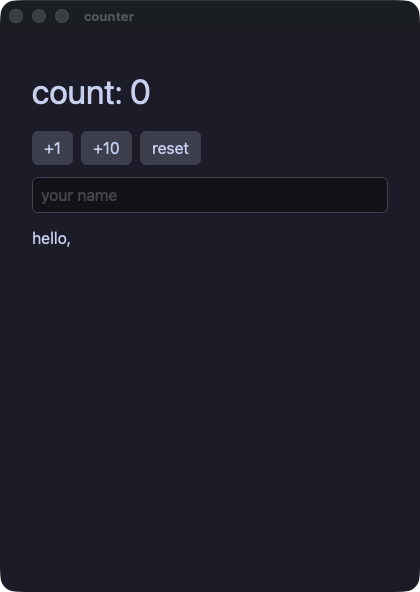

??? note "counter.rb"

    ```ruby
    # The reference: everything in this file is what Wakakusa takes. The
    # app is an object, its state is its instance variables, and a handler
    # is a block that closes over it.
    #
    #   wakakusa run  demo/counter.rb
    #   wakakusa gate demo/counter.rb --script "click:+1,input:Momo"
    require "wakakusa"

    class Counter
      def initialize
        @count = 0
        @name = ""
      end

      def view
        column(
          text("count: #{@count}", size: 34.0),
          row(
            button("+1") { @count += 1 },
            button("+10") { @count += 10 },
            button("reset") { @count = 0 },
            spacing: 8.0
          ),
          text_field(@name, placeholder: "your name") { |s| @name = s },
          text("hello, #{@name}"),
          spacing: 12.0,
          padding: 16.0
        )
      end
    end

    run(Counter.new, title: "counter")
    ```

#### blockform — the same counter written the other way: a container takes its children as a block, and both spellings build the same tree
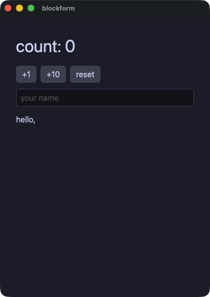

??? note "blockform.rb"

    ```ruby
    # The same counter as demo/counter.rb, written the other way. A
    # container takes its children as a block, and each element inside
    # joins the one that is open.
    #
    # Both spellings build the same tree; this demo exists to say so.
    require "wakakusa"

    class Counter
      def initialize
        @count = 0
        @name = ""
      end

      def view
        column(spacing: 12.0, padding: 16.0) {
          text "count: #{@count}", size: 34.0
          row(spacing: 8.0) {
            button("+1") { @count += 1 }
            button("+10") { @count += 10 }
            button("reset") { @count = 0 }
          }
          text_field(@name, placeholder: "your name") { |s| @name = s }
          text "hello, #{@name}"
        }
      end
    end

    run(Counter.new, title: "blockform")
    ```

#### control — ordinary Ruby inside a view: `if`, `unless`, a ternary, a loop, and a method that answers part of the screen
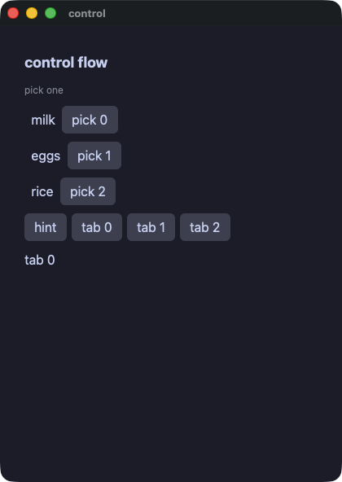

??? note "control.rb"

    ```ruby
    # Ordinary Ruby inside a view: `if`, `unless`, a ternary, a loop, and a
    # method that answers part of the screen. Nothing here is a special
    # form — the block is Ruby, and each element joins the container that
    # is open.
    #
    # The one shape that is refused is a block written inside a loop's
    # block. `line` below is what to write instead, and `wakakusa check`
    # says so with the line.
    require "wakakusa"

    class Control
      def initialize
        @items = ["milk", "eggs", "rice"]
        @picked = -1
        @show_hint = true
        @tab = 0
      end

      def hint
        text "pick one", size: 12.0, color: "#8a8f98"
      end

      def line(name, i)
        row(spacing: 8.0) {
          text(i == @picked ? "▸ #{name}" : "  #{name}")
          button("pick #{i}") { @picked = i }
        }
      end

      def tab_button(n)
        button("tab #{n}") { @tab = n }
      end

      def view
        column(spacing: 10.0, padding: 14.0) {
          text "control flow", size: 18.0, bold: true

          if @show_hint
            hint
          else
            text "hidden", size: 12.0
          end

          @items.each_with_index { |name, i| line(name, i) }

          unless @picked < 0
            text "picked #{@items[@picked]}", color: @picked.even? ? "accent" : "#f38ba8"
          end

          row(spacing: 6.0) {
            button("hint") { @show_hint = !@show_hint }
            3.times { |n| tab_button(n) }
          }
          text "tab #{@tab}"
        }
      end
    end

    run(Control.new, title: "control")
    ```

#### todo — a list whose rows are built on demand, and a field that submits with enter
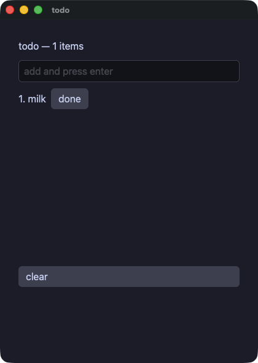

??? note "todo.rb"

    ```ruby
    # A list whose rows are built on demand: the builder is called for the
    # rows in view, not for all of them. The row number is an ordinary
    # argument inside it, so the line, the marker and that row's own button
    # all read the same `i`.
    require "wakakusa"

    class Todo
      def initialize
        @items = ["milk"]
        @draft = ""
        @done = -1
      end

      def add(t)
        items = @items.dup
        items.push(t)
        @items = items
        @draft = ""
      end

      def line(i)
        cells = [text("#{i + 1}. #{@items[i]}")]
        cells.push(text("done", color: "accent")) if i == @done
        cells.push(button("done") { @done = i })
        row(*cells, spacing: 8.0)
      end

      def view
        column(
          text("todo — #{@items.length} items", size: 16.0),
          text_field(@draft, placeholder: "add and press enter",
                     on_submit: -> { add(event_text) }) { |t| @draft = t },
          list_view(@items.length, item_height: 26.0, height: 280.0) { |i| line(i) },
          button("clear") { @items = [] },
          spacing: 10.0,
          padding: 14.0
        )
      end
    end

    run(Todo.new, title: "todo")
    ```

#### calc — a calculator: one accumulator, one pending operation, and a look kept in a Hash and splatted onto each key
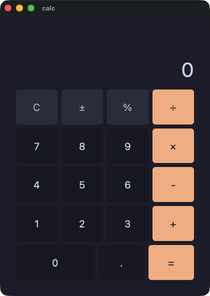

??? note "calc.rb"

    ```ruby
    # A calculator: one accumulator, one pending operation, and a display
    # the app builds as a string. The look is a Hash of properties, handed
    # to each key with `**`.
    require "wakakusa"
    require_relative "calc_style"

    class Calc
      def initialize
        @display = "0"
        @acc = 0.0
        @op = ""
        @fresh = true
        @has_dot = false
      end

      def to_f_or_zero(s)
        Float(s)
      rescue ArgumentError, TypeError
        0.0
      end

      def press(d)
        if @fresh
          @display = d
          @fresh = false
          @has_dot = false
        elsif @display == "0"
          @display = d
        else
          @display = @display + d
        end
      end

      def dot
        if @fresh
          @display = "0."
          @fresh = false
          @has_dot = true
        elsif !@has_dot
          @display = @display + "."
          @has_dot = true
        end
      end

      def negate
        v = to_f_or_zero(@display)
        return if v == 0.0

        @display = "#{0.0 - v}"
        @fresh = false
      end

      def percent
        @display = "#{to_f_or_zero(@display) / 100.0}"
        @fresh = true
        @has_dot = false
      end

      def apply(nxt)
        if @fresh && @op != ""
          @op = nxt
          return
        end
        cur = to_f_or_zero(@display)
        @acc = cur if @op == ""
        @acc += cur if @op == "+"
        @acc -= cur if @op == "-"
        @acc *= cur if @op == "×"
        if @op == "÷"
          if cur == 0.0
            @display = "Error"
            @acc = 0.0
            @op = ""
            @fresh = true
            return
          end
          @acc /= cur
        end
        @display = "#{@acc}"
        @op = nxt
        @fresh = true
      end

      def clear
        @display = "0"
        @acc = 0.0
        @op = ""
        @fresh = true
        @has_dot = false
      end

      def digit(d)
        button(d, **KEY) { press(d) }
      end

      def op_key(name)
        button(name, **OP) { apply(name) }
      end

      def view
        column(spacing: 8.0, padding: 16.0, grow: 1.0) {
          text @display, **READOUT
          row(**KEYS) {
            button("C", **FUN) { clear }
            button("±", **FUN) { negate }
            button("%", **FUN) { percent }
            op_key("÷")
          }
          row(**KEYS) {
            digit("7")
            digit("8")
            digit("9")
            op_key("×")
          }
          row(**KEYS) {
            digit("4")
            digit("5")
            digit("6")
            op_key("-")
          }
          row(**KEYS) {
            digit("1")
            digit("2")
            digit("3")
            op_key("+")
          }
          row(**KEYS) {
            button("0", **WIDE) { press("0") }
            button(".", **KEY) { dot }
            button("=", **OP) { apply("") }
          }
        }
      end
    end

    run(Calc.new, title: "calc")
    ```

#### calcgrid — the same calculator on a grid instead of five rows; `col_span:` is what makes the zero key twice as wide
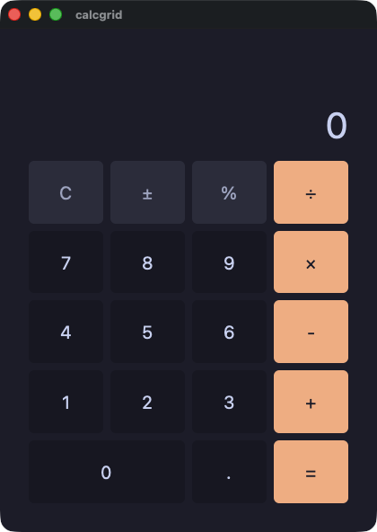

??? note "calcgrid.rb"

    ```ruby
    # The same calculator as demo/calc.rb, on a grid instead of five rows.
    # `col_span:` is what makes the zero key twice as wide.
    require "wakakusa"
    require_relative "calc_style"

    class CalcGrid
      def initialize
        @display = "0"
        @acc = 0.0
        @op = ""
        @fresh = true
        @has_dot = false
      end

      def to_f_or_zero(s)
        Float(s)
      rescue ArgumentError, TypeError
        0.0
      end

      def press(d)
        if @fresh
          @display = d
          @fresh = false
          @has_dot = false
        elsif @display == "0"
          @display = d
        else
          @display = @display + d
        end
      end

      def dot
        if @fresh
          @display = "0."
          @fresh = false
          @has_dot = true
        elsif !@has_dot
          @display = @display + "."
          @has_dot = true
        end
      end

      def negate
        v = to_f_or_zero(@display)
        return if v == 0.0

        @display = "#{0.0 - v}"
        @fresh = false
      end

      def percent
        @display = "#{to_f_or_zero(@display) / 100.0}"
        @fresh = true
        @has_dot = false
      end

      def apply(nxt)
        if @fresh && @op != ""
          @op = nxt
          return
        end
        cur = to_f_or_zero(@display)
        @acc = cur if @op == ""
        @acc += cur if @op == "+"
        @acc -= cur if @op == "-"
        @acc *= cur if @op == "×"
        if @op == "÷"
          if cur == 0.0
            @display = "Error"
            @acc = 0.0
            @op = ""
            @fresh = true
            return
          end
          @acc /= cur
        end
        @display = "#{@acc}"
        @op = nxt
        @fresh = true
      end

      def clear
        @display = "0"
        @acc = 0.0
        @op = ""
        @fresh = true
        @has_dot = false
      end

      def digit(d)
        button(d, **KEY) { press(d) }
      end

      def op_key(name)
        button(name, **OP) { apply(name) }
      end

      def view
        column(spacing: 8.0, padding: 16.0, grow: 1.0) {
          text @display, **READOUT
          grid(columns: 4, rows: 5, spacing: 8.0, grow: 5.0) {
            button("C", **FUN) { clear }
            button("±", **FUN) { negate }
            button("%", **FUN) { percent }
            op_key("÷")
            digit("7")
            digit("8")
            digit("9")
            op_key("×")
            digit("4")
            digit("5")
            digit("6")
            op_key("-")
            digit("1")
            digit("2")
            digit("3")
            op_key("+")
            button("0", col_span: 2, **KEY) { press("0") }
            button(".", **KEY) { dot }
            button("=", **OP) { apply("") }
          }
        }
      end
    end

    run(CalcGrid.new, title: "calcgrid")
    ```

## Holding state

#### mixer — state an app keeps, and a field that writes into it
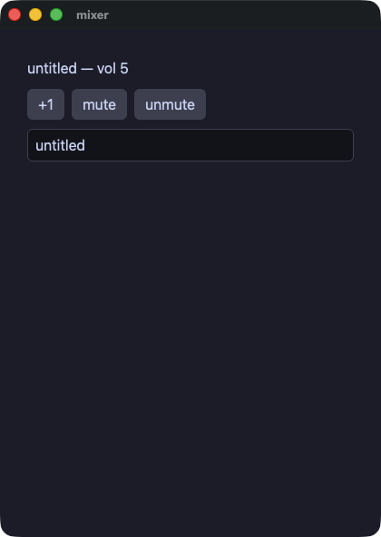

??? note "mixer.rb"

    ```ruby
    # State an app keeps and a field that writes into it.
    require "wakakusa"

    class Mixer
      def initialize
        @volume = 5
        @title = "untitled"
        @muted = false
      end

      def view
        cells = [
          text("#{@title} — vol #{@volume}", size: 16.0),
          row(
            button("+1") { @volume += 1 },
            button("mute") { @muted = true },
            button("unmute") { @muted = false },
            spacing: 8.0
          ),
        ]
        cells.push(text("(muted)", size: 12.0, color: "#8a8f98")) if @muted
        cells.push(text_field(@title, placeholder: "title") { |t| @title = t })
        column(*cells, spacing: 10.0, padding: 14.0)
      end
    end

    run(Mixer.new, title: "mixer")
    ```

#### lookup — a Hash on the app: reading with a fallback, asking whether a key is there, and adding one while the window is open
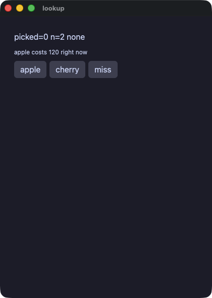

??? note "lookup.rb"

    ```ruby
    # A Hash on the app: reading with a fallback, asking whether a key is
    # there, and adding one while the window is open.
    require "wakakusa"

    class Lookup
      def initialize
        @prices = { "apple" => 120, "banana" => 80 }
        @picked = 0
        @label = "none"
      end

      def pick_apple
        @picked = @prices.fetch("apple", -1)
        @label = @prices.key?("cherry") ? "cherry known" : "no cherry"
      end

      def add_cherry
        @prices["cherry"] = 200
        @picked = @prices.fetch("cherry", -1)
        @label = "cherry known" if @prices.key?("cherry")
      end

      def view
        column(spacing: 8.0, padding: 12.0) {
          text "picked=#{@picked} n=#{@prices.length} #{@label}"
          text "apple costs #{@prices.fetch("apple", -1)} right now", size: 12.0
          row(spacing: 6.0) {
            button("apple") { pick_apple }
            button("cherry") { add_cherry }
            button("miss") { @picked = @prices.fetch("durian", -7) }
          }
        }
      end
    end

    run(Lookup.new, title: "lookup")
    ```

#### points — a small class of values, carried on the app's own state
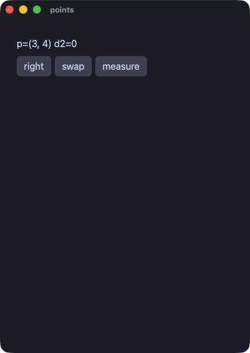

??? note "points.rb"

    ```ruby
    # A small class of values, carried on the app's own state.
    require "wakakusa"

    class Point
      attr_reader :x, :y

      def initialize(x, y = 0)
        @x = x
        @y = y
      end
    end

    class Points
      def initialize
        @sel = Point.new(3, 4)
        @dist = 0
      end

      def view
        column(
          text("p=(#{@sel.x}, #{@sel.y}) d2=#{@dist}"),
          row(
            button("right") { @sel = Point.new(@sel.x + 5, @sel.y) },
            button("swap") { @sel = Point.new(@sel.y, @sel.x) },
            button("measure") { @dist = @sel.x * @sel.x + @sel.y * @sel.y },
            spacing: 6.0
          ),
          spacing: 8.0,
          padding: 12.0
        )
      end
    end

    run(Points.new, title: "points")
    ```

#### links — objects that point at one another, written the way Ruby's collector allows
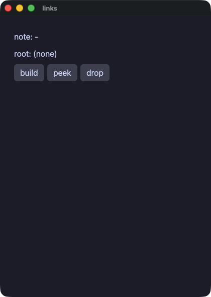

??? note "links.rb"

    ```ruby
    # Objects that point at one another. Yokan needs a weak back pointer
    # here so a parent and a child cannot own each other forever; Ruby's
    # collector takes a cycle in its stride, so the back pointer is an
    # ordinary reference and the tree is written the way it reads.
    require "wakakusa"

    class Node
      attr_accessor :label, :kid, :parent

      def initialize(label)
        @label = label
        @kid = nil
        @parent = nil
      end
    end

    class Tree
      def initialize
        @root = nil
        @keep = nil
        @note = "-"
      end

      def build
        a = Node.new("alpha")
        b = Node.new("beta")
        a.kid = b
        b.parent = a
        @root = a
        @keep = b
      end

      def peek
        @note = if @root.nil?
                  @keep.nil? ? "no root" : "kept #{@keep.label}, parent=#{@keep.parent.label}"
                elsif @root.kid.nil?
                  "no kid"
                else
                  "kid=#{@root.kid.label} parent=#{@root.kid.parent.label}"
                end
      end

      def view
        column(spacing: 8.0, padding: 12.0) {
          text "note: #{@note}"
          if @root.nil?
            text "root: (none)"
          else
            text "root: #{@root.label}"
          end
          row(spacing: 6.0) {
            button("build") { build }
            button("peek") { peek }
            button("drop") { @root = nil }
          }
        }
      end
    end

    run(Tree.new, title: "links")
    ```

#### moods — values that are one of a few named things (symbols), and a value that may be nothing at all (nil), told apart by `case`
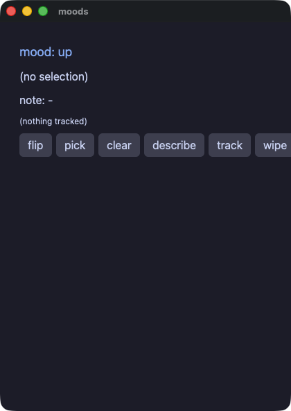

??? note "moods.rb"

    ```ruby
    # Values that are one of a few named things, and a value that may be
    # nothing at all. Ruby writes the first as symbols and the second as
    # nil, and `case` tells them apart.
    require "wakakusa"

    class Tracker
      attr_reader :last, :trend

      def initialize
        @last = nil
        @trend = :happy
      end

      def note(v)
        @last = v
        @trend = case @trend
                 when :happy then :sad
                 else :happy
                 end
      end

      def wipe
        @last = nil
      end
    end

    class Moods
      def initialize
        @mood = :happy
        @sel = nil
        @note = "-"
        @tracker = Tracker.new
      end

      def flip
        @mood = case @mood
                when :happy then :sad
                else :happy
                end
      end

      def describe
        @note = @sel.nil? ? "nothing chosen" : "chose #{@sel}"
      end

      def mood_line
        return text("mood: up", size: 18.0, color: "accent", animate: 120.0, easing: "out") if @mood == :happy

        text("mood: down", size: 18.0, color: "#f38ba8", animate: 120.0, easing: "out")
      end

      def view
        column(spacing: 8.0, padding: 12.0) {
          mood_line
          if @sel.nil?
            text "(no selection)"
          else
            text "selection: #{@sel}"
          end
          text "note: #{@note}"
          if @tracker.last.nil?
            text "(nothing tracked)", size: 12.0
          else
            text "tracked: #{@tracker.last}", size: 12.0
          end
          row(spacing: 6.0) {
            button("flip") { flip }
            button("pick") { @sel = 7 }
            button("clear") { @sel = nil }
            button("describe") { describe }
            button("track", animate: 100.0, easing: "inOut") { @tracker.note(9) }
            button("wipe") { @tracker.wipe }
          }
        }
      end
    end

    run(Moods.new, title: "moods")
    ```

## Elements, layout and look

#### forms — the controls a person changes: a box, a switch, a track, and the four choosers
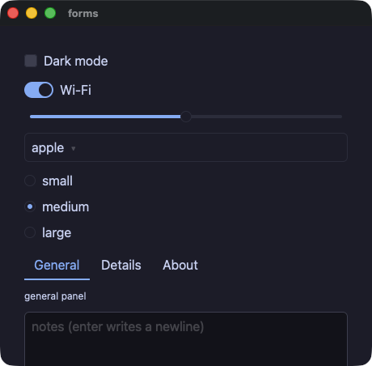

??? note "forms.rb"

    ```ruby
    # The controls a person changes: a box, a switch, a track, and the four
    # choosers. Each hands its new value to the block.
    require "wakakusa"

    class Forms
      def initialize
        @dark = false
        @wifi = true
        @volume = 5.0
        @fruits = ["apple", "banana", "cherry"]
        @fruit = 0
        @sizes = ["small", "medium", "large"]
        @size = 1
        @tabs = ["General", "Details", "About"]
        @tab = 0
        @note = ""
      end

      def panel
        return text("general panel", size: 12.0) if @tab == 0
        return text("details panel", size: 12.0) if @tab == 1

        text("about panel", size: 12.0)
      end

      def view
        column(
          checkbox("Dark mode", checked: @dark,
                   tooltip: "the whole window follows this") { |on| @dark = on },
          switch("Wi-Fi", checked: @wifi) { |on| @wifi = on },
          slider(value: @volume, min: 0.0, max: 10.0, step: 1.0,
                 tooltip: "0 to 10, in whole steps") { |v| @volume = v },
          select(options: @fruits, selected: @fruit) { |i| @fruit = i },
          radio_group(options: @sizes, selected: @size) { |i| @size = i },
          tab_bar(labels: @tabs, active: @tab) { |i| @tab = i },
          panel,
          text_field(@note, placeholder: "notes (enter writes a newline)",
                     multiline: true, rows: 3.0) { |t| @note = t },
          text("dark=#{@dark}  wifi=#{@wifi}  vol=#{format("%.1f", @volume)}"),
          text("fruit##{@fruit}  size##{@size}  tab##{@tab}"),
          spacing: 10.0,
          padding: 14.0
        )
      end
    end

    run(Forms.new, title: "forms", width: 460.0, height: 420.0)
    ```

#### quantities — the two fields that hold a number rather than text: enter commits, text that is not a number is dropped
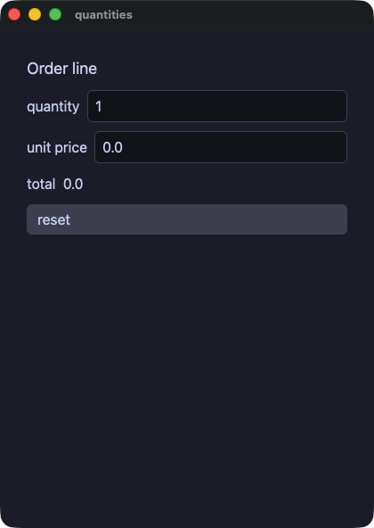

??? note "quantities.rb"

    ```ruby
    # The two fields that hold a number rather than text: enter or leaving
    # them commits, text that is not a number is dropped and the shown
    # value returns to what the app holds.
    require "wakakusa"

    class Order
      def initialize
        @qty = 1
        @price = 0.0
      end

      def reset
        @qty = 1
        @price = 0.0
      end

      def view
        column(
          text("Order line", size: 18.0),
          row(
            text("quantity"),
            int_field(@qty, min: 1, max: 99, placeholder: "qty") { |n| @qty = n },
            spacing: 8.0
          ),
          row(
            text("unit price"),
            number_field(@price, min: 0.0, max: 1000.0, step: 0.5,
                         placeholder: "price") { |p| @price = p },
            spacing: 8.0
          ),
          text("total  #{@qty * @price}"),
          button("reset") { reset },
          spacing: 10.0,
          padding: 14.0
        )
      end
    end

    run(Order.new, title: "quantities")
    ```

#### layout — spacer and divider: a filler that pushes what follows to the edge, and a rule
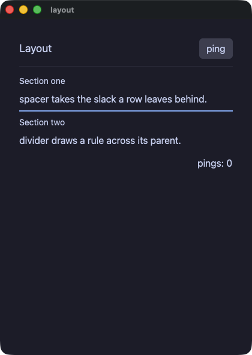

??? note "layout.rb"

    ```ruby
    # spacer and divider: a filler and a rule. The header row's spacer
    # pushes "ping" to the far edge; the footer's does the same for the
    # count. divider draws the rules, the second one heavier and colored.
    require "wakakusa"

    class Layout
      def initialize
        @pings = 0
      end

      def view
        column(
          row(
            text("Layout", size: 18.0),
            spacer,
            button("ping") { @pings += 1 }
          ),
          divider,
          column(
            text("Section one", size: 14.0),
            text("spacer takes the slack a row leaves behind."),
            divider(thickness: 2.0, color: "accent"),
            text("Section two", size: 14.0),
            text("divider draws a rule across its parent."),
            spacing: 6.0
          ),
          row(
            spacer,
            text("pings: #{@pings}")
          ),
          spacing: 12.0,
          padding: 16.0
        )
      end
    end

    run(Layout.new, title: "layout")
    ```

#### cards — a piece of screen with a name is a method, and one that wraps other elements takes them as arguments
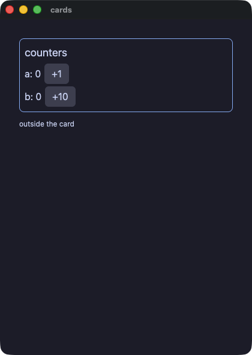

??? note "cards.rb"

    ```ruby
    # A piece of screen with a name is a method that answers an element,
    # and one that wraps other elements takes them as arguments.
    require "wakakusa"

    class Cards
      def initialize
        @a = 0
        @b = 0
      end

      def card(title, *kids)
        column(
          text(title, size: 18.0),
          *kids,
          spacing: 4.0, padding: 8.0,
          border_width: 1.0, border_color: "accent", border_radius: 8.0
        )
      end

      def view
        column(
          card("counters",
               row(text("a: #{@a}"), button("+1") { @a += 1 }, spacing: 6.0),
               row(text("b: #{@b}"), button("+10") { @b += 10 }, spacing: 6.0)),
          text("outside the card", size: 12.0),
          spacing: 10.0,
          padding: 16.0
        )
      end
    end

    run(Cards.new, title: "cards")
    ```

#### styled — a look kept in one place: a Hash merged and splatted, and `theme:` flipping a whole panel
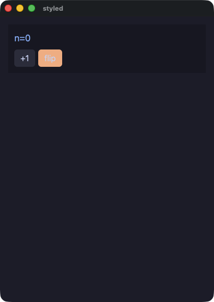

??? note "styled.rb"

    ```ruby
    # A look kept in one place: a Hash of properties, merged and handed to
    # an element with `**`. `theme:` swaps the palette its subtree resolves
    # colors in, so one keyword flips the whole panel.
    require "wakakusa"

    CHIP = { size: 18.0, color: "accent" }.freeze
    KEY = { background: "#313244", hover_background: "#45475a" }.freeze
    HOT = { background: "#fab387" }.freeze
    KEY_HOT = KEY.merge(HOT).freeze

    class Styled
      def initialize
        @mode = "dark"
        @n = 0
      end

      def flip
        @mode = @mode == "dark" ? "light" : "dark"
      end

      def view
        column(
          text("n=#{@n}", **CHIP),
          row(
            button("+1", **KEY) { @n += 1 },
            button("flip", **KEY_HOT) { flip },
            spacing: 6.0
          ),
          spacing: 8.0, padding: 12.0, background: "panel", theme: @mode
        )
      end
    end

    run(Styled.new, title: "styled")
    ```

#### badges — text as a pill, and the rest of what a run of text can be: monospace, underlined, italic, clipped, clamped
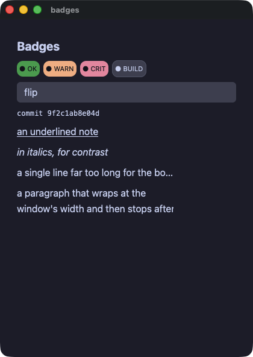

??? note "badges.rb"

    ```ruby
    # Text as a pill: a background with padding and a radius. And the rest
    # of what a run of text can be — monospace, underlined, italic, clipped
    # with an ellipsis, or wrapped and then clamped.
    require "wakakusa"

    PILL = { size: 11.0, color: "#11111b", padding: 4.0, border_radius: 10.0 }.freeze
    PILL_OK = PILL.merge({ background: "#2fa84f" }).freeze
    PILL_WARN = PILL.merge({ background: "#fab387" }).freeze
    PILL_CRIT = PILL.merge({ background: "#f38ba8" }).freeze

    class Badges
      def initialize
        @tint = "#45475a"
        @hot = false
      end

      def flip
        @hot = !@hot
        @tint = @hot ? "#f38ba8" : "#45475a"
      end

      def view
        column(
          text("Badges", size: 20.0, bold: true),
          row(
            text("● OK", **PILL_OK),
            text("● WARN", **PILL_WARN),
            text("● CRIT", **PILL_CRIT),
            text("● BUILD", size: 11.0, color: "#cdd6f4", background: @tint,
                 padding: 4.0, border_radius: 10.0, border_width: 1.0,
                 border_color: "#585b70"),
            spacing: 6.0
          ),
          button("flip") { flip },
          text("commit 9f2c1ab8e04d", mono: true, size: 12.0),
          text("an underlined note", underline: true),
          text("in italics, for contrast", italic: true),
          # An ellipsis needs a bounded box to clip against.
          text("a single line far too long for the box it was given, so it ends in an ellipsis",
               wrap: "ellipsis", width: 260.0),
          # The clamp is the other half: this one wraps, then stops.
          text("a paragraph that wraps at the window's width and then stops after two lines, " \
               "because a clamped label is what a card summary wants",
               max_lines: 2, width: 260.0),
          spacing: 8.0,
          padding: 12.0
        )
      end
    end

    run(Badges.new, title: "badges")
    ```

#### panels — the elements that arrange or cover: tracks, layers, panes that scroll, and a panel over the rest of the window
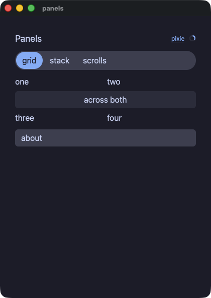

??? note "panels.rb"

    ```ruby
    # The elements that arrange or cover: tracks, layers, panes that
    # scroll, and a panel over the rest of the window.
    require "wakakusa"

    class Panels
      def initialize
        @open = false
        @view = 0
        @views = ["grid", "stack", "scrolls"]
      end

      def tracks
        grid(
          text("one"), text("two"),
          grid_cell(text("across both", align: "center", background: "#313244",
                         padding: 4.0, border_radius: 6.0), col_span: 2),
          text("three"), text("four"),
          columns: 2, spacing: 6.0
        )
      end

      def layers
        stack(
          image("demo/assets/postcard.png", width: 180.0, height: 90.0),
          text("over the picture", size: 14.0, color: "#11111b",
               background: "#f9e2af", padding: 4.0)
        )
      end

      def scrolls
        column(
          scroll_view(
            column(*(1..12).map { |n| text("line #{n}") }, spacing: 2.0),
            height: 90.0
          ),
          h_scroll_view(
            row(*(1..10).map { |n| text("col #{n}", width: 70.0) }, spacing: 6.0)
          ),
          spacing: 8.0
        )
      end

      def panel
        return tracks if @view == 0
        return layers if @view == 1

        scrolls
      end

      def view
        stack(
          column(
            row(
              text("Panels", size: 18.0),
              spacer,
              link("pixie", "https://example.invalid", size: 12.0),
              spinner(size: 14.0),
              spacing: 8.0
            ),
            segmented(options: @views, selected: @view) { |i| @view = i },
            panel,
            button("about") { @open = true },
            spacing: 10.0,
            padding: 14.0
          ),
          modal(
            column(
              text("A panel over the rest of it.", size: 14.0),
              button("close") { @open = false },
              spacing: 8.0, padding: 12.0, background: "panel"
            ),
            open: @open
          )
        )
      end
    end

    run(Panels.new, title: "panels")
    ```

#### dialog — a panel over the rest of the window, opened and closed by the app
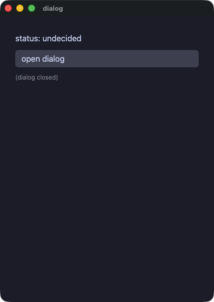

??? note "dialog.rb"

    ```ruby
    # A panel over the rest of the window, opened and closed by the app.
    require "wakakusa"

    class Dialog
      def initialize
        @show = false
        @status = "undecided"
      end

      def decide(answer)
        @status = answer
        @show = false
      end

      def view
        column(spacing: 10.0, padding: 14.0) {
          text "status: #{@status}", size: 16.0
          button("open dialog") { @show = true }
          if @show
            modal {
              text "accept the terms?", size: 18.0
              row(spacing: 8.0) {
                button("accept") { decide("accepted") }
                button("decline") { decide("declined") }
              }
            }
          else
            text "(dialog closed)", size: 12.0, color: "#8a8f98"
          end
        }
      end
    end

    run(Dialog.new, title: "dialog")
    ```

#### labels — what a screen reader is told and what the pointer shows; `role:` takes a value, so a line is a heading until it is not
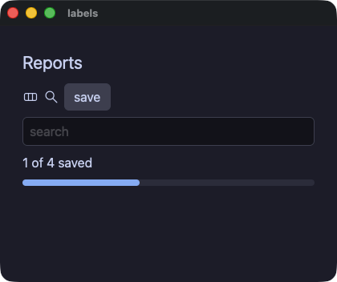

??? note "labels.rb"

    ```ruby
    # What a screen reader is told, and what the pointer shows. `role:`
    # takes a value, so the summary line is a heading until there is a
    # result under it and then it is not.
    require "wakakusa"

    class Labels
      def initialize
        @title = "Reports"
        @query = ""
        @summary_role = "heading"
      end

      def view
        column(
          text(@title, size: 22.0, role: "heading"),
          row(
            svg("demo/assets/yokan.svg", width: 20.0, height: 20.0, a11y_label: "Yokan"),
            svg("demo/assets/search.svg", width: 20.0, height: 20.0, a11y_label: "Search"),
            # The one element carrying a tooltip, a role, a name and a tween
            # at once, which is what pins the order they wrap in.
            button("save", animate: 150.0, easing: "out", role: "button",
                   a11y_label: "Save the report", tooltip: "Save this report") do
              @summary_role = "label"
            end,
            spacing: 6.0, role: "group", a11y_label: "toolbar"
          ),
          text_field(@query, placeholder: "search", a11y_label: "search") { |q| @query = q },
          text("1 of 4 saved", role: @summary_role),
          progress(0.4),
          spacing: 8.0,
          padding: 12.0
        )
      end
    end

    run(Labels.new, title: "labels", width: 420.0, height: 320.0)
    ```

#### shared — the properties every element takes, on elements that have nothing else in common
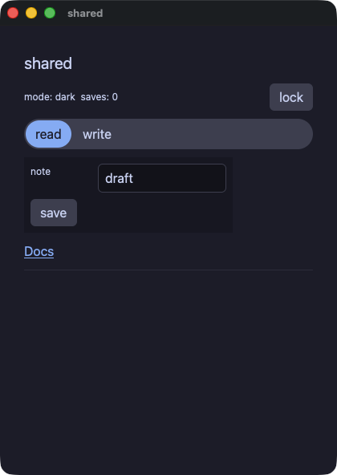

??? note "shared.rb"

    ```ruby
    # The properties every element takes, on elements that have nothing
    # else in common: a theme scope on a spacer, a box around a column, a
    # tween on a chooser, a tooltip on a rule, and the lock that makes a
    # field and a button inert.
    require "wakakusa"

    class Locks
      def initialize
        @locked = false
        @saves = 0
        # The palette the spacer's subtree resolves its tokens in — a
        # property takes a value, not just a literal, so the lock switches it.
        @mode = "dark"
        @tab = 0
        @note = "draft"
      end

      def flip
        @locked = !@locked
        @mode = @locked ? "light" : "dark"
      end

      def view
        column(
          text("shared", size: 20.0, role: "heading"),
          row(
            text("mode: #{@mode}  saves: #{@saves}", size: 12.0),
            # A theme scope on a spacer: the property is the element's,
            # whichever element it is.
            spacer(grow: 1.0, theme: @mode),
            button("lock", tooltip: "flip the lock") { flip },
            spacing: 8.0
          ),
          segmented(options: ["read", "write"], selected: @tab,
                    animate: 120.0, easing: "out") { |i| @tab = i },
          # A box around the section: 260 wide, never under 200.
          column(
            # The field takes two of the grid's three tracks, and goes inert
            # with the lock.
            grid(
              text("note", size: 12.0),
              text_field(@note, col_span: 2, disabled: @locked) { |t| @note = t },
              columns: 3, spacing: 8.0
            ),
            button("save", disabled: @locked, tooltip: "count a save") { @saves += 1 },
            width: 260.0, min_width: 200.0, spacing: 8.0, padding: 8.0, background: "panel"
          ),
          link("Docs", "https://i2y.github.io/yokan/", role: "button"),
          divider(tooltip: "the end of the shared properties"),
          spacing: 10.0,
          padding: 14.0
        )
      end
    end

    run(Locks.new, title: "shared")
    ```

#### loading — the bar that fills, in its three forms, and the sweep for work with no known length
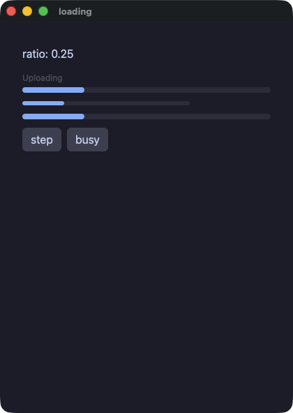

??? note "loading.rb"

    ```ruby
    # The bar that fills, in its three forms: with a caption above it, at a
    # size the app chose, and sweeping for work with no known length.
    require "wakakusa"

    class Loading
      def initialize
        @ratio = 0.25
        @busy = false
      end

      def step
        @ratio = @ratio >= 1.0 ? 0.0 : @ratio + 0.25
      end

      def view
        column(
          text("ratio: #{@ratio}"),
          progress(@ratio, label: "Uploading"),
          progress(@ratio, width: 240.0, height: 6.0),
          progress(@ratio, indeterminate: @busy),
          row(
            button("step") { step },
            button("busy") { @busy = !@busy },
            spacing: 8.0
          ),
          spacing: 12.0,
          padding: 16.0
        )
      end
    end

    run(Loading.new, title: "loading")
    ```

#### filter — a chooser that changes what a list shows, with the rows built on demand
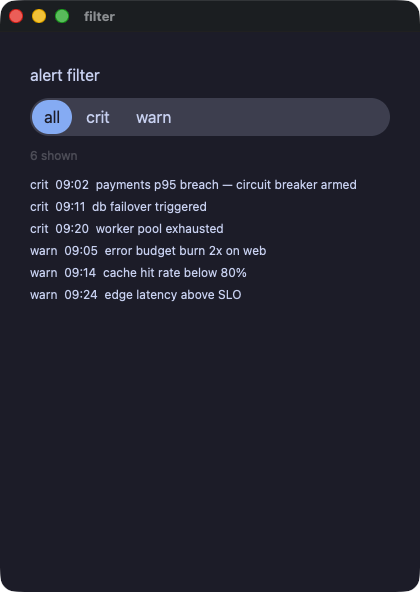

??? note "filter.rb"

    ```ruby
    # A chooser that changes what a list shows. The rows are built on
    # demand, so the list is asked only for the ones in view.
    require "wakakusa"

    class Alerts
      def initialize
        @levels = ["all", "crit", "warn"]
        @level = 0
        @crit = [
          "crit  09:02  payments p95 breach — circuit breaker armed",
          "crit  09:11  db failover triggered",
          "crit  09:20  worker pool exhausted",
        ]
        @warn = [
          "warn  09:05  error budget burn 2x on web",
          "warn  09:14  cache hit rate below 80%",
          "warn  09:24  edge latency above SLO",
        ]
        @visible = @crit + @warn
      end

      def pick(i)
        @level = i
        @visible = case i
                   when 1 then @crit
                   when 2 then @warn
                   else @crit + @warn
                   end
      end

      def alert_row(i)
        text(@visible[i], size: 12.0)
      end

      def view
        column(
          text("alert filter", size: 16.0),
          segmented(options: @levels, selected: @level) { |i| pick(i) },
          text("#{@visible.length} shown", size: 12.0, color: "textDim"),
          list_view(@visible.length, item_height: 22.0, height: 150.0) { |i| alert_row(i) },
          spacing: 10.0,
          padding: 14.0
        )
      end
    end

    run(Alerts.new, title: "filter")
    ```

## Lists, tables and charts

#### table — `data_table` draws the table itself: the first row is the header, the later ones are shaded in alternation
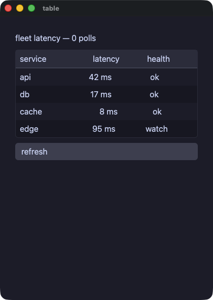

??? note "table.rb"

    ```ruby
    # data_table draws the table itself: the first row inside it is the
    # header, every later row is a data row shaded in alternation, and the
    # frame comes with the element. Columns line up because the cells of
    # one column carry the same `grow` share.
    require "wakakusa"

    class Fleet
      def initialize
        @latency = { "api" => 42, "db" => 17, "cache" => 8, "edge" => 95 }
        @polls = 0
      end

      def refresh
        @polls += 1
        @latency["api"] = (@latency["api"] * 3 + 29) % 140
        @latency["db"] = (@latency["db"] * 5 + 11) % 140
        @latency["cache"] = (@latency["cache"] * 7 + 3) % 140
        @latency["edge"] = (@latency["edge"] * 2 + 47) % 140
      end

      def health(ms)
        label = "ok"
        label = "watch" if ms > 60
        label = "slow" if ms > 100
        label
      end

      def service_row(name)
        row(
          text(name, grow: 2.0),
          text("#{@latency[name]} ms", grow: 1.0, align: "right"),
          text(health(@latency[name]), grow: 1.0, align: "center"),
          spacing: 8.0
        )
      end

      def view
        column(
          text("fleet latency — #{@polls} polls", size: 16.0),
          data_table(
            row(
              text("service", grow: 2.0),
              text("latency", grow: 1.0, align: "right"),
              text("health", grow: 1.0, align: "center"),
              spacing: 8.0
            ),
            service_row("api"),
            service_row("db"),
            service_row("cache"),
            service_row("edge")
          ),
          button("refresh") { refresh },
          spacing: 10.0,
          padding: 14.0
        )
      end
    end

    run(Fleet.new, title: "table")
    ```

#### roster — the table that builds its rows on demand, with row selection and header sort the app performs itself
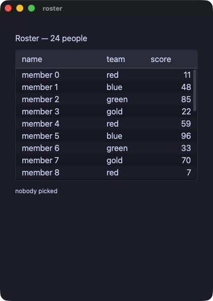

??? note "roster.rb"

    ```ruby
    # The table that builds its rows on demand: the block builds row i as a
    # row of one cell per column, and the header and the rows sit on tracks
    # whose shares are `widths`. Picking a row and sorting a column are the
    # app's own methods, named rather than handed over.
    require "wakakusa"

    class Roster
      def initialize
        @teams = ["red", "blue", "green", "gold"]
        @names = []
        @team_of = []
        @scores = []
        24.times do |i|
          @names.push("member #{i}")
          @team_of.push(@teams[i % 4])
          @scores.push((i * 37 + 11) % 100)
        end
        @sel = -1
        @line = ""
        @sort = -1
        @desc = false
      end

      def pick(i)
        @sel = i
        @line = "#{@names[i]} (#{@team_of[i]}, #{@scores[i]})"
      end

      def sort_by(col)
        @desc = col == @sort ? !@desc : false
        @sort = col
        order = (0...@names.length).to_a
        order.sort_by! { |i| col == 2 ? @scores[i] : @names[i] }
        order.reverse! if @desc
        @names = order.map { |i| @names[i] }
        @team_of = order.map { |i| @team_of[i] }
        @scores = order.map { |i| @scores[i] }
        @sel = -1
        @line = ""
      end

      def line(i)
        row(
          text(@names[i], grow: 2.0),
          text(@team_of[i], grow: 1.0),
          text(@scores[i].to_s, grow: 1.0, align: "right")
        )
      end

      def view
        column(
          text("Roster — #{@names.length} people", size: 16.0),
          table(["name", "team", "score"], @names.length,
                widths: [2.0, 1.0, 1.0], height: 220.0,
                selected: @sel, sort: @sort, descending: @desc,
                on_select: -> { pick(event_index) },
                on_sort: -> { sort_by(event_index) }) { |i| line(i) },
          text(@line.empty? ? "nobody picked" : @line, size: 12.0),
          spacing: 10.0,
          padding: 14.0
        )
      end
    end

    run(Roster.new, title: "roster")
    ```

#### csv_viewer — a hundred thousand rows, filtered as you type; only the rows in the window are ever built
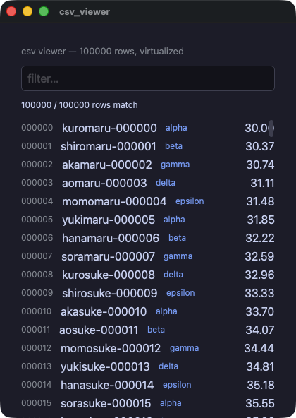

??? note "csv_viewer.rb"

    ```ruby
    # A hundred thousand rows, filtered as you type. The list is
    # virtualized: only the rows in the window are ever built, so the
    # filter is the only thing that touches all of them.
    #
    # The numbers are arithmetic rather than random, because the two runs
    # do not share a generator and a viewer whose rows cannot be compared
    # would not be worth gating.
    require "wakakusa"

    N = 100_000
    CATS = %w[alpha beta gamma delta epsilon].freeze
    STEMS = %w[kuro shiro aka ao momo yuki hana sora].freeze
    TAILS = %w[maru suke chan gou ta emon].freeze

    class Viewer
      def initialize
        @names = Array.new(N) { |i| format("%s%s-%06d", STEMS[i % 8], TAILS[(i / 8) % 6], i) }
        @cats = Array.new(N) { |i| CATS[i % 5] }
        @values = Array.new(N) { |i| ((i * 37 % 4000) / 100.0) + 30.0 }
        @q = ""
        @idx = (0...N).to_a
      end

      def filter(q)
        @q = q
        @idx = if q.empty?
                 (0...N).to_a
               else
                 low = q.downcase
                 (0...N).select { |i| @names[i].include?(low) || @cats[i].include?(low) }
               end
      end

      def line(k)
        i = @idx[k]
        row(spacing: 12.0) {
          text format("%06d", i), size: 12.0, color: "#8a8f98"
          text @names[i], grow: 1.0
          text @cats[i], size: 12.0, color: "#7aa2f7"
          text format("%.2f", @values[i]), align: "right"
        }
      end

      def view
        column(spacing: 10.0, padding: 14.0) {
          text "csv viewer — #{N} rows, virtualized", size: 13.0, color: "#8a8f98"
          text_field(@q, placeholder: "filter…") { |t| filter(t) }
          text "#{@idx.length} / #{N} rows match", size: 12.0
          list_view(@idx.length, item_height: 26.0, height: 430.0) { |k| line(k) }
        }
      end
    end

    run(Viewer.new, title: "csv_viewer")
    ```

#### trend — one list of numbers, drawn twice
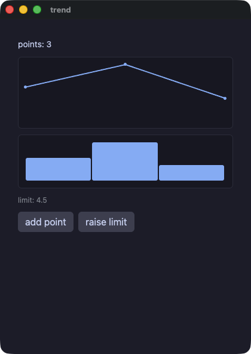

??? note "trend.rb"

    ```ruby
    # One list of numbers, drawn twice. A chart takes its data as its first
    # argument, so a view that computes the numbers reads in order.
    require "wakakusa"

    class Trend
      def initialize
        @values = [3.0, 5.0, 2.0]
        @limit = 4.5
      end

      def bump
        values = @values.dup
        values.push(8.0)
        @values = values
      end

      def view
        column(
          text("points: #{@values.length}", size: 14.0),
          line_chart(@values, height: 120.0),
          bar_chart(@values, height: 90.0),
          text("limit: #{format("%.1f", @limit)}", size: 12.0, color: "#8a8f98"),
          row(
            button("add point") { bump },
            button("raise limit") { @limit += 0.5 },
            spacing: 8.0
          ),
          spacing: 10.0,
          padding: 14.0
        )
      end
    end

    run(Trend.new, title: "trend")
    ```

#### charts — losses below the zero line, a pinned range, an axis with gridlines, and two series with their own colors
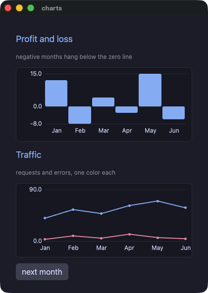

??? note "charts.rb"

    ```ruby
    # Charts that can say what they mean: a profit-and-loss bar chart whose
    # losing months hang below the zero line, and a two-series line chart.
    # `min`/`max` both zero take the range from the data; `axis` draws the
    # tick labels and a faint gridline at each; `series` takes one list per
    # line, `colors` one color each.
    require "wakakusa"

    HEADING = { size: 18.0, color: "accent" }.freeze
    FAINT = { size: 12.0, color: "#8a8f98" }.freeze

    class Book
      def initialize
        @months = ["Jan", "Feb", "Mar", "Apr", "May", "Jun"]
        @profit = [12.0, -8.0, 4.0, -3.0, 15.0, -6.0]
        @requests = [40.0, 55.0, 48.0, 62.0, 70.0, 58.0]
        @errors = [3.0, 9.0, 5.0, 12.0, 6.0, 4.0]
        @traffic = [@requests, @errors]
        @n = 6
      end

      def next_month
        @n += 1
        # A deterministic next month, so both runs read the same numbers
        # and the gate can compare them.
        @profit = grown(@profit, (@n * 7 % 41).to_f - 18.0)
        @months = grown(@months, "M#{@n}")
        @requests = grown(@requests, (@n * 13 % 50).to_f + 30.0)
        @errors = grown(@errors, (@n * 5 % 14).to_f)
        @traffic = [@requests, @errors]
      end

      # `list + [one]` on a field takes a different shape in the two runs;
      # a copy that is pushed to takes the same one in both.
      def grown(list, item)
        out = list.dup
        out.push(item)
        out
      end

      def view
        column(
          text("Profit and loss", **HEADING),
          text("negative months hang below the zero line", **FAINT),
          bar_chart(@profit, labels: @months, axis: true, height: 150.0),
          text("Traffic", **HEADING),
          text("requests and errors, one color each", **FAINT),
          line_chart(series: @traffic, labels: @months, colors: ["accent", "#f38ba8"],
                     axis: true, max: 90.0, height: 150.0),
          row(button("next month") { next_month }, spacing: 8.0),
          spacing: 12.0,
          padding: 16.0
        )
      end
    end

    run(Book.new, title: "charts")
    ```

## The canvas, and the two games

#### canvas — a grid of virtual pixels painted command by command, colors by palette index, and the keyboard read from the tick
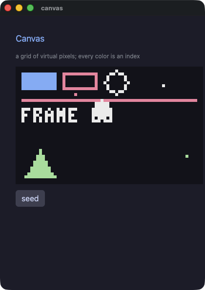

??? note "canvas.rb"

    ```ruby
    # A canvas: a grid of virtual pixels, painted command by command.
    #
    # `canvas(width, height, scale:, background:, palette:)` opens the grid
    # and its block paints — pixel, line, rect, rect_outline, circle,
    # circle_outline, triangle, triangle_outline, sprite and pixel_text.
    # `scale` says how many logical pixels one virtual pixel takes, so a
    # 64x40 canvas at six is 384x240 on screen.
    #
    # Every color is a NUMBER: the index of a color in `palette`. That is
    # how tools for pixel art work, so drawing code written for one moves
    # here with its numbers unchanged.
    #
    # The commands are not elements. Nothing here can be clicked, themed,
    # sized or animated, and a loop inside the canvas is the ordinary loop:
    # what its body paints joins the frame where it stands.
    require "wakakusa"

    HEADING = { size: 18.0, color: "accent" }.freeze
    FAINT = { size: 12.0, color: "#8a8f98" }.freeze

    # Five colors are enough to show that the index IS the color.
    PALETTE = ["#11111b", "#89b4fa", "#f38ba8", "#eeeeee", "#a6e3a1"].freeze

    class Blip
      attr_reader :x, :y, :c

      def initialize(x, y, c)
        @x = x
        @y = y
        @c = c
      end
    end

    class Sky
      def initialize
        @frame = 0
        @ball_x = 30
        @ball_y = 18
        @dx = 1
        @dy = 1
        @blips = []
        seed
      end

      def seed
        @blips = [Blip.new(6, 4, 1), Blip.new(20, 9, 2), Blip.new(50, 6, 3), Blip.new(58, 30, 4)]
      end

      def tick
        @frame += 1
        # The keyboard is read here, in the tick, never in a view.
        # `key_down` is "held right now", so holding an arrow steers.
        @dx = -1 if key_down("left")
        @dx = 1 if key_down("right")
        @dy = -@dy if key_pressed("space")
        x = @ball_x + @dx
        y = @ball_y + @dy
        if x < 4
          x = 4
          @dx = 1
        end
        if x > 59
          x = 59
          @dx = -1
        end
        if y < 4
          y = 4
          @dy = 1
        end
        if y > 35
          y = 35
          @dy = -1
        end
        @ball_x = x
        @ball_y = y
      end

      def blip(b)
        pixel(b.x, b.y, b.c)
      end

      def view
        column(spacing: 12.0, padding: 16.0) {
          text "Canvas", **HEADING
          text "a grid of virtual pixels; every color is an index", **FAINT
          canvas(64, 40, scale: 6, background: 0, palette: PALETTE) {
            rect(2, 2, 12, 6, 1)
            rect_outline(16, 2, 12, 6, 2)
            circle_outline(34, 5, 4, 3)
            line(2, 11, 61, 11, 2)
            triangle(3, 37, 8, 28, 13, 37, 4)
            @blips.each { |b| blip(b) }
            circle(@ball_x, @ball_y, 3, 3)
            pixel_text(2, 14, "FRAME #{@frame}", 3)
          }
          row(spacing: 8.0) {
            button("seed") { seed }
          }
        }
      end
    end

    app = Sky.new
    every(0.05) { app.tick }
    run(app, title: "canvas")
    ```

#### jump — Pyxel's jump game, ported: gravity, floors that fall away when you land on them, fruit, and scenery scrolling at its own speed


??? note "jump.rb"

    ```ruby
    # Pyxel Jump, ported to Wakakusa.
    #
    # The original is `02_jump_game.py` from Pyxel's examples (Takashi
    # Kitao, MIT, https://github.com/kitao/pyxel), and `assets/jump.png` is
    # that example's own image bank written out with Pyxel's palette. The
    # port follows it line by line: `pyxel.blt` becomes `sprite`,
    # `pyxel.btn` becomes `key_down`, `pyxel.cls(12)` becomes the canvas
    # background, and 12 still means the same color, because inside a
    # canvas a color is an index into the palette this file declares.
    #
    # What is different, and why. There is no sound: the engine has no
    # audio verb yet, so the three effects the original plays are gone. And
    # the numbers come from a generator written here rather than from
    # `rand`: a seeded `rand` gives the two runs different sequences, and a
    # game whose floors land in different places is not one the gate can
    # compare. Everything else is the game.
    #
    # Left and right move; the rest is gravity.
    require "wakakusa"

    WIDTH = 160
    HEIGHT = 120
    SKY = 12
    SHEET = "demo/assets/jump.png"

    PALETTE = [
      "#000000", "#2b335f", "#7e2072", "#19959c",
      "#8b4852", "#395c98", "#a9c1ff", "#eeeeee",
      "#d4186c", "#d38441", "#e9c35b", "#70c6a9",
      "#7696de", "#a3a3a3", "#ff9798", "#edc7b0"
    ].freeze

    # Whole numbers from arithmetic alone, so both runs draw one game.
    class Roll
      def initialize(seed)
        @s = seed
      end

      def int(lo, hi)
        @s = (@s * 1103515245 + 12345) % 2147483648
        lo + ((@s >> 8) % (hi - lo + 1))
      end
    end

    class Cloud
      attr_reader :x, :y

      def initialize(x, y)
        @x = x
        @y = y
      end
    end

    class Floor
      attr_reader :x, :y, :alive

      def initialize(x, y, alive)
        @x = x
        @y = y
        @alive = alive
      end
    end

    class Fruit
      attr_reader :x, :y, :kind, :alive

      def initialize(x, y, kind, alive)
        @x = x
        @y = y
        @kind = kind
        @alive = alive
      end
    end

    class Game
      def initialize
        @score = 0
        @px = 72
        @py = -16
        @dy = 0
        @alive = true
        @frame = 0
        # What the view needs whole: the parallax offsets and which of the
        # two player sprites to cut out.
        @tree_off = 0
        @far_off = 0
        @near_off = 0
        @player_u = 0
        @roll = Roll.new(11)
        @far = [Cloud.new(-10, 75), Cloud.new(40, 65), Cloud.new(90, 60)]
        @near = [Cloud.new(10, 25), Cloud.new(70, 35), Cloud.new(120, 15)]
        @floors = []
        @fruits = []
        4.times { |i| boot_one(i) }
      end

      def boot_one(i)
        @floors.push(Floor.new(i * 60, @roll.int(8, 104), true))
        @fruits.push(Fruit.new(i * 60, @roll.int(0, 104), @roll.int(0, 2), true))
      end

      def tick
        @frame += 1
        @tree_off = @frame % 160
        @far_off = (@frame / 16) % 160
        @near_off = (@frame / 8) % 160
        update_player
        update_floors
        update_fruits
      end

      def update_player
        @px = [@px - 2, 0].max if key_down("left")
        @px = [@px + 2, WIDTH - 16].min if key_down("right")
        @py += @dy
        @dy = [@dy + 1, 8].min
        @player_u = 0
        @player_u = 16 if @dy > 0
        return if @py <= HEIGHT

        @alive = false
        return if @py <= 600

        @score = 0
        @px = 72
        @py = -16
        @dy = 0
        @alive = true
      end

      # A floor the player lands on drops away and bounces them. The
      # original edits the tuple in the list; these are built fresh
      # instead, and `dy` is carried in a local because the bounce it
      # writes is what the floors after this one see.
      def update_floors
        out = []
        @floors.each { |f| out.push(next_floor(f)) }
        @floors = out
      end

      def next_floor(f)
        x = f.x
        y = f.y
        alive = f.alive
        if alive
          if @px + 16 >= x && @px <= x + 40 && @py + 16 >= y && @py <= y + 8 && @dy > 0
            alive = false
            @score += 10
            @dy = -12
          end
        else
          y += 6
        end
        x -= 4
        if x < -40
          x += 240
          y = @roll.int(8, 104)
          alive = true
        end
        Floor.new(x, y, alive)
      end

      def update_fruits
        out = []
        @fruits.each { |f| out.push(next_fruit(f)) }
        @fruits = out
      end

      def next_fruit(f)
        x = f.x
        y = f.y
        kind = f.kind
        alive = f.alive
        if alive && (x - @px).abs < 12 && (y - @py).abs < 12
          alive = false
          @score += (kind + 1) * 100
          @dy = [@dy, -8].min
        end
        x -= 2
        if x < -40
          x += 240
          y = @roll.int(0, 104)
          kind = @roll.int(0, 2)
          alive = true
        end
        Fruit.new(x, y, kind, alive)
      end

      def tree(i)
        sprite(i * 160 - @tree_off, 104, SHEET, 0, 48, 160, 16, colkey: SKY)
      end

      def far_cloud(c, i)
        sprite(c.x + i * 160 - @far_off, c.y, SHEET, 64, 32, 32, 8, colkey: SKY)
      end

      def near_cloud(c, i)
        sprite(c.x + i * 160 - @near_off, c.y, SHEET, 0, 32, 56, 8, colkey: SKY)
      end

      def far_strip(i)
        @far.each { |c| far_cloud(c, i) }
      end

      def near_strip(i)
        @near.each { |c| near_cloud(c, i) }
      end

      def floor_of(f)
        sprite(f.x, f.y, SHEET, 0, 16, 40, 8, colkey: SKY)
      end

      def fruit_of(f)
        sprite(f.x, f.y, SHEET, 32 + f.kind * 16, 0, 16, 16, colkey: SKY) if f.alive
      end

      def view
        column(spacing: 0.0, padding: 0.0) {
          canvas(WIDTH, HEIGHT, scale: 4, background: SKY, palette: PALETTE) {
            # sky, mountain, and the trees that scroll fastest
            sprite(0, 88, SHEET, 0, 88, 160, 32)
            sprite(0, 88, SHEET, 0, 64, 160, 24, colkey: SKY)
            2.times { |i| tree(i) }
            # two layers of cloud, each strip drawn twice so it wraps
            2.times { |i| far_strip(i) }
            2.times { |i| near_strip(i) }
            @floors.each { |f| floor_of(f) }
            @fruits.each { |f| fruit_of(f) }
            sprite(@px, @py, SHEET, @player_u, 0, 16, 16, colkey: SKY)
            pixel_text(5, 4, format("SCORE %4d", @score), 1)
            pixel_text(4, 4, format("SCORE %4d", @score), 7)
          }
        }
      end
    end

    app = Game.new
    every(0.033) { app.tick }
    run(app, title: "Pyxel Jump", width: 640.0, height: 480.0, padding: 0.0)
    ```

#### shooter — Pyxel's shoot-'em-up, ported: scenes, parallax stars, enemies that sway as they fall, collisions and expanding blasts


??? note "shooter.rb"

    ```ruby
    # Pyxel Shooter, ported to Wakakusa.
    #
    # The original is `10_platformer.py`'s sibling `shooter.py` from
    # Pyxel's examples (Takashi Kitao, MIT,
    # https://github.com/kitao/pyxel), and `assets/shooter.png` is that
    # example's own image bank written out with Pyxel's palette.
    #
    # What is different, and why. There is no sound: the engine has no
    # audio verb yet. And the numbers come from a generator written here
    # rather than from `rand`, because a seeded `rand` gives the two runs
    # different sequences and a game whose enemies arrive in different
    # places is not one the gate can compare.
    #
    # Arrows move, space fires, enter starts and restarts, q closes.
    require "wakakusa"

    WIDTH = 120
    HEIGHT = 160

    SCENE_TITLE = 0
    SCENE_PLAY = 1
    SCENE_GAMEOVER = 2

    NUM_STARS = 100
    STAR_COLOR_HIGH = 12
    STAR_COLOR_LOW = 5

    PLAYER_WIDTH = 8
    PLAYER_HEIGHT = 8
    PLAYER_SPEED = 2

    BULLET_WIDTH = 2
    BULLET_HEIGHT = 8
    BULLET_COLOR = 11
    BULLET_SPEED = 4

    ENEMY_WIDTH = 8
    ENEMY_HEIGHT = 8
    # Pyxel's 1.5 px a frame, in tenths.
    ENEMY_SPEED = 15

    BLAST_START_RADIUS = 1
    BLAST_END_RADIUS = 8
    BLAST_COLOR_IN = 7
    BLAST_COLOR_OUT = 10

    SHEET = "demo/assets/shooter.png"

    # Pyxel's own sixteen colors, which is what makes the numbers in this
    # file mean what they mean in the original.
    PALETTE = [
      "#000000", "#2b335f", "#7e2072", "#19959c",
      "#8b4852", "#395c98", "#a9c1ff", "#eeeeee",
      "#d4186c", "#d38441", "#e9c35b", "#70c6a9",
      "#7696de", "#a3a3a3", "#ff9798", "#edc7b0"
    ].freeze

    # Whole numbers from arithmetic alone, so both runs play one game.
    class Roll
      def initialize(seed)
        @s = seed
      end

      def int(lo, hi)
        @s = (@s * 1103515245 + 12345) % 2147483648
        lo + ((@s >> 8) % (hi - lo + 1))
      end
    end

    class Star
      # `y` is what the canvas draws; `y10` is where the star really is.
      attr_reader :x, :y, :y10, :speed10, :col

      def initialize(x, y, y10, speed10, col)
        @x = x
        @y = y
        @y10 = y10
        @speed10 = speed10
        @col = col
      end
    end

    class Bullet
      attr_reader :x, :y

      def initialize(x, y)
        @x = x
        @y = y
      end
    end

    class Enemy
      attr_reader :x, :y, :x10, :y10, :flip, :offset

      def initialize(x, y, x10, y10, flip, offset)
        @x = x
        @y = y
        @x10 = x10
        @y10 = y10
        @flip = flip
        @offset = offset
      end
    end

    class Blast
      attr_reader :x, :y, :radius

      def initialize(x, y, radius)
        @x = x
        @y = y
        @radius = radius
      end
    end

    class Game
      def initialize
        @scene = SCENE_TITLE
        @score = 0
        @frame = 0
        @title_col = 0
        @px = 56
        @py = 140
        @stars = []
        @bullets = []
        @enemies = []
        @blasts = []
        @live_enemies = []
        @hit_bullets = []
        @player_struck = false
        @enemy_struck = false
        @roll = Roll.new(7)
        NUM_STARS.times { boot_star }
      end

      def boot_star
        x = @roll.int(0, WIDTH - 1)
        y = @roll.int(0, HEIGHT - 1)
        speed10 = @roll.int(10, 25)
        col = speed10 > 18 ? STAR_COLOR_HIGH : STAR_COLOR_LOW
        @stars.push(Star.new(x, y, y * 10, speed10, col))
      end

      def tick
        quit if key_pressed("q")
        @frame += 1
        @title_col = @frame % 16
        move_stars
        if @scene == SCENE_TITLE
          @scene = SCENE_PLAY if key_pressed("enter")
        elsif @scene == SCENE_PLAY
          play
        else
          over
        end
      end

      def move_stars
        out = []
        @stars.each { |s| out.push(next_star(s)) }
        @stars = out
      end

      def next_star(s)
        y10 = s.y10 + s.speed10
        y10 -= HEIGHT * 10 if y10 >= HEIGHT * 10
        Star.new(s.x, y10 / 10, y10, s.speed10, s.col)
      end

      def play
        if (@frame % 6).zero?
          x = @roll.int(0, WIDTH - ENEMY_WIDTH)
          @enemies.push(Enemy.new(x, 0, x * 10, 0, false, @roll.int(0, 59)))
        end
        collide
        move_player
        move_bullets
        move_enemies
        move_blasts
      end

      def over
        move_bullets
        move_enemies
        move_blasts
        return unless key_pressed("enter")

        @scene = SCENE_PLAY
        @px = 56
        @py = 140
        @score = 0
        @enemies = []
        @bullets = []
        @blasts = []
      end

      def move_player
        x = @px
        y = @py
        x -= PLAYER_SPEED if key_down("left")
        x += PLAYER_SPEED if key_down("right")
        y -= PLAYER_SPEED if key_down("up")
        y += PLAYER_SPEED if key_down("down")
        @px = [[x, 0].max, WIDTH - PLAYER_WIDTH].min
        @py = [[y, 0].max, HEIGHT - PLAYER_HEIGHT].min
        @bullets.push(Bullet.new(@px + 3, @py - 4)) if key_pressed("space")
      end

      def move_bullets
        out = []
        @bullets.each { |b| keep_bullet(out, b) }
        @bullets = out
      end

      def keep_bullet(out, b)
        y = b.y - BULLET_SPEED
        out.push(Bullet.new(b.x, y)) if y + BULLET_HEIGHT - 1 >= 0
      end

      def move_enemies
        out = []
        @enemies.each { |e| keep_enemy(out, e) }
        @enemies = out
      end

      def keep_enemy(out, e)
        x10 = e.x10
        flip = true
        if (@frame + e.offset) % 60 < 30
          x10 += ENEMY_SPEED
          flip = false
        else
          x10 -= ENEMY_SPEED
        end
        y10 = e.y10 + ENEMY_SPEED
        out.push(Enemy.new(x10 / 10, y10 / 10, x10, y10, flip, e.offset)) if y10 <= (HEIGHT - 1) * 10
      end

      def move_blasts
        out = []
        @blasts.each { |b| keep_blast(out, b) }
        @blasts = out
      end

      def keep_blast(out, b)
        r = b.radius + 1
        out.push(Blast.new(b.x, b.y, r)) if r <= BLAST_END_RADIUS
      end

      # The two rectangle tests, resolved into new lists. Where the
      # original sets `is_alive = False` and filters afterwards, this keeps
      # the ones that live.
      #
      # The three names below are a frame's working room rather than state
      # the game has: a block cannot write the local outside it, so what
      # the loop collects is collected on the object.
      def collide
        @live_enemies = []
        @hit_bullets = []
        @player_struck = false
        @enemies.each { |e| resolve(e) }
        live = []
        @bullets.each_with_index { |b, i| live.push(b) unless @hit_bullets.include?(i) }
        @enemies = @live_enemies
        @bullets = live
        @scene = SCENE_GAMEOVER if @player_struck
      end

      def resolve(e)
        @enemy_struck = false
        @bullets.each_with_index { |b, i| note_hit(e, b, i) }
        if @enemy_struck
          @blasts.push(Blast.new(e.x + 4, e.y + 4, BLAST_START_RADIUS))
          @score += 10
        elsif rammed?(e)
          @blasts.push(Blast.new(@px + 4, @py + 4, BLAST_START_RADIUS))
          @player_struck = true
        else
          @live_enemies.push(e)
        end
      end

      def note_hit(e, b, i)
        return unless shot?(e, b)

        @enemy_struck = true
        @hit_bullets.push(i)
      end

      def shot?(e, b)
        e.x + ENEMY_WIDTH > b.x && b.x + BULLET_WIDTH > e.x &&
          e.y + ENEMY_HEIGHT > b.y && b.y + BULLET_HEIGHT > e.y
      end

      def rammed?(e)
        @px + PLAYER_WIDTH > e.x && e.x + ENEMY_WIDTH > @px &&
          @py + PLAYER_HEIGHT > e.y && e.y + ENEMY_HEIGHT > @py
      end

      def star(s)
        pixel(s.x, s.y, s.col)
      end

      def bullet(b)
        rect(b.x, b.y, BULLET_WIDTH, BULLET_HEIGHT, BULLET_COLOR)
      end

      def enemy(e)
        sprite(e.x, e.y, SHEET, 8, 0, ENEMY_WIDTH, ENEMY_HEIGHT, colkey: 0, flip_x: e.flip)
      end

      def blast(b)
        circle(b.x, b.y, b.radius, BLAST_COLOR_IN)
        circle_outline(b.x, b.y, b.radius, BLAST_COLOR_OUT)
      end

      def view
        column(spacing: 0.0, padding: 0.0) {
          canvas(WIDTH, HEIGHT, scale: 4, background: 0, palette: PALETTE) {
            @stars.each { |s| star(s) }
            if @scene == SCENE_TITLE
              pixel_text(35, 66, "Pyxel Shooter", @title_col)
              pixel_text(31, 126, "- PRESS ENTER -", 13)
            elsif @scene == SCENE_PLAY
              sprite(@px, @py, SHEET, 0, 0, PLAYER_WIDTH, PLAYER_HEIGHT, colkey: 0)
            else
              pixel_text(43, 66, "GAME OVER", 8)
              pixel_text(31, 126, "- PRESS ENTER -", 13)
            end
            @bullets.each { |b| bullet(b) }
            @enemies.each { |e| enemy(e) }
            @blasts.each { |b| blast(b) }
            pixel_text(39, 4, format("SCORE %5d", @score), 7)
          }
        }
      end
    end

    app = Game.new
    every(0.033) { app.tick }
    # `padding: 0.0`: the canvas IS the app, so it paints to the window's
    # edge rather than sitting inside the engine's ring.
    run(app, title: "Pyxel Shooter", width: 480.0, height: 640.0, padding: 0.0)
    ```

## Ruby, files and data

#### stdlib — Ruby's own standard library under the gate: `Math`, `Time`, `JSON`, `CSV`, `format`, regular expressions, `Enumerable`
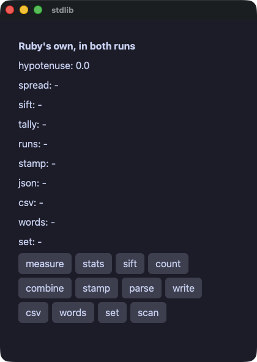

??? note "stdlib.rb"

    ```ruby
    # Ruby's own standard library, under the gate.
    #
    # Nothing here is Wakakusa's. `Math`, `Time`, `JSON`, `CSV`,
    # `format`, the regular expressions and everything Enumerable answers
    # are the language's, and both runs call the same ones. What the gate
    # says is that they answer the same — which is the only claim worth
    # making about a standard library shared between two implementations.
    require "wakakusa"
    require "json"
    require "csv"

    class Stdlib
      def initialize
        @hyp = 0.0
        @spread = "-"
        @sift = "-"
        @tally = "-"
        @runs = "-"
        @stamp = "-"
        @doc = "-"
        @row = "-"
        @words = "-"
        @unique = "-"
        @scores = [3, 5, 8, 13, 21]
        @votes = %w[ivy momo ivy ada momo ivy ada]
      end

      def measure
        @hyp = Math.sqrt(3.0 * 3.0 + 4.0 * 4.0)
      end

      def stats
        mean = @scores.sum.to_f / @scores.length
        sorted = @scores.sort
        median = sorted[sorted.length / 2]
        @spread = format("mean %.1f median %d min %d max %d",
                         mean, median, sorted.first, sorted.last)
      end

      def sift
        big = @scores.select { |n| n > 5 }
        small = @scores.reject { |n| n > 5 }
        @sift = "big #{big.join(",")} small #{small.join(",")}"
      end

      def count
        @tally = @votes.tally.sort_by { |name, n| [-n, name] }
                       .map { |name, n| "#{name}:#{n}" }.join(" ")
      end

      def combine
        steps = @scores.each_cons(2).map { |a, b| b - a }
        pairs = @scores.first(3).zip(%w[a b c]).map { |n, s| "#{s}#{n}" }
        @runs = "steps #{steps.join(",")} pairs #{pairs.join(",")}"
      end

      def stamp
        @stamp = Time.at(1_700_000_000).utc.strftime("%Y-%m-%d %H:%M:%S UTC")
      end

      def parse
        src = '{"name": "wakakusa", "parts": [1, 2, 3], "ok": true}'
        doc = JSON.parse(src)
        @doc = "#{doc["name"]} #{doc["parts"].sum} #{doc["ok"]}"
      end

      def write
        @doc = JSON.generate({ "n" => @scores.length, "top" => @scores.max })
      end

      def read_row
        @row = CSV.parse_line("api,42,\"one, two\"").join(" | ")
      end

      def words
        line = "  the quick brown fox  "
        @words = "#{line.strip.split.map(&:capitalize).join("-")} (#{line.strip.length})"
      end

      # The set of names, without repeats.
      def unique
        @unique = @votes.uniq.sort.join(",")
      end

      def find_numbers
        @spread = "a1b22c333".scan(/\d+/).map(&:to_i).sum.to_s
      end

      def view
        column(spacing: 6.0, padding: 14.0) {
          text "Ruby's own, in both runs", size: 16.0, bold: true
          text "hypotenuse: #{@hyp}"
          text "spread: #{@spread}"
          text "sift: #{@sift}"
          text "tally: #{@tally}"
          text "runs: #{@runs}"
          text "stamp: #{@stamp}"
          text "json: #{@doc}"
          text "csv: #{@row}"
          text "words: #{@words}"
          text "set: #{@unique}"
          row(spacing: 6.0) {
            button("measure") { measure }
            button("stats") { stats }
            button("sift") { sift }
            button("count") { count }
          }
          row(spacing: 6.0) {
            button("combine") { combine }
            button("stamp") { stamp }
            button("parse") { parse }
            button("write") { write }
          }
          row(spacing: 6.0) {
            button("csv") { read_row }
            button("words") { words }
            button("set") { unique }
            button("scan") { find_numbers }
          }
        }
      end
    end

    run(Stdlib.new, title: "stdlib")
    ```

#### files — files with Ruby's own `File` and `Dir`: nothing here is Wakakusa's
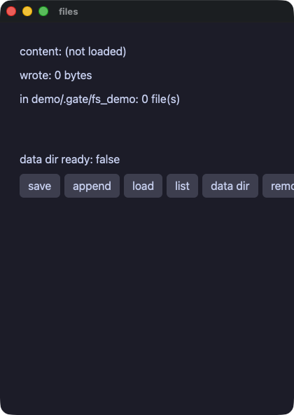

??? note "files.rb"

    ```ruby
    # Files, with Ruby's own File and Dir. Nothing here is Wakakusa's: both
    # runs call the same methods of the same standard library, and the gate
    # is what says they answer the same.
    require "wakakusa"

    DIR = "demo/.gate/fs_demo"
    NOTE = "demo/.gate/fs_demo/note.txt"

    class Files
      def initialize
        @content = "(not loaded)"
        @wrote = 0
        @names = []
        @ready = false
      end

      def save
        Dir.mkdir(DIR) unless Dir.exist?(DIR)
        @wrote = File.write(NOTE, "hello from one standard library")
      end

      def add_line
        File.write(NOTE, " (and again)", mode: "a")
      end

      def listing
        @names = Dir.children(DIR).sort
      end

      def clean
        File.delete(NOTE) if File.exist?(NOTE)
        listing
      end

      # A place of the app's own, made on the way out. A demo has no
      # business in someone's home directory, so this one keeps to the
      # directory the gate already writes in — and beside the one it lists,
      # not inside it, or the listing would depend on the order.
      def data_dir
        path = "demo/.gate/fs_demo_app"
        Dir.mkdir(path) unless Dir.exist?(path)
        @ready = Dir.exist?(path)
      end

      def entry(i)
        text @names[i]
      end

      def view
        column(spacing: 8.0, padding: 12.0) {
          text "content: #{@content}"
          text "wrote: #{@wrote} bytes"
          text "in #{DIR}: #{@names.length} file(s)"
          list_view(@names.length, item_height: 20.0, height: 44.0) { |i| entry(i) }
          text "data dir ready: #{@ready}"
          row(spacing: 6.0) {
            button("save") { save }
            button("append") { add_line }
            button("load") { @content = File.read(NOTE) }
            button("list") { listing }
            button("data dir") { data_dir }
            button("remove") { clean }
          }
        }
      end
    end

    run(Files.new, title: "files")
    ```

#### reader — a page fetched off the window's thread, from a server the app runs for itself, so both runs read the same bytes
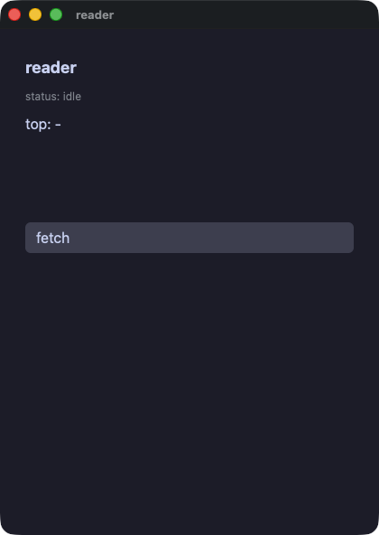

??? note "reader.rb"

    ```ruby
    # A page fetched and read, with nothing outside the machine involved:
    # the app serves the document to itself on a port the operating system
    # picks, so both runs read the same bytes and the gate can compare them.
    #
    # The fetch happens off the window's thread, which is what `task` is
    # for; the server answers on a thread of its own.
    require "wakakusa"
    require "net/http"
    require "uri"
    require "socket"
    require "json"

    BODY = '{"items": [' \
           '{"title": "wakakusa ships native ruby apps", "points": 128},' \
           '{"title": "one engine, two doors", "points": 64},' \
           '{"title": "the gate arbitrates", "points": 256}' \
           ']}'

    class Reader
      def initialize
        @status = "idle"
        @titles = []
        @top = "-"
        @port = 0
      end

      # A server that answers exactly one request and then closes. Serving
      # in a loop would leave a thread sitting in `accept`, and a compiled
      # run waits for its threads before it exits.
      def serve_one
        server = TCPServer.new("127.0.0.1", 0)
        @port = server.addr[1]
        Thread.new do
          socket = server.accept
          # past the request head: a blank line is where it ends
          loop do
            line = socket.gets
            break if line.nil? || line == "\r\n"
          end
          socket.print("HTTP/1.1 200 OK\r\nContent-Length: #{BODY.bytesize}\r\n" \
                       "Connection: close\r\n\r\n#{BODY}")
          socket.close
          server.close
        end
      end

      def fetch
        @status = "fetching"
        serve_one
        job = task { Net::HTTP.get(URI("http://127.0.0.1:#{@port}/")) }
        on_done(job) { read(task_answer) }
      end

      def read(body)
        doc = JSON.parse(body)
        items = doc["items"]
        @titles = items.map { |it| it["title"] }
        best = items.max_by { |it| it["points"] }
        @top = "#{best["title"]} (#{best["points"]})"
        @status = "read #{items.length} items"
      end

      def line(i)
        text @titles[i], size: 13.0
      end

      def view
        column(spacing: 8.0, padding: 12.0) {
          text "reader", size: 18.0, bold: true
          text "status: #{@status}", size: 12.0, color: "#8a8f98"
          text "top: #{@top}"
          list_view(@titles.length, item_height: 22.0, height: 80.0) { |i| line(i) }
          button("fetch") { fetch }
        }
      end
    end

    run(Reader.new, title: "reader")
    ```

#### dbnotes — a database reached through the engine, with the values bound rather than spliced
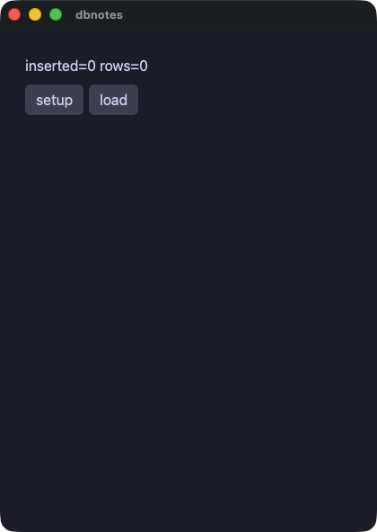

??? note "dbnotes.rb"

    ```ruby
    # A database, reached through the engine so that both runs call one
    # implementation. Write `?` in the statement and put the values beside
    # it, and text a person typed can never become part of the statement.
    require "wakakusa"

    DB = "demo/.gate/notes.db"

    class Notes
      def initialize
        @changed = 0
        @rows = []
      end

      def setup
        sqlite_exec(DB, "CREATE TABLE IF NOT EXISTS notes(t TEXT)")
        sqlite_exec(DB, "DELETE FROM notes")
        @changed = sqlite_exec(DB, "INSERT INTO notes VALUES ('alpha'),('beta'),('gamma')")
      end

      def load
        @rows = sqlite_column(DB, "SELECT t FROM notes ORDER BY t")
      end

      def note_row(i)
        text @rows[i]
      end

      def view
        column(spacing: 8.0, padding: 12.0) {
          text "inserted=#{@changed} rows=#{@rows.length}"
          row(spacing: 6.0) {
            button("setup") { setup }
            button("load") { load }
          }
          list_view(@rows.length, item_height: 22.0, height: 120.0) { |i| note_row(i) }
        }
      end
    end

    run(Notes.new, title: "dbnotes")
    ```

#### ledger — money kept in sqlite: an item called o'brien is an apostrophe and never a piece of SQL


??? note "ledger.rb"

    ```ruby
    # Money kept in a database, with the values bound rather than spliced:
    # an item called o'brien is an apostrophe and never a piece of SQL.
    require "wakakusa"

    DB = "demo/.gate/ledger.db"

    HEADING = { size: 20.0, color: "accent" }.freeze
    FAINT = { size: 12.0, color: "#8a8f98" }.freeze

    class Ledger
      def initialize
        @name = ""
        @amount = ""
        @count = 0
        @grand = 0
        @food = 0
        @transit = 0
        @fun = 0
        @rows = []
        load
      end

      def reset
        sqlite_exec(DB, "CREATE TABLE IF NOT EXISTS expenses(name TEXT, amount INTEGER, cat TEXT)")
        sqlite_exec(DB, "DELETE FROM expenses")
        load
      end

      def add(cat)
        yen = @amount.to_i
        return unless yen > 0

        sqlite_exec(DB, "INSERT INTO expenses VALUES (?, ?, ?)", [@name, yen, cat])
        load
      end

      def one_number(sql, params)
        rows = sqlite_rows(DB, sql, params)
        rows.empty? ? 0 : rows[0][0].to_i
      end

      def load
        @count = one_number("SELECT COUNT(*) FROM expenses", [])
        @grand = one_number("SELECT COALESCE(SUM(amount),0) FROM expenses", [])
        by = "SELECT COALESCE(SUM(amount),0) FROM expenses WHERE cat=?"
        @food = one_number(by, ["food"])
        @transit = one_number(by, ["transit"])
        @fun = one_number(by, ["fun"])
        # whole rows, every column as text: the line is written here rather
        # than assembled in SQL
        @rows = sqlite_rows(DB, "SELECT name, amount, cat FROM expenses ORDER BY rowid")
                    .map { |r| "#{r[0]}  ¥#{r[1]}  (#{r[2]})" }
      end

      def chart
        [@food.to_f, @transit.to_f, @fun.to_f]
      end

      def entry_row(i)
        text @rows[i]
      end

      def view
        column(spacing: 10.0, padding: 14.0, background: "panel") {
          text "ledger", **HEADING
          row(spacing: 6.0) {
            text_field(@name, placeholder: "item") { |t| @name = t }
            text_field(@amount, placeholder: "yen") { |t| @amount = t }
          }
          row(spacing: 6.0) {
            button("food") { add("food") }
            button("transit") { add("transit") }
            button("fun") { add("fun") }
            button("reset") { reset }
          }
          text "#{@count} entries, ¥#{@grand} in all", **FAINT
          text "food ¥#{@food} · transit ¥#{@transit} · fun ¥#{@fun}", **FAINT
          bar_chart(chart, labels: ["food", "transit", "fun"], axis: true, height: 90.0)
          list_view(@rows.length, item_height: 22.0, height: 120.0) { |i| entry_row(i) }
        }
      end
    end

    run(Ledger.new, title: "ledger")
    ```

#### edges — the edges: an index past the end of a list, and a number far past what a machine word holds
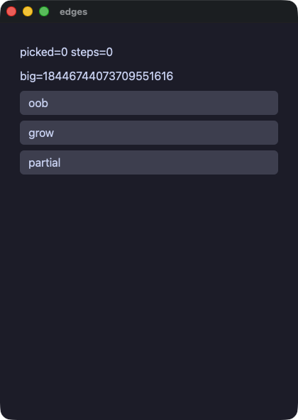

??? note "edges.rb"

    ```ruby
    # The edges: an index past the end of a list, and a number far past what
    # a machine word holds that keeps growing. Both runs have to answer the
    # same, and this is the demo that says so.
    #
    # The number starts big rather than growing into it. A value that begins
    # inside a machine word and then passes 2**63 is where the two runs part
    # company today: the compiled run keeps the slot it first chose and the
    # value wraps to zero, which the compiler's own notes call out.
    require "wakakusa"

    class Edges
      def initialize
        @xs = [7]
        @picked = 0
        @big = 18_446_744_073_709_551_616
        @steps = 0
      end

      def view
        column(
          text("picked=#{@picked} steps=#{@steps}"),
          text("big=#{@big}"),
          button("oob") { @picked = @xs[5].nil? ? -1 : @xs[5] },
          button("grow") { @big = @big * 4 },
          button("partial") do
            @steps += 1
            @picked = @xs[9].nil? ? -1 : @xs[9]
          end,
          spacing: 8.0,
          padding: 12.0
        )
      end
    end

    run(Edges.new, title: "edges")
    ```

#### flow — control flow in the handlers: a loop that skips, a loop that stops, a while, and a method that wraps another
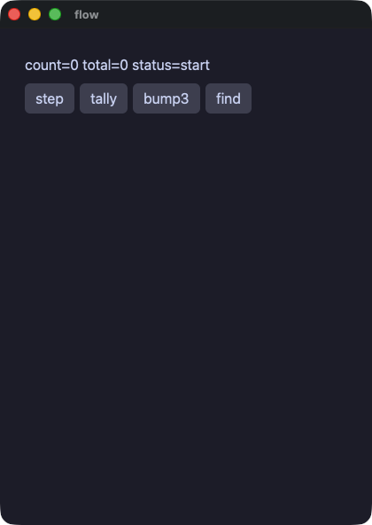

??? note "flow.rb"

    ```ruby
    # Control flow in the handlers: a loop that skips, a loop that stops, a
    # while, and a method that wraps another one. Both runs do the same
    # thing, which is what the gate compares.
    require "wakakusa"

    class Flow
      def initialize
        @count = 0
        @total = 0
        @status = "start"
      end

      def double(v)
        v * 2
      end

      # A wrapper around a handler: it says what it is doing, runs the
      # handler, and says it is done.
      def announced
        @status = "working"
        yield
        @status = "done"
      end

      def step
        @count += 1
        @status = if @count > 3 && @count < 100
                    "big"
                  elsif @count == 3
                    "three"
                  else
                    "small"
                  end
      end

      def tally
        @total = 0
        (1...6).each do |i|
          next if i == 3

          @total += double(i)
        end
      end

      def bump3
        announced do
          @count += 1 while @count < 3
        end
      end

      def find
        (0...10).each do |i|
          if i * i > 10
            @count = i
            break
          end
        end
      end

      def view
        column(spacing: 8.0, padding: 12.0) {
          text "count=#{@count} total=#{@total} status=#{@status}"
          row(spacing: 6.0) {
            button("step") { step }
            button("tally") { tally }
            button("bump3") { bump3 }
            button("find") { find }
          }
        }
      end
    end

    run(Flow.new, title: "flow")
    ```

## The window

#### keys — the keyboard as chords and the same handlers in the menu bar, driven with `key:cmd+s` and `menu:Save`
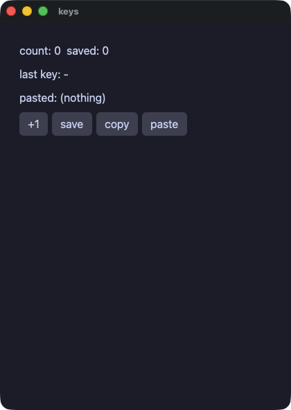

??? note "keys.rb"

    ```ruby
    # The keyboard as a set of chords, and the same handlers in the
    # application's menu bar. A script presses one with `key:cmd+s` and
    # picks one with `menu:Save`.
    require "wakakusa"

    class Keys
      def initialize
        @count = 0
        @saved = 0
        @last = "-"
        @pasted = "(nothing)"
      end

      def save
        @saved = @count
      end

      def clear
        @count = 0
        @saved = 0
      end

      def copy_count
        clipboard_set("count=#{@count}")
      end

      def paste
        @pasted = clipboard_get
      end

      def typed(key)
        @last = key
      end

      def view
        column(spacing: 8.0, padding: 12.0) {
          text "count: #{@count}  saved: #{@saved}"
          text "last key: #{@last}"
          text "pasted: #{@pasted}"
          row(spacing: 6.0) {
            button("+1") { @count += 1 }
            button("save") { save }
            button("copy") { copy_count }
            button("paste") { paste }
          }
        }
      end
    end

    app = Keys.new

    menu_item("Count", "Save") { app.save }
    menu_item("Count", "Clear") { app.clear }

    shortcut("cmd+s") { app.save }
    shortcut("cmd+shift+r") { app.clear }
    shortcut("cmd+shift+c") { app.copy_count }
    shortcut("cmd+shift+v") { app.paste }
    on_key { |chord| app.typed(chord) }

    run(app, title: "keys")
    ```

#### picker — the platform's own file panels, asked for off the window's thread, and a file dragged onto the window
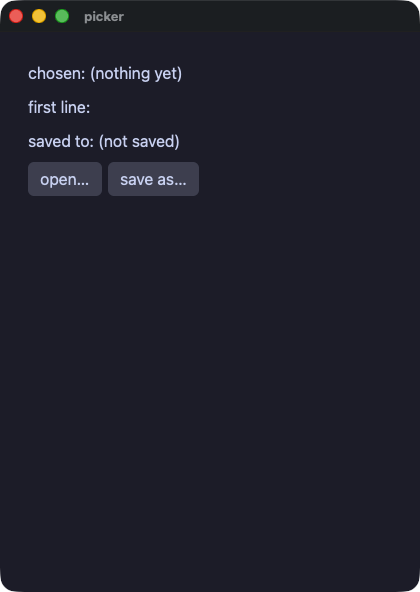

??? note "picker.rb"

    ```ruby
    # The platform's own panels, and a file dragged onto the window. A
    # dialog waits for a person, so it is asked for off the window's
    # thread; a script answers one with `file:<path>` and drops one with
    # `drop:<path>`.
    require "wakakusa"

    class Picker
      def initialize
        @chosen = "(nothing yet)"
        @body = ""
        @saved = "(not saved)"
      end

      def took(path)
        @chosen = path
        @body = read_or(path, "(unreadable)") unless path.empty?
      end

      def read_or(path, fallback)
        File.read(path)
      rescue SystemCallError
        fallback
      end

      def open_one
        job = task { open_dialog("Choose a file") }
        on_done(job) { took(task_answer) }
      end

      def save_as
        job = task { save_dialog("notes.txt") }
        on_done(job) do
          path = task_answer
          unless path.empty?
            File.write(path, @body)
            @saved = path
          end
        end
      end

      def view
        column(spacing: 8.0, padding: 12.0) {
          text "chosen: #{@chosen}"
          text "first line: #{@body[0, 40]}"
          text "saved to: #{@saved}"
          row(spacing: 6.0) {
            button("open…", tooltip: "the platform's own panel") { open_one }
            button("save as…") { save_as }
          }
        }
      end
    end

    app = Picker.new
    on_file_drop { |path| app.took(path) }
    run(app, title: "picker")
    ```

#### about — links that open a page, and the system clipboard
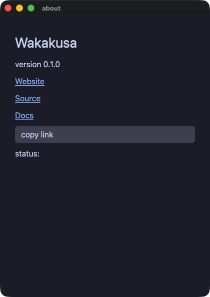

??? note "about.rb"

    ```ruby
    # Links that open a page, and the system clipboard.
    require "wakakusa"

    class About
      def initialize
        @status = ""
      end

      def view
        column(spacing: 8.0, padding: 14.0) {
          text "Wakakusa", size: 28.0
          text "version 0.1.0"
          link("Website", "https://i2y.github.io/yokan/")
          link("Source", "https://github.com/i2y/yokan")
          link("Docs", "https://i2y.github.io/yokan/tour/")
          button("copy link") do
            clipboard_set("https://github.com/i2y/yokan")
            @status = "copied"
          end
          text "status: #{@status}"
        }
      end
    end

    run(About.new, title: "about")
    ```

## Time, and work off the thread

#### dashboard — a timer declared before the app runs, ticking in both runs (the gate steps it with `advance:`)
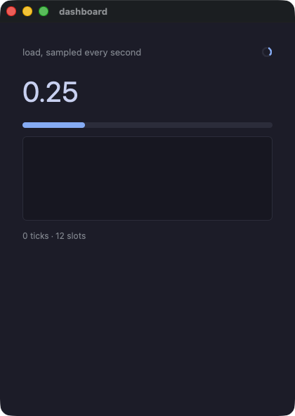

??? note "dashboard.rb"

    ```ruby
    # A timer: declared before the app runs, told every second. Both runs
    # tick off the same clock — a frame in a window, an `advance:` in a
    # script — so the same number of ticks lands in both.
    #
    # The step is arithmetic rather than a random number: the two runs draw
    # on different generators, and a dashboard that cannot be compared is
    # not worth gating.
    require "wakakusa"

    SLOTS = 12

    class Dashboard
      attr_reader :ticks

      def initialize
        @hist = Array.new(SLOTS, 0.0)
        @at = 0
        @ticks = 0
        @cur = 0.25
      end

      def tick
        @ticks += 1
        step = ((@ticks * 37 % 41).to_f / 100.0) - 0.2
        v = @cur + step
        v = 0.0 if v < 0.0
        v = 1.0 if v > 1.0
        @cur = v
        @hist[@at] = v
        @at = (@at + 1) % SLOTS
      end

      def view
        column(
          row(
            text("load, sampled every second", size: 13.0, color: "#8a8f98", grow: 1.0),
            spinner(size: 16.0),
            spacing: 8.0
          ),
          text(format("%.2f", @cur), size: 40.0),
          progress(@cur),
          line_chart(@hist, height: 120.0),
          text("#{@ticks} ticks · #{SLOTS} slots", size: 12.0, color: "#8a8f98"),
          spacing: 12.0,
          padding: 16.0
        )
      end
    end

    app = Dashboard.new
    every(1.0) { app.tick }
    run(app, title: "dashboard")
    ```

#### tasks — work that takes a while, done off the window's thread; the answer comes back through `on_done`
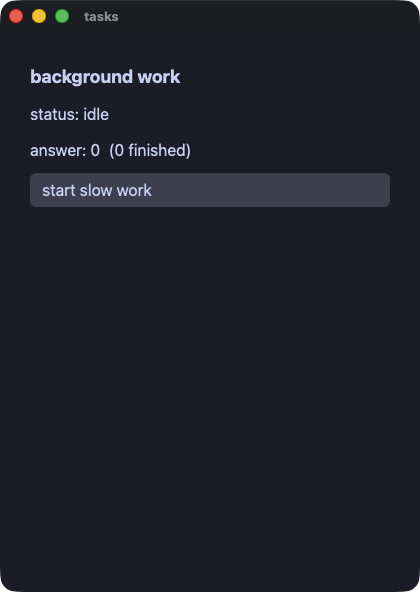

??? note "tasks.rb"

    ```ruby
    # Work that takes a while, done off the window's thread. `task` runs
    # the block on a thread of its own; when it answers, the app's
    # `on_done:` method is called on the window's thread with the answer.
    #
    # Nothing inside the work touches the app's state or the screen. That
    # is the whole rule, and it is why the handler asks for the answer with
    # `task_answer` rather than the worker writing it anywhere.
    require "wakakusa"

    class Jobs
      def initialize
        @status = "idle"
        @answer = 0
        @done = 0
      end

      def start
        @status = "working"
        job = task do
          # deliberately slow, and deliberately arithmetic: both runs have
          # to agree about what it answers.
          total = 0
          i = 0
          while i < 300_000
            total += i % 7
            i += 1
          end
          total
        end
        on_done(job) do
          @answer = task_answer
          @done += 1
          @status = "done"
        end
      end

      def view
        column(spacing: 10.0, padding: 14.0) {
          text "background work", size: 18.0, bold: true
          text "status: #{@status}"
          text "answer: #{@answer}  (#{@done} finished)"
          button("start slow work") { start }
        }
      end
    end

    run(Jobs.new, title: "tasks")
    ```

