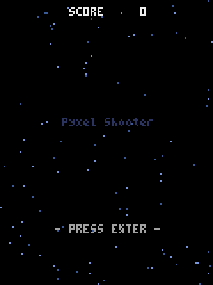
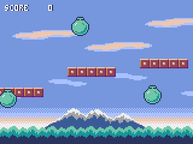

<div class="wk-hero" markdown>


# Wakakusa

<p class="wk-hero__tag">Write Ruby. Ship native.</p>

<p class="wk-hero__lede">
A compiler for Ruby desktop apps: <strong>what you run under CRuby is
what it ships as a native binary, and each build verifies it</strong>.
An app is a plain Ruby class; what Wakakusa adds is the methods that
build the screen. While you are working, the real interpreter is
answering; when you ship, the
whole program becomes one native binary — and
<code>wakakusa gate</code> drives both with the same script and
compares what they drew, byte for byte.
</p>

<div class="wk-hero__cta" markdown>
[Get started](installation.md){ .md-button .md-button--primary }
[Language tour](tour.md){ .md-button }
[Demos](demos.md){ .md-button }
[GitHub](https://github.com/i2y/yokan){ .md-button }
</div>
</div>

## The whole picture

One source, two roads to run it.


Both roads drive one engine, behind a C ABI: the interpreted run opens
it as a shared library, the compiled run links the static one. The
engine never holds a Ruby object, which is what lets an interpreter and
a compiled binary drive exactly the same code.

---

## What it looks like


*`demo/ledger.rb` — money kept in a database, every value bound rather
than spliced, with a chart over the totals. Ordinary Ruby; ships as one
native binary.*

---

## Write it, run it, ship it

The smallest complete app:

```ruby
require "wakakusa"

class Counter
  def initialize
    @count = 0
  end

  def view
    column(spacing: 12.0, padding: 16.0) {
      text "count: #{@count}", size: 34.0
      button("+1") { @count += 1 }
    }
  end
end

run(Counter.new, title: "counter")
```

An app is an object. Its state is its instance variables, `view`
answers one element, and a handler is a block that closes over it.
There is nothing to inherit from, nothing to register, and nothing to
mark as observable.

```console
$ ./bin/wakakusa run app.rb
```

That opens a window and watches the file. Save an edit and the window
picks it up: the file is read again, and the object the window is
holding answers with the new `view` while keeping every value it had —
`initialize` is not run again on it, which is the point.

Ship it:

```console
$ ./bin/wakakusa build demo/todo.rb --release --app
built: demo/.gate/todo (12.3 MB)
bundle: demo/dist/todo.app (12.5 MB)
  not gate-checked — `gate` with a script proves the two runs agree
```

The binary carries the engine and the compiled Ruby and links nothing
but the system's own libraries. The person receiving it installs
neither Ruby nor the compiler.

---

## "But it worked on my machine"

Hand it a sequence of interactions and it replays them against the
CRuby run and the compiled binary, then compares the resulting screens.
Wakakusa calls it the **gate**:

```console
$ ./bin/wakakusa gate app.rb --script "click:+1,dump"
GATE OK — 3 dump lines identical in both runs
```

The interpreted run *is* CRuby, so a green gate means the shipped
binary agrees with the real interpreter on everything the script
touched. The handful of places where the two are not the same program
are named, with reasons, on [The two runs](two-runs.md).

---

## Ruby's own library, in both runs

`File`, `Dir`, `JSON`, `CSV`, `Time`, `Math`, `Net::HTTP`, sockets,
threads, everything `Enumerable` answers — you write Ruby's library,
not a library of ours standing in front of it. Underneath, one run is
CRuby's implementation and the other the compiler's, and the gate is
what holds them together.

How much of Ruby you may write — CRuby's all of it, spinel's
compilable part, and Wakakusa's five further subtractions — is set out
in [Three Rubys, nested](two-runs.md#three-rubys-nested).

A database is the one exception, because it is no use unless both runs
read the one file the same way:

```ruby
sqlite_exec(DB, "INSERT INTO expenses VALUES (?, ?, ?)", [name, yen, cat])
rows = sqlite_rows(DB, "SELECT name, amount FROM expenses ORDER BY rowid")
```

---

## Two games, ported

Two of Pyxel's own examples (Takashi Kitao, MIT) are in the bundled
demos, ported almost line for line: the same pixel canvas, the same
thirty frames a second, the same keys read while they are held. A
script of keystrokes and frames replays both runs, so the gate compares
every frame of the game.

<p align="center">
  
  
</p>

*`demo/shooter.rb` and `demo/jump.rb` — inside a canvas a color is a
number, the index of a color in the palette, which is what lets drawing
code written for a pixel machine port with its numbers unchanged.*

---

## When an agent is writing it

An agent writes a file and reads what comes back, so what comes back
decides how the session goes. Two of the commands answer in well under
a second, with no compiler and no window: a refusal that names what to
write instead, and the screen as text. The gate is the proof at the
end.


[Building with an agent](agents.md) walks the whole loop.

---

## What else is in it

<div class="grid cards" markdown>

-   :material-table-large: __One table, one vocabulary__

    Thirty-three elements and fifteen shared keywords, written once in
    `elements.toml`. The Ruby an app calls, the numbers the engine
    counts with and its own constants are generated from it, so an
    element cannot mean two things.

-   :material-brush-variant: __A canvas, and the keyboard__

    A grid of virtual pixels painted command by command, colors by
    palette index, keys read as a device from the tick — and a PNG of
    any frame without opening a window at all.

-   :material-shield-check: __Refusals that teach__

    What the compiler cannot take is refused by name, with the line and
    the rewrite, before a compiler is ever started.

</div>

---

## Where next

<div class="grid cards" markdown>

-   :material-rocket-launch: __[Installation](installation.md)__

    What you need, the one-time setup, and the five commands. macOS on
    Apple silicon today.

-   :material-book-open-variant: __[Language tour](tour.md)__

    One pass over how apps are written — state, views, the canvas, the
    window, a database, the gate — closing with what does not work yet.

-   :material-view-gallery: __[Demos](demos.md)__

    Forty-three apps, each with its screenshot and its whole source.

-   :material-github: __[Source](https://github.com/i2y/yokan)__

    The compiler, the engine, and the demos.

</div>

---

_The name is 若草 — wakakusa, the first grass of the year._

_Wakakusa compiles Ruby; it is not part of the Ruby project._
