# デモ

どれも 1 ファイル（opsboard と multi はディレクトリ）で、リポジトリの `crates/yokan/` からそのまま動きます。

```console
$ cd crates/yokan
$ uv run demo/counter.py            # そのデモの名前に置き換える
$ ./tools/gate_all.sh               # 全デモをゲートで一括チェック
```

numpy を使う 3 本（pystats / csv_viewer / app）は `uv run --with numpy` で。
`app` `csv_viewer` `dashboard` `tasks` の 4 本は辞書 state を使う開発専用デモで、ゲート対象外です（[今できないこと](tour-ship.md#今できないこと)参照）。
スクリーンショットはすべて初期状態（起動直後）のものです。

## まず動きを見る

#### counter — いちばん小さいアプリ。同じアプリの別の書き方が counter_state.py（型付き State セル）と counter_with.py です


#### opsboard — 旗艦デモ。3 モジュール構成のダッシュボード（ストア 2 つ、直和型のヘルスモデル、チャート、仮想化アラートフィード、テーマ切替、fs へのレポート出力）


#### forms — フォーム部品一式。checkbox / switch / slider / select / radio_group / tab_bar、ハンドラは新しい値をひとつ受け取る


#### calc — 定番の電卓。レイアウトは `grow` だけで組んであり、ウィンドウを伸ばすとパッド全体が隙間なく追従する


#### calcgrid — 同じ電卓を `grid(columns=4, rows=5)` で。0 キーは `col_span=2` で 2 セルにまたがる


## 状態の持ち方

#### stores — 名前付きストア。クラス名がそのままシングルトンで、ストア同士のメソッド呼び出しもできる
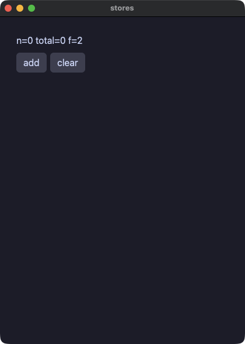

#### models — @model と Protocol。観測されるオブジェクトと、静的ディスパッチされるインターフェース


#### links — モデルがモデルを参照する。所有は `Node | None`、逆向きは `Weak[Node]`（循環しないので、根を手放すと連鎖ごと解放される）


#### stateful — @component + local。呼び出し位置ごとに独立した状態を持つ部品


#### lookup — 辞書セル。読みは `.get(key, default)`、`in`、そして `cell[k] = v` のその場書き込み


#### mixer — フィールドだけの @store。注釈付きフィールドへの直接代入で画面が追随する
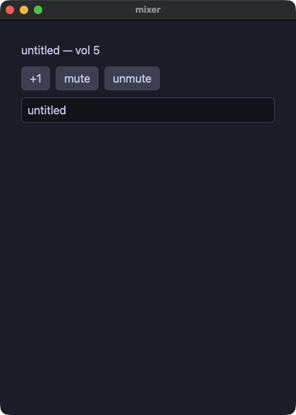

## 値と型

#### points — Value クラス（frozen dataclass）。書き換えは `replace` の関数的更新
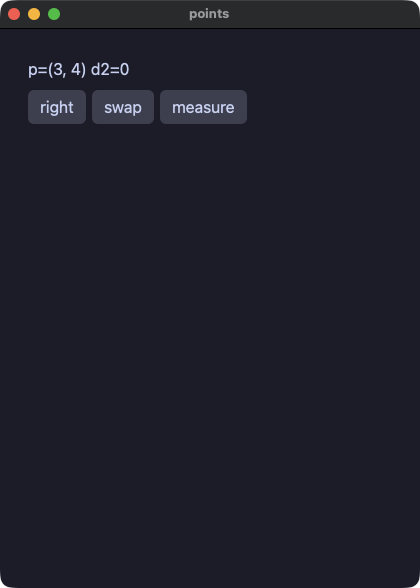

#### vecops — Value クラスの演算子。`__add__` / `__sub__` / `__mul__` を定義すると `+` `-` `*` がその意味になる
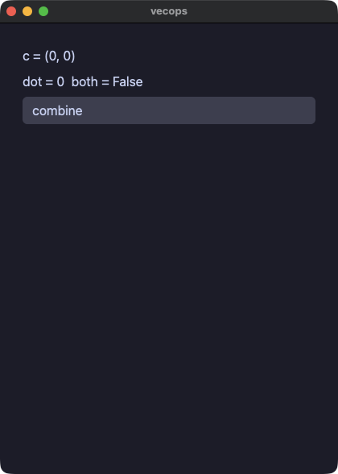

#### geometry — Protocol による静的ディスパッチ。トレイト相当がコンパイルされる


#### moods — Enum と Optional とアニメーション
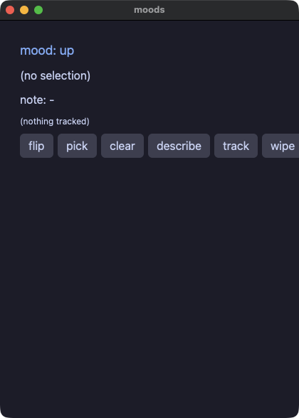

#### pyops — CPython と同じ算術。`/` `//` `%` `**`、負のインデックス、sorted() まで両実行でバイト一致


#### pytext — 素の float / bool / Enum の表示が Python の str() と一致する
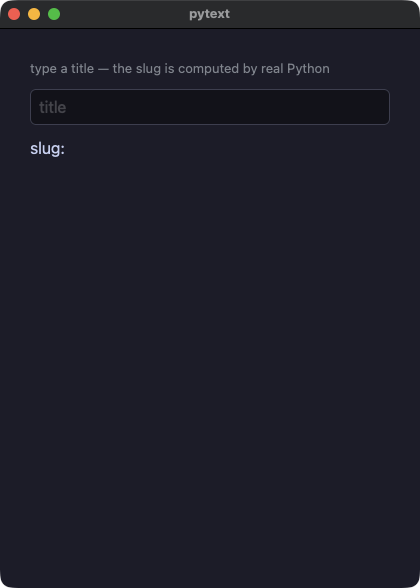

## 制御フローとエラー

#### flow — ハンドラの中の本物の制御フロー（if / elif / while / for / break / continue）


#### edges — 封じ込めの実証。範囲外アクセスもオーバーフローも、両実行で同じ文が同じように止まり、アプリは落ちない


#### tryfetch — try/except の全形。失敗する http 呼び出しを捕まえ、`f"{e}"` の文言まで両実行で一致する
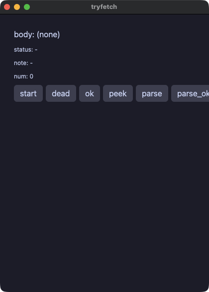

## 画面部品

#### todo — 定番の TODO リスト
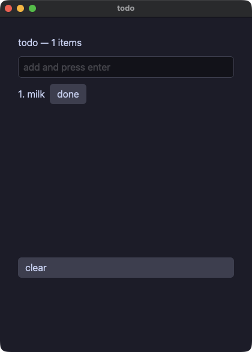

#### dialog — モーダル。「存在すること」が「開いていること」なので、`if` で包む


#### trend — ライン / バーチャート


#### styled — 名前付きスタイル（`style` + `**` 展開 + `|` 合成）とテーマスコープ


#### cards — スロット付きコンポーネント（子要素を受け取る部品）


## 標準ライブラリ

#### files — yokan.fs。書いて読み戻す（両実行が同じ実装を呼ぶ）


#### dbnotes — yokan.sqlite。行は SQL で形作り、ORDER BY で並べる


#### ledger — 実用アプリの形をした家計簿。sqlite に永続化する


#### webfetch — yokan.http。ゲートはネットワーク不要（@py のフィクスチャサーバを両実行に立てる）
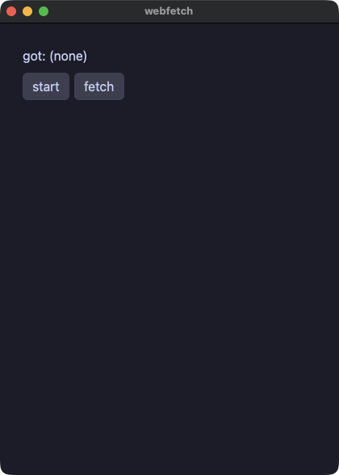

#### reader — http + json のフィードリーダー


#### stdlib — math / json / time


#### dice — yokan.random。種を撒けば両実行で同じ列


#### postcard — 画像とベクタアイコン、そして `notify.send`（`.app` バンドルとして動かすと通知センターに届く）
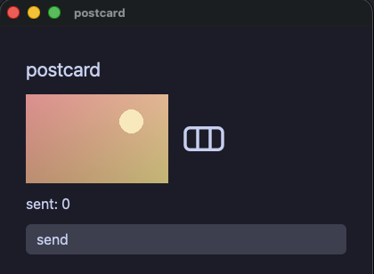

## Rust crate

#### rustcrate — `yokan add` で足した Rust crate。手元の path crate と crates.io の version crate が同居し、crate 本来の snake_case 名で呼ぶ。同じ宣言の pyproject 綴りが `demo/proj/`
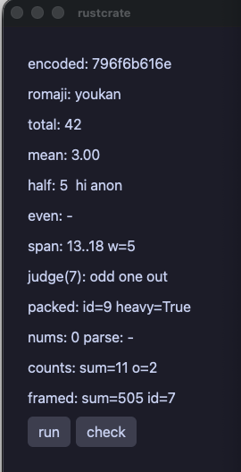

## CPython エスケープと開発専用

#### pystats — @py + numpy。エスケープした関数はリリースバイナリに CPython ごと同梱される
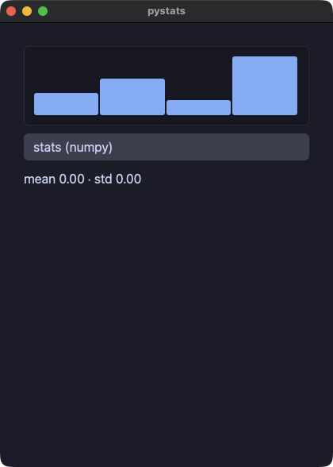

#### multi — マルチモジュール構成（state.py と widgets.py に分割、ヘルパはコンポーネントになる）
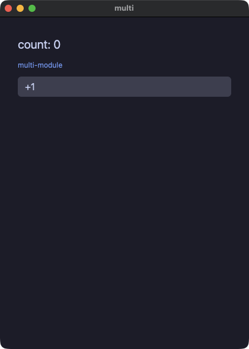

#### dashboard — every() が毎秒動かすロードアベレージ表示（開発専用: 辞書 state）


#### app — numpy 入りのダッシュボード（開発専用: 辞書 state）


#### csv_viewer — 10 万行の仮想化テーブル + numpy（開発専用: 辞書 state）


#### tasks — task() のワーカースレッド（開発専用: 辞書 state）
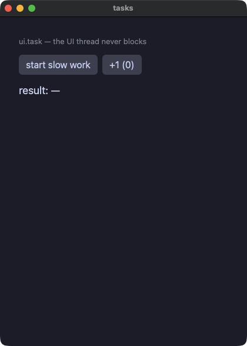
