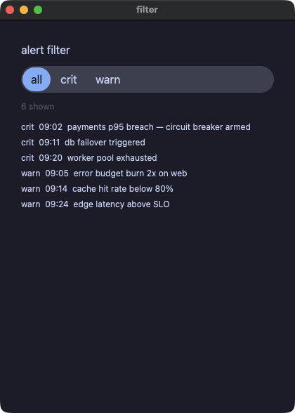
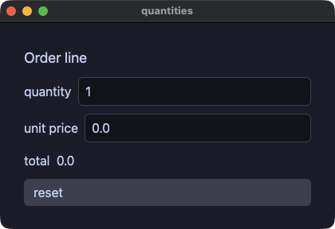
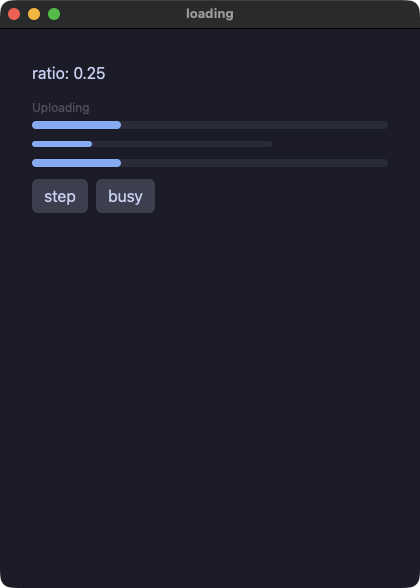
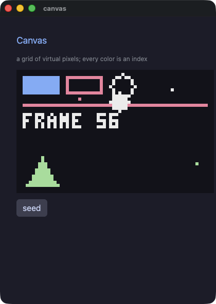
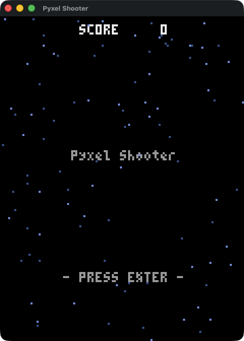
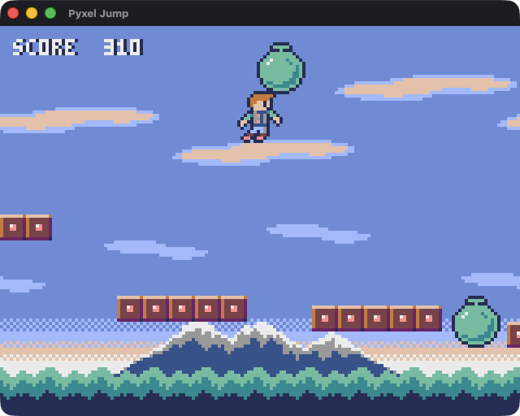
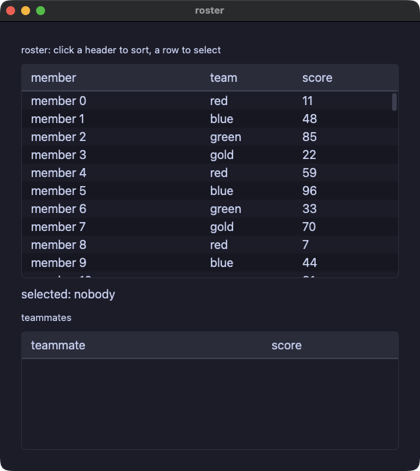
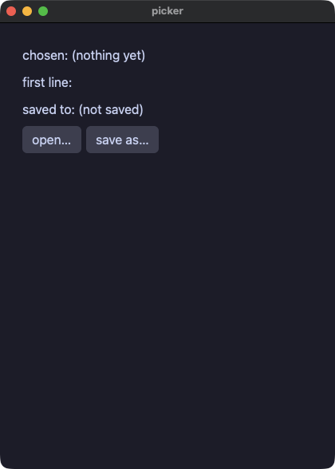
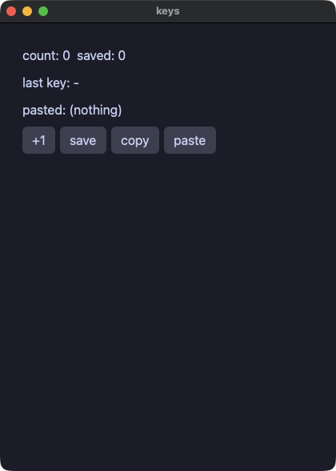

# デモ

どれも 1 ファイル（opsboard と multi はディレクトリ）で、リポジトリの `crates/yokan/` からそのまま動きます。

```console
$ cd crates/yokan
$ uv run demo/counter.py            # そのデモの名前に置き換える
$ ./tools/gate_all.sh               # 全デモをゲートで一括チェック
```

numpy を使う 3 本（pystats / csv_viewer / app）は `uv run --with numpy` で。
`app` と `csv_viewer` の 2 本は辞書 state を使う開発専用デモで、ゲート対象外です（[今できないこと](tour-ship.md#今できないこと)参照）。
スクリーンショットはすべて初期状態（起動直後）のものです。

## まず動きを見る

#### counter — いちばん小さいアプリ。同じアプリの別の書き方が counter_state.py（型付き State セル）と counter_with.py です


<!-- source -->
??? note "counter.py"

    ```python
    # /// script
    # requires-python = ">=3.14"
    # ///
    """The dialect reference: everything in this file translates to .pix.

    Develop:  uv run demo/counter.py
    Ship:     python3 yokan_gate.py gate demo/counter.py --script "click:+1,input:Momo"
    """
    import os
    import sys

    sys.path.insert(0, os.path.join(os.path.dirname(os.path.abspath(__file__)), ".."))

    from yokan import button, column, row, run, State, text, text_field  # noqa: E402


    count: State[int] = State(0)
    name: State[str] = State("")


    def view():
        return column(
            text(f"count: {count()}", size=34),
            row(
                button("+1", on_click=lambda: count.set(count() + 1)),
                button("+10", on_click=lambda: count.set(count() + 10)),
                button("reset", on_click=lambda: count.set(0)),
                spacing=8,
            ),
            text_field(name(), placeholder="your name", on_change=name.set),
            text(f"hello, {name()}"),
            spacing=12,
            padding=16,
        )


    if __name__ == "__main__":
        run(view, title="counter")
    ```
<!-- source -->


#### opsboard — 旗艦デモ。3 モジュール構成のダッシュボード（ストア 2 つ、直和型のヘルスモデル、チャート、仮想化アラートフィード、テーマ切替、fs へのレポート出力）


<!-- source -->
??? note "app.py"

    ```python
    # /// script
    # requires-python = ">=3.14"
    # ///
    """OpsBoard — a fleet-operations dashboard, fully compiled.

    Three modules, two stores, a sum-typed health model matched in the
    view, seeded mock telemetry, charts, a virtualized alert feed with
    severity filters, slotted cards, themed styling with a live palette
    flip — and the shipped artifact is one native binary with no Python
    in it. Every behavior below is gate-checked against CPython.

    Run:   uv run demo/opsboard/app.py
    Gate:  yokan gate demo/opsboard/app.py --script "click:reset,click:tick,..."
    Ship:  yokan build demo/opsboard/app.py --release
    """
    import os
    import sys

    sys.path.insert(0, os.path.join(os.path.dirname(os.path.abspath(__file__)), "..", ".."))
    sys.path.insert(0, os.path.dirname(os.path.abspath(__file__)))

    from yokan import (
        bar_chart,
        button,
        column,
        fs,
        line_chart,
        list_view,
        row,
        run,
        text,
    )

    from state import Alerts, Degraded, Healthy, Metrics, Outage, health, mode  # noqa: E402
    from widgets import btn, btn_hot, card, h1, h2, kpi, panel, pill_crit, pill_ok, pill_warn, svc_row  # noqa: E402


    def reset():
        Metrics.reset()
        Alerts.reset()
        health.set(Healthy())


    def tick():
        Metrics.tick()
        Alerts.emit_tick(Metrics.ticks)
        if Alerts.crit_n > 1:
            health.set(Outage("api"))
        elif Alerts.crit_n > 0:
            health.set(Degraded(1))
        else:
            health.set(Healthy())


    def boot():
        """Open onto history, not zeros: reset then replay six minutes
        of telemetry — deterministic, so both tiers boot identically."""
        Metrics.reset()
        Alerts.reset()
        for i in range(6):
            Metrics.tick()
            Alerts.emit_tick(Metrics.ticks)
        if Alerts.crit_n > 1:
            health.set(Outage("api"))
        elif Alerts.crit_n > 0:
            health.set(Degraded(1))
        else:
            health.set(Healthy())


    def export():
        fs.write_text(
            "demo/.gate/opsboard-report.txt",
            f"OpsBoard report @ {Metrics.clock} — rps={Metrics.rps} p95={Metrics.p95}ms alerts={Alerts.crit_n}/{Alerts.warn_n}/{Alerts.info_n}",
        )


    def flip_theme():
        if mode() == "dark":
            mode.set("light")
        else:
            mode.set("dark")


    def alert_row(i):
        return text(Alerts.visible[i], size=12)


    def view():
        with column(spacing=10, padding=16, background="windowBg", grow=1.0, theme=mode()):
            # ── header ────────────────────────────────────────────────
            with row(spacing=10):
                text("⬢ OpsBoard", **h1)
                text("fleet telemetry · mock feed", **h2)
                text(f"synced {Metrics.clock}", size=12, color="textDim", grow=1.0, align="right")
                button("◐ theme", on_click=flip_theme, **btn)
            # ── system health (sum type, matched live) ───────────────
            with row(spacing=8):
                match health():
                    case Healthy():
                        text("ALL SYSTEMS NOMINAL", animate=140, easing="out", **pill_ok)
                    case Degraded(services):
                        text(f"DEGRADED — {services} service(s) impacted", animate=140, easing="out", **pill_warn)
                    case Outage(service):
                        text(f"OUTAGE — {service} is down", animate=140, easing="out", **pill_crit)
                text(f"tick #{Metrics.ticks}", size=11, color="textDim", grow=1.0, align="right")
            # ── KPI row ──────────────────────────────────────────────
            with row(spacing=10):
                kpi("REQUESTS", f"{Metrics.rps}", "req/m")
                kpi("ERROR RATE", f"{Metrics.err_pct:.1f}", "%")
                kpi("P95 LATENCY", f"{Metrics.p95}", "ms")
                kpi("UPTIME 30D", f"{Metrics.uptime}", "SLO 99.9")
            # ── charts ───────────────────────────────────────────────
            with row(spacing=10):
                with card("THROUGHPUT — req/m per tick"):
                    line_chart(Metrics.rps_trend, height=110.0)
                with card("P95 LATENCY — ms per tick"):
                    line_chart(Metrics.p95_trend, height=110.0)
            with row(spacing=10):
                with card("LOAD BY SERVICE"):
                    bar_chart(Metrics.svc_reqs, labels=Metrics.svc_names, height=100.0)
                with card("FLEET"):
                    svc_row("api-gateway", Metrics.api_r, Metrics.api_s)
                    svc_row("web-frontend", Metrics.web_r, Metrics.web_s)
                    svc_row("worker-pool", Metrics.worker_r, Metrics.worker_s)
                    svc_row("cache-layer", Metrics.cache_r, Metrics.cache_s)
            # ── alert feed ───────────────────────────────────────────
            with card(f"ALERTS — {Alerts.crit_n} crit · {Alerts.warn_n} warn · {Alerts.info_n} info"):
                with row(spacing=6):
                    # the highlight follows the ACTIVE filter
                    if Alerts.filter == "all":
                        button("all", on_click=lambda: Alerts.set_filter("all"), **btn_hot)
                    else:
                        button("all", on_click=lambda: Alerts.set_filter("all"), **btn)
                    if Alerts.filter == "crit":
                        button("crit", on_click=lambda: Alerts.set_filter("crit"), **btn_hot)
                    else:
                        button("crit", on_click=lambda: Alerts.set_filter("crit"), **btn)
                    if Alerts.filter == "warn":
                        button("warn", on_click=lambda: Alerts.set_filter("warn"), **btn_hot)
                    else:
                        button("warn", on_click=lambda: Alerts.set_filter("warn"), **btn)
                list_view(len(Alerts.visible), alert_row, item_height=22.0, grow=1.0)
            # ── footer ───────────────────────────────────────────────
            with row(spacing=8):
                button("▶ tick", on_click=tick, **btn)
                button("reset", on_click=reset, **btn)
                button("export report", on_click=export, **btn)
                text("yokan · compiled dashboard · zero python at runtime", size=10, color="textDim", grow=1.0, align="right")


    if __name__ == "__main__":
        run(view, title="OpsBoard", width=1100, height=820, on_start=boot)
    ```

??? note "state.py"

    ```python
    # /// script
    # requires-python = ">=3.14"
    # ///
    """OpsBoard state: the whole data model compiles — sum-typed fleet
    health, two stores, seeded mock generation. No CPython at runtime.
    """
    import random
    from dataclasses import dataclass

    from yokan import State, store  # noqa: E402
    from yokan import clock

    BASE_MS = 1767225600000  # 2026-01-01 00:00 UTC — the mock clock's epoch


    @dataclass(frozen=True)
    class Healthy:
        pass


    @dataclass(frozen=True)
    class Degraded:
        services: int


    @dataclass(frozen=True)
    class Outage:
        service: str


    type Health = Healthy | Degraded | Outage

    health: State[Health] = State(Healthy())
    mode: State[str] = State("dark")


    @store
    class Metrics:
        ticks: int = 0
        clock: str = "--:--"
        rps: int = 0
        err_pct: float = 0.0
        p95: int = 0
        uptime: str = "99.99%"
        rps_trend: list[float] = []
        p95_trend: list[float] = []
        svc_reqs: list[int] = []
        svc_names: list[str] = ["api", "web", "worker", "cache"]
        api_r: int = 0
        api_s: str = "ok"
        web_r: int = 0
        web_s: str = "ok"
        worker_r: int = 0
        worker_s: str = "ok"
        cache_r: int = 0
        cache_s: str = "ok"

        def reset(self) -> None:
            random.seed(3)
            self.ticks = 0
            self.clock = "--:--"
            self.rps = 0
            self.err_pct = 0.0
            self.p95 = 0
            self.rps_trend = []
            self.p95_trend = []
            self.svc_reqs = []
            self.api_r = 0
            self.web_r = 0
            self.worker_r = 0
            self.cache_r = 0
            self.api_s = "ok"
            self.web_s = "ok"
            self.worker_s = "ok"
            self.cache_s = "ok"

        def tick(self) -> None:
            self.ticks += 1
            self.clock = clock.format_ms(1767225600000 + self.ticks * 60000, "%H:%M")
            self.api_r = 900 + random.randint(0, 300)
            self.web_r = 600 + random.randint(0, 250)
            self.worker_r = 200 + random.randint(0, 120)
            self.cache_r = 1500 + random.randint(0, 400)
            self.rps = self.api_r + self.web_r + self.worker_r + self.cache_r
            self.err_pct = 0.1 * random.randint(1, 28)
            self.p95 = 80 + random.randint(0, 220)
            self.rps_trend = self.rps_trend + [1.0 * self.rps]
            self.p95_trend = self.p95_trend + [1.0 * self.p95]
            self.svc_reqs = []
            self.svc_reqs = self.svc_reqs + [self.api_r]
            self.svc_reqs = self.svc_reqs + [self.web_r]
            self.svc_reqs = self.svc_reqs + [self.worker_r]
            self.svc_reqs = self.svc_reqs + [self.cache_r]
            if self.p95 > 260:
                self.api_s = "crit"
            elif self.p95 > 200:
                self.api_s = "warn"
            else:
                self.api_s = "ok"
            if self.err_pct > 2.0:
                self.web_s = "warn"
            else:
                self.web_s = "ok"


    @store
    class Alerts:
        crit_rows: list[str] = []
        warn_rows: list[str] = []
        info_rows: list[str] = []
        visible: list[str] = []
        filter: str = "all"
        crit_n: int = 0
        warn_n: int = 0
        info_n: int = 0

        def reset(self) -> None:
            self.crit_rows = []
            self.warn_rows = []
            self.info_rows = []
            self.visible = []
            self.filter = "all"
            self.crit_n = 0
            self.warn_n = 0
            self.info_n = 0

        def emit_tick(self, tick_no: int) -> None:
            stamp = clock.format_ms(1767225600000 + tick_no * 60000, "%H:%M")
            roll = random.randint(0, 9)
            if roll < 2:
                self.crit_rows = self.crit_rows + ["🔴 " + stamp + "  p95 breach on api — circuit breaker armed"]
                self.crit_n += 1
            elif roll < 5:
                self.warn_rows = self.warn_rows + ["🟡 " + stamp + "  error budget burn 2× on web"]
                self.warn_n += 1
            else:
                self.info_rows = self.info_rows + ["🔵 " + stamp + "  deploy worker@" + stamp + " rolled out"]
                self.info_n += 1
            self.rebuild()

        def set_filter(self, f: str) -> None:
            self.filter = f
            self.rebuild()

        def rebuild(self) -> None:
            self.visible = []
            if self.filter == "all":
                for r in self.crit_rows:
                    self.visible = self.visible + [r]
                for r in self.warn_rows:
                    self.visible = self.visible + [r]
                for r in self.info_rows:
                    self.visible = self.visible + [r]
            elif self.filter == "crit":
                for r in self.crit_rows:
                    self.visible = self.visible + [r]
            else:
                for r in self.warn_rows:
                    self.visible = self.visible + [r]
    ```

??? note "widgets.py"

    ```python
    # /// script
    # requires-python = ">=3.14"
    # ///
    """OpsBoard widgets: named styles and reusable components — the
    slotted panel, KPI cards, status pills — all compiled to native
    views with pixie's Slot{} splice.

    Colors are theme TOKENS (panel/border/surface/textDim/accent…) so
    the whole board re-skins on a palette flip; only the status colors
    are fixed hex, picked to read on both palettes.
    """
    from yokan import column, component, row, slot, style, text  # noqa: E402

    panel = style(background="panel", border_radius=10, border_width=1.0, border_color="border", padding=12, spacing=6, grow=1.0)
    kpi_label = style(size=11, color="textDim")
    kpi_value = style(size=26, color="accent")
    kpi_unit = style(size=11, color="textDim")
    h1 = style(size=20, color="accent")
    h2 = style(size=13, color="textDim")
    pill_ok = style(size=11, color="#2fa84f")
    pill_warn = style(size=11, color="#d99a1f")
    pill_crit = style(size=11, color="#e5484d")
    row_text = style(size=12)
    btn = style(background="surface", hover_background="surfaceHover")
    hot = style(background="#f38ba8", hover_background="#eba0ac")
    btn_hot = btn | hot


    @component(slots=True)
    def card(title: str):
        with column(**panel):
            text(title, **kpi_label)
            slot()


    @component
    def kpi(label: str, value: str, unit: str):
        with column(**panel):
            text(label, **kpi_label)
            with row(spacing=4):
                text(value, **kpi_value)
                text(unit, **kpi_unit)


    @component
    def pill(status: str):
        with row():
            if status == "crit":
                text("● CRIT", **pill_crit)
            elif status == "warn":
                text("● WARN", **pill_warn)
            else:
                text("● OK", **pill_ok)


    @component
    def svc_row(name: str, reqs: int, status: str):
        with row(spacing=10):
            text(name, size=12, grow=1.0)
            text(f"{reqs} req/m", **row_text)
            pill(status)
    ```
<!-- source -->


#### forms — フォーム部品一式。checkbox / switch / slider / select / radio_group / tab_bar、ハンドラは新しい値をひとつ受け取る


<!-- source -->
??? note "forms.py"

    ```python
    # /// script
    # requires-python = ">=3.14"
    # ///
    """The form controls, gated: checkbox / switch (click by label
    toggles), slider (`slide:` steps), select / radio_group / tab_bar
    (`select:` steps) — every handler receives the new value as its one
    argument. The last one is a text field that holds paragraphs:
    `multiline=True` makes it wrap, `enter` writes a newline instead of
    submitting, and `rows=` says how many lines are visible. Two of the
    controls carry `tooltip=`, which every element takes: the window
    shows it when the pointer rests there, and it is in the dump either
    way, so a script sees it.
    """
    import os
    import sys

    sys.path.insert(0, os.path.join(os.path.dirname(os.path.abspath(__file__)), ".."))

    from yokan import (
        checkbox,
        column,
        text_field,
        radio_group,
        run,
        select,
        slider,
        State,
        store,
        switch,
        tab_bar,
        text,
    )


    @store
    class Settings:
        dark: bool = False
        wifi: bool = True
        volume: float = 5.0
        fruits: list[str] = ["apple", "banana", "cherry"]
        fruit: int = 0
        sizes: list[str] = ["small", "medium", "large"]
        size: int = 1
        tabs: list[str] = ["General", "Details", "About"]
        tab: int = 0
        note: str = ""

        def set_dark(self, on: bool) -> None:
            self.dark = on

        def set_wifi(self, on: bool) -> None:
            self.wifi = on

        def set_volume(self, v: float) -> None:
            self.volume = v

        def pick_fruit(self, i: int) -> None:
            self.fruit = i

        def pick_size(self, i: int) -> None:
            self.size = i

        def pick_tab(self, i: int) -> None:
            self.tab = i

        def write(self, t: str) -> None:
            self.note = t


    def view():
        with column(spacing=10, padding=14):
            checkbox(
                "Dark mode",
                checked=Settings.dark,
                on_change=Settings.set_dark,
                tooltip="the whole window follows this",
            )
            switch("Wi-Fi", checked=Settings.wifi, on_change=Settings.set_wifi)
            slider(
                value=Settings.volume,
                min=0.0,
                max=10.0,
                step=1.0,
                on_change=Settings.set_volume,
                tooltip="0 to 10, in whole steps",
            )
            select(options=Settings.fruits, selected=Settings.fruit, on_change=Settings.pick_fruit)
            radio_group(options=Settings.sizes, selected=Settings.size, on_change=Settings.pick_size)
            tab_bar(labels=Settings.tabs, active=Settings.tab, on_change=Settings.pick_tab)
            if Settings.tab == 0:
                text("general panel", size=12)
            elif Settings.tab == 1:
                text("details panel", size=12)
            else:
                text("about panel", size=12)
            text_field(
                Settings.note,
                placeholder="notes (enter writes a newline)",
                on_change=Settings.write,
                multiline=True,
                rows=3,
            )
            text(f"dark={Settings.dark}  wifi={Settings.wifi}  vol={Settings.volume:.1f}")
            text(f"fruit#{Settings.fruit}  size#{Settings.size}  tab#{Settings.tab}")


    if __name__ == "__main__":
        run(view, title="forms", width=460, height=420)
    ```
<!-- source -->


#### calc — 定番の電卓。レイアウトは `grow` だけで組んであり、ウィンドウを伸ばすとパッド全体が隙間なく追従する


<!-- source -->
??? note "calc.py"

    ```python
    # /// script
    # requires-python = ">=3.14"
    # ///
    """A calculator — the classic keypad, in the dialect. The layout is
    all `grow`: the root column fills the window, every row shares the
    height, keys share each row's width, and the zero key takes two
    shares (`grow=2`), so resizing the window scales the whole pad with
    no dead space. Styles are dicts merged with `|`.
    `strings.to_float` is total (bad text parses as the default), so
    the arithmetic needs no try."""
    import os
    import sys

    sys.path.insert(0, os.path.join(os.path.dirname(os.path.abspath(__file__)), ".."))

    from yokan import button, column, row, run, store, strings, style, text  # noqa: E402


    @store
    class Calc:
        display: str = "0"
        acc: float = 0.0
        op: str = ""
        fresh: bool = True
        has_dot: bool = False

        def press(self, d: str) -> None:
            if self.fresh:
                self.display = d
                self.fresh = False
                self.has_dot = False
            elif self.display == "0":
                self.display = d
            else:
                self.display = self.display + d

        def dot(self) -> None:
            if self.fresh:
                self.display = "0."
                self.fresh = False
                self.has_dot = True
            elif not self.has_dot:
                self.display = self.display + "."
                self.has_dot = True

        def negate(self) -> None:
            v = strings.to_float(self.display, 0.0)
            if v != 0.0:
                self.display = f"{0.0 - v}"
                self.fresh = False

        def percent(self) -> None:
            v = strings.to_float(self.display, 0.0)
            self.display = f"{v / 100.0}"
            self.fresh = True
            self.has_dot = False

        def apply(self, nxt: str) -> None:
            if self.fresh and self.op != "":
                self.op = nxt
                return
            cur = strings.to_float(self.display, 0.0)
            if self.op == "":
                self.acc = cur
            if self.op == "+":
                self.acc = self.acc + cur
            if self.op == "-":
                self.acc = self.acc - cur
            if self.op == "×":
                self.acc = self.acc * cur
            if self.op == "÷":
                if cur == 0.0:
                    self.display = "Error"
                    self.acc = 0.0
                    self.op = ""
                    self.fresh = True
                    return
                self.acc = self.acc / cur
            self.display = f"{self.acc}"
            self.op = nxt
            self.fresh = True

        def do_op(self, o: str) -> None:
            Calc.apply(o)

        def equals(self) -> None:
            Calc.apply("")

        def clear(self) -> None:
            self.display = "0"
            self.acc = 0.0
            self.op = ""
            self.fresh = True
            self.has_dot = False


    key = style(
        grow=1, size=20, background="panel",
        hover_background="#45475a", active_background="#585b70",
    )
    fun_tint = style(background="#313244", color="#a6adc8")
    fun = key | fun_tint
    op_tint = style(
        background="#fab387", color="#1e1e2e",
        hover_background="#f8c49b", active_background="#f5e0dc",
    )
    op = key | op_tint
    wide_tint = style(grow=2, basis=8)
    wide = key | wide_tint
    readout = style(size=40, color="text", align="right", grow=1.4)
    keys = style(spacing=8, grow=1)


    def view():
        with column(spacing=8, padding=16, grow=1):
            text(f"{Calc.display}", **readout)
            with row(**keys):
                button("C", on_click=Calc.clear, **fun)
                button("±", on_click=Calc.negate, **fun)
                button("%", on_click=Calc.percent, **fun)
                button("÷", on_click=lambda: Calc.do_op("÷"), **op)
            with row(**keys):
                button("7", on_click=lambda: Calc.press("7"), **key)
                button("8", on_click=lambda: Calc.press("8"), **key)
                button("9", on_click=lambda: Calc.press("9"), **key)
                button("×", on_click=lambda: Calc.do_op("×"), **op)
            with row(**keys):
                button("4", on_click=lambda: Calc.press("4"), **key)
                button("5", on_click=lambda: Calc.press("5"), **key)
                button("6", on_click=lambda: Calc.press("6"), **key)
                button("-", on_click=lambda: Calc.do_op("-"), **op)
            with row(**keys):
                button("1", on_click=lambda: Calc.press("1"), **key)
                button("2", on_click=lambda: Calc.press("2"), **key)
                button("3", on_click=lambda: Calc.press("3"), **key)
                button("+", on_click=lambda: Calc.do_op("+"), **op)
            with row(**keys):
                button("0", on_click=lambda: Calc.press("0"), **wide)
                button(".", on_click=Calc.dot, **key)
                button("=", on_click=Calc.equals, **op)


    if __name__ == "__main__":
        run(view, title="calc")
    ```
<!-- source -->


#### calcgrid — 同じ電卓を `grid(columns=4, rows=5)` で。0 キーは `col_span=2` で 2 セルにまたがる


<!-- source -->
??? note "calcgrid.py"

    ```python
    # /// script
    # requires-python = ">=3.14"
    # ///
    """The calculator again, on a grid. `grid(columns=4, rows=5)`
    lays equal tracks, every key fills its cell, and the zero key says
    `col_span=2` — the whole keypad is one container instead of five
    rows. Same store as demo/calc.py; only the view differs."""
    import os
    import sys

    sys.path.insert(0, os.path.join(os.path.dirname(os.path.abspath(__file__)), ".."))

    from yokan import button, column, grid, run, store, strings, style, text  # noqa: E402


    @store
    class Calc:
        display: str = "0"
        acc: float = 0.0
        op: str = ""
        fresh: bool = True
        has_dot: bool = False

        def press(self, d: str) -> None:
            if self.fresh:
                self.display = d
                self.fresh = False
                self.has_dot = False
            elif self.display == "0":
                self.display = d
            else:
                self.display = self.display + d

        def dot(self) -> None:
            if self.fresh:
                self.display = "0."
                self.fresh = False
                self.has_dot = True
            elif not self.has_dot:
                self.display = self.display + "."
                self.has_dot = True

        def negate(self) -> None:
            v = strings.to_float(self.display, 0.0)
            if v != 0.0:
                self.display = f"{0.0 - v}"
                self.fresh = False

        def percent(self) -> None:
            v = strings.to_float(self.display, 0.0)
            self.display = f"{v / 100.0}"
            self.fresh = True
            self.has_dot = False

        def apply(self, nxt: str) -> None:
            if self.fresh and self.op != "":
                self.op = nxt
                return
            cur = strings.to_float(self.display, 0.0)
            if self.op == "":
                self.acc = cur
            if self.op == "+":
                self.acc = self.acc + cur
            if self.op == "-":
                self.acc = self.acc - cur
            if self.op == "×":
                self.acc = self.acc * cur
            if self.op == "÷":
                if cur == 0.0:
                    self.display = "Error"
                    self.acc = 0.0
                    self.op = ""
                    self.fresh = True
                    return
                self.acc = self.acc / cur
            self.display = f"{self.acc}"
            self.op = nxt
            self.fresh = True

        def do_op(self, o: str) -> None:
            Calc.apply(o)

        def equals(self) -> None:
            Calc.apply("")

        def clear(self) -> None:
            self.display = "0"
            self.acc = 0.0
            self.op = ""
            self.fresh = True
            self.has_dot = False


    key = style(
        size=20, background="panel",
        hover_background="#45475a", active_background="#585b70",
    )
    fun_tint = style(background="#313244", color="#a6adc8")
    fun = key | fun_tint
    op_tint = style(
        background="#fab387", color="#1e1e2e",
        hover_background="#f8c49b", active_background="#f5e0dc",
    )
    op = key | op_tint
    readout = style(size=40, color="text", align="right", grow=1.4)


    def view():
        with column(spacing=8, padding=16, grow=1):
            text(f"{Calc.display}", **readout)
            with grid(columns=4, rows=5, spacing=8, grow=5):
                button("C", on_click=Calc.clear, **fun)
                button("±", on_click=Calc.negate, **fun)
                button("%", on_click=Calc.percent, **fun)
                button("÷", on_click=lambda: Calc.do_op("÷"), **op)
                button("7", on_click=lambda: Calc.press("7"), **key)
                button("8", on_click=lambda: Calc.press("8"), **key)
                button("9", on_click=lambda: Calc.press("9"), **key)
                button("×", on_click=lambda: Calc.do_op("×"), **op)
                button("4", on_click=lambda: Calc.press("4"), **key)
                button("5", on_click=lambda: Calc.press("5"), **key)
                button("6", on_click=lambda: Calc.press("6"), **key)
                button("-", on_click=lambda: Calc.do_op("-"), **op)
                button("1", on_click=lambda: Calc.press("1"), **key)
                button("2", on_click=lambda: Calc.press("2"), **key)
                button("3", on_click=lambda: Calc.press("3"), **key)
                button("+", on_click=lambda: Calc.do_op("+"), **op)
                button("0", on_click=lambda: Calc.press("0"), col_span=2, **key)
                button(".", on_click=Calc.dot, **key)
                button("=", on_click=Calc.equals, **op)


    if __name__ == "__main__":
        run(view, title="calcgrid")
    ```
<!-- source -->


## 状態の持ち方

#### stores — 名前付きストア。クラス名がそのままシングルトンで、ストア同士のメソッド呼び出しもできる


<!-- source -->
??? note "stores.py"

    ```python
    # /// script
    # requires-python = ">=3.14"
    # ///
    """Named stores: `@store` is a process-lifetime singleton with
    fields AND methods — the decorator returns the instance, so the
    class name IS the store. Stores
    call each other's methods; views read their fields reactively.
    """
    import os
    import sys

    sys.path.insert(0, os.path.join(os.path.dirname(os.path.abspath(__file__)), ".."))

    from yokan import button, column, row, run, store, text  # noqa: E402


    @store
    class Settings:
        factor: int = 2

        def double(self) -> None:
            self.factor *= 2


    @store
    class Cart:
        items: list[str] = []
        total: int = 0

        def add(self, name: str, price: int) -> None:
            self.items = self.items + [name]
            self.total += price * Settings.factor
            Settings.double()

        def clear(self) -> None:
            self.items = []
            self.total = 0


    def view():
        with column(spacing=8, padding=12):
            text(f"n={len(Cart.items)} total={Cart.total} f={Settings.factor}")
            with row(spacing=6):
                button("add", on_click=lambda: Cart.add("apple", 10))
                button("clear", on_click=Cart.clear)


    if __name__ == "__main__":
        run(view, title="stores")
    ```
<!-- source -->


#### models — @model と Protocol。観測されるオブジェクトと、静的ディスパッチされるインターフェース


<!-- source -->
??? note "models.py"

    ```python
    # /// script
    # requires-python = ">=3.14"
    # ///
    """class ↔ @model and trait ↔ Protocol. A model is an observed
    object: Python objects and native handles are both references, so
    identity agrees from the start. A Protocol base routes its methods
    into a native `impl`, and a Protocol-typed helper compiles to a
    bounded generic fn — static dispatch, no boxing.
    """
    import os
    import sys

    sys.path.insert(0, os.path.join(os.path.dirname(os.path.abspath(__file__)), ".."))

    from typing import Protocol  # noqa: E402

    from yokan import button, column, model, run, State, text  # noqa: E402


    class Shape(Protocol):
        def area(self) -> float: ...


    @model
    class Circle(Shape):
        r: float = 1.0
        hits: int = 0

        def grow(self, by: float) -> None:
            self.r += by
            self.hits += 1

        def area(self) -> float:
            return self.r * self.r * 3.0


    left = Circle()
    right = Circle()
    total: State[float] = State(0.0)


    def area_of(s: Shape) -> float:
        return s.area()


    def bump():
        left.grow(0.5)
        right.grow(2.0)
        total.set(area_of(left) + area_of(right))


    def view():
        with column(spacing=8, padding=12):
            text(f"L={left.hits} R={right.hits} total={total():.2f}")
            button("bump", on_click=bump)


    if __name__ == "__main__":
        run(view, title="models")
    ```
<!-- source -->


#### links — モデルがモデルを参照する。所有は `Node | None`、逆向きは `Weak[Node]`（循環しないので、根を手放すと連鎖ごと解放される）


<!-- source -->
??? note "links.py"

    ```python
    # /// script
    # requires-python = ">=3.14"
    # ///
    """Models referencing models, gated: `Node | None` fields wire an
    ownership chain in handlers, `Weak[Node]` is the not-owning back
    pointer (it breaks the cycle, so dropping the root frees the chain
    in both tiers at the same statement), and views read through
    walrus-narrowed bindings.
    """
    import os
    import sys

    sys.path.insert(0, os.path.join(os.path.dirname(os.path.abspath(__file__)), ".."))

    from yokan import button, column, model, row, run, State, store, text, Weak  # noqa: E402


    @model
    class Node:
        label: str = "n"
        kid: Node | None = None
        parent: Weak[Node] = None


    @store
    class Tree:
        root: Node | None = None
        keep: Node | None = None
        note: str = "-"

        def build(self) -> None:
            a = Node()
            a.label = "alpha"
            b = Node()
            b.label = "beta"
            a.kid = b
            b.parent = a
            self.root = a
            self.keep = b

        def drop_root(self) -> None:
            self.root = None

        def peek(self) -> None:
            if (r := Tree.root) is not None:
                if (k := r.kid) is not None:
                    if (p := k.parent) is not None:
                        self.note = f"kid={k.label} parent={p.label}"
                    else:
                        self.note = f"kid={k.label} parent=gone"
                else:
                    self.note = "no kid"
            elif (k := Tree.keep) is not None:
                if (p := k.parent) is not None:
                    self.note = f"kept {k.label}, parent={p.label}"
                else:
                    self.note = f"kept {k.label}, parent=gone"
            else:
                self.note = "no root"


    def view():
        with column(spacing=8, padding=12):
            text(f"note: {Tree.note}")
            if (r := Tree.root) is not None:
                text(f"root: {r.label}")
            else:
                text("root: (none)")
            with row(spacing=6):
                button("build", on_click=Tree.build)
                button("peek", on_click=Tree.peek)
                button("drop", on_click=Tree.drop_root)


    if __name__ == "__main__":
        run(view, title="links")
    ```
<!-- source -->


#### stateful — @component + local。呼び出し位置ごとに独立した状態を持つ部品


<!-- source -->
??? note "stateful.py"

    ```python
    # /// script
    # requires-python = ">=3.14"
    # ///
    """Per-instance state: @component + local. Each call site owns
    its own `n`; identity is positional (the no-key rule), and the state
    survives rebuilds and reloads.
    """
    import os
    import sys

    sys.path.insert(0, os.path.join(os.path.dirname(os.path.abspath(__file__)), ".."))

    from yokan import button, column, component, local, row, run, State, text  # noqa: E402


    @component
    def counter(label: str, step: int):
        n: State[int] = local(0)
        with row(spacing=6):
            text(f"{label}: {n()}")
            button(f"+{step}", on_click=lambda: n.set(n() + step))


    def view():
        with column(spacing=10, padding=14):
            text("two counters, one component, separate state", size=13, color="#8a8f98")
            counter("a", 1)
            counter("b", 10)


    if __name__ == "__main__":
        run(view, title="stateful")
    ```
<!-- source -->


#### lookup — 辞書セル。読みは `.get(key, default)`、`in`、そして `cell[k] = v` のその場書き込み


<!-- source -->
??? note "lookup.py"

    ```python
    # /// script
    # requires-python = ">=3.14"
    # ///
    """Dict cells. The order question is DECIDED: iteration stays out
    (Python orders by insertion, native maps by key — admitting either
    would lie), and everything order-free is in: per-key writes land in
    place in both tiers (`prices["cherry"] = 200` is pixie's
    `m[k] = v`), reads are total via .get(key, default), membership
    guards conditions, len counts.
    """
    import os
    import sys

    sys.path.insert(0, os.path.join(os.path.dirname(os.path.abspath(__file__)), ".."))

    from yokan import button, column, row, run, State, text  # noqa: E402

    prices: State[dict[str, int]] = State({"apple": 120, "banana": 80})
    picked: State[int] = State(0)
    label: State[str] = State("none")


    def pick_apple():
        picked.set(prices().get("apple", -1))
        if "cherry" in prices():
            label.set("cherry known")
        else:
            label.set("no cherry")


    def add_cherry():
        prices["cherry"] = 200
        picked.set(prices().get("cherry", -1))
        if "cherry" in prices():
            label.set("cherry known")


    def miss():
        picked.set(prices().get("durian", -7))


    def view():
        with column(spacing=8, padding=12):
            text(f"picked={picked()} n={len(prices())} {label()}")
            text(f"apple costs {prices().get('apple', -1)} right now", size=12)
            with row(spacing=6):
                button("apple", on_click=pick_apple)
                button("cherry", on_click=add_cherry)
                button("miss", on_click=miss)


    if __name__ == "__main__":
        run(view, title="lookup")
    ```
<!-- source -->


#### mixer — フィールドだけの @store。注釈付きフィールドへの直接代入で画面が追随する


<!-- source -->
??? note "mixer.py"

    ```python
    # /// script
    # requires-python = ">=3.14"
    # ///
    """Grouped state is a fields-only @store: annotated fields, direct
    reads in views (`Mixer.volume`), writes through methods — no
    separate instance line, and methods are there the day you need one.
    """
    import os
    import sys

    sys.path.insert(0, os.path.join(os.path.dirname(os.path.abspath(__file__)), ".."))

    from yokan import button, column, row, run, store, text, text_field  # noqa: E402


    @store
    class Mixer:
        volume: int = 5
        title: str = "untitled"
        muted: bool = False

        def louder(self) -> None:
            self.volume += 1

        def set_muted(self, on: bool) -> None:
            self.muted = on

        def rename(self, t: str) -> None:
            self.title = t


    def view():
        with column(spacing=10, padding=14):
            text(f"{Mixer.title} — vol {Mixer.volume}", size=16)
            with row(spacing=8):
                button("+1", on_click=Mixer.louder)
                button("mute", on_click=lambda: Mixer.set_muted(True))
                button("unmute", on_click=lambda: Mixer.set_muted(False))
            if Mixer.muted:
                text("(muted)", size=12, color="#8a8f98")
            text_field(Mixer.title, placeholder="title", on_change=Mixer.rename)


    if __name__ == "__main__":
        run(view, title="mixer")
    ```
<!-- source -->


## 値と型

#### points — Value クラス（frozen dataclass）。書き換えは `replace` の関数的更新


<!-- source -->
??? note "points.py"

    ```python
    # /// script
    # requires-python = ">=3.14"
    # ///
    """struct ↔ frozen dataclass. `frozen=True` is the admission ticket:
    an immutable value cannot expose Python's reference aliasing, so it
    means the same thing as a native COW value by construction. Updates
    are `dataclasses.replace` — a new value, both tiers.
    """
    import os
    import sys

    sys.path.insert(0, os.path.join(os.path.dirname(os.path.abspath(__file__)), ".."))

    from dataclasses import dataclass, replace  # noqa: E402

    from yokan import button, column, row, run, State, text  # noqa: E402


    @dataclass(frozen=True)
    class Point:
        x: int
        y: int = 0


    sel: State[Point] = State(Point(3, 4))
    dist: State[int] = State(0)


    def move_right():
        sel.set(replace(sel(), x=sel().x + 5))


    def swap():
        sel.set(Point(sel().y, sel().x))


    def measure():
        p = sel()
        dist.set(p.x * p.x + p.y * p.y)


    def view():
        with column(spacing=8, padding=12):
            text(f"p=({sel().x}, {sel().y}) d2={dist()}")
            with row(spacing=6):
                button("right", on_click=move_right)
                button("swap", on_click=swap)
                button("measure", on_click=measure)


    if __name__ == "__main__":
        run(view, title="points")
    ```
<!-- source -->


#### vecops — Value クラスの演算子。`__add__` / `__sub__` / `__mul__` を定義すると `+` `-` `*` がその意味になる


<!-- source -->
??? note "vecops.py"

    ```python
    # /// script
    # requires-python = ">=3.14"
    # ///
    """Operator overloading on value classes, gated: __add__ / __sub__ /
    __mul__ become the operator's meaning in both tiers, and plain value
    methods are handler-callable. Bool logic as a VALUE (and / or / not
    over bools) rides along.
    """
    import os
    import sys

    sys.path.insert(0, os.path.join(os.path.dirname(os.path.abspath(__file__)), ".."))

    from yokan import button, column, run, State, text, value  # noqa: E402


    @value
    class V2:
        x: int
        y: int

        def __add__(self, o: "V2") -> "V2":
            return V2(self.x + o.x, self.y + o.y)

        def __sub__(self, o: "V2") -> "V2":
            return V2(self.x - o.x, self.y - o.y)

        def __mul__(self, k: int) -> "V2":
            return V2(self.x * k, self.y * k)

        def dot(self, o: "V2") -> int:
            return self.x * o.x + self.y * o.y


    a: State[V2] = State(V2(1, 2))
    b: State[V2] = State(V2(10, 20))
    c: State[V2] = State(V2(0, 0))
    d: State[int] = State(0)
    both: State[bool] = State(False)
    hot: State[bool] = State(True)
    cold: State[bool] = State(False)


    def combine():
        c.set(a() + b() * 2 - V2(1, 1))
        d.set(a().dot(b()))
        both.set(hot() and not cold())


    def view():
        with column(spacing=6, padding=12):
            text(f"c = ({c().x}, {c().y})")
            text(f"dot = {d()}  both = {both()}")
            button("combine", on_click=combine)


    if __name__ == "__main__":
        run(view, title="vecops")
    ```
<!-- source -->


#### geometry — Protocol による静的ディスパッチ。トレイト相当がコンパイルされる


<!-- source -->
??? note "geometry.py"

    ```python
    # /// script
    # requires-python = ">=3.14"
    # ///
    """Sum types: frozen dataclasses joined by a `type` alias compile to
    a native payload enum, and `match` destructures in handlers AND view
    bodies — this required fixing a real substrate contradiction (the
    checker demanded view patterns the emitter refused; both tiers can
    bind them now).
    """
    import os
    import sys

    sys.path.insert(0, os.path.join(os.path.dirname(os.path.abspath(__file__)), ".."))

    from dataclasses import dataclass  # noqa: E402

    from yokan import button, column, row, run, State, text  # noqa: E402


    @dataclass(frozen=True)
    class Circle:
        r: float


    @dataclass(frozen=True)
    class Rect:
        w: float
        h: float


    @dataclass(frozen=True)
    class Dot:
        pass


    type Shape = Circle | Rect | Dot

    sel: State[Shape] = State(Dot())
    area: State[float] = State(0.0)


    def mk_circle():
        sel.set(Circle(2.0))


    def mk_rect():
        sel.set(Rect(3.0, 4.0))


    def measure():
        match sel():
            case Circle(r):
                area.set(r * r * 3.0)
            case Rect(w, h):
                area.set(w * h)
            case Dot():
                area.set(0.0)


    def view():
        with column(spacing=8, padding=12):
            text(f"area={area():.1f}")
            match sel():
                case Circle(r):
                    text(f"circle r={r:.1f}")
                case Rect(w, h):
                    text(f"rect {w:.1f} x {h:.1f}")
                case Dot():
                    text("just a dot")
            with row(spacing=6):
                button("circle", on_click=mk_circle)
                button("rect", on_click=mk_rect)
                button("measure", on_click=measure)


    if __name__ == "__main__":
        run(view, title="geometry")
    ```
<!-- source -->


#### moods — Enum と Optional とアニメーション


<!-- source -->
??? note "moods.py"

    ```python
    # /// script
    # requires-python = ">=3.14"
    # ///
    """Enum, Optional and animation. `match` IS pixie's `case` (exhaustiveness checked
    natively), the walrus IS `if let some(v)` (Python's own spelling of
    narrowing), and `animate=`/`easing=` ride the kernel's animation clock, so
    `advance:` frames dump identically in both tiers.
    """
    import os
    import sys

    sys.path.insert(0, os.path.join(os.path.dirname(os.path.abspath(__file__)), ".."))

    from enum import Enum, auto  # noqa: E402

    from yokan import button, column, row, run, State, store, text  # noqa: E402


    class Mood(Enum):
        HAPPY = auto()
        SAD = auto()


    @store
    class Tracker:
        last: int | None = None
        trend: Mood = Mood.HAPPY

        def note(self, v: int) -> None:
            self.last = v
            match self.trend:
                case Mood.HAPPY:
                    self.trend = Mood.SAD
                case Mood.SAD:
                    self.trend = Mood.HAPPY

        def wipe(self) -> None:
            self.last = None


    mood: State[Mood] = State(Mood.HAPPY)
    sel: State[int | None] = State(None)
    note: State[str] = State("-")


    def flip():
        match mood():
            case Mood.HAPPY:
                mood.set(Mood.SAD)
            case Mood.SAD:
                mood.set(Mood.HAPPY)


    def describe():
        if (v := sel()) is not None:
            note.set(f"picked {v}")
        else:
            note.set("nothing picked")


    def view():
        with column(spacing=8, padding=12):
            match mood():
                case Mood.HAPPY:
                    text("mood: up", size=18, color="accent", animate=120, easing="out")
                case Mood.SAD:
                    text("mood: down", size=18, color="#f38ba8", animate=120, easing="out")
            if (v := sel()) is not None:
                text(f"selection: {v}")
            else:
                text("(no selection)")
            text(f"note: {note()}")
            if (t := Tracker.last) is not None:
                text(f"tracked: {t}", size=12)
            else:
                text("(nothing tracked)", size=12)
            with row(spacing=6):
                button("flip", on_click=flip)
                button("pick", on_click=lambda: sel.set(7))
                button("clear", on_click=lambda: sel.set(None))
                button("describe", on_click=describe)
                button("track", on_click=lambda: Tracker.note(9), animate=100, easing="inOut")
                button("wipe", on_click=Tracker.wipe)


    if __name__ == "__main__":
        run(view, title="moods")
    ```
<!-- source -->


#### pyops — CPython と同じ算術。`/` `//` `%` `**`、負のインデックス、キーによる並べ替えまで両実行でバイト一致


<!-- source -->
??? note "pyops.py"

    ```python
    # /// script
    # requires-python = ">=3.14"
    # ///
    """Python-semantics operations, gated: `/` `//` `%` `**`, bare
    float/bool/enum text, negative indexing, dict iteration (the keys
    in the order they went in, the values, `.items()`, and sorted()),
    tuples (a literal, a part, unpacking, a pair loop, a tuple return),
    ordering by a key (`sorted`/`min`/`max` with `key=`, `reverse=`),
    comprehensions and `[::-1]` over a value class, if/else locals that
    outlive the branch, @value, list-typed store method parameters.
    The interpreted run uses the real operators and str(); the compiled
    run reproduces CPython's results exactly — the gate proves they print
    the same bytes.
    """
    import os
    import sys
    from enum import Enum

    sys.path.insert(0, os.path.join(os.path.dirname(os.path.abspath(__file__)), ".."))

    from yokan import button, column, row, run, State, store, text, value  # noqa: E402


    @value
    class Point:
        x: int
        y: int = 0


    class Mood(Enum):
        HAPPY = 1
        GRUMPY = 2


    q: State[float] = State(0.0)
    big: State[float] = State(0.0)
    fd: State[int] = State(0)
    md: State[int] = State(0)
    ffd: State[float] = State(0.0)
    fmd: State[float] = State(0.0)
    p2: State[int] = State(0)
    pf: State[float] = State(0.0)
    flag: State[bool] = State(False)
    mood: State[Mood] = State(Mood.HAPPY)
    grade: State[str] = State("-")
    last_key: State[str] = State("-")
    walked: State[str] = State("-")
    paired: State[str] = State("-")
    sized: State[tuple[str, int]] = State(("-", 0))
    spend: State[int] = State(0)
    tail: State[str] = State("-")
    pt: State[Point] = State(Point(3, 4))
    prices: State[dict[str, int]] = State({"cherry": 300, "apple": 120, "banana": 80})
    names: State[list[str]] = State(["ada", "erik", "momo"])
    people: State[list[Point]] = State([Point(3, 1), Point(1, 5), Point(2, 5)])
    ranked: State[str] = State("-")


    @store
    class Bag:
        joined: str = "-"

        def take(self, xs: list[str]) -> None:
            self.joined = ""
            for x in xs:
                self.joined = self.joined + x

        def spot(self, p: Point) -> None:
            self.joined = f"({p.x}, {p.y})"


    def crunch():
        q.set(1 / 3)
        big.set(9007199254740993 / 3)
        fd.set(-7 // 2)
        md.set(7 % -2)
        ffd.set(-7.5 // 2.0)
        fmd.set(-1.0 % 0.3)
        p2.set(2 ** 10)
        pf.set(2.0 ** -2)
        flag.set(True)
        mood.set(Mood.GRUMPY)
        n = 25
        if n > 20:
            verdict = "high"
        else:
            verdict = "low"
        grade.set(verdict)


    def measure(word: str) -> tuple[str, int]:
        return (word.upper(), len(word))


    def pairs():
        # A dict walks as pairs, a tuple comes back from a helper, and
        # `divmod` answers the two numbers Python says it does.
        s = ""
        for k, v in prices().items():
            s = s + f"{k[0]}{v}"
        label, n = measure("momo")
        whole, rest = divmod(len(s), 3)
        sized.set((label, n))
        paired.set(f"{s} {label}{n} {whole}r{rest} {sized()[1]}")


    def walk():
        for k in sorted(prices()):
            last_key.set(k)
        # A dict walks in the order its keys went in, which is not the
        # sorted order above — cherry, apple, banana.
        order = ""
        for k in prices():
            order = order + k[0]
        walked.set(order)
        n = 0
        for v in prices().values():
            n = n + v
        spend.set(n)
        r = names()
        tail.set(r[-1])
        Bag.take(names())
        Bag.spot(pt())


    def rank(p: Point) -> int:
        return p.y


    def order():
        # A key says which part to compare, so an order works for a value
        # class as much as for a number, and the key can be a lambda or a
        # helper. Sorting is stable: the two points with y=5 keep the
        # order they came in, and `reverse=True` keeps it as well — it
        # turns the comparison around, not the answer.
        by_y = sorted(people(), key=lambda p: p.y)
        down = sorted(people(), key=rank, reverse=True)
        lo = min(people(), key=lambda p: p.x)
        hi = max(people(), key=lambda p: p.x)
        xs = [p.x for p in people()]
        back = people()[::-1]
        high = sorted(xs, reverse=True)
        ranked.set(
            f"{by_y[0].x}{by_y[1].x}{by_y[2].x} {down[0].x}{down[1].x} "
            f"{lo.x}{hi.x} {xs[0]} {back[0].x} {high[0]}"
        )


    def view():
        with column(spacing=6, padding=12):
            text(f"q = {q()}")
            text(f"big = {big()}")
            text(f"floor {fd()}  mod {md()}")
            text(f"ffloor = {ffd()}  fmod = {fmd()}")
            text(f"pow {p2()}  fpow = {pf()}")
            text(f"flag = {flag()}  mood = {mood()}")
            text(f"grade = {grade()}  doubled = {p2() * 2 + 1}")
            text(f"last key = {last_key()}  tail = {tail()}")
            text(f"walked = {walked()}  spend = {spend()}")
            text(f"paired = {paired()}")
            text(f"bag = {Bag.joined}")
            text(f"ranked = {ranked()}")
            with row(spacing=6):
                button("crunch", on_click=crunch)
                button("walk", on_click=walk)
                button("pairs", on_click=pairs)
                button("order", on_click=order)


    if __name__ == "__main__":
        run(view, title="pyops")
    ```
<!-- source -->


#### pytext — 素の float / bool / Enum の表示が Python の str() と一致する


<!-- source -->
??? note "pytext.py"

    ```python
    # /// script
    # requires-python = ">=3.14"
    # ///
    """@py — a CPython escape compiled INTO the native app.

    `slug` stays real Python (stdlib `re`) in both tiers: interpreted on
    CPython, and run on an EMBEDDED CPython inside the pixie binary,
    bridged through pixie's own [crates] binding machinery. The gate
    proves both tiers agree.
    """
    import os
    import sys

    sys.path.insert(0, os.path.join(os.path.dirname(os.path.abspath(__file__)), ".."))

    from yokan import column, py, run, State, text, text_field  # noqa: E402


    @py
    def slug(t: str) -> str:
        import re

        return re.sub(r"[^a-z0-9]+", "-", t.lower()).strip("-")


    title: State[str] = State("")
    slugged: State[str] = State("")


    def retitle(t: str):
        title.set(t)
        slugged.set(slug(t))


    def view():
        with column(spacing=10, padding=14):
            text("type a title — the slug is computed by real Python", size=13, color="#8a8f98")
            text_field(title(), placeholder="title", on_change=retitle)
            text(f"slug: {slugged()}", size=16)


    if __name__ == "__main__":
        run(view, title="pytext")
    ```
<!-- source -->


## 制御フローとエラー

#### flow — ハンドラの中の本物の制御フロー（if / elif / while / for / break / continue）


<!-- source -->
??? note "flow.py"

    ```python
    # /// script
    # requires-python = ">=3.14"
    # ///
    """Handler control flow, natively compiled: if/elif/else, while,
    for-over-range and for-over-list with break/continue, and a pure
    helper fn that lowers to a native free fn (not an escape — the
    computation itself compiles). Locals are block-scoped natively, so
    the translator refuses reads that Python would leak.

    A decorator compiles too: decoration happens at import and the
    compiled app never runs the module, so the wrapper is folded into
    the handler it decorates. Both runs then do the same thing — which
    is what the gate compares.
    """
    import os
    import sys

    sys.path.insert(0, os.path.join(os.path.dirname(os.path.abspath(__file__)), ".."))

    from yokan import button, column, row, run, State, text  # noqa: E402

    count: State[int] = State(0)
    total: State[int] = State(0)
    status: State[str] = State("start")


    def double(v: int) -> int:
        return v * 2


    def announced(f):
        """A wrapper around the handler: it says what it is doing, runs
        the handler, and says it is done."""

        def wrapper():
            status.set("working")
            f()
            status.set("done")

        return wrapper


    def step():
        count.set(count() + 1)
        if count() > 3 and count() < 100:
            status.set("big")
        elif count() == 3:
            status.set("three")
        else:
            status.set("small")


    def tally():
        total.set(0)
        for i in range(1, 6):
            if i == 3:
                continue
            total.set(total() + double(i))


    @announced
    def bump3():
        while count() < 3:
            count.set(count() + 1)


    def find():
        for i in range(0, 10):
            if i * i > 10:
                count.set(i)
                break


    def view():
        with column(spacing=8, padding=12):
            text(f"count={count()} total={total()} status={status()}")
            with row(spacing=6):
                button("step", on_click=step)
                button("tally", on_click=tally)
                button("bump3", on_click=bump3)
                button("find", on_click=find)


    if __name__ == "__main__":
        run(view, title="flow")
    ```
<!-- source -->


#### edges — 封じ込めの実証。範囲外アクセスもオーバーフローも、両実行で同じ文が同じように止まり、アプリは落ちない


<!-- source -->
??? note "edges.py"

    ```python
    # /// script
    # requires-python = ">=3.14"
    # ///
    """Containment, proven by the gate: every predictable failure an
    admitted program can reach fails the SAME way interpreted and
    compiled — the statement aborts before writing, earlier statements'
    effects stay, the app keeps running.

      oob     — a local subscript past the end
      grow    — i64 overflow (the write is refused before it happens,
                in both runs)
      partial — first statement lands, second fails: ordering agrees
    """
    import os
    import sys

    sys.path.insert(0, os.path.join(os.path.dirname(os.path.abspath(__file__)), ".."))

    from yokan import button, column, run, State, text  # noqa: E402

    xs: State[list[int]] = State([7])
    picked: State[int] = State(0)
    big: State[int] = State(4611686018427387904)
    steps: State[int] = State(0)


    def oob():
        r = xs()
        picked.set(r[5])


    def grow():
        big.set(big() * 4)


    def partial():
        steps.set(steps() + 1)
        r = xs()
        picked.set(r[9])


    def view():
        with column(spacing=8, padding=12):
            text(f"picked={picked()} steps={steps()}")
            button("oob", on_click=oob)
            button("grow", on_click=grow)
            button("partial", on_click=partial)


    if __name__ == "__main__":
        run(view, title="edges")
    ```
<!-- source -->


#### tryfetch — try/except の全形。失敗する http 呼び出しを捕まえ、`f"{e}"` の文言まで両実行で一致する


<!-- source -->
??? note "tryfetch.py"

    ```python
    # /// script
    # requires-python = ">=3.14"
    # ///
    """try/except over the standard library: a failing http.get_text
    raises, a Python `try` around it catches, and `f"{e}"` renders the
    same message whether the app runs interpreted or compiled. An
    uncaught failure aborts just the handler that raised — the app
    keeps running.
    """
    import os
    import sys

    sys.path.insert(0, os.path.join(os.path.dirname(os.path.abspath(__file__)), ".."))

    from yokan import button, column, py, row, run, State, text  # noqa: E402
    from yokan import fs, http  # noqa: E402


    @py
    def serve() -> int:
        import http.server
        import threading

        body = b"hello from fixture"

        class H(http.server.BaseHTTPRequestHandler):
            def do_GET(self):
                self.send_response(200)
                self.send_header("Content-Length", str(len(body)))
                self.end_headers()
                self.wfile.write(body)

            def log_message(self, format: str, *args: object) -> None:
                pass

        srv = http.server.HTTPServer(("127.0.0.1", 0), H)
        threading.Thread(target=srv.serve_forever, daemon=True).start()
        return srv.server_address[1]


    @py
    def parse_num(s: str) -> int:
        return int(s)


    @py
    def risky(mode: str) -> int:
        if mode == "value":
            raise ValueError("bad value here")
        if mode == "key":
            raise KeyError("missing-key")
        return 7


    port: State[int] = State(0)
    num: State[int] = State(0)
    body: State[str] = State("(none)")
    status: State[str] = State("-")
    note: State[str] = State("-")


    def start():
        port.set(serve())


    def fetch_dead():
        try:
            body.set(http.get_text("http://127.0.0.1:9/nothing"))
        except Exception as e:
            status.set(f"offline: {e}")


    def fetch_ok():
        try:
            body.set(http.get_text(f"http://127.0.0.1:{port()}/"))
        except Exception:
            status.set("unreachable")


    def peek():
        try:
            note.set(fs.read_text("demo/.gate/absent.txt"))
        except Exception as e:
            note.set(f"no file: {e}")


    def parse():
        try:
            num.set(parse_num("41x"))
        except Exception as e:
            note.set(f"bad: {e}")


    def parse_ok():
        try:
            num.set(parse_num("41"))
        except Exception:
            note.set("unexpected")


    def multi_v():
        try:
            num.set(risky("value"))
        except ValueError as e:
            note.set(f"VE: {e}")
        except KeyError as e:
            note.set(f"KE: {e}")
        except Exception:
            note.set("other")


    def multi_k():
        try:
            num.set(risky("key"))
        except ValueError as e:
            note.set(f"VE: {e}")
        except KeyError as e:
            note.set(f"KE: {e}")
        except Exception:
            note.set("other")


    def full():
        try:
            a = risky("fine")
            note.set(f"got {a}")
            b = risky("value")
            num.set(a + b)
        except (ValueError, KeyError) as e:
            status.set(f"caught: {e}")
        except Exception:
            status.set("other")
        else:
            status.set("clean run")
        finally:
            body.set("finally ran")


    def full_ok():
        try:
            a = risky("fine")
            b = risky("fine")
            num.set(a + b)
        except Exception as e:
            status.set(f"caught: {e}")
        else:
            status.set("clean run")
        finally:
            body.set("finally ran")


    def mixed():
        try:
            note.set(fs.read_text("demo/.gate/absent.txt"))
        except (KeyError, RuntimeError) as e:
            status.set(f"io: {e}")
        except Exception:
            status.set("other")


    def multi_ok():
        try:
            num.set(risky("fine"))
        except ValueError:
            note.set("VE")
        except Exception:
            note.set("other")


    def view():
        with column(spacing=8, padding=12):
            text(f"body: {body()}")
            text(f"status: {status()}", size=12)
            text(f"note: {note()}", size=12)
            text(f"num: {num()}", size=12)
            with row(spacing=6):
                button("start", on_click=start)
                button("dead", on_click=fetch_dead)
                button("ok", on_click=fetch_ok)
                button("peek", on_click=peek)
                button("parse", on_click=parse)
                button("parse_ok", on_click=parse_ok)
                button("mv", on_click=multi_v)
                button("mk", on_click=multi_k)
                button("mo", on_click=multi_ok)
                button("full", on_click=full)
                button("full_ok", on_click=full_ok)
                button("mixed", on_click=mixed)


    if __name__ == "__main__":
        run(view, title="tryfetch")
    ```
<!-- source -->


## 画面部品

#### todo — 定番の TODO リスト


<!-- source -->
??? note "todo.py"

    ```python
    # /// script
    # requires-python = ">=3.14"
    # ///
    """List state: a todo app with a virtualized list, fully in the dialect.

    items: State[list[str]] — the annotation is what makes `[]`-style
    list state translatable at all. The row builder becomes a `.pix`
    `for` repeater, and the row index is an ordinary int inside it: the
    number, the marker on the row that is done, and that row's own
    button all read the same `i`.
    """
    import os
    import sys

    sys.path.insert(0, os.path.join(os.path.dirname(os.path.abspath(__file__)), ".."))

    from yokan import button, column, list_view, row, run, State, text, text_field  # noqa: E402

    items: State[list[str]] = State(["milk"])
    draft: State[str] = State("")
    done: State[int] = State(-1)


    def add(t: str):
        items.set(items() + [t])
        draft.set("")


    def line(i: int):
        with row(spacing=8):
            text(f"{i + 1}. {items()[i]}")
            if i == done():
                text("done", color="accent")
            button("done", on_click=lambda: done.set(i))


    def view():
        with column(spacing=10, padding=14):
            text(f"todo — {len(items())} items", size=16)
            text_field(
                draft(),
                placeholder="add and press enter",
                on_change=draft.set,
                on_submit=add,
            )
            list_view(len(items()), line, item_height=26.0, height=280.0)
            button("clear", on_click=lambda: items.set([]))


    if __name__ == "__main__":
        run(view, title="todo")
    ```
<!-- source -->


#### table — data_table。最初の `row` がヘッダー行、以降の `row` が交互に色の付くデータ行になり、枠は要素が描く


<!-- source -->
??? note "table.py"

    ```python
    # /// script
    # requires-python = ">=3.14"
    # ///
    """data_table draws the table itself: the first `row` inside it is
    the header, every later `row` is a data row shaded in alternation,
    and the frame around them comes with the element. Columns line up
    because the cells of one column carry the same `grow` share.
    """
    import os
    import sys

    sys.path.insert(0, os.path.join(os.path.dirname(os.path.abspath(__file__)), ".."))

    from yokan import button, column, data_table, row, run, store, text  # noqa: E402


    @store
    class Fleet:
        api: int = 42
        db: int = 17
        cache: int = 8
        edge: int = 95
        polls: int = 0

        def refresh(self) -> None:
            self.polls += 1
            self.api = (self.api * 3 + 29) % 140
            self.db = (self.db * 5 + 11) % 140
            self.cache = (self.cache * 7 + 3) % 140
            self.edge = (self.edge * 2 + 47) % 140


    def health(ms: int) -> str:
        label = "ok"
        if ms > 60:
            label = "watch"
        if ms > 100:
            label = "slow"
        return label


    def view():
        with column(spacing=10, padding=14):
            text(f"fleet latency — {Fleet.polls} polls", size=16)
            with data_table():
                with row(spacing=8):
                    text("service", grow=2.0)
                    text("latency", grow=1.0, align="right")
                    text("health", grow=1.0, align="center")
                with row(spacing=8):
                    text("api", grow=2.0)
                    text(f"{Fleet.api} ms", grow=1.0, align="right")
                    text(f"{health(Fleet.api)}", grow=1.0, align="center")
                with row(spacing=8):
                    text("db", grow=2.0)
                    text(f"{Fleet.db} ms", grow=1.0, align="right")
                    text(f"{health(Fleet.db)}", grow=1.0, align="center")
                with row(spacing=8):
                    text("cache", grow=2.0)
                    text(f"{Fleet.cache} ms", grow=1.0, align="right")
                    text(f"{health(Fleet.cache)}", grow=1.0, align="center")
                with row(spacing=8):
                    text("edge", grow=2.0)
                    text(f"{Fleet.edge} ms", grow=1.0, align="right")
                    text(f"{health(Fleet.edge)}", grow=1.0, align="center")
            button("refresh", on_click=Fleet.refresh)


    if __name__ == "__main__":
        run(view, title="table")
    ```
<!-- source -->


#### dialog — モーダル。「存在すること」が「開いていること」なので、`if` で包む


<!-- source -->
??? note "dialog.py"

    ```python
    # /// script
    # requires-python = ">=3.14"
    # ///
    """Conditional rendering: a modal behind `if show():`.

    bool cells follow the same split as floats: bool TEXT is out of the
    dialect, bool CONDITIONS are in. The Python `if` becomes .pix's view
    `if/else`; the modal needs no open= — presence IS openness.
    """
    import os
    import sys

    sys.path.insert(0, os.path.join(os.path.dirname(os.path.abspath(__file__)), ".."))

    from yokan import button, column, modal, row, run, State, text  # noqa: E402

    show: State[bool] = State(False)
    status: State[str] = State("undecided")


    def accept():
        status.set("accepted")
        show.set(False)


    def decline():
        status.set("declined")
        show.set(False)


    def view():
        with column(spacing=10, padding=14):
            text(f"status: {status()}", size=16)
            button("open dialog", on_click=lambda: show.set(True))
            if show():
                with modal():
                    text("accept the terms?", size=18)
                    with row(spacing=8):
                        button("accept", on_click=accept)
                        button("decline", on_click=decline)
            else:
                text("(dialog closed)", size=12, color="#8a8f98")


    if __name__ == "__main__":
        run(view, title="dialog")
    ```
<!-- source -->


#### trend — ライン / バーチャート


<!-- source -->
??? note "trend.py"

    ```python
    # /// script
    # requires-python = ">=3.14"
    # ///
    """Chart data from a list[float] cell — the float rule in action:

    float TEXT is out of the dialect (str(2.0) diverges across tiers),
    but float DATA is fine: both tiers dump chart values through the
    same kernel renderer, and the gate proves it.
    """
    import os
    import sys

    sys.path.insert(0, os.path.join(os.path.dirname(os.path.abspath(__file__)), ".."))

    from yokan import (
        bar_chart,
        button,
        column,
        line_chart,
        row,
        run,
        State,
        text,
    )

    values: State[list[float]] = State([3.0, 5.0, 2.0])
    limit: State[float] = State(4.5)


    def bump():
        values.set(values() + [8.0])


    def raise_limit():
        limit.set(limit() + 0.5)


    def view():
        with column(spacing=10, padding=14):
            text(f"points: {len(values())}", size=14)
            line_chart(values(), height=120.0)
            bar_chart(values(), height=90.0)
            text(f"limit: {limit():.1f}", size=12, color="#8a8f98")
            with row(spacing=8):
                button("add point", on_click=bump)
                button("raise limit", on_click=raise_limit)


    if __name__ == "__main__":
        run(view, title="trend")
    ```
<!-- source -->


#### styled — 名前付きスタイル（`style` + `**` 展開 + `|` 合成）とテーマスコープ


<!-- source -->
??? note "styled.py"

    ```python
    # /// script
    # requires-python = ">=3.14"
    # ///
    """Named styles and the theme scope. A style is a plain dict of
    element kwargs (`style`), applied with `**` — plain Python when
    interpreted, a native style block when compiled; `|` merges styles
    and `theme=` scopes a palette over a subtree. Tokens like "accent"
    resolve in one shared place, so a palette flip re-colors the
    interpreted and the compiled app identically.
    """
    import os
    import sys

    sys.path.insert(0, os.path.join(os.path.dirname(os.path.abspath(__file__)), ".."))

    from yokan import button, column, row, run, State, style, text  # noqa: E402

    chip = style(size=18, color="accent")
    key = style(background="#313244", hover_background="#45475a")
    hot = style(background="#fab387")
    key_hot = key | hot

    mode: State[str] = State("dark")
    n: State[int] = State(0)


    def flip():
        if mode() == "dark":
            mode.set("light")
        else:
            mode.set("dark")


    def view():
        with column(spacing=8, padding=12, background="panel", theme=mode()):
            text(f"n={n()}", **chip)
            with row(spacing=6):
                button("+1", on_click=lambda: n.set(n() + 1), **key)
                button("flip", on_click=flip, **key_hot)


    if __name__ == "__main__":
        run(view, title="styled")
    ```
<!-- source -->


#### cards — スロット付きコンポーネント（子要素を受け取る部品）


<!-- source -->
??? note "cards.py"

    ```python
    # /// script
    # requires-python = ">=3.14"
    # ///
    """Slots: a component that takes CHILDREN. Declare it
    @component(slots=True), place them with slot(), pass them by
    `with card(...):` — the native twin is pixie's `Slot { }` splice,
    and the children keep use-site identity, so stateful components
    inside a slot hold independent per-instance state.
    """
    import os
    import sys

    sys.path.insert(0, os.path.join(os.path.dirname(os.path.abspath(__file__)), ".."))

    from yokan import (
        button,
        column,
        component,
        local,
        row,
        run,
        slot,
        State,
        text,
    )


    @component(slots=True)
    def card(title: str):
        with column(spacing=4, padding=8, border_width=1.0, border_color="accent", border_radius=8):
            text(title, size=18)
            slot()


    @component
    def counter(label: str, step: int):
        n: State[int] = local(0)
        with row(spacing=6):
            text(f"{label}: {n()}")
            button(f"+{step}", on_click=lambda: n.set(n() + step))


    def view():
        with column(spacing=10, padding=16):
            with card("counters"):
                counter("a", 1)
                counter("b", 10)
            text("outside the card", size=12)


    if __name__ == "__main__":
        run(view, title="cards")
    ```
<!-- source -->


#### layout — spacer と divider。spacer がボタンを行の端に押しやり、divider が罫線を引く（節の間は太い accent 色の線）


<!-- source -->
??? note "layout.py"

    ```python
    # /// script
    # requires-python = ">=3.14"
    # ///
    """spacer and divider: a flex filler and a rule. The header row's
    spacer pushes "ping" to the row's far edge; the footer row's spacer
    does the same for the ping count. divider() draws the rules —
    default weight between the header and the body, a heavier
    theme-colored one between the body's two sections.

    Develop:  uv run demo/layout.py
    Ship:     python3 yokan_gate.py gate demo/layout.py --script "click:ping"
    """
    import os
    import sys

    sys.path.insert(0, os.path.join(os.path.dirname(os.path.abspath(__file__)), ".."))

    from yokan import button, column, divider, row, run, spacer, State, text  # noqa: E402


    pings: State[int] = State(0)


    def view():
        return column(
            row(
                text("Layout", size=18),
                spacer(),
                button("ping", on_click=lambda: pings.set(pings() + 1)),
            ),
            divider(),
            column(
                text("Section one", size=14),
                text("spacer() takes the slack a row leaves behind."),
                divider(thickness=2.0, color="accent"),
                text("Section two", size=14),
                text("divider() draws a rule across its parent."),
                spacing=6,
            ),
            row(
                spacer(),
                text(f"pings: {pings()}"),
            ),
            spacing=12,
            padding=16,
        )


    if __name__ == "__main__":
        run(view, title="layout")
    ```
<!-- source -->


#### about — link。URL を開くテキストと、URL をクリップボードに写すボタン


<!-- source -->
??? note "about.py"

    ```python
    # /// script
    # requires-python = ">=3.14"
    # ///
    """The About panel: the app's identity, and three Links out to the
    project. A Link is a line of text that opens its `url` in the
    browser when clicked (accent-colored, underlined, a pointer cursor);
    a headless run accepts the click and does nothing, since opening a
    browser is not app state — `dump` never moves because of one. The
    button copies the source URL to the clipboard with `clipboard.set_text`
    and flips the status line to confirm it.
    """
    import os
    import sys

    sys.path.insert(0, os.path.join(os.path.dirname(os.path.abspath(__file__)), ".."))

    from yokan import button, column, link, run, store, text  # noqa: E402
    from yokan import clipboard  # noqa: E402


    @store
    class About:
        status: str = ""

        def copy_link(self) -> None:
            clipboard.set_text("https://github.com/i2y/yokan")
            self.status = "copied"


    def view():
        with column(spacing=8, padding=14):
            text("Yokan", size=28)
            text("version 0.2.0")
            link("Website", "https://i2y.github.io/yokan/")
            link("Source", "https://github.com/i2y/yokan")
            link("Docs", "https://i2y.github.io/yokan/tour/")
            button("copy link", on_click=About.copy_link)
            text(f"status: {About.status}")


    if __name__ == "__main__":
        run(view, title="about")
    ```
<!-- source -->


#### badges — 自分の箱を持つ text。状態のピル、等幅のハッシュ、下線付きの注記、省略記号、二行での打ち切り


<!-- source -->
??? note "badges.py"

    ```python
    # /// script
    # requires-python = ">=3.14"
    # ///
    """Typography, wrapping and the box a label draws behind itself.
    A text can be bold, italic, monospaced or underlined; it can stop
    wrapping (`wrap="nowrap"`), clip with an ellipsis (`wrap="ellipsis"`
    plus a `width`), or clamp to `max_lines`; and `background`,
    `padding` and the border props turn it into a status pill. The pill
    colors are named once as styles and composed with `|`, and the last
    one follows state — a style value is a value, so `flip` re-colors it
    without a second element.
    """
    import os
    import sys

    sys.path.insert(0, os.path.join(os.path.dirname(os.path.abspath(__file__)), ".."))

    from yokan import button, column, row, run, State, style, text  # noqa: E402

    pill = style(size=11, color="#11111b", padding=4, border_radius=10)
    ok = style(background="#2fa84f")
    warn = style(background="#fab387")
    crit = style(background="#f38ba8")

    pill_ok = pill | ok
    pill_warn = pill | warn
    pill_crit = pill | crit

    tint: State[str] = State("#45475a")
    hot: State[bool] = State(False)


    def flip():
        hot.set(not hot())
        if hot():
            tint.set("#f38ba8")
        else:
            tint.set("#45475a")


    def view():
        with column(spacing=8, padding=12):
            text("Badges", size=20, bold=True)
            with row(spacing=6):
                text("● OK", **pill_ok)
                text("● WARN", **pill_warn)
                text("● CRIT", **pill_crit)
                text(
                    "● BUILD",
                    size=11,
                    color="#cdd6f4",
                    background=tint(),
                    padding=4,
                    border_radius=10,
                    border_width=1,
                    border_color="#585b70",
                )
            button("flip", on_click=flip)
            text("commit 9f2c1ab8e04d", mono=True, size=12)
            text("an underlined note", underline=True)
            text("in italics, for contrast", italic=True)
            # An ellipsis needs a bounded box to clip against.
            text(
                "a single line far too long for the box it was given, so it ends in an ellipsis",
                wrap="ellipsis",
                width=260,
            )
            # The clamp is the other half: this one wraps, then stops.
            text(
                "a paragraph that wraps at the window's width and then stops after two lines, "
                "because a clamped label is what a card summary wants",
                max_lines=2,
                width=260,
            )


    if __name__ == "__main__":
        run(view, title="badges")
    ```
<!-- source -->


#### filter — segmented。トグルボタン群で絞り込むリスト


<!-- source -->
??? note "filter.py"

    ```python
    # /// script
    # requires-python = ">=3.14"
    # ///
    """segmented replaces a row of if/else-styled buttons with one bound
    chooser: the accent-filled segment IS the current filter, and
    picking another segment reruns `on_change` with its 0-based index.
    Compare `demo/opsboard/app.py`'s `Alerts.filter` row, which needs
    three buttons and an if/else per button to do the same job.

    Develop:  uv run demo/filter.py
    Ship:     python3 yokan_gate.py gate demo/filter.py --script "select:crit,dump,select:all"
    """
    import os
    import sys

    sys.path.insert(0, os.path.join(os.path.dirname(os.path.abspath(__file__)), ".."))

    from yokan import column, list_view, run, segmented, store, text  # noqa: E402


    @store
    class Alerts:
        # `self.levels[i]` (a list indexed by an arbitrary Int) is not in
        # the dialect yet — only a row builder's OWN driving list may be
        # indexed by its row number — and a plain method call (like
        # `.startswith()`) is not a valid `if` condition either, only a
        # bool cell/field or a comparison is. So the split mirrors
        # opsboard's `Alerts.rebuild()`: one list per severity, `pick`
        # branches on the INDEX (an Int comparison) instead of a String
        # field, and appends whichever lists the chosen segment covers.
        levels: list[str] = ["all", "crit", "warn"]
        level: int = 0
        crit_rows: list[str] = [
            "crit  09:02  payments p95 breach — circuit breaker armed",
            "crit  09:11  db failover triggered",
            "crit  09:20  worker pool exhausted",
        ]
        warn_rows: list[str] = [
            "warn  09:05  error budget burn 2x on web",
            "warn  09:14  cache hit rate below 80%",
            "warn  09:24  edge latency above SLO",
        ]
        visible: list[str] = [
            "crit  09:02  payments p95 breach — circuit breaker armed",
            "crit  09:11  db failover triggered",
            "crit  09:20  worker pool exhausted",
            "warn  09:05  error budget burn 2x on web",
            "warn  09:14  cache hit rate below 80%",
            "warn  09:24  edge latency above SLO",
        ]

        def pick(self, i: int) -> None:
            self.level = i
            self.visible = []
            if i == 0:
                for r in self.crit_rows:
                    self.visible = self.visible + [r]
                for r in self.warn_rows:
                    self.visible = self.visible + [r]
            elif i == 1:
                for r in self.crit_rows:
                    self.visible = self.visible + [r]
            else:
                for r in self.warn_rows:
                    self.visible = self.visible + [r]


    def alert_row(i):
        return text(Alerts.visible[i], size=12)


    def view():
        with column(spacing=10, padding=14):
            text("alert filter", size=16)
            segmented(options=Alerts.levels, selected=Alerts.level, on_change=Alerts.pick)
            text(f"{len(Alerts.visible)} shown", size=12, color="textDim")
            list_view(len(Alerts.visible), alert_row, item_height=22.0, height=150.0)


    if __name__ == "__main__":
        run(view, title="filter")
    ```
<!-- source -->


#### quantities — number_field と int_field。enter で確定し、範囲に収め、step に吸着する型付きの数値入力


<!-- source -->
??? note "quantities.py"

    ```python
    # /// script
    # requires-python = ">=3.14"
    # ///
    """An order line with typed numeric inputs: int_field for the
    quantity (1..99) and number_field for the unit price (0..1000, in
    half-yen steps). Both commit on `enter` or when the field loses
    focus — in a script, `input:` commits — so text that is not a number
    never reaches the store, and the total is computed in the view.
    """
    import os
    import sys

    sys.path.insert(0, os.path.join(os.path.dirname(os.path.abspath(__file__)), ".."))

    from yokan import button, column, int_field, number_field, row, run, store, text


    @store
    class Order:
        qty: int = 1
        price: float = 0.0

        def set_qty(self, n: int) -> None:
            self.qty = n

        def set_price(self, p: float) -> None:
            self.price = p

        def reset(self) -> None:
            self.qty = 1
            self.price = 0.0


    def view():
        with column(spacing=10, padding=14):
            text("Order line", size=18)
            with row(spacing=8):
                text("quantity")
                int_field(Order.qty, min=1, max=99, placeholder="qty", on_change=Order.set_qty)
            with row(spacing=8):
                text("unit price")
                number_field(
                    Order.price,
                    min=0.0,
                    max=1000.0,
                    step=0.5,
                    placeholder="price",
                    on_change=Order.set_price,
                )
            text(f"total  {Order.qty * Order.price}")
            button("reset", on_click=Order.reset)


    if __name__ == "__main__":
        run(view, title="quantities", width=420, height=260)
    ```
<!-- source -->


#### loading — progress の見出しと大きさ、長さの分からない作業のための不確定の往復


<!-- source -->
??? note "loading.py"

    ```python
    # /// script
    # requires-python = ">=3.14"
    # ///
    """progress: `value` stays the only required prop — `width`/`height`
    size the track, `label` draws a dim line above it, and
    `indeterminate` ignores `value` and sweeps a segment instead, for
    work with no known length.

    Develop:  uv run demo/loading.py
    Ship:     python3 yokan_gate.py gate demo/loading.py --script "click:step,click:step,dump,click:busy"
    """
    import os
    import sys

    sys.path.insert(0, os.path.join(os.path.dirname(os.path.abspath(__file__)), ".."))

    from yokan import button, column, progress, row, run, State, text  # noqa: E402


    ratio: State[float] = State(0.25)
    busy: State[bool] = State(False)


    def step():
        if ratio() >= 1.0:
            ratio.set(0.0)
        else:
            ratio.set(ratio() + 0.25)


    def toggle_busy():
        busy.set(not busy())


    def view():
        return column(
            text(f"ratio: {ratio()}"),
            progress(ratio(), label="Uploading"),
            progress(ratio(), width=240, height=6),
            progress(ratio(), indeterminate=busy()),
            row(
                button("step", on_click=step),
                button("busy", on_click=toggle_busy),
                spacing=8,
            ),
            spacing=12,
            padding=16,
        )


    if __name__ == "__main__":
        run(view, title="loading")
    ```
<!-- source -->


#### canvas — 描画面。仮想的なピクセルの格子を1命令ずつ描き、色はパレットの番号で指定します。キャンバスの中の `for` と、ティックからキーの状態を読む例です


<!-- source -->
??? note "canvas.py"

    ```python
    # /// script
    # requires-python = ">=3.14"
    # ///
    """A canvas: a grid of virtual pixels you paint command by command.

    `canvas(width, height, scale=…, background=…, palette=…)` opens the
    grid, and inside it the commands paint — `pixel`, `line`, `rect`,
    `rect_outline`, `circle`, `circle_outline`, `triangle`,
    `triangle_outline`, `sprite` and `pixel_text`. `scale` says how many
    logical pixels each virtual one takes, so a 64x40 canvas at six is
    384x240 on screen.

    Every color is a NUMBER: the index of a color in `palette`. That is
    how tools for pixel art work, so drawing code written for one moves
    here with its numbers unchanged.

    The commands are not elements. Nothing here can be clicked, themed,
    sized or animated, and a `for` inside the canvas is the ordinary
    loop — what its body paints joins the frame where it stands.
    """
    import os
    import sys

    sys.path.insert(0, os.path.join(os.path.dirname(os.path.abspath(__file__)), ".."))

    from yokan import (  # noqa: E402
        button,
        canvas,
        circle,
        circle_outline,
        column,
        every,
        keys,
        line,
        pixel,
        pixel_text,
        rect,
        rect_outline,
        row,
        run,
        store,
        style,
        text,
        triangle,
        value,
    )

    heading = style(size=18, color="accent")
    faint = style(size=12, color="#8a8f98")


    @value
    class Blip:
        x: int
        y: int
        c: int


    @store
    class Sky:
        frame: int = 0
        ball_x: int = 30
        ball_y: int = 18
        dx: int = 1
        dy: int = 1
        blips: list[Blip] = []
        # Five colors are enough to show that the index IS the color.
        palette: list[str] = ["#11111b", "#89b4fa", "#f38ba8", "#eeeeee", "#a6e3a1"]

        def seed(self) -> None:
            self.blips = [Blip(6, 4, 1), Blip(20, 9, 2), Blip(50, 6, 3), Blip(58, 30, 4)]

        def tick(self) -> None:
            self.frame = self.frame + 1
            # The keyboard is read here, in the tick — never in a view.
            # `down` is "held right now", so holding an arrow steers.
            if keys.down("left"):
                self.dx = -1
            if keys.down("right"):
                self.dx = 1
            if keys.pressed("space"):
                self.dy = -self.dy
            x = self.ball_x + self.dx
            y = self.ball_y + self.dy
            if x < 4:
                x = 4
                self.dx = 1
            if x > 59:
                x = 59
                self.dx = -1
            if y < 4:
                y = 4
                self.dy = 1
            if y > 35:
                y = 35
                self.dy = -1
            self.ball_x = x
            self.ball_y = y


    every(0.05, Sky.tick)


    def seed():
        Sky.seed()


    def view():
        with column(spacing=12, padding=16):
            text("Canvas", **heading)
            text("a grid of virtual pixels; every color is an index", **faint)
            with canvas(64, 40, scale=6, background=0, palette=Sky.palette):
                rect(2, 2, 12, 6, 1)
                rect_outline(16, 2, 12, 6, 2)
                circle_outline(34, 5, 4, 3)
                line(2, 11, 61, 11, 2)
                triangle(3, 37, 8, 28, 13, 37, 4)
                for b in Sky.blips:
                    pixel(b.x, b.y, b.c)
                circle(Sky.ball_x, Sky.ball_y, 3, 3)
                pixel_text(2, 14, f"FRAME {Sky.frame}", 3)
            with row(spacing=8):
                button("seed", on_click=seed)


    if __name__ == "__main__":
        run(view, title="canvas", on_start=seed)
    ```
<!-- source -->

#### shooter — Pyxel のシューティングの例を移植。三つの場面、視差で流れる100個の星、揺れながら落ちてくる敵、矩形の当たり判定、広がる爆発をキャンバスの上で


<!-- source -->
??? note "shooter.py"

    ```python
    # /// script
    # requires-python = ">=3.14"
    # ///
    """Pyxel Shooter, ported to Yokan.

    The original is `09_shooter.py` from Pyxel's examples (Takashi Kitao,
    MIT, https://github.com/kitao/pyxel), and the sprite sheet in
    `assets/shooter.png` is that example's own two 8x8 sprites, written out
    with Pyxel's palette. The port follows it line by line: `pyxel.rect`
    becomes `rect`, `pyxel.btn` becomes `keys.down`, `pyxel.blt` becomes
    `sprite`, and the color numbers are the same numbers, because inside a
    canvas a color is an index into the palette this file declares.

    What is different, and why. Speeds that were fractional (1.5 px a
    frame) are carried in tenths of a pixel and drawn whole, because a
    pixel grid has no half pixels. The music and the sound effects are
    gone: there is no audio here yet. So is the gamepad.
    Everything else — three scenes, a hundred parallax stars, the enemy
    that sways as it falls, rectangle collisions, expanding blasts — is
    the game.

    Arrow keys move, space fires, enter starts and restarts, q quits.
    """
    import os
    import random
    import sys

    sys.path.insert(0, os.path.join(os.path.dirname(os.path.abspath(__file__)), ".."))

    from yokan import (  # noqa: E402
        canvas,
        circle,
        circle_outline,
        column,
        every,
        keys,
        pixel,
        pixel_text,
        quit,
        rect,
        run,
        sprite,
        store,
        value,
    )

    WIDTH = 120
    HEIGHT = 160

    SCENE_TITLE = 0
    SCENE_PLAY = 1
    SCENE_GAMEOVER = 2

    NUM_STARS = 100
    STAR_COLOR_HIGH = 12
    STAR_COLOR_LOW = 5

    PLAYER_WIDTH = 8
    PLAYER_HEIGHT = 8
    PLAYER_SPEED = 2

    BULLET_WIDTH = 2
    BULLET_HEIGHT = 8
    BULLET_COLOR = 11
    BULLET_SPEED = 4

    ENEMY_WIDTH = 8
    ENEMY_HEIGHT = 8
    # Pyxel's 1.5 px a frame, in tenths.
    ENEMY_SPEED = 15

    BLAST_START_RADIUS = 1
    BLAST_END_RADIUS = 8
    BLAST_COLOR_IN = 7
    BLAST_COLOR_OUT = 10

    SHEET = "demo/assets/shooter.png"


    @value
    class Star:
        x: int
        # `y` is what the canvas draws; `y10` is where the star really is.
        y: int
        y10: int
        speed10: int
        col: int


    @value
    class Bullet:
        x: int
        y: int


    @value
    class Enemy:
        x: int
        y: int
        x10: int
        y10: int
        flip: bool
        offset: int


    @value
    class Blast:
        x: int
        y: int
        radius: int


    @store
    class Game:
        scene: int = 0
        score: int = 0
        frame: int = 0
        title_col: int = 0
        px: int = 56
        py: int = 140
        stars: list[Star] = []
        bullets: list[Bullet] = []
        enemies: list[Enemy] = []
        blasts: list[Blast] = []
        # Pyxel's own sixteen colors, which is what makes the numbers in
        # this file mean what they mean in the original.
        palette: list[str] = [
            "#000000", "#2b335f", "#7e2072", "#19959c",
            "#8b4852", "#395c98", "#a9c1ff", "#eeeeee",
            "#d4186c", "#d38441", "#e9c35b", "#70c6a9",
            "#7696de", "#a3a3a3", "#ff9798", "#edc7b0",
        ]

        def boot(self) -> None:
            random.seed(7)
            out: list[Star] = []
            for i in range(NUM_STARS):
                x = random.randint(0, WIDTH - 1)
                y = random.randint(0, HEIGHT - 1)
                speed10 = random.randint(10, 25)
                col = STAR_COLOR_LOW
                if speed10 > 18:
                    col = STAR_COLOR_HIGH
                out = out + [Star(x, y, y * 10, speed10, col)]
            self.stars = out

        def tick(self) -> None:
            if keys.pressed("q"):
                quit()
            self.frame = self.frame + 1
            self.title_col = self.frame % 16
            Game.move_stars()
            if self.scene == SCENE_TITLE:
                if keys.pressed("enter"):
                    self.scene = SCENE_PLAY
            elif self.scene == SCENE_PLAY:
                Game.play()
            else:
                Game.over()

        def move_stars(self) -> None:
            out: list[Star] = []
            for s in self.stars:
                y10 = s.y10 + s.speed10
                if y10 >= HEIGHT * 10:
                    y10 = y10 - HEIGHT * 10
                out = out + [Star(s.x, y10 // 10, y10, s.speed10, s.col)]
            self.stars = out

        def play(self) -> None:
            if self.frame % 6 == 0:
                x = random.randint(0, WIDTH - ENEMY_WIDTH)
                self.enemies = self.enemies + [
                    Enemy(x, 0, x * 10, 0, False, random.randint(0, 59))
                ]
            Game.collide()
            Game.move_player()
            Game.move_bullets()
            Game.move_enemies()
            Game.move_blasts()

        def over(self) -> None:
            Game.move_bullets()
            Game.move_enemies()
            Game.move_blasts()
            if keys.pressed("enter"):
                self.scene = SCENE_PLAY
                self.px = 56
                self.py = 140
                self.score = 0
                self.enemies = []
                self.bullets = []
                self.blasts = []

        def move_player(self) -> None:
            x = self.px
            y = self.py
            if keys.down("left"):
                x = x - PLAYER_SPEED
            if keys.down("right"):
                x = x + PLAYER_SPEED
            if keys.down("up"):
                y = y - PLAYER_SPEED
            if keys.down("down"):
                y = y + PLAYER_SPEED
            self.px = min(max(x, 0), WIDTH - PLAYER_WIDTH)
            self.py = min(max(y, 0), HEIGHT - PLAYER_HEIGHT)
            if keys.pressed("space"):
                self.bullets = self.bullets + [
                    Bullet(self.px + 3, self.py - 4)
                ]

        def move_bullets(self) -> None:
            out: list[Bullet] = []
            for b in self.bullets:
                y = b.y - BULLET_SPEED
                if y + BULLET_HEIGHT - 1 >= 0:
                    out = out + [Bullet(b.x, y)]
            self.bullets = out

        def move_enemies(self) -> None:
            out: list[Enemy] = []
            for e in self.enemies:
                x10 = e.x10
                flip = True
                if (self.frame + e.offset) % 60 < 30:
                    x10 = x10 + ENEMY_SPEED
                    flip = False
                else:
                    x10 = x10 - ENEMY_SPEED
                y10 = e.y10 + ENEMY_SPEED
                if y10 <= (HEIGHT - 1) * 10:
                    out = out + [
                        Enemy(x10 // 10, y10 // 10, x10, y10, flip, e.offset)
                    ]
            self.enemies = out

        def move_blasts(self) -> None:
            out: list[Blast] = []
            for b in self.blasts:
                r = b.radius + 1
                if r <= BLAST_END_RADIUS:
                    out = out + [Blast(b.x, b.y, r)]
            self.blasts = out

        def collide(self) -> None:
            """The two rectangle tests, resolved into new lists.

            A value is not edited in place, so where the original sets
            `is_alive = False` and filters afterwards, this keeps the ones
            that live."""
            live_enemies: list[Enemy] = []
            hit: list[int] = []
            blasts_ = self.blasts
            score_ = self.score
            struck_player = False
            for e in self.enemies:
                struck = False
                for i in range(len(self.bullets)):
                    b = self.bullets[i]
                    if (
                        e.x + ENEMY_WIDTH > b.x
                        and b.x + BULLET_WIDTH > e.x
                        and e.y + ENEMY_HEIGHT > b.y
                        and b.y + BULLET_HEIGHT > e.y
                    ):
                        struck = True
                        hit = hit + [i]
                if struck:
                    blasts_ = blasts_ + [
                        Blast(e.x + 4, e.y + 4, BLAST_START_RADIUS)
                    ]
                    score_ = score_ + 10
                elif (
                    self.px + PLAYER_WIDTH > e.x
                    and e.x + ENEMY_WIDTH > self.px
                    and self.py + PLAYER_HEIGHT > e.y
                    and e.y + ENEMY_HEIGHT > self.py
                ):
                    blasts_ = blasts_ + [
                        Blast(self.px + 4, self.py + 4, BLAST_START_RADIUS)
                    ]
                    struck_player = True
                else:
                    live_enemies = live_enemies + [e]
            live_bullets: list[Bullet] = []
            for i in range(len(self.bullets)):
                if i in hit:
                    continue
                live_bullets = live_bullets + [self.bullets[i]]
            self.enemies = live_enemies
            self.bullets = live_bullets
            self.blasts = blasts_
            self.score = score_
            if struck_player:
                self.scene = SCENE_GAMEOVER


    every(0.033, Game.tick)


    def view():
        with column(spacing=0, padding=0):
            with canvas(WIDTH, HEIGHT, scale=4, background=0, palette=Game.palette):
                for s in Game.stars:
                    pixel(s.x, s.y, s.col)
                if Game.scene == SCENE_TITLE:
                    pixel_text(35, 66, "Pyxel Shooter", Game.title_col)
                    pixel_text(31, 126, "- PRESS ENTER -", 13)
                elif Game.scene == SCENE_PLAY:
                    sprite(Game.px, Game.py, SHEET, 0, 0, PLAYER_WIDTH, PLAYER_HEIGHT, colkey=0)
                else:
                    pixel_text(43, 66, "GAME OVER", 8)
                    pixel_text(31, 126, "- PRESS ENTER -", 13)
                for b in Game.bullets:
                    rect(b.x, b.y, BULLET_WIDTH, BULLET_HEIGHT, BULLET_COLOR)
                for e in Game.enemies:
                    sprite(e.x, e.y, SHEET, 8, 0, ENEMY_WIDTH, ENEMY_HEIGHT, colkey=0, flip_x=e.flip)
                for bl in Game.blasts:
                    circle(bl.x, bl.y, bl.radius, BLAST_COLOR_IN)
                    circle_outline(bl.x, bl.y, bl.radius, BLAST_COLOR_OUT)
                pixel_text(39, 4, f"SCORE {Game.score:5}", 7)


    if __name__ == "__main__":
        # `padding=0.0`: the canvas IS the app, so it paints to the
        # window's edge rather than sitting inside the engine's ring.
        run(
            view,
            title="Pyxel Shooter",
            width=480.0,
            height=640.0,
            padding=0.0,
            on_start=Game.boot,
        )
    ```
<!-- source -->

#### jump — Pyxel のジャンプゲームを移植。重力、乗ると落ちていく床、果物、そしてそれぞれの速さで流れる山と木と二層の雲


<!-- source -->
??? note "jump.py"

    ```python
    # /// script
    # requires-python = ">=3.14"
    # ///
    """Pyxel Jump, ported to Yokan.

    The original is `02_jump_game.py` from Pyxel's examples (Takashi
    Kitao, MIT, https://github.com/kitao/pyxel), and `assets/jump.png` is
    that example's own image bank (`jump_game.pyxres`) written out with
    Pyxel's palette. The port follows it line by line: `pyxel.blt` becomes
    `sprite`, `pyxel.btn` becomes `keys.down`, `pyxel.cls(12)` becomes the
    canvas background, and 12 still means the same color, because inside a
    canvas a color is an index into the palette this file declares.

    What is different, and why. The music and the sound effects are gone:
    there is no audio here yet. So is the gamepad. Everything else — the falling player, the floors
    that drop away when you land on them, the fruit, the scrolling
    mountain, trees and two layers of cloud — is the game.

    Left and right move; the rest is gravity.
    """
    import os
    import random
    import sys

    sys.path.insert(0, os.path.join(os.path.dirname(os.path.abspath(__file__)), ".."))

    from yokan import (  # noqa: E402
        canvas,
        column,
        every,
        keys,
        pixel_text,
        run,
        sprite,
        store,
        value,
    )

    WIDTH = 160
    HEIGHT = 120
    SKY = 12
    SHEET = "demo/assets/jump.png"


    @value
    class Cloud:
        x: int
        y: int


    @value
    class Floor:
        x: int
        y: int
        alive: bool


    @value
    class Fruit:
        x: int
        y: int
        kind: int
        alive: bool


    @store
    class Game:
        score: int = 0
        px: int = 72
        py: int = -16
        dy: int = 0
        alive: bool = True
        frame: int = 0
        far: list[Cloud] = []
        near: list[Cloud] = []
        floors: list[Floor] = []
        fruits: list[Fruit] = []
        # What the view needs whole: the parallax offsets and which of the
        # two player sprites to cut out.
        tree_off: int = 0
        far_off: int = 0
        near_off: int = 0
        player_u: int = 0
        palette: list[str] = [
            "#000000", "#2b335f", "#7e2072", "#19959c",
            "#8b4852", "#395c98", "#a9c1ff", "#eeeeee",
            "#d4186c", "#d38441", "#e9c35b", "#70c6a9",
            "#7696de", "#a3a3a3", "#ff9798", "#edc7b0",
        ]

        def boot(self) -> None:
            random.seed(11)
            self.far = [Cloud(-10, 75), Cloud(40, 65), Cloud(90, 60)]
            self.near = [Cloud(10, 25), Cloud(70, 35), Cloud(120, 15)]
            floors_: list[Floor] = []
            fruits_: list[Fruit] = []
            for i in range(4):
                floors_ = floors_ + [Floor(i * 60, random.randint(8, 104), True)]
                fruits_ = fruits_ + [
                    Fruit(i * 60, random.randint(0, 104), random.randint(0, 2), True)
                ]
            self.floors = floors_
            self.fruits = fruits_

        def tick(self) -> None:
            self.frame = self.frame + 1
            self.tree_off = self.frame % 160
            self.far_off = (self.frame // 16) % 160
            self.near_off = (self.frame // 8) % 160
            Game.update_player()
            Game.update_floors()
            Game.update_fruits()

        def update_player(self) -> None:
            if keys.down("left"):
                self.px = max(self.px - 2, 0)
            if keys.down("right"):
                self.px = min(self.px + 2, WIDTH - 16)
            self.py = self.py + self.dy
            self.dy = min(self.dy + 1, 8)
            self.player_u = 0
            if self.dy > 0:
                self.player_u = 16
            if self.py > HEIGHT:
                self.alive = False
                if self.py > 600:
                    self.score = 0
                    self.px = 72
                    self.py = -16
                    self.dy = 0
                    self.alive = True

        def update_floors(self) -> None:
            """A floor the player lands on drops away and bounces them.

            The original edits the tuple in the list; a value is not edited
            in place, so this builds the next list — and `dy` is carried in
            a local because the bounce it writes is what the floors after
            this one see."""
            out: list[Floor] = []
            score_ = self.score
            dy_ = self.dy
            for f in self.floors:
                x = f.x
                y = f.y
                alive_ = f.alive
                if alive_:
                    if (
                        self.px + 16 >= x
                        and self.px <= x + 40
                        and self.py + 16 >= y
                        and self.py <= y + 8
                        and dy_ > 0
                    ):
                        alive_ = False
                        score_ = score_ + 10
                        dy_ = -12
                else:
                    y = y + 6
                x = x - 4
                if x < -40:
                    x = x + 240
                    y = random.randint(8, 104)
                    alive_ = True
                out = out + [Floor(x, y, alive_)]
            self.floors = out
            self.score = score_
            self.dy = dy_

        def update_fruits(self) -> None:
            out: list[Fruit] = []
            score_ = self.score
            dy_ = self.dy
            for f in self.fruits:
                x = f.x
                y = f.y
                kind = f.kind
                alive_ = f.alive
                if alive_ and abs(x - self.px) < 12 and abs(y - self.py) < 12:
                    alive_ = False
                    score_ = score_ + (kind + 1) * 100
                    dy_ = min(dy_, -8)
                x = x - 2
                if x < -40:
                    x = x + 240
                    y = random.randint(0, 104)
                    kind = random.randint(0, 2)
                    alive_ = True
                out = out + [Fruit(x, y, kind, alive_)]
            self.fruits = out
            self.score = score_
            self.dy = dy_


    every(0.033, Game.tick)


    def view():
        with column(spacing=0, padding=0):
            with canvas(WIDTH, HEIGHT, scale=4, background=SKY, palette=Game.palette):
                # sky, mountain, and the trees that scroll fastest
                sprite(0, 88, SHEET, 0, 88, 160, 32)
                sprite(0, 88, SHEET, 0, 64, 160, 24, colkey=SKY)
                for i in range(2):
                    sprite(i * 160 - Game.tree_off, 104, SHEET, 0, 48, 160, 16, colkey=SKY)
                # two layers of cloud, each strip drawn twice so it wraps
                for i in range(2):
                    for c in Game.far:
                        sprite(c.x + i * 160 - Game.far_off, c.y, SHEET, 64, 32, 32, 8, colkey=SKY)
                for i in range(2):
                    for c in Game.near:
                        sprite(c.x + i * 160 - Game.near_off, c.y, SHEET, 0, 32, 56, 8, colkey=SKY)
                for f in Game.floors:
                    sprite(f.x, f.y, SHEET, 0, 16, 40, 8, colkey=SKY)
                for fr in Game.fruits:
                    if fr.alive:
                        sprite(fr.x, fr.y, SHEET, 32 + fr.kind * 16, 0, 16, 16, colkey=SKY)
                sprite(Game.px, Game.py, SHEET, Game.player_u, 0, 16, 16, colkey=SKY)
                pixel_text(5, 4, f"SCORE {Game.score:>4}", 1)
                pixel_text(4, 4, f"SCORE {Game.score:>4}", 7)


    if __name__ == "__main__":
        run(
            view,
            title="Pyxel Jump",
            width=640.0,
            height=480.0,
            padding=0.0,
            on_start=Game.boot,
        )
    ```
<!-- source -->

#### charts — 0 の線の下に垂れる負の値、固定した範囲、グリッド線付きの軸、色の異なる二つの系列


<!-- source -->
??? note "charts.py"

    ```python
    # /// script
    # requires-python = ">=3.14"
    # ///
    """Charts that can say what they mean: a profit-and-loss bar chart
    whose losing months hang below the zero line, and a two-series line
    chart of requests against errors.

    `axis=True` puts the range's ends and the zero line in the margin
    with a faint gridline across the plot at each; `series=` takes one
    `list[list[float]]` field, one inner list per line, and `colors=`
    names them.
    """
    import os
    import sys

    sys.path.insert(0, os.path.join(os.path.dirname(os.path.abspath(__file__)), ".."))

    from yokan import (
        bar_chart,
        button,
        column,
        line_chart,
        row,
        run,
        store,
        style,
        text,
    )

    heading = style(size=18, color="accent")
    faint = style(size=12, color="#8a8f98")


    @store
    class Book:
        months: list[str] = ["Jan", "Feb", "Mar", "Apr", "May", "Jun"]
        profit: list[float] = [12.0, -8.0, 4.0, -3.0, 15.0, -6.0]
        requests: list[float] = [40.0, 55.0, 48.0, 62.0, 70.0, 58.0]
        errors: list[float] = [3.0, 9.0, 5.0, 12.0, 6.0, 4.0]
        traffic: list[list[float]] = [
            [40.0, 55.0, 48.0, 62.0, 70.0, 58.0],
            [3.0, 9.0, 5.0, 12.0, 6.0, 4.0],
        ]
        n: int = 6

        def next_month(self) -> None:
            self.n = self.n + 1
            # A deterministic next month, so both runs read the same
            # numbers and the gate can byte-compare them.
            p = 1.0 * (self.n * 7 % 41) - 18.0
            self.profit = self.profit + [p]
            self.months = self.months + [f"M{self.n}"]
            self.requests = self.requests + [1.0 * (self.n * 13 % 50) + 30.0]
            self.errors = self.errors + [1.0 * (self.n * 5 % 14)]
            # `series=` reads ONE list[list[float]], so the two flat
            # series are collected into it after each shift.
            self.traffic = []
            self.traffic = self.traffic + [self.requests]
            self.traffic = self.traffic + [self.errors]


    def advance():
        Book.next_month()


    def view():
        with column(spacing=12, padding=16):
            text("Profit and loss", **heading)
            text("negative months hang below the zero line", **faint)
            bar_chart(Book.profit, labels=Book.months, axis=True, height=150.0)
            text("Traffic", **heading)
            text("requests and errors, one color each", **faint)
            line_chart(
                series=Book.traffic,
                labels=Book.months,
                colors=["accent", "#f38ba8"],
                axis=True,
                max=90.0,
                height=150.0,
            )
            with row(spacing=8):
                button("next month", on_click=advance)


    if __name__ == "__main__":
        run(view, title="charts")
    ```
<!-- source -->


#### roster — table。列トラック、行の選択、見出しでのソートを持つ仮想化された表（並べ替えはアプリ側）


<!-- source -->
??? note "roster.py"

    ```python
    # /// script
    # requires-python = ">=3.14"
    # ///
    """A roster of 200 members in a `table`: the columns are tracks the
    cells line up on, a click on a row selects it, and a click on a header
    sorts. The widget only reports which column was clicked; the store
    owns the order and re-sorts its own parallel lists, so the selection
    is tracked by member and follows its row through a sort. A second
    table lists the selected member's teammates, with a selection of its
    own.
    """
    import os
    import sys

    sys.path.insert(0, os.path.join(os.path.dirname(os.path.abspath(__file__)), ".."))

    from yokan import column, row, run, store, table, text  # noqa: E402


    @store
    class Roster:
        team_names: list[str] = ["red", "blue", "green", "gold"]
        names: list[str] = []
        ids: list[int] = []
        teams: list[str] = []
        team_ix: list[int] = []
        scores: list[int] = []
        keys: list[int] = []
        sel: int = -1
        sel_id: int = -1
        sel_line: str = ""
        sort_col: int = -1
        desc: bool = False
        mates: list[str] = []
        mate_scores: list[int] = []
        mate_sel: int = -1
        mate_name: str = ""

        def seed(self) -> None:
            for i in range(200):
                self.names = self.names + [f"member {i}"]
                self.ids = self.ids + [i]
                self.team_ix = self.team_ix + [i % 4]
                self.teams = self.teams + [self.team_names[i % 4]]
                self.scores = self.scores + [(i * 37 + 11) % 100]

        def pick(self, i: int) -> None:
            self.sel = i
            self.sel_id = self.ids[i]
            self.sel_line = f"{self.names[i]} ({self.teams[i]}, {self.scores[i]})"
            self.mates = []
            self.mate_scores = []
            for k in range(len(self.names)):
                if self.team_ix[k] == self.team_ix[i] and k != i:
                    self.mates = self.mates + [self.names[k]]
                    self.mate_scores = self.mate_scores + [self.scores[k]]
            self.mate_sel = -1

        def pick_mate(self, i: int) -> None:
            self.mate_sel = i
            self.mate_name = self.mates[i]

        def swap(self, a: int, b: int) -> None:
            n = self.names[a]
            self.names[a] = self.names[b]
            self.names[b] = n
            d = self.ids[a]
            self.ids[a] = self.ids[b]
            self.ids[b] = d
            t = self.teams[a]
            self.teams[a] = self.teams[b]
            self.teams[b] = t
            x = self.team_ix[a]
            self.team_ix[a] = self.team_ix[b]
            self.team_ix[b] = x
            s = self.scores[a]
            self.scores[a] = self.scores[b]
            self.scores[b] = s
            k = self.keys[a]
            self.keys[a] = self.keys[b]
            self.keys[b] = k

        # The sort key is an int per column: the member number for the
        # name column (the names are seeded in order), the team's index,
        # the score. An insertion sort swaps every parallel list in step,
        # then the selection finds its member again.
        def sort_by(self, j: int) -> None:
            if j == self.sort_col:
                self.desc = not self.desc
            else:
                self.sort_col = j
                self.desc = False
            if j == 0:
                self.keys = [k for k in self.ids]
            elif j == 1:
                self.keys = [k for k in self.team_ix]
            else:
                self.keys = [k for k in self.scores]
            i = 1
            while i < len(self.names):
                k = i
                while k > 0:
                    a = self.keys[k]
                    b = self.keys[k - 1]
                    if (self.desc and a > b) or (not self.desc and a < b):
                        Roster.swap(k, k - 1)
                        k = k - 1
                    else:
                        break
                i = i + 1
            if self.sel_id >= 0:
                for k in range(len(self.names)):
                    if self.ids[k] == self.sel_id:
                        self.sel = k


    def cells(i: int):
        return row(text(Roster.names[i]), text(Roster.teams[i]), text(f"{Roster.scores[i]}"))


    def mate_cells(i: int):
        return row(text(Roster.mates[i]), text(f"{Roster.mate_scores[i]}"))


    def view():
        with column(spacing=8, padding=12, grow=1.0):
            text("roster: click a header to sort, a row to select", size=13)
            table(
                ["member", "team", "score"],
                len(Roster.names),
                cells,
                widths=[2.0, 1.0, 1.0],
                selected=Roster.sel,
                sort=Roster.sort_col,
                descending=Roster.desc,
                on_select=Roster.pick,
                on_sort=Roster.sort_by,
                grow=1.0,
            )
            if Roster.sel >= 0:
                text(f"selected: {Roster.sel_line}")
            else:
                text("selected: nobody")
            text("teammates", size=13)
            table(
                ["teammate", "score"],
                len(Roster.mates),
                mate_cells,
                widths=[2.0, 1.0],
                selected=Roster.mate_sel,
                on_select=Roster.pick_mate,
                height=120.0,
            )
            if Roster.mate_sel >= 0:
                text(f"teammate: {Roster.mate_name}")


    if __name__ == "__main__":
        run(view, title="roster", width=560, height=600, on_start=Roster.seed)
    ```
<!-- source -->


#### labels — アクセシビリティのプロパティ `role=` と `a11y_label=`。スクリプトの `a11y` ステップが印字する


<!-- source -->
??? note "labels.py"

    ```python
    # /// script
    # requires-python = ">=3.14"
    # ///
    """Accessibility riders, gated: `role=` overrides the role an element
    derives, `a11y_label=` is the name assistive technology reads instead
    of what the element would otherwise derive. Mirrors
    examples/labels/labels.pix — the `a11y` headless step prints the
    resulting tree, the same one a platform adapter would be handed.

    Develop:  uv run demo/labels.py
    Ship:     python3 yokan_gate.py gate demo/labels.py --script "a11y,click:save,a11y"
    """
    import os
    import sys

    sys.path.insert(0, os.path.join(os.path.dirname(os.path.abspath(__file__)), ".."))

    from yokan import button, column, progress, row, run, State, svg, text, text_field  # noqa: E402


    title: State[str] = State("Reports")
    query: State[str] = State("")
    # `role=` takes a value: the summary line is a heading until there is
    # a result under it, and then it is not (mirrors labels.pix).
    summary_role: State[str] = State("heading")


    def save():
        summary_role.set("label")


    def find(q: str):
        query.set(q)


    def view():
        with column(spacing=8, padding=12):
            text(title(), size=22, role="heading")
            with row(spacing=6, role="group", a11y_label="toolbar"):
                svg("demo/assets/yokan.svg", width=20, height=20, a11y_label="Yokan")
                svg("demo/assets/search.svg", width=20, height=20, a11y_label="Search")
                # The one element carrying tooltip=, role=, a11y_label=
                # AND animate= together — proving the wrapper nesting
                # (Semantics, then Tooltip, then Anim) matches pixie's
                # own codegen byte for byte.
                button(
                    "save",
                    on_click=save,
                    animate=150,
                    easing="out",
                    role="button",
                    a11y_label="Save the report",
                    tooltip="Save this report",
                )
            text_field(query(), placeholder="search", on_change=find, a11y_label="search")
            text("1 of 4 saved", role=summary_role())
            progress(0.4)


    if __name__ == "__main__":
        run(view, title="labels", width=420, height=320)
    ```
<!-- source -->


#### shared — 共通プロパティを要素の種類ごとに一つずつ。theme 付きの spacer、animate 付きの segmented、grid の 2 トラックにまたがるフィールド、role 付きの link、tooltip 付きの divider、disabled のボタンとフィールド、幅を指定した列


<!-- source -->
??? note "shared.py"

    ```python
    # /// script
    # requires-python = ">=3.14"
    # ///
    """The shared properties: the keyword arguments EVERY element takes,
    under the same names and with the same meaning. `width=`/`min_width=`
    size an element, `disabled=` dims it and stops taking its clicks,
    `theme=` scopes a palette over a subtree, `animate=`/`easing=` tween
    what changes, `col_span=` places an element on a grid's tracks,
    `role=` names it for assistive technology and `tooltip=` is the line
    the window shows under the pointer. None of them belongs to any one
    element, so the same spelling works on a spacer, a segmented chooser,
    a field, a link or a rule — and both runs build the same tree, which
    is what the gate compares. Locking proves it: while `locked` is true
    the save button and the field are inert, in the window and in a
    script alike.

    Develop:  uv run demo/shared.py
    Ship:     python3 yokan_gate.py gate demo/shared.py --script "click:lock,click:save,input:typed,dump,click:lock,click:save,dump"
    """
    import os
    import sys

    sys.path.insert(0, os.path.join(os.path.dirname(os.path.abspath(__file__)), ".."))

    from yokan import (  # noqa: E402
        button,
        column,
        divider,
        grid,
        link,
        row,
        run,
        segmented,
        spacer,
        store,
        text,
        text_field,
    )


    @store
    class Locks:
        locked: bool = False
        saves: int = 0
        # The palette the spacer's subtree resolves its tokens in — a
        # property takes a read, not just a literal, so the lock switches it.
        mode: str = "dark"
        tab: int = 0
        note: str = "draft"

        def flip(self) -> None:
            self.locked = not self.locked
            if self.locked:
                self.mode = "light"
            else:
                self.mode = "dark"

        def save(self) -> None:
            self.saves = self.saves + 1

        def pick(self, i: int) -> None:
            self.tab = i

        def edit(self, t: str) -> None:
            self.note = t


    def view():
        with column(spacing=10, padding=14):
            text("shared", size=20, role="heading")
            with row(spacing=8):
                text(f"mode: {Locks.mode}  saves: {Locks.saves}", size=12)
                # A theme scope on a spacer: the property is the element's,
                # whichever element it is.
                spacer(grow=1.0, theme=Locks.mode)
                button("lock", on_click=Locks.flip, tooltip="flip the lock")
            segmented(
                options=["read", "write"],
                selected=Locks.tab,
                on_change=Locks.pick,
                animate=120,
                easing="out",
            )
            # A box around the section: 260 wide, never under 200.
            with column(width=260.0, min_width=200.0, spacing=8, padding=8, background="panel"):
                # The field takes two of the grid's three tracks, and goes
                # inert with the lock.
                with grid(columns=3, spacing=8):
                    text("note", size=12)
                    text_field(
                        Locks.note,
                        on_change=Locks.edit,
                        col_span=2,
                        disabled=Locks.locked,
                    )
                button("save", on_click=Locks.save, disabled=Locks.locked, tooltip="count a save")
            link("Docs", "https://i2y.github.io/yokan/", role="button")
            divider(tooltip="the end of the shared properties")


    if __name__ == "__main__":
        run(view, title="shared")
    ```
<!-- source -->


## 標準ライブラリ

#### picker — ファイルダイアログと落とされたファイル。`task` の中の `fs.open_dialog` / `save_dialog`、`on_file_drop`。スクリプトは `file:<path>` で答え、`drop:<path>` で落とす


<!-- source -->
??? note "picker.py"

    ```python
    # /// script
    # requires-python = ">=3.14"
    # ///
    """File dialogs. A dialog waits for a person, so it runs inside a
    `task`: the call blocks on the worker while the window keeps drawing,
    and the answer arrives in `on_done`. A headless run has no person, so
    the script is the person — a `file:<path>` step is the answer the
    next dialog gets, which is what makes a flow that opens a file
    replayable and comparable across both runs.

    A file dragged onto the window arrives the same way: `on_file_drop`
    declares what happens to the path, and a script drops one with
    `drop:<path>`.
    """
    import os
    import sys

    sys.path.insert(0, os.path.join(os.path.dirname(os.path.abspath(__file__)), ".."))

    from yokan import (  # noqa: E402
        button,
        column,
        on_file_drop,
        row,
        run,
        State,
        task,
        text,
    )
    from yokan import fs  # noqa: E402

    chosen: State[str] = State("(nothing yet)")
    body: State[str] = State("")
    saved: State[str] = State("(not saved)")


    def pick_file() -> str:
        return fs.open_dialog("Choose a file")


    def took(path: str):
        chosen.set(path)
        if path != "":
            body.set(fs.read_text_or(path, "(unreadable)"))


    def open_one():
        task(pick_file, on_done=took)


    def pick_target() -> str:
        return fs.save_dialog("notes.txt")


    def wrote(path: str):
        if path != "":
            fs.write_text(path, body())
            saved.set(path)


    def save_as():
        task(pick_target, on_done=wrote)


    def dropped(path: str):
        chosen.set(path)
        body.set(fs.read_text_or(path, "(unreadable)"))


    on_file_drop(dropped)


    def view():
        with column(spacing=8, padding=12):
            text(f"chosen: {chosen()}")
            text(f"first line: {body()[:40]}")
            text(f"saved to: {saved()}")
            with row(spacing=6):
                button("open…", on_click=open_one, tooltip="the platform's own panel")
                button("save as…", on_click=save_as)


    if __name__ == "__main__":
        run(view, title="picker")
    ```
<!-- source -->


#### keys — ショートカット、キー、クリップボード、メニューバー。`shortcut("cmd+s", save)`、`on_key(typed)`、`clipboard.set_text` / `get_text`、`menu_item("Count", "Save", save)`。スクリプトからは `key:cmd+s` と `menu:Save` で動かす


<!-- source -->
??? note "keys.py"

    ```python
    # /// script
    # requires-python = ">=3.14"
    # ///
    """Keys and the clipboard. `shortcut(chord, handler)` declares a chord
    the app answers, and `on_key(handler)` sees every key as the chord it
    was. The chord is spelled the way the platform spells it (`cmd+s`,
    `shift-tab`, `ctrl+alt+k`); a headless script presses one with
    `key:cmd+s`, so a shortcut is checked by the gate like any other
    interaction. `clipboard.set_text` / `get_text` copy and paste: a
    window exchanges the text with every other application, a headless
    run keeps it to itself. `menu_item(menu, name, handler)` puts the
    same handlers in the application's menu bar, and a script picks one
    with `menu:Save`.
    """
    import os
    import sys

    sys.path.insert(0, os.path.join(os.path.dirname(os.path.abspath(__file__)), ".."))

    from yokan import (  # noqa: E402
        button,
        column,
        menu_item,
        on_key,
        row,
        run,
        shortcut,
        State,
        text,
    )
    from yokan import clipboard  # noqa: E402

    count: State[int] = State(0)
    saved: State[int] = State(0)
    last: State[str] = State("-")
    pasted: State[str] = State("(nothing)")


    def bump():
        count.set(count() + 1)


    def save():
        saved.set(count())


    def clear():
        count.set(0)
        saved.set(0)


    def typed(key: str):
        last.set(key)


    def copy_count():
        clipboard.set_text(f"count={count()}")


    def paste():
        pasted.set(clipboard.get_text())


    menu_item("Count", "Save", save)
    menu_item("Count", "Clear", clear)

    shortcut("cmd+s", save)
    shortcut("cmd+shift+r", clear)
    shortcut("cmd+shift+c", copy_count)
    shortcut("cmd+shift+v", paste)
    on_key(typed)


    def view():
        with column(spacing=8, padding=12):
            text(f"count: {count()}  saved: {saved()}")
            text(f"last key: {last()}")
            text(f"pasted: {pasted()}")
            with row(spacing=6):
                button("+1", on_click=bump)
                button("save", on_click=save)
                button("copy", on_click=copy_count)
                button("paste", on_click=paste)


    if __name__ == "__main__":
        run(view, title="keys")
    ```
<!-- source -->


#### files — yokan.fs。書く、足す、ディレクトリを並べる、消す（両実行が同じ実装を呼ぶ）


<!-- source -->
??? note "files.py"

    ```python
    # /// script
    # requires-python = ">=3.14"
    # ///
    """`yokan.fs` from the standard library: the interpreted and the
    compiled app call the SAME implementation, so the gate arbitrates a
    single truth (write 25 bytes, read them back). The rest of a file
    app is here too — make a directory, append to a file, list what is
    in it, remove one — and `fs.app_dir(name)` answers the directory
    this app may keep its own files in, created if it is not there yet.
    """
    import os
    import sys

    sys.path.insert(0, os.path.join(os.path.dirname(os.path.abspath(__file__)), ".."))

    from yokan import button, column, list_view, row, run, State, text  # noqa: E402
    from yokan import fs  # noqa: E402

    DIR = "demo/.gate/fs_demo"
    NOTE = "demo/.gate/fs_demo/note.txt"

    content: State[str] = State("(not loaded)")
    wrote: State[int] = State(0)
    names: State[list[str]] = State([])
    ready: State[bool] = State(False)


    def save():
        fs.make_dir(DIR)
        wrote.set(fs.write_text(NOTE, "hello from one rust crate"))


    def add_line():
        fs.append_text(NOTE, " (and again)")


    def load():
        content.set(fs.read_text(NOTE))


    def listing():
        names.set(fs.list_dir(DIR))


    def clean():
        fs.remove(NOTE)
        names.set(fs.list_dir(DIR))


    def data_dir():
        # the app's own directory, made on the way out
        ready.set(fs.exists(fs.app_dir("yokan-files-demo")))


    def entry(i):
        return text(names()[i])


    def view():
        with column(spacing=8, padding=12):
            text(f"content: {content()}")
            text(f"wrote: {wrote()} bytes")
            text(f"in {DIR}: {len(names())} file(s)")
            list_view(len(names()), entry, item_height=20.0, height=44.0)
            text(f"data dir ready: {ready()}")
            with row(spacing=6):
                button("save", on_click=save)
                button("append", on_click=add_line)
                button("load", on_click=load)
                button("list", on_click=listing)
            with row(spacing=6):
                button("remove", on_click=clean)
                button("data dir", on_click=data_dir)


    if __name__ == "__main__":
        run(view, title="files")
    ```
<!-- source -->


#### dbnotes — yokan.sqlite。行は SQL で形作り、ORDER BY で並べる


<!-- source -->
??? note "dbnotes.py"

    ```python
    # /// script
    # requires-python = ">=3.14"
    # ///
    """sqlite from the standard library: one bundled implementation
    serves the interpreted and the compiled app alike. Rows come back
    as column-0 text — shape the row with SQL, order with ORDER BY
    (determinism is the app's SQL, not the module's guess).
    """
    import os
    import sys

    sys.path.insert(0, os.path.join(os.path.dirname(os.path.abspath(__file__)), ".."))

    from yokan import button, column, list_view, row, run, State, text  # noqa: E402
    from yokan import sqlite  # noqa: E402

    changed: State[int] = State(0)
    rows: State[list[str]] = State([])


    def setup():
        sqlite.exec("demo/.gate/notes.db", "CREATE TABLE IF NOT EXISTS notes(t TEXT)")
        sqlite.exec("demo/.gate/notes.db", "DELETE FROM notes")
        changed.set(sqlite.exec("demo/.gate/notes.db", "INSERT INTO notes VALUES ('alpha'),('beta'),('gamma')"))


    def load():
        rows.set(sqlite.query_text("demo/.gate/notes.db", "SELECT t FROM notes ORDER BY t"))


    def note_row(i):
        return text(rows()[i])


    def view():
        with column(spacing=8, padding=12):
            text(f"inserted={changed()} rows={len(rows())}")
            with row(spacing=6):
                button("setup", on_click=setup)
                button("load", on_click=load)
            list_view(len(rows()), note_row, item_height=22.0, height=120.0)


    if __name__ == "__main__":
        run(view, title="dbnotes")
    ```
<!-- source -->


#### ledger — 実用アプリの形をした家計簿。sqlite に永続化し、値はすべてバインドで渡す


<!-- source -->
??? note "ledger.py"

    ```python
    # /// script
    # requires-python = ">=3.14"
    # ///
    """A practical app: a household ledger. Everything on the stack at
    once — a named store with methods over sqlite, dict/list fields, a
    chart, styles, typed text input (`strings.to_int` is total: bad
    input becomes the default, identically in both tiers) — and it
    ships as one file.

    Every value reaches the database as a bound parameter: a `?` in the
    statement and the value beside it, so an apostrophe in an item name
    is an apostrophe and never a piece of SQL.
    """
    import os
    import sys

    sys.path.insert(0, os.path.join(os.path.dirname(os.path.abspath(__file__)), ".."))

    from yokan import (
        bar_chart,
        button,
        column,
        list_view,
        row,
        run,
        State,
        store,
        style,
        text,
        text_field,
    )
    from yokan import sqlite, strings  # noqa: E402

    DB = "demo/.gate/ledger.db"

    heading = style(size=20, color="accent")
    faint = style(size=12, color="#8a8f98")

    name: State[str] = State("")
    amount: State[str] = State("")


    @store
    class Ledger:
        count: int = 0
        grand: int = 0
        food: int = 0
        transit: int = 0
        fun: int = 0
        totals: dict[str, int] = {}
        chart: list[float] = []
        rows: list[str] = []
        raw: list[list[str]] = []

        def reset(self) -> None:
            sqlite.exec(DB, "CREATE TABLE IF NOT EXISTS expenses(name TEXT, amount INTEGER, cat TEXT)")
            sqlite.exec(DB, "DELETE FROM expenses")
            self.load()

        def add(self, item: str, yen: int, cat: str) -> None:
            if yen > 0:
                sqlite.exec(DB, "INSERT INTO expenses VALUES (?, ?, ?)", [item, str(yen), cat])
                self.load()

        def load(self) -> None:
            # the *_or family: a missing table reads as clean zeros —
            # return-value defaults are the ergonomic default; try/except
            # is for when the failure REASON matters (see tryfetch).
            self.count = sqlite.query_int_or(DB, "SELECT COUNT(*) FROM expenses", 0)
            self.grand = sqlite.query_int_or(DB, "SELECT COALESCE(SUM(amount),0) FROM expenses", 0)
            by_cat = "SELECT COALESCE(SUM(amount),0) FROM expenses WHERE cat=?"
            f = sqlite.query_int_or(DB, by_cat, 0, ["food"])
            t = sqlite.query_int_or(DB, by_cat, 0, ["transit"])
            n = sqlite.query_int_or(DB, by_cat, 0, ["fun"])
            self.food = f
            self.transit = t
            self.fun = n
            self.totals = {}
            self.totals["food"] = f
            self.totals["transit"] = t
            self.totals["fun"] = n
            self.chart = []
            self.chart = self.chart + [1.0 * f]
            self.chart = self.chart + [1.0 * t]
            self.chart = self.chart + [1.0 * n]
            # whole rows, every column as text — the line is written here
            # rather than assembled in SQL
            self.raw = sqlite.query_rows_or(DB, "SELECT name, amount, cat FROM expenses ORDER BY rowid")
            self.rows = []
            for r in self.raw:
                self.rows = self.rows + [f"{r[0]}  ¥{r[1]}  ({r[2]})"]


    def entry_row(i):
        return text(Ledger.rows[i])


    def add_food():
        Ledger.add(name(), strings.to_int(amount(), 0), "food")


    def add_transit():
        Ledger.add(name(), strings.to_int(amount(), 0), "transit")


    def add_fun():
        Ledger.add(name(), strings.to_int(amount(), 0), "fun")


    def view():
        with column(spacing=10, padding=14, background="panel"):
            text("ledger", **heading)
            with row(spacing=6):
                text_field(name(), placeholder="item", on_change=name.set)
                text_field(amount(), placeholder="yen", on_change=amount.set)
            with row(spacing=6):
                button("food", on_click=add_food)
                button("transit", on_click=add_transit)
                button("fun", on_click=add_fun)
            bar_chart(Ledger.chart, height=100.0)
            list_view(len(Ledger.rows), entry_row, item_height=22.0, height=110.0)
            text(f"entries={Ledger.count} total=¥{Ledger.grand}")
            text(f"food ¥{Ledger.food} · transit ¥{Ledger.transit} · fun ¥{Ledger.fun}", **faint)
            with row(spacing=6):
                button("load", on_click=Ledger.load)
                button("reset", on_click=Ledger.reset)


    if __name__ == "__main__":
        run(view, title="ledger", on_start=Ledger.load)
    ```
<!-- source -->


#### webfetch — yokan.http。GET、ヘッダ、POST、ステータス（@py のフィクスチャサーバを両実行に立てるので、ゲートはネットワーク不要）


<!-- source -->
??? note "webfetch.py"

    ```python
    # /// script
    # requires-python = ">=3.14"
    # ///
    """http from the standard library: GET with a deadline, GET with
    headers, POST, and the status code on its own. Every one of them
    blocks until the answer arrives — the interpreted and the compiled
    app both block on that same statement (put one in a `task` to keep
    the window live). The gate needs no network: an @py escape starts
    an in-process fixture server in both runs, because escapes run the
    same CPython either way.
    """
    import os
    import sys

    sys.path.insert(0, os.path.join(os.path.dirname(os.path.abspath(__file__)), ".."))

    from yokan import button, column, py, row, run, State, text  # noqa: E402
    from yokan import http  # noqa: E402


    @py
    def serve() -> int:
        import http.server
        import threading

        class H(http.server.BaseHTTPRequestHandler):
            def do_GET(self):
                who = self.headers.get("X-Who", "nobody")
                body = f"hello from fixture (for {who})".encode()
                self.send_response(200)
                self.send_header("Content-Length", str(len(body)))
                self.end_headers()
                self.wfile.write(body)

            def do_POST(self):
                n = int(self.headers.get("Content-Length", "0"))
                body = b"echo: " + self.rfile.read(n)
                self.send_response(200)
                self.send_header("Content-Length", str(len(body)))
                self.end_headers()
                self.wfile.write(body)

            def log_message(self, format: str, *args: object) -> None:
                pass

        srv = http.server.HTTPServer(("127.0.0.1", 0), H)
        threading.Thread(target=srv.serve_forever, daemon=True).start()
        return srv.server_address[1]


    port: State[int] = State(0)
    content: State[str] = State("(none)")
    code: State[int] = State(0)


    def start():
        port.set(serve())


    def fetch():
        # a second argument is the deadline in milliseconds
        content.set(http.get_text(f"http://127.0.0.1:{port()}/", 2000))


    def introduce():
        content.set(http.get_text_with(f"http://127.0.0.1:{port()}/", {"X-Who": "yokan"}))


    def send():
        content.set(http.post_text(f"http://127.0.0.1:{port()}/", "ping"))


    def check():
        code.set(http.status(f"http://127.0.0.1:{port()}/"))


    def view():
        with column(spacing=8, padding=12):
            text(f"got: {content()}")
            text(f"status: {code()}")
            with row(spacing=6):
                button("start", on_click=start)
                button("fetch", on_click=fetch)
                button("headers", on_click=introduce)
                button("post", on_click=send)
                button("status", on_click=check)


    if __name__ == "__main__":
        run(view, title="webfetch")
    ```
<!-- source -->


#### reader — http + jsondoc のフィードリーダー


<!-- source -->
??? note "reader.py"

    ```python
    # /// script
    # requires-python = ">=3.14"
    # ///
    """A feed reader: http + json over a realistic nested payload. The
    fixture is an @py escape serving JSON in BOTH tiers, the parse
    loop builds rows with dynamic paths (f"items.{i}.title"), and the
    list renders through the virtualized list_view.
    """
    import os
    import sys

    sys.path.insert(0, os.path.join(os.path.dirname(os.path.abspath(__file__)), ".."))

    from yokan import (
        button,
        column,
        list_view,
        py,
        row,
        run,
        State,
        store,
        text,
    )
    from yokan import http, jsondoc  # noqa: E402


    @py
    def serve() -> int:
        import http.server
        import threading

        body = (
            '{"items": ['
            '{"title": "yokan ships native python apps", "points": 128},'
            '{"title": "one rust crate, two doors", "points": 64},'
            '{"title": "the gate arbitrates", "points": 256}'
            "]}"
        ).encode()

        class H(http.server.BaseHTTPRequestHandler):
            def do_GET(self):
                self.send_response(200)
                self.send_header("Content-Length", str(len(body)))
                self.end_headers()
                self.wfile.write(body)

            def log_message(self, format: str, *args: object) -> None:
                pass

        srv = http.server.HTTPServer(("127.0.0.1", 0), H)
        threading.Thread(target=srv.serve_forever, daemon=True).start()
        return srv.server_address[1]


    port: State[int] = State(0)


    @store
    class Feed:
        rows: list[str] = []
        total_points: int = 0

        def refresh(self, src: str) -> None:
            self.rows = []
            self.total_points = 0
            for i in range(jsondoc.length(src, "items")):
                self.rows = self.rows + [jsondoc.get_text(src, f"items.{i}.title")]
                self.total_points += jsondoc.get_int(src, f"items.{i}.points")


    def start():
        port.set(serve())


    def fetch():
        Feed.refresh(http.get_text(f"http://127.0.0.1:{port()}/feed"))


    def item_row(i):
        return text(Feed.rows[i])


    def view():
        with column(spacing=8, padding=12):
            text(f"stories={len(Feed.rows)} points={Feed.total_points}", size=16)
            list_view(len(Feed.rows), item_row, item_height=22.0, height=90.0)
            with row(spacing=6):
                button("start", on_click=start)
                button("fetch", on_click=fetch)


    if __name__ == "__main__":
        run(view, title="reader")
    ```
<!-- source -->


#### stdlib — Python の `math`、`random`、`statistics`、`json`、`datetime`、`time`、`re`、`collections`、`itertools` と、Yokan の jsondoc、clock


<!-- source -->
??? note "stdlib.py"

    ```python
    # /// script
    # requires-python = ">=3.14"
    # ///
    """The standard library, in its two halves.

    `math`, `random` and `statistics` are Python's own, written the way
    Python writes them. During development the app imports CPython's
    module; the shipped binary calls a twin written against it, and a
    table of answers CPython printed holds the twin to CPython. Seed the
    generator and the two runs walk the same sequence.

    `json.dumps` is Python's too, and writes what CPython writes: keys in
    the order they went in, `", "` between the parts, non-ASCII escaped.
    Reading a path out of a document is Yokan's own, under `jsondoc`,
    because Python's `json` has no such thing;
    `datetime` is Python's as well: a date is a value that adds a
    timedelta, subtracts another date and formats itself, and the twin
    answers what CPython answers. So are `re` (the pattern is compiled by
    CPython while the app translates, and the shipped binary runs that
    array), `string`, `textwrap`, `bisect` and `heapq`.

    `collections` and `itertools` are Python's too, and the pieces of
    them that have a shape here are written out rather than called:
    `Counter` is the dict of counts, and `itertools`' combinators are
    what a `for` walks. The interpreted run is the real module, so the
    gate is comparing against CPython itself.

    `clock.format_ms` is UTC and `clock.format_local_ms` is the machine's
    own zone, from the same zone database in both runs. Python's own
    `time` is there too, for the clock itself.
    """
    import itertools
    import json
    import math
    import os
    import random
    import re
    import statistics
    import string
    import sys
    import textwrap
    import time
    from collections import Counter
    from datetime import date, timedelta

    sys.path.insert(0, os.path.join(os.path.dirname(os.path.abspath(__file__)), ".."))

    from yokan import button, column, row, run, State, text  # noqa: E402
    from yokan import clock, jsondoc  # noqa: E402

    hyp: State[float] = State(0.0)
    spread: State[str] = State("-")
    rolls: State[str] = State("-")
    who: State[str] = State("-")
    score: State[int] = State(0)
    day: State[str] = State("-")
    here: State[str] = State("-")
    ticked: State[str] = State("-")
    due: State[date] = State(date(2026, 1, 1))
    plan: State[str] = State("-")
    words: State[str] = State("-")
    doc: State[str] = State("-")
    scores: State[list[int]] = State([3, 5, 8])
    # momo and ada both land on two, and momo was seen first — which is
    # the order `most_common` puts them in, and where its second slot goes
    votes: State[list[str]] = State(["ivy", "momo", "ivy", "ada", "momo", "ivy", "ada"])
    tally: State[str] = State("-")
    runs: State[str] = State("-")


    def measure():
        hyp.set(math.sqrt(3.0 * 3.0 + 4.0 * 4.0))


    def schedule():
        # A date is a value: arithmetic, comparison and formatting all
        # answer what Python answers, down to the weekday's name.
        due.set(date(2026, 1, 1) + timedelta(weeks=6))
        span = due() - date(2026, 1, 1)
        plan.set(f"{due()} ({due().strftime('%A')}) in {span.days} days")


    def sift():
        # A pattern is compiled by CPython while the app translates, so
        # the shipped binary runs the array CPython itself would run.
        line = "order 42 from momo@example.com"
        got = re.findall(r"\w+@[\w.]+", line)
        tidy = re.sub(r"\s+", " ", textwrap.dedent("  a   b  "))
        words.set(f"{len(got)} {tidy.strip().title()} {string.digits[:3]}")


    def summarize():
        xs: list[float] = [0.1, 0.2, 0.3]
        # An exact mean, as CPython computes it: 0.2, not the
        # 0.20000000000000004 a plain sum would give.
        spread.set(f"{statistics.mean(xs)} sd={statistics.stdev([1.5, 2.5, 4.75]):.4f}")


    def roll():
        # Seeded, so both runs walk the same sequence.
        random.seed(20260904)
        out = ""
        for _i in range(5):
            out = out + f"{random.randint(1, 6)}"
        rolls.set(f"{out} u={random.uniform(0.0, 1.0):.4f}")


    def count():
        # A Counter is a dict of counts, keyed in first-seen order, and
        # `most_common` orders by the count and keeps that order among
        # equals — which is what CPython's does.
        c = Counter(votes())
        top = c.most_common(2)
        board = ""
        for name, n in top:
            board = board + f"{name}:{n} "
        tally.set(f"{board}of {c.total()} in {len(c)} names")


    def combine():
        # Every one of these answers an iterator in Python, so a `for` is
        # what walks them — the loop the translator writes is that walk.
        totals = ""
        for v in itertools.accumulate(scores()):
            totals = totals + f"{v} "
        steps = ""
        for a, b in itertools.pairwise(scores()):
            steps = steps + f"{b - a} "
        both = ""
        for a, b in itertools.combinations(votes()[:3], 2):
            both = both + a[0] + b[0] + " "
        order = ""
        for a, b in itertools.permutations(votes()[:2], 2):
            order = order + a[0] + b[0] + " "
        grid = ""
        for a, b in itertools.product(votes()[:2], scores()):
            grid = grid + f"{a[0]}{b}"
        long = 0
        for w in itertools.chain(votes(), votes()[:2]):
            long = long + len(w)
        runs.set(f"{totals}| {steps}| {both}| {order}| {grid} {long}")


    def parse():
        who.set(jsondoc.get_text('{"name": "momo", "scores": [3, 5, 8]}', "name"))
        score.set(jsondoc.get_int('{"name": "momo", "scores": [3, 5, 8]}', "scores.2"))


    def stamp():
        # A clock reads differently in every run, so what a gate compares
        # is the shape, not the moment: this one only asks that the two
        # readings are ordered.
        lo = time.monotonic()
        time.sleep(0.001)
        if time.monotonic() > lo:
            ticked.set("yes")
        else:
            ticked.set("no")
        day.set(clock.format_ms(0, "%Y-%m-%d"))
        here.set(clock.format_local_ms(0, "%Y-%m-%d %H:%M"))


    def write():
        # A literal nests as deep as it is written out.
        doc.set(json.dumps({"name": "momo", "team": "yokan", "tags": ["a", "b"]}))


    def write_list():
        doc.set(json.dumps(scores()))


    def view():
        with column(spacing=8, padding=12):
            text(f"hyp={hyp():.1f} who={who()} score={score()} day={day()}")
            text(f"local={here()}  ticked={ticked()}")
            text(f"exact={spread()}")
            text(f"due={due()} plan={plan()}")
            text(f"words={words()}")
            text(f"rolls={rolls()}")
            text(f"tau={math.tau:.5f} floor={math.floor(hyp())}")
            text(f"doc={doc()}")
            text(f"tally={tally()}")
            text(f"runs={runs()}")
            with row(spacing=6):
                button("measure", on_click=measure)
                button("stats", on_click=summarize)
                button("due", on_click=schedule)
                button("sift", on_click=sift)
                button("roll", on_click=roll)
            with row(spacing=6):
                button("count", on_click=count)
                button("combine", on_click=combine)
            with row(spacing=6):
                button("parse", on_click=parse)
                button("stamp", on_click=stamp)
                button("write", on_click=write)
                button("write list", on_click=write_list)


    if __name__ == "__main__":
        run(view, title="stdlib")
    ```
<!-- source -->


#### dice — Python の `random`。種を撒けば両実行で同じ列


<!-- source -->
??? note "dice.py"

    ```python
    # /// script
    # requires-python = ">=3.14"
    # ///
    """Python's `random`, seeded so both runs walk the same sequence, and
    helpers grown up: full statement bodies,
    callable from VIEW text because they compile to native `static fn`s
    (no receiver, no World — view-safe by definition; making that true
    took teaching pixie's view lowering AND its interpreter to call
    statics).
    """
    import os
    import random
    import sys

    sys.path.insert(0, os.path.join(os.path.dirname(os.path.abspath(__file__)), ".."))

    from yokan import button, column, row, run, State, text  # noqa: E402

    rolls: State[list[int]] = State([])
    total: State[int] = State(0)


    def rank(v: int) -> str:
        label = "low"
        if v > 9:
            label = "high"
        return label


    def reset():
        random.seed(42)
        rolls.set([])
        total.set(0)


    def roll():
        v = random.randint(1, 6)
        rolls.set(rolls() + [v])
        total.set(total() + v)


    def view():
        with column(spacing=8, padding=12):
            text(f"rolls={len(rolls())} total={total()} rank={rank(total())}")
            with row(spacing=6):
                button("reset", on_click=reset)
                button("roll", on_click=roll)


    if __name__ == "__main__":
        run(view, title="dice")
    ```
<!-- source -->


#### postcard — 画像とベクタアイコン、そして `notify.send`（`.app` バンドルとして動かすと通知センターに届く）


<!-- source -->
??? note "postcard.py"

    ```python
    # /// script
    # requires-python = ">=3.14"
    # ///
    """An image, a vector icon, and an OS notification. `image` and
    `svg` take a path (resolved from the run directory in development
    and from beside the executable after shipping) with `width=` /
    `height=`; an svg renders as a monochrome icon, tinted with the
    theme's text color. `notify.send(title, body)` queues an OS notification:
    delivered through Notification Center when the app runs as an
    `.app` bundle; a bare dev run and headless runs drop it quietly."""
    import os
    import sys

    sys.path.insert(0, os.path.join(os.path.dirname(os.path.abspath(__file__)), ".."))

    from yokan import State, button, column, image, notify, row, run, svg, text  # noqa: E402

    sent: State[int] = State(0)


    def send():
        notify.send("Yokan", "a postcard from the demo")
        sent.set(sent() + 1)


    def view():
        with column(spacing=10, padding=14):
            text("postcard", size=22)
            with row(spacing=12):
                image("demo/assets/postcard.png", width=160.0, height=100.0)
                svg("demo/assets/yokan.svg", width=56.0, height=56.0)
            text(f"sent: {sent()}")
            button("send", on_click=send)


    if __name__ == "__main__":
        run(view, title="postcard")
    ```
<!-- source -->


## Rust crate

#### rustcrate — `yokan add` で足した Rust crate。手元の path crate と crates.io の version crate が同居し、crate 本来の snake_case 名で呼ぶ。同じ宣言の pyproject 綴りが `demo/proj/`


<!-- source -->
??? note "rustcrate.py"

    ```python
    # /// script
    # requires-python = ">=3.14"
    #
    # [tool.yokan.crates]
    # deunicode = "1"
    # hexfmt = { path = "native/hexfmt" }
    # ///
    """Rust crates, declared and called — one by path, one by
    crates.io version (added with `yokan add`). The `[tool.yokan.crates]` block
    names it; `crates.hexfmt.…` calls it — through an auto-built pyo3
    door while developing, through the derived binding in the release
    build. One implementation, both runs, and the gate compares them.
    """
    import os
    import sys

    sys.path.insert(0, os.path.join(os.path.dirname(os.path.abspath(__file__)), ".."))

    from enum import Enum

    from yokan import button, column, crates, row, run, store, text, value  # noqa: E402


    @value
    class Span:
        lo: int
        hi: int


    class Grade(Enum):
        Fine = 1
        Odd = 2


    @value
    class Packed:
        id: int
        weight: int


    @value
    class Framed:
        span: Span
        packed: Packed


    @store
    class Out:
        samples: list[float] = [1.0, 2.0, 6.0]
        encoded: str = "-"
        romaji: str = "-"
        total: int = 0
        mean: float = 0.0
        half: int | None = None
        span_lo: int = 0
        span_hi: int = 0
        span_w: int = 0
        verdict: str = "-"
        pack_id: int = 0
        heavy: bool = False
        nums: list[int] = []
        parse_msg: str = "-"

        hello: str = "-"
        even_msg: str = "-"
        csum: int = 0
        o_count: int = 0
        fr_sum: int = 0
        fr_id: int = 0

        def run(self) -> None:
            self.encoded = crates.hexfmt.encode("yokan")
            self.total = crates.hexfmt.add(40, 2)
            self.mean = crates.hexfmt.avg(self.samples)
            self.romaji = crates.deunicode.deunicode("ようかん")
            self.half = crates.hexfmt.halve(10)
            self.hello = crates.hexfmt.greet(None)
            moved = crates.hexfmt.shift(Span(3, 8), 10)
            self.span_lo = moved.lo
            self.span_hi = moved.hi
            self.span_w = crates.hexfmt.width(moved)
            g = crates.hexfmt.judge(7)
            self.verdict = crates.hexfmt.describe(g)
            p = crates.hexfmt.pack(9, 1200)
            self.pack_id = p.id
            self.heavy = crates.hexfmt.heavier(p, 1000)
            counts = crates.hexfmt.char_counts("yokan yokan")
            self.csum = crates.hexfmt.total_counts(counts)
            self.o_count = counts.get("o", 0)
            fr = crates.hexfmt.frame(Span(3, 8), Packed(7, 500))
            self.fr_sum = crates.hexfmt.frame_sum(fr)
            self.fr_id = fr.packed.id

        def check(self) -> None:
            try:
                self.total = crates.hexfmt.parse_even("41")
            except Exception as e:
                self.even_msg = f"{e}"
            try:
                self.nums = crates.hexfmt.parse_all("4, 5, six")
            except Exception as e:
                self.parse_msg = f"{e}"
            try:
                self.nums = crates.hexfmt.parse_all("4, 5, 6")
            except Exception as e:
                self.parse_msg = f"{e}"


    def view():
        with column(spacing=8, padding=12):
            text(f"encoded: {Out.encoded}")
            text(f"romaji: {Out.romaji}")
            text(f"total: {Out.total}")
            text(f"mean: {Out.mean:.2f}")
            if (h := Out.half) is not None:
                text(f"half: {h}  {Out.hello}")
            else:
                text(f"half: (none)  {Out.hello}")
            text(f"even: {Out.even_msg}")
            text(f"span: {Out.span_lo}..{Out.span_hi} w={Out.span_w}")
            text(f"judge(7): {Out.verdict}")
            text(f"packed: id={Out.pack_id} heavy={Out.heavy}")
            text(f"nums: {len(Out.nums)} parse: {Out.parse_msg}")
            text(f"counts: sum={Out.csum} o={Out.o_count}")
            text(f"framed: sum={Out.fr_sum} id={Out.fr_id}")
            with row(spacing=6):
                button("run", on_click=Out.run)
                button("check", on_click=Out.check)


    if __name__ == "__main__":
        run(view, title="rustcrate", on_start=Out.run)
    ```
<!-- source -->


#### dashboard — every()。モジュールレベルで宣言したタイマーが両方の実行で動く（ゲートは `advance:` で進める）


<!-- source -->
??? note "dashboard.py"

    ```python
    # /// script
    # requires-python = ">=3.14"
    # ///
    """A live dashboard: every() drives the updates, in both runs.

    `every(1.0, tick)` at module level is a declaration — the compiled
    app starts the timer with the app, and a headless run steps it with
    `advance:<ms>`, so a minute of ticks is gate-checkable. The samples
    come from the seeded RNG both runs share, and the history is a
    fixed ring the tick writes by index.
    """
    import os
    import random
    import sys

    sys.path.insert(0, os.path.join(os.path.dirname(os.path.abspath(__file__)), ".."))

    from yokan import (  # noqa: E402
        State,
        column,
        every,
        line_chart,
        progress,
        row,
        run,
        spinner,
        text,
    )

    SLOTS = 12

    hist: State[list[float]] = State([0.0, 0.0, 0.0, 0.0, 0.0, 0.0, 0.0, 0.0, 0.0, 0.0, 0.0, 0.0])
    at: State[int] = State(0)
    ticks: State[int] = State(0)
    cur: State[float] = State(0.25)


    def setup():
        random.seed(7)


    def tick():
        step = random.random() * 0.4 - 0.2
        v = cur() + step
        if v < 0.0:
            v = 0.0
        if v > 1.0:
            v = 1.0
        cur.set(v)
        hist[at()] = v
        at.set((at() + 1) % SLOTS)
        ticks.set(ticks() + 1)


    every(1.0, tick)


    def view():
        with column(spacing=12, padding=16):
            with row(spacing=8):
                text("load, sampled every second", size=13, color="#8a8f98", grow=1.0)
                spinner(size=16.0)
            text(f"{cur():.2f}", size=40)
            progress(cur())
            line_chart(hist(), height=120.0)
            text(f"{ticks()} ticks · {SLOTS} slots", size=12, color="#8a8f98")


    if __name__ == "__main__":
        run(view, title="loadavg", on_start=setup)
    ```
<!-- source -->


#### tasks — task()。重い処理を UI スレッドの外へ、両方の実行で


<!-- source -->
??? note "tasks.py"

    ```python
    # /// script
    # requires-python = ">=3.14"
    # ///
    """task — slow work off the UI thread, in both runs.

    `task(work, on_done=...)` hands the work to a worker: during
    development that is a Python thread, and the compiled app awaits the
    standard-library call inside it, which puts it on the engine's pool.
    Either way the window keeps drawing — the counter button stays
    clickable while the work runs — and `on_done` lands the result.
    """
    import os
    import sys
    import time

    sys.path.insert(0, os.path.join(os.path.dirname(os.path.abspath(__file__)), ".."))

    from yokan import (  # noqa: E402
        State,
        button,
        column,
        row,
        run,
        spinner,
        task,
        text,
    )

    busy: State[bool] = State(False)
    result: State[str] = State("—")
    n: State[int] = State(0)


    def slow_work() -> int:
        time.sleep(1.5)
        return 1_500


    def start():
        busy.set(True)
        task(slow_work, on_done=lambda v: (busy.set(False), result.set(f"waited {v} ms")))


    def view():
        with column(spacing=12, padding=16):
            text("task — the UI thread never blocks", size=13, color="#8a8f98")
            with row(spacing=8):
                button("start slow work", on_click=start)
                button(f"+1 ({n()})", on_click=lambda: n.set(n() + 1))
            if busy():
                with row(spacing=8):
                    spinner(size=16.0)
                    text("working…", color="#8a8f98")
            else:
                text(f"result: {result()}", size=18)


    if __name__ == "__main__":
        run(view, title="tasks")
    ```
<!-- source -->


## CPython エスケープと開発専用

#### pystats — @py + numpy。エスケープした関数はリリースバイナリに CPython ごと同梱される


<!-- source -->
??? note "pystats.py"

    ```python
    # /// script
    # requires-python = ">=3.14"
    # dependencies = ["numpy"]
    # ///
    """numpy inside the native app: the escape imports numpy, and
    --bundle installs it (from this file's own PEP 723 block) into the
    shipped runtime's site-packages.
    """
    import os
    import sys

    sys.path.insert(0, os.path.join(os.path.dirname(os.path.abspath(__file__)), ".."))

    from yokan import bar_chart, button, column, py, run, State, text  # noqa: E402


    @py
    def stats(xs: list[float]) -> list[float]:
        import numpy as np

        a = np.array(xs)
        return [float(a.mean()), float(a.std())]


    values: State[list[float]] = State([3.0, 5.0, 2.0, 8.0])
    mean: State[float] = State(0.0)
    std: State[float] = State(0.0)


    def compute():
        r = stats(values())
        mean.set(r[0])
        std.set(r[1])


    def view():
        with column(spacing=10, padding=14):
            bar_chart(values(), height=100.0)
            button("stats (numpy)", on_click=compute)
            text(f"mean {mean():.2f} · std {std():.2f}", size=16)


    if __name__ == "__main__":
        run(view, title="pystats")
    ```
<!-- source -->


#### multi — マルチモジュール構成（state.py と widgets.py に分割、ヘルパはコンポーネントになる）


<!-- source -->
??? note "app.py"

    ```python
    # /// script
    # requires-python = ">=3.14"
    # ///
    """Multi-module apps: state lives in state.py, view helpers in
    widgets.py. Helpers compile as reusable components; the build
    flattens the module graph into the one compiled program.
    """
    import os
    import sys
    from yokan import button, column, run

    sys.path.insert(0, os.path.join(os.path.dirname(os.path.abspath(__file__)), "..", ".."))

    from state import count  # noqa: E402
    from widgets import badge, header  # noqa: E402


    def view():
        with column(spacing=10, padding=14):
            header()
            badge("multi-module")
            button("+1", on_click=lambda: count.set(count() + 1))


    if __name__ == "__main__":
        run(view, title="multi")
    ```

??? note "state.py"

    ```python
    from yokan import State  # noqa: E402

    count: State[int] = State(0)
    ```

??? note "widgets.py"

    ```python
    from yokan import text
    from state import count


    def header():
        return text(f"count: {count()}", size=20)


    def badge(label: str):
        return text(label, size=12, color="#7aa2f7")
    ```
<!-- source -->


#### app — numpy 入りのダッシュボード（開発専用: 辞書 state）


<!-- source -->
??? note "app.py"

    ```python
    # /// script
    # requires-python = ">=3.14"
    # dependencies = ["numpy"]
    # ///
    """yokan demo: real CPython + numpy driving pixie's gpui engine.

    Build the module, then run:
        cargo build -p yokan --release --features extension-module
        cp <target>/release/libyokan.dylib crates/yokan/yokan.so
        uv run crates/yokan/demo/app.py

    While it runs, edit view() below and save — the window updates in
    place; the session id, the count and the typed name all survive
    (state lives on, only the view function is re-executed).
    """
    import os
    import random
    import sys
    from yokan import bar_chart, button, column, row, run, text, text_field

    sys.path.insert(0, os.path.join(os.path.dirname(os.path.abspath(__file__)), ".."))

    import numpy as np  # noqa: E402


    def view(s):
        xs = np.linspace(0.0, 2.0 * np.pi, 36)
        wave = ((np.sin(xs + s["phase"]) + 1.0) * 0.5).tolist()
        greeting = f"Hello, {s['name']}!" if s["name"] else "type your name below"
        return column(
            text(f"yokan — session #{s['sid']}", size=13, color="#8a8f98"),
            text(f"count: {s['count']}", size=34),
            row(
                button("+1", on_click=lambda: s.update(count=s["count"] + 1)),
                button("+10", on_click=lambda: s.update(count=s["count"] + 10)),
                button("wave", on_click=lambda: s.update(phase=s["phase"] + 0.7)),
                spacing=8,
            ),
            text_field(
                s["name"],
                placeholder="your name",
                on_change=lambda t: s.update(name=t),
            ),
            text(greeting, size=16),
            bar_chart(wave, height=140.0),
            text("edit view() and save — state survives the reload", size=12, color="#8a8f98"),
            spacing=12,
            padding=16,
        )


    if __name__ == "__main__":
        run(
            view,
            state={"sid": random.randint(1000, 9999), "count": 0, "phase": 0.0, "name": ""},
            title="yokan",
        )
    ```
<!-- source -->


#### csv_viewer — 10 万行の仮想化テーブル + numpy（開発専用: 辞書 state）


<!-- source -->
??? note "csv_viewer.py"

    ```python
    # /// script
    # requires-python = ">=3.14"
    # dependencies = ["numpy"]
    # ///
    """yokan dogfood #1: 100,000 rows at native scroll speed.

    Type in the filter box; rows render through a virtualized ListView,
    so Python builds only the visible window (~14 rows of 100k). Run
    with PIXIE_TRACE_LAZY=1 to watch the requested ranges.
    """
    import os
    import sys
    from yokan import column, list_view, row, run, text, text_field

    sys.path.insert(0, os.path.join(os.path.dirname(os.path.abspath(__file__)), ".."))

    import numpy as np  # noqa: E402

    N = 100_000
    rng = np.random.default_rng(7)
    CATS = ["alpha", "beta", "gamma", "delta", "epsilon"]
    STEMS = ["kuro", "shiro", "aka", "ao", "momo", "yuki", "hana", "sora"]
    TAILS = ["maru", "suke", "chan", "gou", "ta", "emon"]
    names = [f"{STEMS[i % 8]}{TAILS[(i // 8) % 6]}-{i:06d}" for i in range(N)]
    cats = [CATS[i % 5] for i in range(N)]
    values = np.round(rng.normal(50.0, 20.0, N), 2)


    def matches(q):
        if not q:
            return list(range(N))
        q = q.lower()
        return [i for i in range(N) if q in names[i] or q in cats[i]]


    def view(s):
        idx = s["idx"]

        def render_row(k):
            i = idx[k]
            return row(
                text(f"{i:06d}", size=12, color="#8a8f98"),
                text(names[i], grow=1.0),
                text(cats[i], size=12, color="#7aa2f7"),
                text(f"{values[i]:.2f}", align="right"),
                spacing=12,
            )

        return column(
            text("csv viewer — 100k rows, virtualized", size=13, color="#8a8f98"),
            text_field(s["q"], placeholder="filter…", on_change=lambda t: s.update(q=t, idx=matches(t))),
            text(f"{len(idx):,} / {N:,} rows match", size=12),
            list_view(len(idx), render_row, item_height=26.0, height=430.0),
            spacing=10,
            padding=14,
        )


    if __name__ == "__main__":
        run(view, state={"q": "", "idx": list(range(N))}, title="csv viewer")
    ```
<!-- source -->


