# Demos

Every demo is one file (opsboard and multi are directories) and runs
as-is from `crates/yokan/` in the repository:

```console
$ cd crates/yokan
$ uv run demo/counter.py            # substitute any demo's name
$ ./tools/gate_all.sh               # gate-check every demo at once
```

The three numpy demos (pystats / csv_viewer / app) run with
`uv run --with numpy`. Two demos — `app` and `csv_viewer` —
use dict state and are development-only by design (see the
[What does not work yet](tour-ship.md#what-does-not-work-yet) section); they are listed here, not gated. All screenshots show
the initial state, right after launch.

## Start here

#### counter — the smallest app. The same app in two other spellings: counter_state.py (typed State cells) and counter_with.py


#### opsboard — the flagship: a three-module dashboard (two stores, a sum-typed health model, charts, a virtualized alert feed, theme flip, fs report export)


#### forms — the full set of form controls: checkbox / switch / slider / select / radio_group / tab_bar; each handler receives the one new value
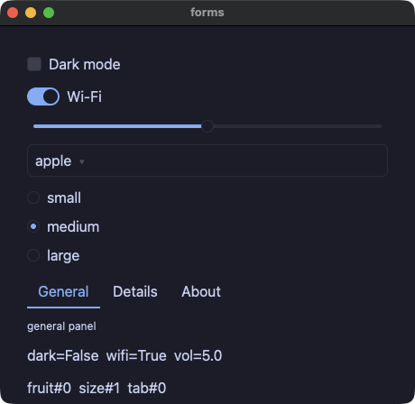

#### calc — the classic keypad calculator: the layout is all `grow`, so resizing scales the whole pad with no dead space


#### calcgrid — the same calculator on `grid(columns=4, rows=5)`; the zero key spans two cells with `col_span=2`


## Holding state

#### stores — named stores: the class name IS the singleton, and stores call each other's methods


#### models — @model and Protocol: observed objects, and statically dispatched interfaces


#### links — models referencing models: owning `Node | None`, non-owning `Weak[Node]` back pointers (no cycles, so dropping the root frees the chain)
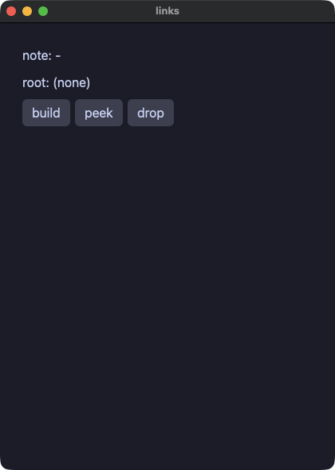

#### stateful — @component + local: a component with its own state per call site
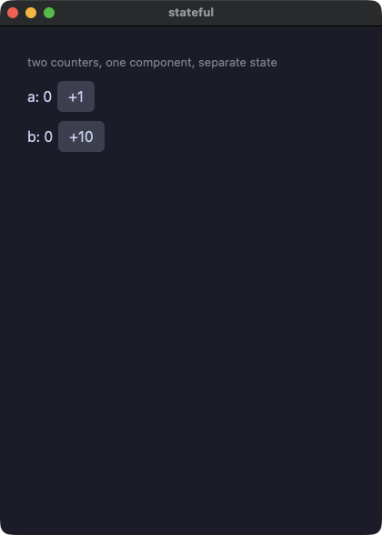

#### lookup — dict cells: reads via `.get(key, default)` and `in`, writes in place with `cell[k] = v`
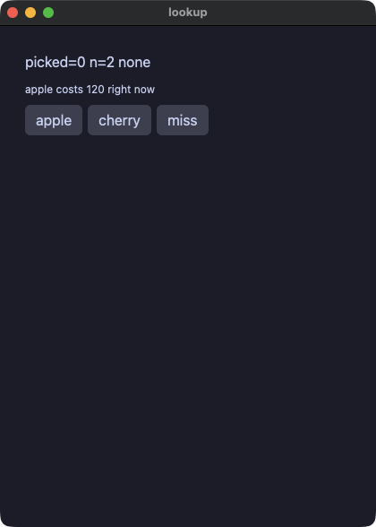

#### mixer — a fields-only @store: annotated fields, direct assignment, the screen follows


## Values and types

#### points — Value classes (frozen dataclasses): updates are functional, via `replace`


#### vecops — operators on Value classes: define `__add__` / `__sub__` / `__mul__` and `+` `-` `*` mean that


#### geometry — static dispatch through Protocol: the trait story, compiled
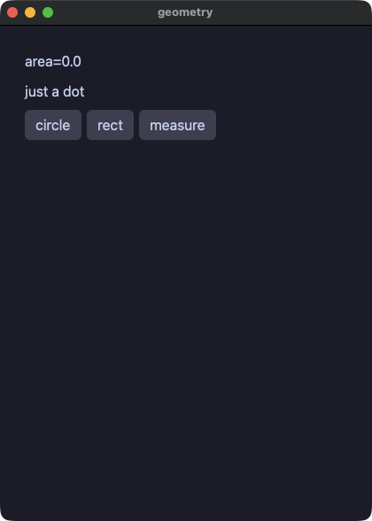

#### moods — Enum, Optional and animation


#### pyops — CPython's own arithmetic: `/` `//` `%` `**`, negative indexing, sorted() — byte-identical in both runs


#### pytext — bare float / bool / Enum text renders exactly as Python's str()


## Control flow and errors

#### flow — real control flow in handlers: if / elif / while / for / break / continue
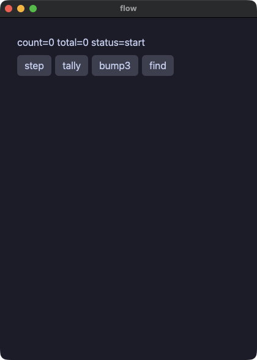

#### edges — containment, demonstrated: out-of-bounds and overflow stop the same statement the same way in both runs, and the app keeps running
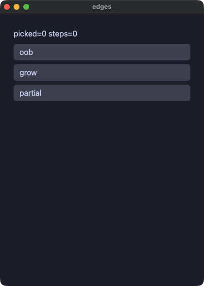

#### tryfetch — the full try/except form: catch a failing http call, with `f"{e}"` identical in both runs


## UI elements

#### todo — the classic todo list


#### table — data_table: the first `row` is the header, later `row`s are data rows shaded in alternation, and the frame comes with the element


#### dialog — the modal: existing IS being open, so wrap it in `if`


#### trend — line and bar charts
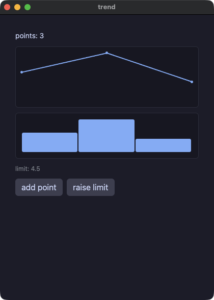

#### styled — named styles (`style` + `**` splat + `|` merge) and theme scopes


#### cards — components with slots (components that take children)


#### layout — spacer and divider: a spacer pushes the button to the row's edge, a divider draws a rule (thicker and accent-colored between the sections)
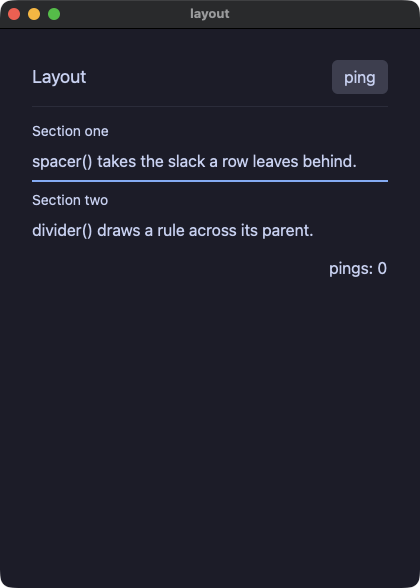

#### about — link: text that opens a URL, beside a button that copies one to the clipboard
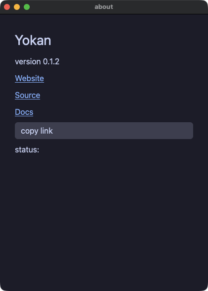

#### badges — text with a box of its own: status pills, a monospaced hash, an underlined note, an ellipsis and a two-line clamp


#### filter — segmented: the toggle-button chooser over a filtered list


#### quantities — number_field and int_field: typed numeric inputs that commit on enter, clamp into the range and snap to the step


#### loading — progress with a label, a size, and an indeterminate sweep for work with no known length


#### charts — negative values below the zero line, a pinned range, an axis with gridlines, and two series with their own colors
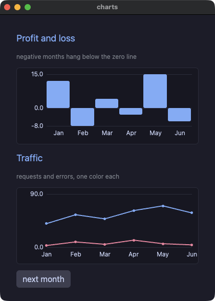

#### roster — table: a virtualized table with column tracks, row selection and header sort (the app re-sorts its own lists)


#### labels — the accessibility properties `role=` and `a11y_label=`, printed by a script's `a11y` step


#### shared — the shared properties on elements that could not take them before: a themed spacer, an animated segmented, a field spanning two grid tracks, a link with a role, a divider with a tooltip, a disabled button and field, a sized column


## The standard library

#### picker — file dialogs and dropped files: `fs.open_dialog` / `save_dialog` inside a `task`, `on_file_drop`; a script answers with `file:<path>` and drops with `drop:<path>`


#### keys — shortcuts, keys, the clipboard and the menu bar: `shortcut("cmd+s", save)`, `on_key(typed)`, `clipboard.set_text` / `get_text`, `menu_item("Count", "Save", save)` — driven in a script with `key:cmd+s` and `menu:Save`


#### files — yokan.fs: write, append, list a directory, remove (both runs call the same implementation)


#### dbnotes — yokan.sqlite: shape rows with SQL, order with ORDER BY


#### ledger — a practical app: a household ledger in sqlite, every value a bound parameter


#### webfetch — yokan.http: GET, headers, POST, status (an @py fixture server runs in both runs, so the gate needs no network)


#### reader — an http + jsondoc feed reader
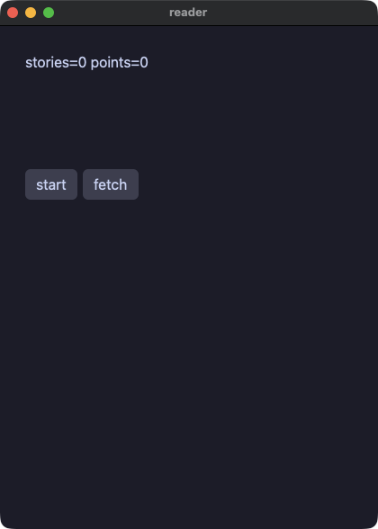

#### stdlib — Python's `math`, `random`, `statistics`, `json`, `datetime`, `time` and `re`, and Yokan's jsondoc and clock


#### dice — Python's `random`: seed it and both runs draw the same sequence
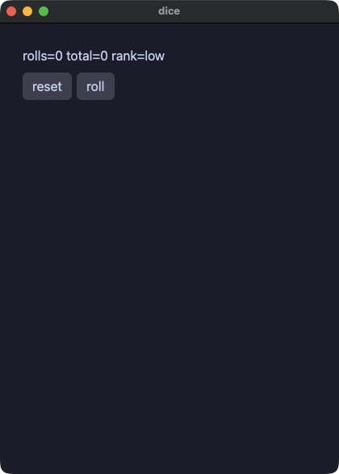

#### postcard — an image, a vector icon, and `notify.send` (delivered through Notification Center when the app runs as an `.app` bundle)


## A Rust crate of your own

#### rustcrate — Rust crates, added with `yokan add`: a local path crate and a crates.io version crate side by side, called by their own snake_case names. The pyproject spelling of the same declaration is `demo/proj/`


#### dashboard — every(): a timer declared at module level, ticking in both runs (the gate steps it with `advance:`)
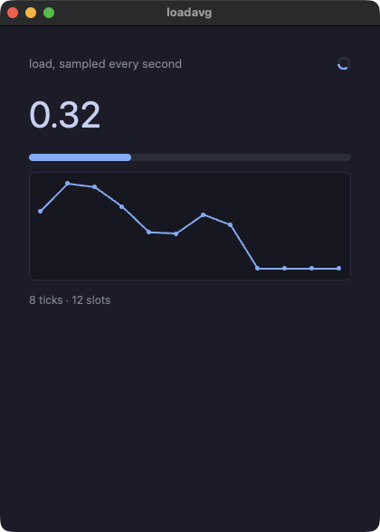

#### tasks — task(): slow work off the UI thread, in both runs


## Escapes and development-only

#### pystats — @py + numpy: escaped functions ship with CPython embedded in the release binary


#### multi — a multi-module app (state.py and widgets.py; helpers become components)


#### app — a dashboard with numpy (development-only: dict state)


#### csv_viewer — a 100k-row virtualized table + numpy (development-only: dict state)


