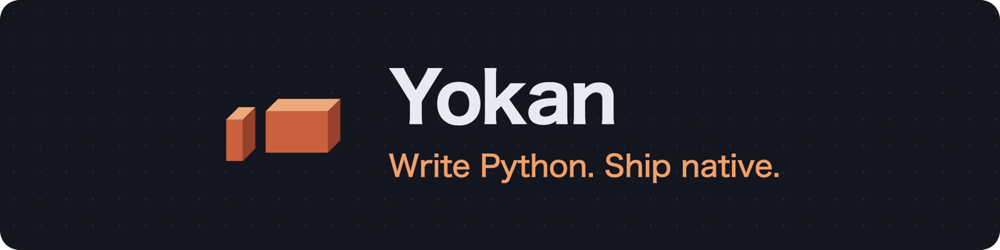
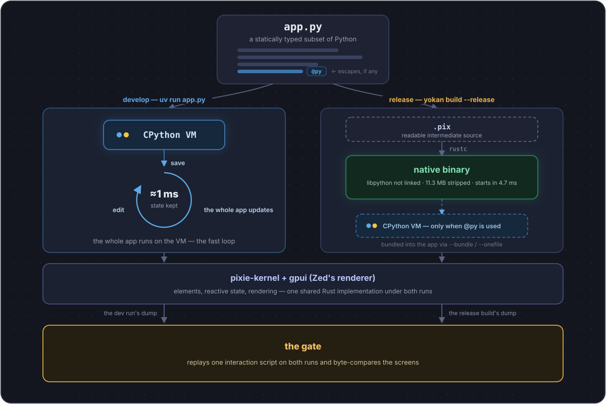

---
hide:
  - navigation
  - toc
---

# 

Yokan is a **compiler** that takes a statically typed subset of
Python to native code. Not a Python-lookalike language: what you can write is a
slice of Python, and inside that slice your code behaves exactly
as Python. While you develop, the whole app runs on real CPython;
when you ship, the same source becomes a machine-code executable —
and **every build verifies that the two behave the same**.

[Installation](installation.md){ .md-button .md-button--primary }
[Language tour](tour.md){ .md-button }
[Demos](demos.md){ .md-button }
[GitHub](https://github.com/i2y/yokan){ .md-button }


*[`demo/opsboard`](https://github.com/i2y/yokan/tree/main/crates/yokan/demo/opsboard)
— a three-module dashboard: two stores, a sum-typed health model
matched in the view, charts, a virtualized alert feed, theme flip.
Written entirely in Python; ships as one native binary.*

The smallest complete app:

```python
# /// script
# dependencies = ["yokan"]
# ///
from yokan import State, button, column, run, text

count: State[int] = State(0)

def view():
    with column(spacing=12, padding=16):
        text(f"count: {count()}", size=34)
        button("+1", on_click=lambda: count.set(count() + 1))

if __name__ == "__main__":
    run(view, title="counter")
```

Run it with `uv run app.py` and this window opens (the renderer is
**gpui**, the engine behind the Zed editor):


Edit the running app's source and save — the app updates in
place, views and handler behavior alike, with the state intact. The GIF below is that moment (editing
another small demo); note the tick counter never stops:


Ship it:

```console
$ yokan build app.py --release
```

No `@py` escapes in the app? Then the executable contains no
CPython at all — zero links to Python, 13.4 MB (10.4 MB stripped),
millisecond startup. The person receiving it installs nothing.

---

## The whole picture

Your app is one Python file with two roads to run it.
Both roads stand on the same Rust foundation — **pixie**, the
substrate language Yokan compiles through; the `.pix` in the middle
of the release road is its readable source, so you can open it and
see what your app compiled to.



---

## "But it worked on my machine" — removed by construction

Every build replays the same interactions against the CPython run
and the machine-code build, then byte-compares the resulting
screens. Yokan calls it the **gate**:

```console
$ yokan gate app.py --script "click:+1,input:Momo"
GATE OK — 2 dump lines identical across tiers
```

The standard library (files, SQLite, HTTP, and friends) is one
implementation used by both runs — that is what makes the
comparison meaningful. And what Yokan cannot do yet is listed, with
reasons, in [What does not work yet](tour-ship.md#what-does-not-work-yet)
at the end of the tour.

---

## Why Yokan?

<div class="grid cards" markdown>

-   :material-check-decagram: __Verified, per build__

    The claim is never "Python compiles". It is: *this app*
    translates, and the gate proved the binary behaves exactly
    like the CPython run — byte for byte, on your interactions.

-   :material-fire: __Hot reload with state__

    `uv run app.py`, edit, save: the window updates in place and
    your state survives — about 1 ms. The shape you know from
    Flutter and Dart, with Python.

-   :material-package-variant-closed: __One file to hand over__

    `--release` builds a native executable with no Python inside;
    `--onefile` bundles CPython for `@py` apps (numpy included) —
    either way, the receiver installs nothing.

-   :material-language-python: __The rest of Python stays__

    Mark a function `@py` and it runs on real CPython embedded in
    the executable. numpy, pandas, your existing code — all of it.

-   :material-language-rust: __Rust crates, yours or crates.io's__

    `yokan add app.py deunicode 1` — declare a crates.io version or
    a local path and call it from your Yokan code. Both doors — the
    pyo3 shim for development, the binding for release — are
    generated from the crate's rustdoc JSON.

-   :material-shield-check: __Typed and checked__

    Bundled stubs make pyright/Pylance check Yokan apps clean —
    `@store` singletons bind correctly, `@model`/`@value` carry
    field constructors, `Weak[Node]` reads as `Node | None`.

</div>

---

## Where next

<div class="grid cards" markdown>

-   :material-rocket-launch: __[Installation](installation.md)__

    `uv run` covers development; clone the repo for native builds.
    macOS (Apple silicon) today, Linux lands shortly.

-   :material-book-open-variant: __[Language tour](tour.md)__

    One pass over how apps are written — state, views, forms,
    memory, Rust crates, the gate — closing with what does not
    work yet. ([日本語版](https://i2y.github.io/yokan/ja/tour/))

-   :material-view-gallery: __[Demos](demos.md)__

    All 41 bundled demos, screenshotted — from the smallest
    counter to the OpsBoard dashboard.

-   :material-github: __[Source](https://github.com/i2y/yokan)__

    The compiler, the engine, and the demos.

</div>

---

_The name is the Japanese confection — yokan (羊羹), a dense solid
block made to be sliced and handed out. Which is what your app
becomes._

_"Python" is a trademark of the Python Software Foundation._
